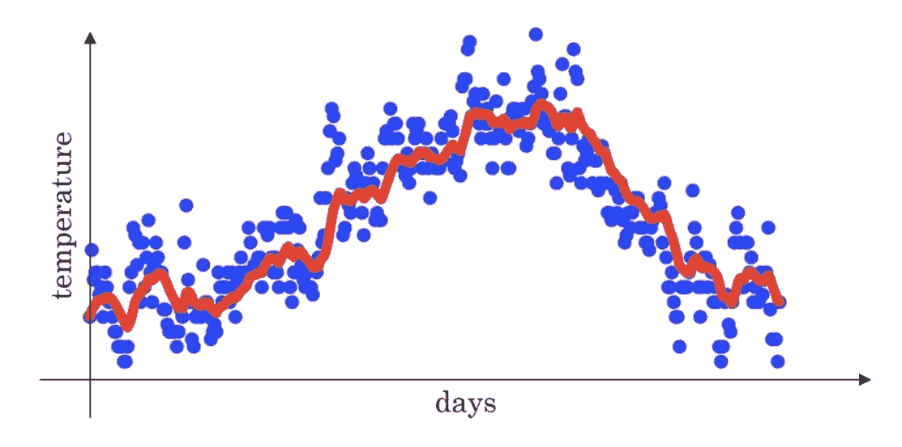
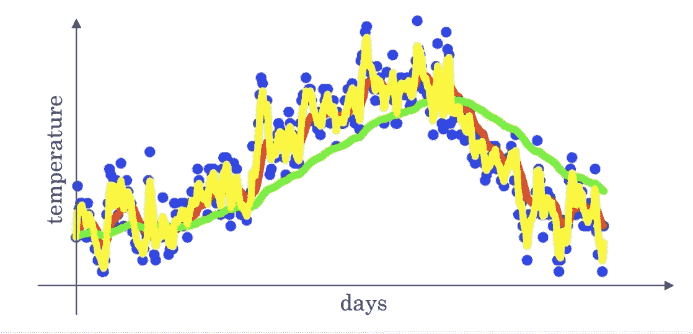
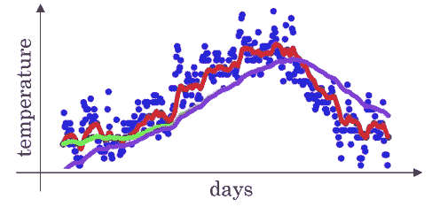

# 训练时间太长？使用指数加权平均值！

> 原文：<https://pub.towardsai.net/training-taking-too-long-use-exponentially-weighted-averages-c15279f3df55?source=collection_archive---------6----------------------->

## [深度学习](https://towardsai.net/p/category/machine-learning/deep-learning)

## 使用这种优化来加快你的训练！


[乌列尔 SC](https://unsplash.com/@urielsc26?utm_source=medium&utm_medium=referral) 在 [Unsplash](https://unsplash.com?utm_source=medium&utm_medium=referral) 上的照片

被困在付费墙后面？点击[这里](https://medium.com/@D3nii/training-taking-too-long-use-exponentially-weighted-averages-c15279f3df55?sk=4a2ef7f3a44a43e05e62daddc36f7271)阅读完整故事与我的朋友链接！

我们所有人，不管是 ML 工程师还是数据科学家，都爱 ***数据*** 。每当我们听说我们有更多的数据可以使用时，这听起来就像是天堂

> 并非一切都像看上去的那样。

“这里的弊端是什么？”~你可能会问。所以，我们有我们的小 CPU 处理器，但我们中的一些幸运儿有 GPU，但也是如此，计算能力并没有暴涨，而是有一个极限。我能想到的主要缺点就是 ***明显训练时间*** 太长。

# 指数加权平均值

让我用 T21 解释的方式来解释。假设你有伦敦的天气数据。你希望能够预测不同日子的天气。数据可能类似于:

```
╔═══════════╦════════════════════╗
║   house   ║       Weather      ║
╠═══════════╬════════════════════╣
║    X1     ║        40 ˚F       ║
║    X2     ║        40 ˚F       ║
║    X3     ║        49 ˚F       ║
║    ..     ║         ...        ║
║    ..     ║         ...        ║
║    ..     ║         ...        ║
║   X180    ║        63 ˚F       ║
║   X180    ║        61 ˚F       ║
╚═══════════╩════════════════════╝
```

其中‘X1’是第 1 天的天气，‘*X180*是第*180*天。现在，如果你绘制数据，你会看到这样的东西:



作者图片

# 现在，算法是什么？

公式为:**Vt =(σ)* Vt-1+(1—σ)* t**

其中:

*   “t”是当天的温度。
*   “Vt-1”是前一天的温度。
*   “和”是一个变量。它改变了图表的外观。

> 的值越大，曲线越平滑。如果小于，曲线会有噪声。



作者图片

这里，这些行是:

*   ***绿色*** : 0.98
*   ***红色*** : 0.9
*   ***黄色*** : 0.5

或者如果:

*   ∧≈1:*绿色*线。
*   ß != 1 或 0: *红色*线。
*   ∧≈0:*黄色*线。

其中“≈≈”表示“*接近*”。

我们得到的是一个*指数* *递减的*值。大约所有的 Vt 加起来等于 1。因此，我们可以说 *V100* 将是第 100 天之前 V 的所有值 之和的乘以 ***。***

# 实现算法

```
# Pseudo CodeVø = 0For loop {
Get next øt
Vø = ß * Vø + (1 - ß) * øt
}
```

就是这样！没错，使用这个算法的*最大的* ***pro*** 就是它使用*极少的内存*。我们只是初始化*v9*，然后我们继续 ***更新*** 它。

> 如果你想计算许多值的平均值，这是很有用的，因为它占用的空间很少。

# 什么是偏差修正？



作者配图。

*绿线*是我们想要的，但是*紫线*是我们使用等式得到的。

发生的情况是，因为我们*初始化**到*零*，在几个第一项中，因此，图形开始 ***相当低*** 并且**不是我们期望的**。*

*所以，为了让*处理*这个问题，我们没有使用*v*，而是使用**Vt/(1—t)**，这样*基本上解决了*的问题。此外，当 *t* 足够大*时*，几乎不需要校正，因此这就是等式所示。*

*希望这篇文章对你有帮助！让我们在 [Linkedin](https://www.linkedin.com/in/d3ni/) 上连线。*

# *进一步阅读*

*[](https://medium.com/swlh/training-taking-too-long-use-mini-batch-gradient-descent-a101846afe47) [## 训练时间太长？使用小批量梯度下降

### 使用这种优化来加快你的训练！

medium.com](https://medium.com/swlh/training-taking-too-long-use-mini-batch-gradient-descent-a101846afe47) [](https://medium.com/datadriveninvestor/model-overfitting-use-dropout-a32010f0afd0) [## 模型过度拟合？使用辍学！

### 最好的正规化技术。

medium.com](https://medium.com/datadriveninvestor/model-overfitting-use-dropout-a32010f0afd0) [](https://medium.com/@D3nii/tackling-common-neural-network-problems-e08b30775100) [## 解决常见的神经网络问题

### 大家好！这是我开始攻读纳米学位并成功完成第一个学位后的第四篇文章

medium.com](https://medium.com/@D3nii/tackling-common-neural-network-problems-e08b30775100) 

# 联系人

如果你想了解我最新的文章和项目[，请在 Medium](/@D3nii) 上关注我。以下是我的一些联系人详细信息:

*   [领英](https://www.linkedin.com/in/d3ni/)
*   [GitHub](https://github.com/D3nii?tab=repositories)
*   [推特](https://twitter.com/danyal0_o)

> *快乐学习。:)**