# 使用预先训练的模型进行迁移学习

> 原文：<https://pub.towardsai.net/transfer-learning-using-a-pre-trained-model-c599e353bbe3?source=collection_archive---------0----------------------->

## [深度学习](https://towardsai.net/p/category/deep-learning)

## 探索 VGG16 在图像分类中的应用

来源:[渠道驱动](https://channeldrive.in/netapp-gives-customers-the-freedom-to-choice-for-any-cloud-with-one-experience/)

# 什么是迁移学习？

**迁移学习**是机器学习中的一个研究问题，专注于存储在解决一个问题时获得的知识，并将其应用于另一个不同但相关的问题。

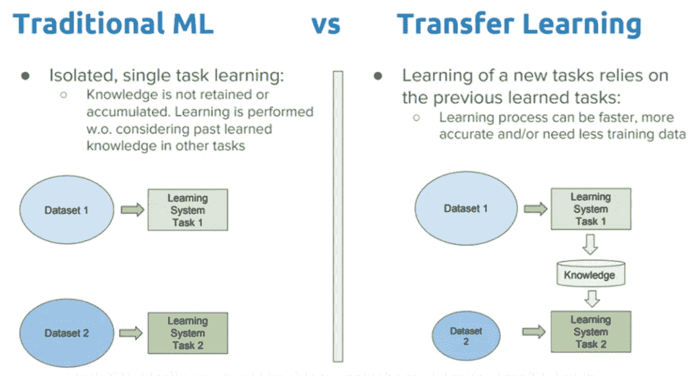

传统机器学习 VS 迁移学习(来源: [Dipanjan Sarkar](https://towardsdatascience.com/a-comprehensive-hands-on-guide-to-transfer-learning-with-real-world-applications-in-deep-learning-212bf3b2f27a)

传统的机器学习方法基于从训练数据中学习到的模式来概括看不见的数据，而对于迁移学习，它**从先前学习的模式开始，以解决不同的任务**。

迁移学习的基本思想(来源: [Integrate.ai](https://medium.com/the-official-integrate-ai-blog/transfer-learning-explained-7d275c1e34e2) )

## 有两种常见的迁移学习方法:

1.  **开发模型方法:**开发比简单模型更好的模型，以确保已经执行了一些特征学习。为感兴趣的任务重用和调整开发的模型。
2.  **预训练模型方法:**从可用模型中选择一个预训练源模型进行重用和微调。

在这篇文章中，我们将重点关注预训练模型方法，因为它通常用于深度学习领域。

# 什么是预训练模型？

预训练模型是一个**保存的网络，之前在大型数据集**上训练过，通常是在大规模图像分类任务上。人们可以使用预先训练的模型，或者使用迁移学习来定制该模型以用于给定的任务。

迁移学习背后的直觉是**如果一个模型在一个足够大和足够一般的数据集上被训练，这个模型将有效地充当视觉世界的通用模型**。然后，我们可以利用这些学习到的特征地图，而不必通过在大型数据集上训练大型模型来从头开始。

让我们来深入了解一下**vgg 16**——2014 年提交给[大规模视觉识别挑战赛](http://www.image-net.org/challenges/LSVRC/2014/results)的一个著名的预训练模型。

# VGG16 架构

Simonyan 和 Zisserman 在他们 2014 年的论文[用于大规模图像识别的甚深卷积网络](https://arxiv.org/abs/1409.1556) *中介绍了 VGG 网络架构。*该模型在 ImageNet 中获得了 92.7%的前 5 名测试准确率，ImageNet 是一个包含 1000 个类别的 1400 多万张图像的数据集。VGG16 中的数字“16”是指它的 16 层，这些层具有权重。该网络相当大，大约有 1.38 亿个参数。

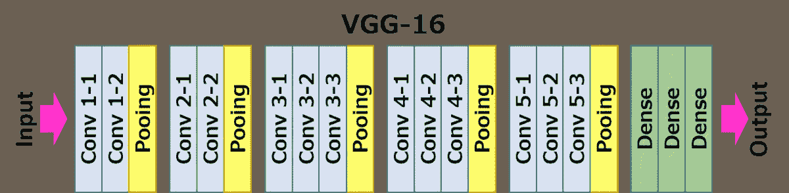

VGG16 的架构(来源: [Neurohive](https://neurohive.io/en/popular-networks/vgg16/) )

conv1 层的**输入是固定大小的 224 x 224 RGB 图像。图像通过一叠卷积层，在卷积层中，滤波器使用非常小的感受野:3×3(这是捕捉左/右、上/下、中心概念的最小尺寸)。在其中一种配置中，它还利用 1×1 卷积滤波器，可视为输入通道的线性变换(后跟非线性)。**

**卷积步幅**固定为 1 个像素；卷积层输入的空间填充使得在卷积后保持空间分辨率，即对于 3×3 卷积层，填充是 1 像素。**空间池**由五个最大池层执行，它们遵循一些卷积层(并非所有卷积层都遵循最大池)。**最大池化**在 2×2 像素窗口上执行，步长为 2。

**三个完全连接的层**跟随一堆卷积层(在不同的架构中具有不同的深度):前两个每个具有 4096 个信道，第三个执行 1000 路 ILSVRC 分类，因此包含 1000 个信道(每个类一个)。最后一层是**软最大层**。全连接层的配置在所有网络中都是相同的。

所有隐藏层都配有**校正(ReLU)非线性。**还要注意的是，没有一个网络(除了一个)包含局部响应归一化(LRN)，这种归一化不会提高数据集的性能，但会导致内存消耗和计算时间增加。

我们将探讨一个问题陈述，并探索使用预训练模型进行迁移学习的基本原理，如何微调超参数以提高模型性能，并解释学习曲线。

# 问题陈述:使用迁移学习，建立一个卷积神经网络(“CNN”)模型，将神奇宝贝分类到各自的类别中。

# 让我们编码并抓住他们！

# 数据准备

我从[神奇宝贝数据集](https://www.kaggle.com/thedagger/pokemon-generation-one)中选择了 5 类神奇宝贝。加载这些图像并绘制一个条形图，以了解每个类中有多少图像。

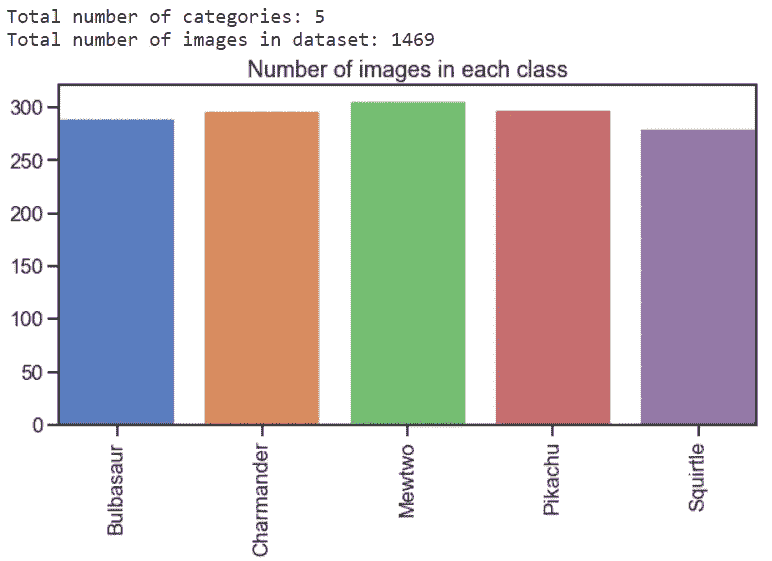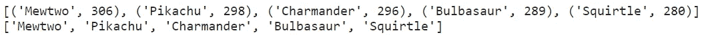

根据上面的条形图，每个神奇宝贝类至少有 280 个图像，这是一个很好的平均大小。由于硬件限制，我们将使用 128 X 128 的输入图像尺寸，而不是 VGG16 模型中使用的原始 224 X 224。我们将继续阅读、调整和缩放这些图像用于训练。

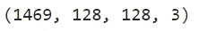

总共 1，429 张图像，输入尺寸为 128 X 128 X 3

加载并拆分数据集，用于 CNN 模型的训练和测试。使用了 0.2 的**测试规模，这意味着数据集的 80%将用于训练目的，而剩余的 20%用作测试组件。然后，我们使用标签 y *、*作为类别标签，以**分层**的方式分割数据集。在分割之前，数据集也被**混洗**，以增强概率采样的随机性。**随机状态**控制在应用分割之前应用于数据的混洗。此参数中传递了一个整数，以便在多个函数调用中进行可再现的输出。**

# 利用迁移学习创建 CNN 模型

通过冻结模型的“深层”并仅重新训练分类层来应用迁移学习。

我们选择使用 [**Adam 优化**](https://www.tensorflow.org/api_docs/python/tf/keras/optimizers/Adam) ，这是一种基于一阶和二阶矩自适应估计的随机梯度下降方法。

根据 [Kingma et al .，2014](http://arxiv.org/abs/1412.6980) ，该方法为

> 计算效率高，几乎不需要内存，对梯度的对角线重新缩放不变，非常适合数据/参数较大的问题

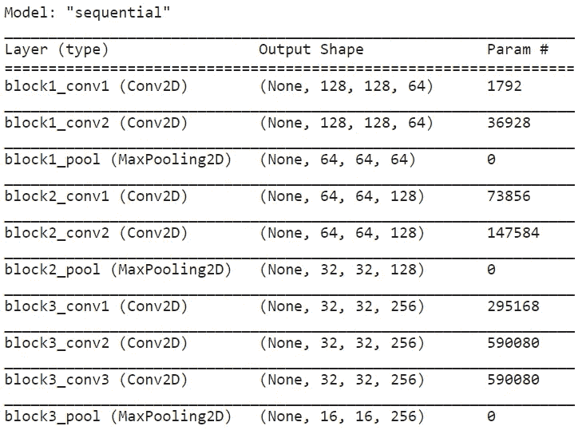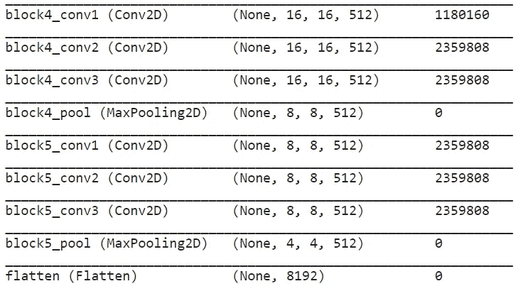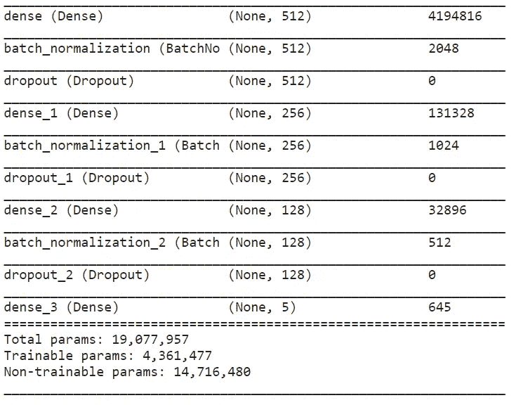

# 模特培训

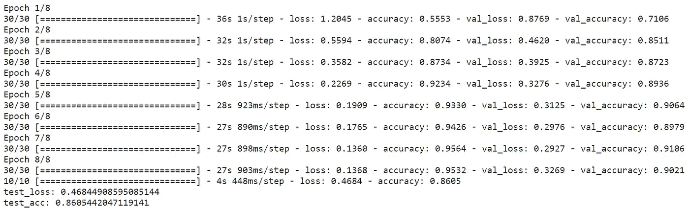

# 学习曲线

学习曲线**是模型学习性能随经验或时间变化的曲线图**。学习曲线是机器学习中广泛使用的诊断工具，用于从训练数据集增量学习的算法。在训练期间的每次更新之后，可以在训练数据集和验证数据集上评估该模型，并且创建测量的性能的图以反映学习曲线。

在训练期间检查模型的学习曲线可用于诊断学习的问题，例如欠拟合或过拟合模型，以及训练和验证数据集是否具有适当的代表性。

*   **训练学习曲线**:从训练数据集中计算出的学习曲线，给出了模型学习情况的想法。
*   **验证学习曲线**:从验证数据集中计算出的学习曲线，给出了模型泛化能力的概念。

让我们绘制训练和验证准确性/损失的学习曲线。

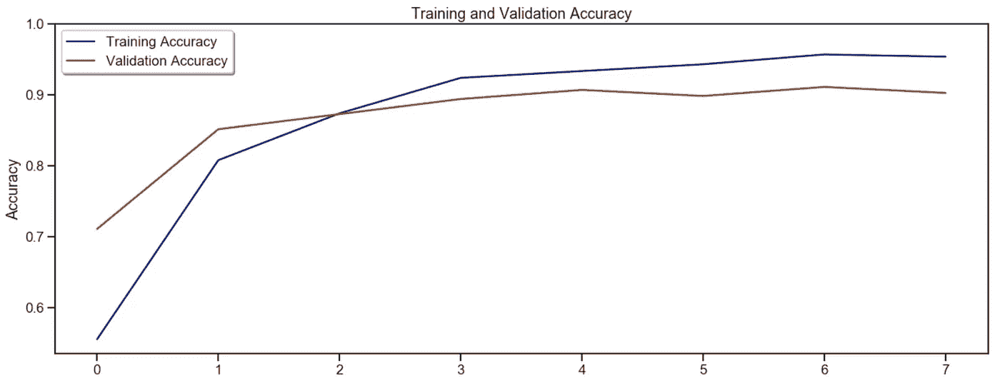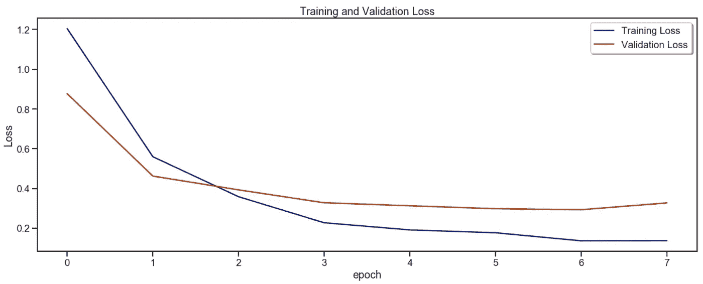

根据绘制的学习曲线，观察到学习算法的良好拟合。**良好拟合**由**识别，训练和验证精度/损失降低到稳定点，两个最终精度/损失值之间的差距最小。**

模型的准确性在训练数据集上将总是比验证数据集**高**，反之亦然，模型的损失在训练数据集上将几乎总是比验证数据集**低**。这意味着我们应该预期在训练和验证损失学习曲线之间会有一个[推广缺口](https://ai.googleblog.com/2019/07/predicting-generalization-gap-in-deep.html)。

学习曲线图示出了良好的拟合，如果:

*   训练精度/损失的曲线将增加/减少到一个稳定点。
*   验证准确度/损失的曲线将增加/减少到稳定点，并且与训练准确度/损失有小的差距。

然而，任何持续的良好适应训练都可能导致过度适应。

# 超参数微调

接下来，我们将通过使用低得多的学习速率来微调超参数，以提高模型性能。

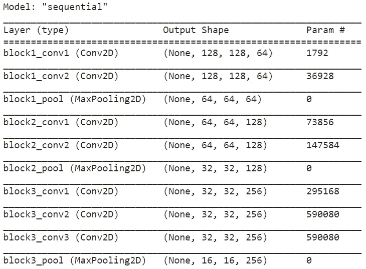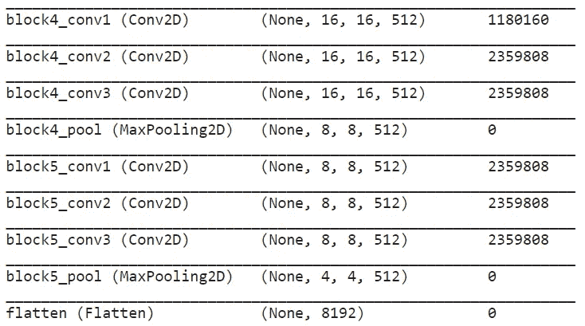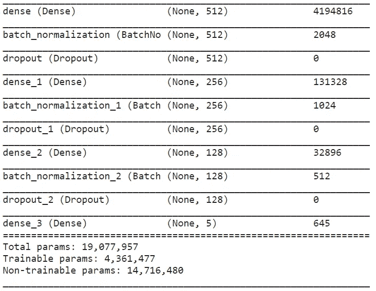

通过增加训练时期的数量并减少批次大小来继续训练模型，以提高测试准确性和测试损失。

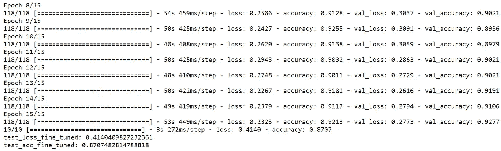

# 微调后的学习曲线

绘制训练和验证准确性的学习曲线以及微调后的损失，以便更好地可视化模型的学习效果。

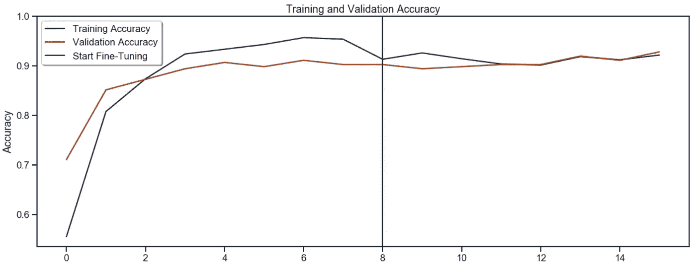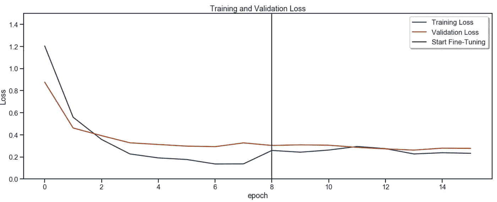

通过使用较慢的学习速率，有助于提高验证准确性和降低验证损失。请注意，训练和验证准确度/损失学习曲线之间的泛化差距已经显著最小化。

# 结果评估

为了提供对训练模型的独立评估，通过从互联网上选择每一类的随机图像来创建未看见数据的测试数据集。

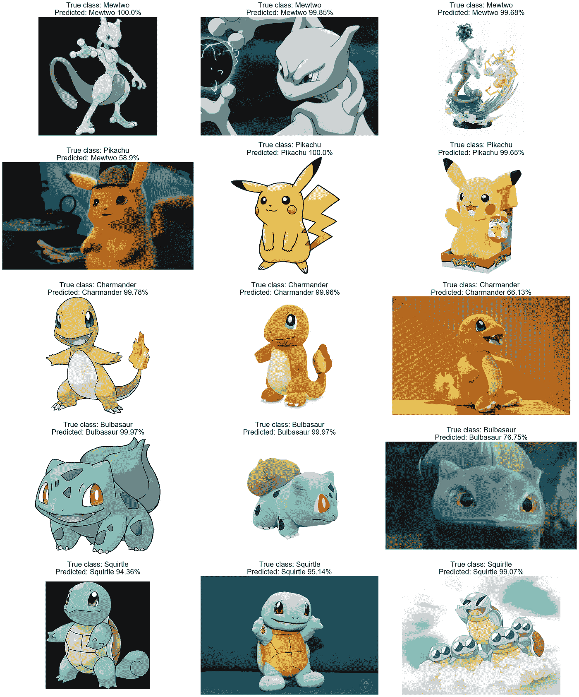

上述结果表明，在正确地将每个神奇宝贝识别到其各自的类别方面，训练模型具有良好的性能。好吧，除了可怜的大侦探皮卡丘，它不幸以 58.9%的预测率被认定为 Mewtwo。也许 Mewtwo 已经决定反击，因为它的电影- [神奇宝贝:Mewtwo 反击-进化](https://en.wikipedia.org/wiki/Pok%C3%A9mon:_Mewtwo_Strikes_Back%E2%80%94Evolution)。

# 结论

总的来说，使用迁移学习成功地建立了一个 CNN 模型来对神奇宝贝数据集进行分类。

为了进一步提高具有背景噪声的图像的精度水平，可以在用足够大和通用的数据集训练 CNN 模型的地方进行改进。迁移学习的使用使人们能够利用先前学习的特征图，而不必通过在大数据集上训练大模型而从头开始。

# **参考文献**

1.  [深度学习迁移学习的温和介绍](https://machinelearningmastery.com/transfer-learning-for-deep-learning/)
2.  [迁移学习和微调](https://www.tensorflow.org/tutorials/images/transfer_learning)
3.  [VGG16 —用于分类和检测的卷积网络](https://neurohive.io/en/popular-networks/vgg16/)
4.  [Scikit 学习—训练、测试、分割](https://scikit-learn.org/stable/modules/generated/sklearn.model_selection.train_test_split.html)
5.  [tensor flow 中的 Adam 优化器](https://www.tensorflow.org/api_docs/python/tf/keras/optimizers/Adam)
6.  [如何使用学习曲线诊断机器学习模型性能](https://machinelearningmastery.com/learning-curves-for-diagnosing-machine-learning-model-performance/)