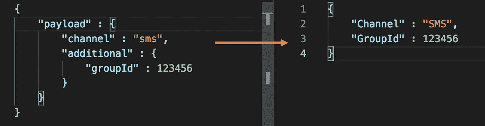
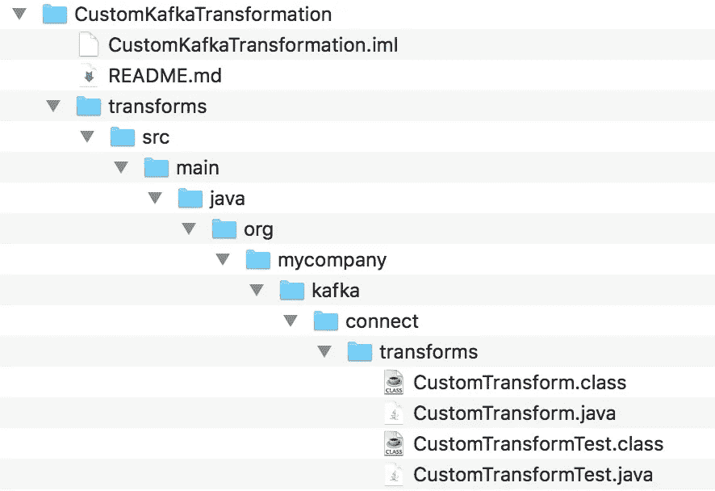

# 借助 Kafka Connect 以时尚的方式转变您的数据

> 原文：<https://pub.towardsai.net/transform-your-data-in-style-with-kafka-connect-2817d7bb39b9?source=collection_archive---------3----------------------->

## [软件工程](https://towardsai.net/p/category/software-engineering)

## 让我们编写最简单但功能强大的单一消息转换


[K8](https://unsplash.com/@k8_iv?utm_source=medium&utm_medium=referral) 在 [Unsplash](https://unsplash.com?utm_source=medium&utm_medium=referral) 上拍照

> 做以前没做过的，写以前没写过的。

Kafka 被证明是我们组织的弹性和性能指标的游戏规则改变者。实现松耦合、高可用性、容错以及最重要的易于适应的承诺；Kafka 成为应用程序到应用程序通信的默认选择，留下了 Restful API，*只要有可能*。

我使用 [Kafka](https://kafka.apache.org/) 和 [Kafka Connect](https://kafka.apache.org/documentation/#connect) 从几个应用程序中获取数据。在很大程度上，Kafka 中数据的结构和格式(*记录*)非常符合我的需求。如果没有，我会使用 Kafka 内置的[转换](https://docs.confluent.io/current/connect/transforms/index.html)，这将很容易允许我稍微调整一下数据。如果仍然不满意，我会要求采购团队根据我的需要调整数据的结构。这种对另一个团队的依赖很快就要结束了，我将不得不寻找一个内置的工具来满足我的特定需求。**回车，** [**自定义变换**](https://docs.confluent.io/current/connect/transforms/custom.html#custom-transform) ！！

> 唯一的问题，你需要懂 Java 我不知道。唯一可用的[文档](https://www.confluent.io/blog/kafka-connect-single-message-transformation-tutorial-with-examples/)试图谈论一切，而没有真正解释任何事情。


感觉卡住了；照片由[马里奥·阿齐](https://unsplash.com/@spce?utm_source=medium&utm_medium=referral)在 [Unsplash](https://unsplash.com?utm_source=medium&utm_medium=referral) 上拍摄

自学基础 Java 很快，但是弄清楚 kafka 方法和组件来完成我的转换工作却不容易。我惊讶地发现缺少文档和独立文章。因此，在本文中，让我们编写一个假设但相关的自定义 Kafka 转换，它将允许您将 Kafka 消息转换为特定的结构。为了使它简单易懂，让我们来看看:

*   模式已禁用
*   没有运行时配置
*   仅值转换(*即*无键转换)



图 1:卡夫卡的信息价值转换

## 1.卡夫卡把内置的转换连接为基础结构

Apache Kafka 拥有可用于其内置转换的[源代码](https://github.com/apache/kafka/tree/trunk/connect/transforms/src)，这是一个*真正真正*开始探索和检验最佳范例的好地方。我们会复制相同的代码结构。有一个目录结构，就像你在 Apache Kafka 源代码中看到的那样，最后有一个 java 文件，它将包含你的定制转换代码，在我的例子中是[*【CustomTransform.java*](https://github.com/akash092/CustomKafkaTransformation/blob/master/transforms/src/main/java/org/mycompany/kafka/connect/transforms/CustomTransform.java)*。*该代码也可在 [Github](https://github.com/akash092/CustomKafkaTransformation) 上获得。



图 2: Kafka 定制转换存储库结构

## 2.定义 CustomTransform.java

从概念上讲，流程是您的定制转换从上游系统接收记录；对于源连接器，它将来自您的源系统或应用程序，而对于汇连接器，它将来自 Kafka broker。然后，您的转换会将它转换成一个 *ConnectRecord* ，然后通过已经配置好的转换的 *apply()* 函数传递该记录，期望返回一个记录。

图 3:带有底层方法的 CustomTransform 类定义

上面展示了构建这个简单转换所需的一切(类、方法、导入)。 ***apply()*** 方法是我们接下来要写的真正的果汁，但是其他的都很好。在我们进入 *apply()* 之前，请注意为简化程序而做的关键假设:

*   我们的 *config()* 返回一个空的 *CONFIG_DEF* 对象。这是简化的，因为我们已经假设“没有运行时配置”。
*   没有提到 *operatingSchema(记录)*或 *applyWithSchema(记录)。*这与 Kafka 标准转换布局(例如 [*展平*](https://github.com/apache/kafka/blob/trunk/connect/transforms/src/main/java/org/apache/kafka/connect/transforms/Flatten.java) )形成对比，因为我们假设“模式被禁用”。
*   没有提及*类键*和*类值。*这也被简化了，因为我们已经预先决定要进行“唯价值转换”。

我希望这澄清了标准 Kafka 转换中每个方法和类的意义，这种自底向上的方法将允许逐步掌握每个类。

## 3.实现 apply()方法

应用是转换的核心。这可以用 Kafka Key 或 Value 中的数据做任何事情，不管有没有模式。

图 4:将数据转换为定制结构的 apply()实现

我们在 *originalRecord* 中捕获了原始的 JSON 负载，然后遍历它们来构造 *updatedValue* 。不用说，您可以在 *apply()，*中做各种事情，就像在现有 Kafka 转换的代码中已经可见的那样。

## 4.不要忘记单元测试

*无法测试的代码是有缺陷的，*所以我们不要忘记它们*。如图 2 所示，我的测试文件*CustomTransformTest.java*和我的转换在同一个文件夹中。*

图 5:测试类实现

这是一个简单的测试，在测试方法 *testSampleData()* 中，我们填充原始有效负载，将其传递给 *apply()* 方法，然后通过 *assert()* 确保转换后的响应符合预期。

## 5.编译和验证

```
$ pwd *~/CustomKafkaTransformation/transforms/src/main/java*$ javac org/mycompany/kafka/connect/transforms/CustomTransform.java$ javac org/mycompany/kafka/connect/transforms/CustomTransformTest.java$ java org.junit.runner.JUnitCore org.mycompany.kafka.connect.transforms.CustomTransformTest*JUnit version 4.10
.Inside method :: originalRecord :: {payload={additional={groupId=12345}, channel=sms}}
Inside method :: originalRecord :: {Channel=SMS, GroupId=12345}**Time: 0.016**OK (1 test)*
```

如果您发现上面有任何错误，请确保您的**类路径**包含所有 [Kafka 相关 jar](https://jar-download.com/?search_box=kafka-connect)以及 [JUnit](https://github.com/junit-team/junit4/wiki/Download-and-Install) 的路径。

*您的定制改造已经就绪！！*现在剩下的就是构建 JAR 并在 Kafka worker 配置文件的 ***plugin.path*** 属性中提及 JAR 的路径。

# 结论

定制转换非常强大，可以通过动态配置和随着需求的发展在单个消息级别上完成很多工作。希望这个简单的演练能让你写出各种复杂的业务需求！