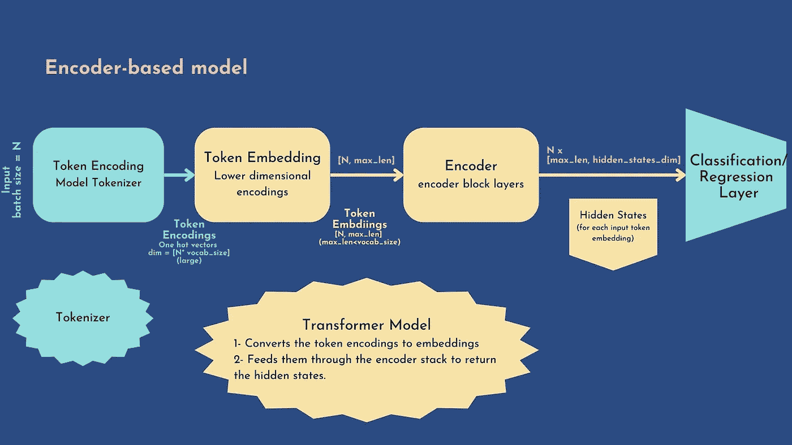
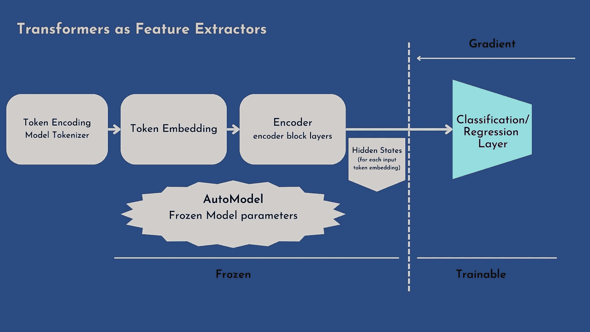
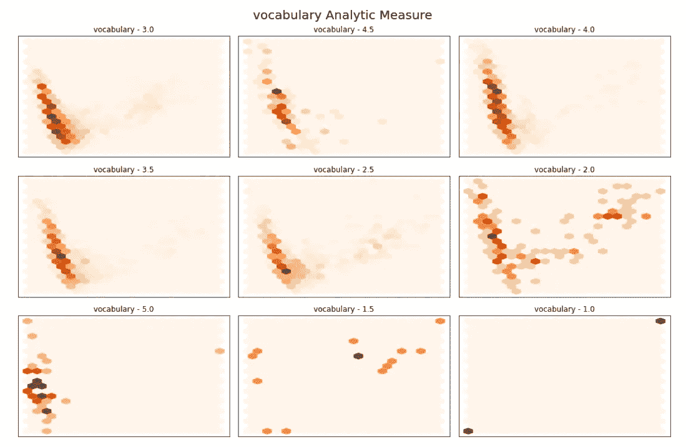
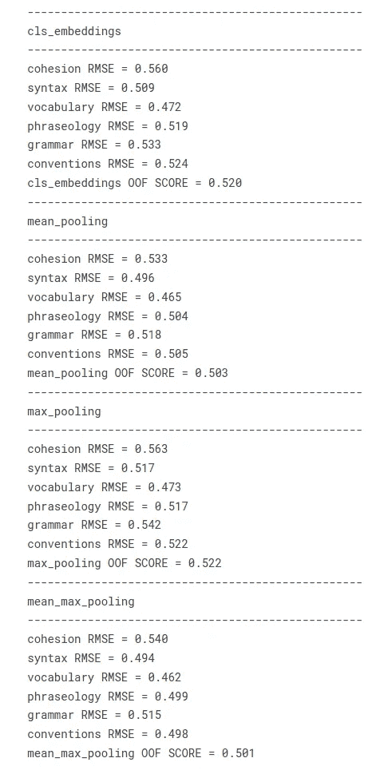

# 多元回归的变形金刚—[第一部分]

> 原文：<https://pub.towardsai.net/transformers-for-multi-regression-task-part1-transformers-as-feature-extractor-9f174ab66ce9?source=collection_archive---------1----------------------->

# 💎作为特征提取器的变压器💎

我在 Kaggle 参加的 [FB3 竞赛](https://www.kaggle.com/competitions/feedback-prize-english-language-learning)激励我写一篇关于我测试过的方法的帖子。再加上我没有找到任何明确的关于如何使用变压器解决多元回归问题的教程，所以我认为分享一下我的工作会很有用。

所有这些工作都在[我的卡格尔笔记本](https://www.kaggle.com/code/schopenhacker75/transformers-for-us-beginners)中继续


[https://unsplash.com/photos/AVYo3X6XZYg](https://unsplash.com/photos/AVYo3X6XZYg)

# 介绍

我们并不都有福楼拜🧡的才华，柏格森🤎的清晰，普鲁斯特的天才💙，也没有**茨威格**的风格和手腕💜，也不是伏尔泰**的本事**💚，也不是叔本华**的先知先觉**💖…

这份清单远非详尽无遗，感谢上帝，有天才的作家和哲学家允许我们暂时逃离这个唯物主义的世界。

但就我们普通人而言，不管是不是文学，我们至少可以希望尽力尊重语言的规则，写得“正确”。老师们帮助我们学习语言的基础知识，那么为什么不呢？反过来，我们也会帮助他们，利用我们的知识，节省时间来修改学生的作文，帮助他们区分每个学生的优缺点，并更好地调整他们的教学方法，以适应每个学生的水平。

在这场比赛中，我们被要求使用 8-12 年级英语学习者写的预先评分的议论文，根据六个分析指标创建一个有效的模型:**衔接、句法、词汇、短语、语法**和**惯例**。分数范围从 1.0 到 5.0，增量为 0.5。

我们将描述如何使用拥抱脸模型来解决这种类型的问题，我选择了`deberta-v3-base`模型(这里的[是相应的模型卡)，我将展示我们如何以两种有效的方式使用它:](https://huggingface.co/microsoft/deberta-v3-base?text=The+goal+of+life+is+%5BMASK%5D.)

🤙**特征提取**:我们使用隐藏状态作为特征，只在其上训练一个分类器，而不修改预先训练好的模型。对于本节[,@ cdeotte](https://www.kaggle.com/competitions/feedback-prize-english-language-learning/discussion/351577)提出了这种方法的一个绝妙用法，即使用多个非微调的变压器嵌入，然后将它们连接起来并训练一个独立的分类器:我强烈邀请您查看相关的[讨论](https://www.kaggle.com/competitions/feedback-prize-english-language-learning/discussion/351577)和[笔记本](https://www.kaggle.com/code/cdeotte/rapids-svr-cv-0-450-lb-0-44x)

🤙**微调**:我们对整个模型进行端到端的训练，这也意味着对预训练模型的参数进行更新。这种方法将在[后面的帖子](https://zghrib.medium.com/transformers-for-multi-regression-task-part2-fine-tuning-2683ef134d1c)中讨论

在这一部分，我们将一步一步地介绍第一种方法:👐基于编码器的变压器简介

这个想法是使用基于 BERT 的模型，这些模型经过预先训练，可以预测文本的屏蔽元素，以及一个自定义的分类器:工作流程如下:



带有基于编码器的
变压器的分类器/回归器头

**1。生成令牌编码:**
首先，令牌化器生成一个名为**令牌编码**的热编码:每个向量的维数等于令牌化器词汇表`[batch_size, vocab_size]`。HuggingFace 的`AutoTokenizer`类将自动加载对应于检查点名称的记号赋予器(对于这个笔记本，我们将使用`deberta-v3-base`)，记号赋予器将生成一个字典，包括:

*   `input_ids`:句子中每个标记对应的索引
*   `token_type_ids`:当有多个序列时，标识一个令牌属于哪个序列
*   `attention_mask`:从真实记号中识别填充元素

然后，模型将采用令牌编码，并如下进行:

**2 .生成嵌入:**
该模型将令牌编码转换为**密集嵌入**。与令牌编码不同，嵌入是**密集的** =非零值。令牌编码是由令牌化器生成的。
- >我们用模型的最大上下文尺寸得到一个维度为`[batch_size, max_len]`的张量

**3。生成隐藏状态:**
模型通过编码器堆栈提供嵌入，为每个令牌输入返回隐藏状态。我们获得一个最终张量`[batch_size, max_len, hidden_states_dim]`
我们加载一个`AutoModel`对象来初始化一个具有所有检查点权重的模型(在我们的例子中是`microsoft/deberta-v3-base`

现在让我们看看如何准备我们的数据集，以便由转换器进行处理:

# 🪵准备数据集

我们将通过小批量进行，为此，我们将使用`torch.utils.data.DataLoader`和`torch.utils.data.Dataset`(您可以在此处查看参考)。`Dataset`允许返回带有相应标签的数据集样本。`DataLoader`在数据集周围包装了一个 iterable 以方便访问样本，提供了许多实用程序，例如在每个时期重新排列数据以减少模型过度拟合，或者允许使用多重处理来加速数据检索。

为了开发我们的定制`Dataset`，我们必须覆盖`__init__`、`__len__`和`__getitem__`函数。
最重要的函数是`__getitem__`:它从数据集中给定索引 idx 处返回一个样本。函数的输出格式必须符合**模型的预期格式**:

*   `input_ids`:提供给模型的令牌 id 列表。
*   `attention_mask`:指定模型应该关注哪些令牌的索引列表
*   `labels`:在我们的例子中，我们处理一个**多类回归**问题，标签是*六个分析分数*的向量。

对于训练方法，我们将参考不可否认的经典交叉验证方案

🍕**多标签数据分层:**

在我们的数据科学家社区中，有证据表明如何分割交叉验证折叠对模型性能有直接影响。
通常，对于单类问题，褶皱与单个目标一起分层(离散目标的*类分布或连续目标的面元分布*)。

> 但是，在多类问题的情况下，我们该怎么做呢🤔？

嗯，已经开展了许多工作来处理这个问题，例如:

*   2011 : [Sechidis —关于多标签数据的分层](http://lpis.csd.auth.gr/publications/sechidis-ecmlpkdd-2011.pdf)
*   2017:[szymński——第一届不平衡领域学习国际研讨会论文集](http://proceedings.mlr.press/v74/szyma%C5%84ski17a.html)

[这里](https://www.slideshare.net/tsoumakas/on-the-stratification-of-multilabel-data)是一个温和的演示，解释算法。
我们将使用采用[迭代分层](https://github.com/trent-b/iterative-stratification)实施的迭代方法算法:

```
import pandas as pd
from iterstrat.ml_stratifiers import MultilabelStratifiedKFoldtrain = pd.read_csv(PATH_TO_TRAIN)
print("TRAIN SHAPE", train.shape)
test = pd.read_csv(PATH_TO_TEST)
print("TEST SHAPE", test.shape)
label_cols = ['cohesion', 'syntax', 'vocabulary', 'phraseology', 'grammar', 'conventions']
cv = MultilabelStratifiedKFold(
          n_splits=N_FOLDS, 
          shuffle=True, 
          random_state=SEED
          )
train = train.reset_index(drop=True)
for fold, ( _, val_idx) in enumerate(cv.split(X=train, y=train[label_cols])):
    train.loc[val_idx , "fold"] = int(fold)

train["fold"] = train["fold"].astype(int)
```

现在让我们像前面描述的那样实现数据集迭代器:

```
# lets define the batch genetator
class CustomIterator(torch.utils.data.Dataset):
    def __init__(self, df, tokenizer, labels=CONFIG['label_cols'], is_train=True):
        self.df = df
        self.tokenizer = tokenizer
        self.max_seq_length = CONFIG["max_length"]# tokenizer.model_max_length
        self.labels = labels
        self.is_train = is_train

    def __getitem__(self,idx):
        tokens = self.tokenizer(
                    self.df.loc[idx, 'full_text'],#.to_list(),
                    add_special_tokens=True,
                    padding='max_length',
                    max_length=self.max_seq_length,
                    truncation=True,
                    return_tensors='pt',
                    return_attention_mask=True
                )     
        res = {
            'input_ids': tokens['input_ids'].to(CONFIG.get('device')).squeeze(),
            'attention_mask': tokens['attention_mask'].to(CONFIG.get('device')).squeeze()
        }

        if self.is_train:
            res["labels"] = torch.tensor(
                self.df.loc[idx, self.labels].to_list(), 
            ).to(CONFIG.get('device')) 

        return res

    def __len__(self):
        return len(self.df)
```

这个自定义的`Dataset`将在以后被用于微调转换器或者仅仅作为一个特征提取器。

PS:我添加了`is_train`参数来决定是否返回“标签”字段(只有训练数据集包含标签字段)

# ⛏Transformers 是 Extractors⛏的特色

通过这种方法，编码器权重被**冻结**，隐藏状态被多元回归器用作**独立特征**。
由于隐藏状态只计算一次，如果我们**不处理 GPU**，这种方法是最好的选择:



编码器变压器作为特征提取器:只有头部是可训练的，所有的变压器层被冻结

留给我们的唯一一把自由之斧是如何将隐藏状态张量`[batch_size, max_len, hidden_states_dim]`简化为一个单一的向量表示:我强烈建议你参考无价的 [@rhtsingh notebook](https://www.kaggle.com/code/rhtsingh/utilizing-transformer-representations-efficiently) ，它“详尽地”列举了隐藏状态编码的不同方式**、**。我测试了以下技巧:

🤙 **CLS 嵌入:** BERT 引入一个**【CLS】**token 标签，站在每句话的第一个位置，捕捉整个句子的上下文。cls 嵌入简单地包括选择每个隐藏状态向量的第一个元素，从而得到`[batch_size, 1, hidden_states_dim]`向量

```
import torch
import torch.nn as nn
import transformers
from transformers import (
    AutoModel, AutoConfig, 
    AutoTokenizer, logging,
    AdamW, get_linear_schedule_with_warmup,
    DataCollatorWithPadding,
    Trainer, TrainingArguments
)
from transformers.modeling_outputs import SequenceClassifierOutput# https://github.com/UKPLab/sentence-transformers/blob/0422a5e07a5a998948721dea435235b342a9f610/sentence_transformers/models/Pooling.py
# https://www.kaggle.com/code/rhtsingh/utilizing-transformer-representations-efficiently
def cls_embedding(outputs):
    """Since Transformers are contextual model, 
    the idea is [CLS] token would have captured the entire context 
    and would be sufficient for simple downstream tasks such as classification
    Select the first token for each hidden state

    @param outputs: the model output dim = [batch_size, max_len, hidden_states_dim]
    @return:  tensor of dimensions = [batch_size, hidden_states_dim]
    """
    return outputs.last_hidden_state[:, 0, :].to(CONFIG.get('device'))
```

🤙**意味着汇集**:我们将考虑每个隐藏状态维度的`max_len` 维度嵌入的平均值，而不是选择第一个元素:我们获得一个`[batch_size, 1, hidden_states_dim]`的张量，或者仅仅是未排序的形式:`[batch_size, hidden_states_dim]`

```
def mean_pooling(inputs, outputs):
    """
    For each hidden_state, average along with max_len embeddings, 
    but we will condider only the highlighted tokens by the attention mask

    @param inputs: = the tokenizer output = the model input : a dict must contain at least the attention_mask field
    @param outputs: the model output dim = [batch_size, max_len, hidden_states_dim]
    @return:  tensor of dimensions = [batch_size, hidden_states_dim]
    """
    input_mask_expanded = inputs['attention_mask'].squeeze().unsqueeze(-1).expand(outputs.last_hidden_state.size()).float()
    sum_embeddings = torch.sum(outputs.last_hidden_state * input_mask_expanded, 1)
    sum_mask = input_mask_expanded.sum(1)
    sum_mask = torch.clamp(sum_mask, min=1e-9)
    mean_embeddings = sum_embeddings / sum_mask
    return mean_embeddings
```

🤙**最大汇集**:为了得到最大汇集，我们将在每个隐藏状态维度上的`max_len`嵌入中取最大值，结果是一个`[batch_size, hidden_states_dim]`维度的张量

```
def max_pooling(inputs, outputs):
    """
    For each hidden_state, get the max element along with max_len embeddings,
    considering only the non masked element difined by the attention mask computed by the tokenizer

    @param inputs: = the tokenizer output = the model input : a dict must contain at least the attention_mask field
    @param outputs: the model output dim = [batch_size, max_len, hidden_states_dim]
    @return:  tensor of dimensions = [batch_size, hidden_states_dim]

    """
    last_hidden_state = outputs.last_hidden_state
    input_mask_expanded = inputs['attention_mask'].squeeze().unsqueeze(-1).expand(outputs.last_hidden_state.size()).float()
    last_hidden_state[input_mask_expanded == 0] = -1e9  # Set padding tokens to large negative value
    max_embeddings = torch.max(last_hidden_state, 1).values
    return max_embeddings
```

🤙**平均最大池化:**我们应用平均池化和最大池化，然后连接两者以获得`[batch_size, 2*hidden_states_dim]`维度张量

```
def mean_max_pooling(inputs, outputs):
    """
    Apply mean and max-pooling embeddings, then we concatenate the two onto a single final representation

    @param outputs: the model output dim = [batch_size, max_len, hidden_states_dim]
    @return:  tensor of dimensions = [batch_size, 2*hidden_states_dim]
    """
    mean_pooling_embeddings = mean_pooling(inputs, outputs)
    max_pooling_embeddings = max_pooling(inputs, outputs)
    mean_max_embeddings = torch.cat((mean_pooling_embeddings, max_pooling_embeddings), 1)
    return mean_max_embeddings
```

下面是获取所有嵌入的代码示例:

```
 def get_embedding(dataloader, model, n):
    """
    Run the model to predict hidden states then apply all the transformations implemented above

    @param dataloader: a torch.utils.data.DataLoader the iterator along with the custom torch.utils.data.Dataset
    @param model : the huggingface AutoModel that generates the hidden states
    """
    embeddings = {}
    model = model.to(CONFIG.get('device'))
    for batch in tqdm_notebook(dataloader):
        with torch.no_grad():
            # please note here that the labels fileds is not necessary 
            # since we are not going to fine tune the model but just get the vectors output
            outputs = model(
                input_ids=batch['input_ids'].squeeze(),
                attention_mask=batch['attention_mask'].squeeze()
            )
        for embed_name, embed_func in zip(['cls_embeddings', "mean_pooling", "max_pooling", "mean_max_pooling"], 
                                          [cls_embedding, mean_pooling, max_pooling, mean_max_pooling]):
            if embed_name == 'cls_embeddings':
                embed = embed_func(outputs)
            else:
                embed = embed_func(batch, outputs)
            embeddings[embed_name] = torch.cat(
                (
                    embeddings.get(embed_name, torch.empty(embed.size()).to(CONFIG.get('device'))), 
                    embed
                ),
                0
            )
    threshold = min(n,CONFIG.get('train_batch_size'))
    for key in embeddings:
        embeddings[key] = embeddings[key][threshold:,:]
    return embeddings
```

现在让我们看看如何为训练和测试数据集生成嵌入:

```
model = AutoModel.from_pretrained(CONFIG["model_name"], config=config)
# TRAIN #
df_iter = CustomIterator(train, tokenizer)
train_dataloader = torch.utils.data.DataLoader(
    df_iter, 
    batch_size=CONFIG["train_batch_size"],
    shuffle=False
)
embeddings = get_embedding(train_dataloader, model, n=len(train))
# TEST #
df_iter = CustomIterator(test, tokenizer, is_train=False)
test_dataloader = torch.utils.data.DataLoader(
    df_iter, 
    batch_size=CONFIG["train_batch_size"],
    shuffle=False
)
test_embeddings = get_embedding(test_dataloader, model, n=len(test))
```

# 🔍隐藏状态可视化:

在训练分类器以获得 2D 可视化之前，让我们看一下嵌入。为了简单起见，我们将只对`cls_embeddings`应用它，对于其他类型的嵌入也是一样的。

我们必须将隐藏状态减少到 2D，许多有效的模型可以用来减少嵌入的维数: [UMAP](https://umap-learn.readthedocs.io/en/latest/) ，[主成分分析](https://scikit-learn.org/stable/modules/generated/sklearn.decomposition.PCA.html)， [T-SNE](https://scikit-learn.org/stable/modules/generated/sklearn.manifold.TSNE.html)

我们将使用 PCA 算法:
1。**数据标准化**:使用 scikit learn
2 的`StandardScaler`标准化嵌入。 **2D 降维**:拟合嵌入的 PCA 模型，提取前两个分量
3。 **Hexbin 可视化**:对于每个目标类，我们将可视化每个分数的 bin(从 1 到 5，步长= 0.5)

我们来看看词汇课剧情:



词汇得分分布的 Hexbin 图，以及 cls _ embeddings 的前两个组成部分

PS:这个可视化部分技术很受 t [的 HuggingFace NLP GitHub 例子](https://github.com/nlp-with-transformers/notebooks/blob/5dce9357463435c7208bf5e1a4cc5be6e49e0a40/02_classification.ipynb)的启发

从这个图中可以看出一些模式:对大多数人来说，极端分数是分开的，2.5 分似乎分散在所有地方，而对其他人来说，有明显的重叠。

PS:不要忘记，这些嵌入是由一个模型**生成的，该模型预先训练用于预测句子中的屏蔽词**，而不是对分数进行分类。

# ⚙多元回归头培训

让我们在我们的嵌入上训练一个多元回归模型:我选择了一个基于梯度推进的模型: **Xgboost**

在我们的例子中:多类回归，我们将使用 scikit-learn 的`MultiOutputRegressor`估计器。我会让你从 [@SWIMMY 优秀笔记本](https://www.kaggle.com/code/swimmy/stacking-xgboost-lgbm-ridge-catboost)中查看不同的基于树的模型+用一个元模型堆叠的原始和进一步的实现。

为了查看哪个池具有最佳的分离表示，我们将对每个池嵌入使用交叉验证评估。全局度量包括平均 6 个目标列的 RMSE:这个度量称为 **MCRMSE** (平均列均方根误差)

让我们定义评估指标:

```
def comp_score(y_true,y_pred):
    rmse_scores = []
    for i in range(len(CONFIG['label_cols'])):
        rmse_scores.append(np.sqrt(mean_squared_error(y_true[:,i],y_pred[:,i])))
    return np.mean(rmse_scores)
```

现在开始简历培训:

```
import joblib
y_true = train[CONFIG['label_cols']].values
cv_rmse = pd.DataFrame(0, index=range(N_FOLDS), columns=embeddings.keys())

oof_pred = {
        emb_type : np.zeros((len(train), len(label_cols)))
        for emb_type in embeddings
    }

for emb_type, emb in embeddings.items(): 
    print(f"CV for {emb_type}")
    emb = normalize(
        emb, 
        p=1.0, 
        dim = 1
    ).cpu()

    for fold, val_fold in train.groupby('fold'):
        print(f"*** FOLD == {fold} **")
        x_train, x_val = np.delete(emb, val_fold.index, axis=0), emb[val_fold.index]
        y_train, y_val = np.delete(y_true, val_fold.index, axis=0), y_true[val_fold.index]
        xgb_estimator = xgb.XGBRegressor(
                n_estimators=500, random_state=0, 
                objective='reg:squarederror')
        # create MultiOutputClassifier instance with XGBoost model inside
        xgb_model = MultiOutputRegressor(xgb_estimator, n_jobs=2)
        # model4 = XGBClassifier(early_stopping_rounds=10)
        xgb_model.fit(x_train, y_train)
        oof_pred[emb_type][val_fold.index] = xgb_model.predict(x_val)
        for i, col in enumerate(CONFIG['label_cols']):
            rmse_fold = np.sqrt(mean_squared_error(y_val[:,i], oof_pred[emb_type][val_fold.index,i]))
            print(f'{col} RMSE = {rmse_fold:.3f}')

        cv_rmse.loc[fold, emb_type] = comp_score(y_val, oof_pred[emb_type][val_fold.index])
        print(f'COMP METRIC = {cv_rmse.loc[fold, emb_type]:.3f}')        
        joblib.dump(xgb_model, f'xgb_{emb_type}_{fold}.pkl')
```

在 CV 训练期间，对于每种嵌入类型，在每次迭代中保持一个折叠分开，并且在剩余的折叠上训练模型。然后我们预测看不见的褶皱。因此，我们获得了非折叠预测(OOF 预测)，这意味着每个预测都是在看不见的数据上完成的。

然后，我们评估每个类上的 RMSE 和每个嵌入类型的 OOF 预测上的全局 MCRMSE:我们获得以下性能:



按嵌入类型划分的 OOF XGBoost 性能

*   看起来**平均最大池**提供了最好的性能，但是**平均池**非常接近。由于平均最大池的容量是平均池的两倍，我们将选择平均编码来微调转换器
*   我们语料库中效率最低的池方法是**最大池**
*   对于分析度量的所有表示，词汇是最容易估计的目标(最低的 RMSE)，而内聚是最难估计的目标(最高的 RMSE)

为了推断新的预测，我的一个朋友 [Mathurin Aché](https://www.kaggle.com/mathurinach) ，他也是一个伟大的数据科学家和 Kaggle 大师，教了我两个方法:

1.  使用 CV 模型来预测新的数据:对预测进行平均可以**减少方差**但是会增加每个样本时间的预测，如果我们必须部署这种方法，我们必须保存所有的 CV 模型
2.  对整个训练数据训练一次保留的模型，然后预测新的预测，这可能会稍微增加泛化误差 a，但在部署的情况下(预测时间和要监视的单个模型)建议这样做

只要我们处于 Kaggle 竞争环境中，我们就选择第一种方法，使用均值-最大值池:

```
import glob
# init output with zeros
xgb_infer = np.zeros((len(test), len(label_cols)))
for model_path in glob.glob("./xgb_mean_max_pooling_*.pkl"):
    print(f"load {model_path} model")
    xgb_model = joblib.load(model_path)
    emb = normalize(
        test_embeddings["mean_max_pooling"], 
        p=1.0, 
        dim = 1
    ).cpu()
    # add fold model prediction
    xgb_infer = np.add(xgb_infer, xgb_model.predict(emb))
# devide by the number of folds
xgb_infer = xgb_infer*(1/N_FOLDS)
```

# 🙏学分:

我在这一部分的工作受到了这些优秀资源的启发，请不要犹豫去查阅它们:

*   [**@rhtsingh** 笔记本](https://www.kaggle.com/code/rhtsingh/utilizing-transformer-representations-efficiently):探索变压器表象的不同方式
*   [**@Y.NAKAMA** 笔记本](https://www.kaggle.com/code/yasufuminakama/fb3-deberta-v3-base-baseline-train):损失函数与多标签分层交叉验证
*   [Huggingface NLP GitHub](https://github.com/nlp-with-transformers/notebooks/blob/5dce9357463435c7208bf5e1a4cc5be6e49e0a40/02_classification.ipynb) :降维及变压器嵌入可视化

# 结论:

感谢您阅读我的帖子🤗希望有用！提醒一下，我所有的作品都可以在这里找到[🎁。](https://www.kaggle.com/code/schopenhacker75/transformers-for-us-beginners)

在这篇文章中，我们看到了如何使用一个预先训练的转换器来提取上下文捕获嵌入，并使用它来训练一个多元回归器(在我们的例子中是 Xgboost)来对学生论文的分析指标进行建模。

在下一部分，我将解决同样的问题，但这次是通过**微调**转换器，并更新其所有的编码器堆栈。此外，我将向您展示如何使用 [**权重&偏差**](https://wandb.ai/site) 大平台来跟踪模型性能并创建模型工件。多元回归任务的转换器