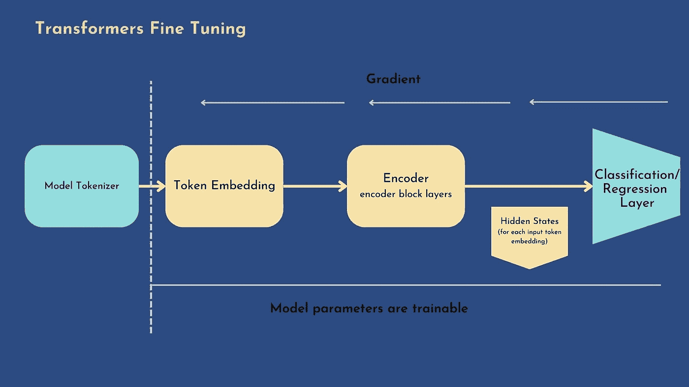
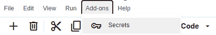
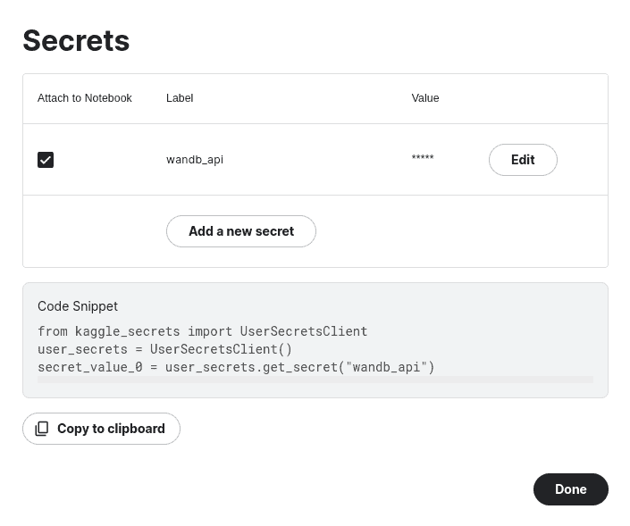
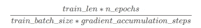

# 多元回归的变形金刚—[第二部分]

> 原文：<https://pub.towardsai.net/transformers-for-multi-regression-task-part2-fine-tuning-2683ef134d1c?source=collection_archive---------4----------------------->

# 🤖微调🤖

在 [FB3 竞赛](https://www.kaggle.com/competitions/feedback-prize-english-language-learning)的背景下，我们的目标是使用 8-12 年级英语学习者写的预先评分的议论文建立六个分析指标模型。我们必须模拟的技能如下:**衔接、句法、词汇、措辞、语法**和**约定**。分数范围从 1.0 到 5.0，增量为 0.5。


致敬马赛尔·普鲁斯特:@ [马里奥·布雷达](https://fr.dreamstime.com/marcel-proust-auteur-fran%C3%A7ais-illustration-vecteur-image131669085)

在我的上一篇文章中，我向您展示了如何使用一个预先训练好的转换器来提取上下文捕获嵌入，并使用它们来训练一个多元回归器。

这次我将向您展示如何对整个变压器进行端到端的训练，这也意味着更新预训练模型的参数。

此外，我将向您展示如何使用 weights and biases 平台:从使用 **wandb** API 登录，到创建和使用模型工件以及通过模型跟踪。

所有代码源都可以从[我的 Kaggle 笔记本](https://www.kaggle.com/code/schopenhacker75/transformers-for-us-beginners)中检索到

**信用**:这部分我借用了 [@debarshichanda](https://www.kaggle.com/code/debarshichanda/fb3-custom-hf-trainer-w-b-starter#notebook-container) 模型的架构。

# 🎛Imports 和配置

首先，我们将定义`CONFIG`字典和与 transformer 相关的导入，我们将在整个项目中使用它们:

```
import torch
import torch.nn as nn
import transformers
from transformers import (
    AutoModel, AutoConfig, 
    AutoTokenizer, logging,
    AdamW, get_linear_schedule_with_warmup,
    DataCollatorWithPadding,
    Trainer, TrainingArguments
)
from transformers.modeling_outputs import SequenceClassifierOutput

logging.set_verbosity_error()
logging.set_verbosity_warning()

CONFIG = {
    "model_name": "microsoft/deberta-v3-base",# "distilbert-base-uncased",
    "device": 'cuda' if torch.cuda.is_available() else 'cpu',
    "dropout": random.uniform(0.01, 0.60),
    "max_length": 512,
    "train_batch_size": 8,
    "valid_batch_size": 16,
    "epochs": 10,
    "folds" : 3,
    "max_grad_norm": 1000,
    "weight_decay": 1e-6,
    "learning_rate": 1e-5,
     "loss_type": "rmse",
    "n_accumulate" : 1,
    "label_cols" : ['cohesion', 'syntax', 'vocabulary', 'phraseology', 'grammar', 'conventions'], 

}
```

# 🧮Custom 数据集迭代器:

如前一篇文章所解释的，我们将定义一个`torch.utils.data.Dataset`的子类，并覆盖`__init__`、`__len__`和`__getitem__`特殊方法，如下所示:

```
import pandas as pd

train = pd.read_csv(PATH_TO_TRAIN)
test = pd.read_csv(PATH_TO_TEST)

# lets define the batch genetator
class CustomIterator(torch.utils.data.Dataset):
    def __init__(self, df, tokenizer, labels=CONFIG['label_cols'], is_train=True):
        self.df = df
        self.tokenizer = tokenizer
        self.max_seq_length = CONFIG["max_length"]# tokenizer.model_max_length
        self.labels = labels
        self.is_train = is_train

    def __getitem__(self,idx):
        tokens = self.tokenizer(
                    self.df.loc[idx, 'full_text'],#.to_list(),
                    add_special_tokens=True,
                    padding='max_length',
                    max_length=self.max_seq_length,
                    truncation=True,
                    return_tensors='pt',
                    return_attention_mask=True
                )     
        res = {
            'input_ids': tokens['input_ids'].to(CONFIG.get('device')).squeeze(),
            'attention_mask': tokens['attention_mask'].to(CONFIG.get('device')).squeeze()
        }

        if self.is_train:
            res["labels"] = torch.tensor(
                self.df.loc[idx, self.labels].to_list(), 
            ).to(CONFIG.get('device')) 

        return res

    def __len__(self):
        return len(self.df)
```

# 🤖微调变压器

使用这种方法，隐藏状态不是固定的，而是可训练的:为此，它要求分类头是**可微分的。通常，我们使用神经网络作为分类器。**



Zeineb Ghrib

在本节中，我们将看到如何使用 HuggingFace 提供的简单且功能完整的训练和评估 API:`Trainer`基于`microsoft/deberta-v3-base`预训练模型微调编码器变压器。

我们将定义一个自定义模型，用一个可训练的神经网络头来扩展`microsoft/deberta-v3-base`。

定制模型将包括:

*   **预训练基线模型**:加载带有`AutoModel.from_pretrained`功能的预训练`microsoft/deberta-v3-base`
*   **平均池层**:我们需要对之前的平均池函数做一些修改(参见[第一部分](https://medium.com/@zghrib/transformers-for-multi-regression-task-part1-transformers-as-feature-extractor-9f174ab66ce9)帖子):从`torch.nn.Module`继承池类，并在`forward`方法中定义平均池函数(参见下面的代码)
*   **漏失层**:添加一个漏失层进行正则化
*   **线性图层**:输入尺寸= `hidden_state_dim`，输出尺寸=目标特征数量(6)

线性层的 logits 输出通过`forward`方法上的`SequenceClassifierOutput`-`ModelOutput`类的子类返回(所有模型的输出必须是`ModelOutput`子类的实例:[引用此处为](https://huggingface.co/docs/transformers/main_classes/output))

```
class MeanPooling(nn.Module):
    def __init__(self):
        super(MeanPooling, self).__init__()  
    def forward(self, last_hidden_state, attention_mask):
        input_mask_expanded = attention_mask.unsqueeze(-1).expand(last_hidden_state.size()).float()
        sum_embeddings = torch.sum(last_hidden_state * input_mask_expanded, 1)
        sum_mask = input_mask_expanded.sum(1)
        sum_mask = torch.clamp(sum_mask, min=1e-9)
        mean_embeddings = sum_embeddings / sum_mask
        return mean_embeddings

class FeedBackModel(nn.Module):
    def __init__(self, model_name):
        super(FeedBackModel, self).__init__()
        self.config = AutoConfig.from_pretrained(model_name)
        self.config.hidden_dropout_prob = 0
        self.config.attention_probs_dropout_prob = 0
        self.model = AutoModel.from_pretrained(model_name, config=self.config)
        self.drop = nn.Dropout(p=0.2)
        self.pooler = MeanPooling()
        self.fc = nn.Linear(self.config.hidden_size, len(CONFIG['label_cols']))

    def forward(self, input_ids, attention_mask):
        out = self.model(input_ids=input_ids,
                         attention_mask=attention_mask, 
                         output_hidden_states=False)
        out = self.pooler(out.last_hidden_state, attention_mask)
        out = self.drop(out)
        outputs = self.fc(out)
        return SequenceClassifierOutput(logits=outputs)
```

## 损失和度量

由于我们将使用`Trainer`，我们需要定义一个对应于目标评估指标的新损失函数(在我们的例子中为 MCRMSE)。该损失函数将用于训练变压器。实现的方法是定义一个`subclassing Trainer`并覆盖`compute_loss()`方法。

同样，我们希望在评估步骤中获得每个目标类的局部评估，因此我们将为`Trainer`提供一个自定义的`compute_metrics()`函数，该函数允许计算六个目标中每个目标的 RMSE(否则，评估将只返回损失评估 MCRMSE)。

```
class RMSELoss(nn.Module):
    """
    Code taken from Y Nakama's notebook (https://www.kaggle.com/code/yasufuminakama/fb3-deberta-v3-base-baseline-train)
    """
    def __init__(self, reduction='mean', eps=1e-9):
        super().__init__()
        self.mse = nn.MSELoss(reduction='none')
        self.reduction = reduction
        self.eps = eps

    def forward(self, predictions, targets):
        loss = torch.sqrt(self.mse(predictions, targets) + self.eps)
        if self.reduction == 'none':
            loss = loss
        elif self.reduction == 'sum':
            loss = loss.sum()
        elif self.reduction == 'mean':
            loss = loss.mean()
        return loss

class CustomTrainer(Trainer):
    def compute_loss(self, model, inputs, return_outputs=False):
        outputs = model(inputs['input_ids'], inputs['attention_mask'])
        loss_func = RMSELoss(reduction='mean')
        loss = loss_func(outputs.logits.float(), inputs['labels'].float())
        return (loss, outputs) if return_outputs else loss

def compute_metrics(eval_pred):
    predictions, labels = eval_pred
    colwise_rmse = np.sqrt(np.mean((labels - predictions) ** 2, axis=0))
    res = {
        f"{analytic.upper()}_RMSE" : colwise_rmse[i]
        for i, analytic in enumerate(CONFIG["label_cols"])
    }
    res["MCRMSE"] = np.mean(colwise_rmse)
    return res
```

# 🧚Weights 和 Biases🧚

尽管 HuggingFace Transformers 提供了广泛的训练检查点功能。W & B 提供强大的实验跟踪和模型版本化工具，带有友好的交互式仪表盘。每个实验项目都是独立划分的。

查看[这款出色的笔记本](https://www.kaggle.com/code/ayuraj/experiment-tracking-with-weights-and-biases#%F0%9F%96%A5-Dashboard-(experiment-tracking)，它详细描述了如何在 kaggle 中使用 W & B:

> *W&B 提供了两个主要的实用程序:*
> 
> 🤙**仪表板**(实验跟踪):实时记录和可视化实验=将数据和结果保存在一个方便的地方。把这看作是一个实验的宝库。
> 
> 🤙**工件**(数据集+模型版本化):存储和版本化数据集、模型和结果=确切地知道模型被训练的数据。

为了连接到 Weights & Biases，我们需要从[https://wandb.ai/authorize](https://wandb.ai/authorize)访问您的 API 密钥。
有两种方法可以使用 Kaggle 内核登录:

*   运行`wandb.login(key=your-api-key)` cmd:它会要求 API key:你可以从[https://wandb.ai/authorize](https://wandb.ai/authorize)复制/粘贴。

*如果你不使用 Kaggle* ，可以跳过这一部分

*   使用 Kaggle secrets 存储您的 API 密钥:并使用下面的代码片段登录。

1.  点击笔记本编辑器中的`Add-ons`菜单，然后点击`Secrets`:



2.将 api-key 存储为将附加到当前笔记本的键值对:



3.复制并粘贴代码片段以访问 api-key，然后使用`wandb.login()`连接到 W & B:

```
from kaggle_secrets import UserSecretsClient
import wandb

user_secrets = UserSecretsClient()
api_key = user_secrets.get_secret("wandb_api")
wandb.login(key=api_key)
```

# 🛠Wandb 论点

对于每个 CV 迭代‘I ’,我们将创建一个名为 **FB3-fold-i** 的新运行，其中‘I ’=迭代的编号，在一个名为 **Feedback3-deberta** 的项目中。

一些其他参数:

*   `group`:群组参数特别用于将单个实验组织成一个更大的实验，[下面是一些用例示例](https://docs.wandb.ai/guides/track/advanced/grouping)
*   `tags`:我们将添加型号名称和公制标签。正如 W & B 中所解释的，doc 标签对于组织一起运行或应用临时标签如“基线”或“生产”是有用的。很容易在 UI 中添加和删除标签，或者过滤到只运行特定的标签。
*   通常不是“训练”就是“评估”。稍后，它将允许对相似的运行进行过滤和分组。我们将把 job_type 设置为**“train”**
*   `anonymous`:该参数允许控制匿名记录。我们将把它设置为**“must”**，这将把跑步发送到一个匿名帐户，而不是一个注册用户帐户。对于其他选项，您可以查看[文档](https://docs.wandb.ai/ref/python/init)

对于每个 CV 迭代，我们可以如下实例化一个 wandb 运行:

```
run = wandb.init(project="FB3-deberta-v3", 
                   config=CONFIG,
                   job_type='train',
                   group="FB3-BASELINE-MODEL",
                   tags=[CONFIG['model_name'], CONFIG['loss_type'], "10-epochs"],
                   name=f'FB3-fold-{fold}',
                   anonymous='must')
```

现在让我们定义拥抱脸`Trainer`将使用的训练参数

# 🛠Training 论点

在实例化我们的定制教练之前，我们将创建一个`TrainingArguments`来定义训练配置。
我们将设置以下参数:

*   `output_dir`:模型预测和检查点将被写入的输出目录:每个 CV 迭代将有它自己的目录，其名称等于以**“输出-”**为前缀的迭代次数
*   `evaluation_strategy`:设置为**“epoch”**，表示在每个 epoch 结束时进行评估。
*   `per_device_train_batch_size`:训练的批量。我们将它设置为 8
*   `per_device_eval_batch_size`:评估的批量。我们将它设置为 16(以加快时间执行)
*   `num_train_epochs`:训练时期数。提醒一下，在一个时期内，模型已经看到了训练数据集的每个样本
*   `group_by_length`:只要我们将使用动态填充，我们就将该参数设置为`True`，以将训练数据集中长度大致相同的样本分组在一起(以最小化所应用的填充并提高效率)
*   `max_grad_norm`:最大梯度范数(用于梯度裁剪)。
*   `learning_rate`:AdamW 优化器的初始学习率。提醒一下，AdamW 优化器
*   `weight_decay`:应用于 AdamW 优化器的权重衰减:在我们的例子中，我们将权重衰减应用于除偏差和标准化层之外的所有层

****注:**
权重衰减是一种正则化技术，它给损失函数(通常是权重的 L2 范数)增加了一个小的惩罚。
损耗=损耗+权重 _ 衰减 _ 参数* L2 _ 范数 _ 权重**

**一些实现仅对权重而不是偏差应用权重衰减。另一方面，PyTorch 将权重衰减应用于权重和偏移。**

> ****为什么体重会衰减？****
> 
> **1.以防止过度拟合。
> 2。为了避免爆炸梯度:由于额外的 L2 范数，除了损失之外，网络的每次迭代将试图优化模型权重。这将有助于保持权重尽可能小，防止权重增长失控，从而避免爆炸梯度**

*   **`gradient_accumulation_steps`:在执行向后传递之前，梯度应该累积的步数:当使用梯度累积时，梯度计算是在较小的步中完成的，而不是一次为一批完成；1(表示没有梯度累积))**

> ****注** :
> 在本 [Stackoverflow 讨论](https://stackoverflow.com/questions/74065165/getting-cuda-error-when-trying-to-train-mbart-model)中，已经解释了如何使用 set `gradient_accumulation_steps`参数来避免 OOM 错误:将`gradient_accumulation_steps`参数设置为一个适合内存的数字，并将`per_device_train_batch_size`修改为`original_batch_size/gradient_accumulation_steps`:这样梯度将在`gradient_accumulation_steps`上累积，并通过`gradient_accumulation_steps` * `original_batch_size/gradient_accumulation_steps` = `original_batch_size`样本执行向后传递。训练步骤的总数是:**

****

*   **`load_best_model_at_end`:我们将把它设置为 True，以便在训练结束时加载训练过程中找到的最佳模型:在这种情况下，`save_strategy`必须与`evaluation_strategy` : **epoch** 相同**
*   **`metric_for_best_model`:我们将设置竞争指标 **MCRMSE** 或 **eval_MCRMSE** (带有 eval_ prefix)**
*   **`greater_is_better`:设置为 False，因为我们想得到 MCRMSE 较低的模型**
*   **`save_total_limit`:我们将把它设置为 1，以便每次总是保留一个检查点(output_dir 中较旧的检查点将被删除)。**
*   **`report_to`:由于我们连接到 W & B，我们将把 report_to logs 设置为**“wandb”****
*   **`label_name`:将 label_name 参数列表设置为 **["labels"]，**，对应目标类对应的自定义`Dataloader`生成的预定义字段**

```
training_args = TrainingArguments(
        output_dir=f"outputs-{fold}/",
        evaluation_strategy="epoch",
        per_device_train_batch_size=CONFIG['train_batch_size'],
        per_device_eval_batch_size=CONFIG['valid_batch_size'],
        num_train_epochs=CONFIG['epochs'],
        learning_rate=CONFIG['learning_rate'],
        weight_decay=CONFIG['weight_decay'],
        gradient_accumulation_steps=CONFIG['n_accumulate'],
        seed=SEED,
        group_by_length=True,
        max_grad_norm=CONFIG['max_grad_norm'],
        metric_for_best_model='eval_MCRMSE',
        load_best_model_at_end=True,
        greater_is_better=False,
        save_strategy="epoch",
        save_total_limit=1,
        report_to="wandb",
        label_names=["labels"]
    )
```

**此外，我们将为`Trainer`定义一些其他参数:**

*   ****数据整理器**:我们需要定义如何从`Dataloader` 返回的数据输入列表中创建一个批处理，我们将使用`DataCollatorWithPadding`来动态填充接收到的输入。**
*   ****优化器**:我们将在所有层使用`AdamW`，除了偏置和标准化层**
*   ****调度器**:我们将使用`get_linear_schedule_with_warmup`创建一个带有预热期的调度，在此期间，学习率从 0 线性增加到初始 lr(在优化器中设置)，然后从优化器中设置的初始 lr 线性减少到 0。
    调度器允许我们保持对学习率的控制，例如，如果我们想要确保学习率的每次更新不超过λ值(查看这个 [Stackoverflow 讨论](https://stackoverflow.com/questions/39517431/should-we-do-learning-rate-decay-for-adam-optimizer)关于优化器调度器的效用)**

**要启动交叉验证培训，首先，我们必须按照[第一部分帖子](https://zghrib.medium.com/transformers-for-multi-regression-task-part1-transformers-as-feature-extractor-9f174ab66ce9)中的说明创建简历折叠栏:**

```
# set seed to produce similar folds
cv = MultilabelStratifiedKFold(n_splits=CONFIG.get("folds", 3), shuffle=True, random_state=SEED)

train = train.reset_index(drop=True)
for fold, ( _, val_idx) in enumerate(cv.split(X=train, y=train[CONFIG['label_cols']])):
    train.loc[val_idx , "fold"] = int(fold)

train["fold"] = train["fold"].astype(int)
```

**CV 培训工作流程可以按如下方式实施:**

```
# Data Collator for Dynamic Padding
collate_fn = DataCollatorWithPadding(tokenizer=tokenizer)
# init predictions by fold
predictions = {}
for fold in range(0, CONFIG['folds']):
    print(f" ---- Fold: {fold} ----")
    run = wandb.init(project="FB3-deberta-v3", 
                     config=CONFIG,
                     job_type='train',
                     group="FB3-BASELINE-MODEL",
                     tags=[CONFIG['model_name'], CONFIG['loss_type'], "10-epochs"],
                     name=f'FB3-fold-{fold}',
                     anonymous='must')
    # the reset index is VERY IMPORTANT for the Dataset iterator
    df_train = train[train.fold != fold].reset_index(drop=True)
    df_valid = train[train.fold == fold].reset_index(drop=True)
    # create iterators
    train_dataset = CustomIterator(df_train, tokenizer)
    valid_dataset = CustomIterator(df_valid, tokenizer)
    # init model
    model = FeedBackModel(CONFIG['model_name'])
    model.to(CONFIG['device'])

    # SET THE OPITMIZER AND THE SCHEDULER
    # no decay for bias and normalization layers
    param_optimizer = list(model.named_parameters())
    no_decay = ["bias", "LayerNorm.weight"]
    optimizer_parameters = [
        {
            "params": [p for n, p in param_optimizer if not any(nd in n for nd in no_decay)],
            "weight_decay": CONFIG['weight_decay'],
        },
        {
            "params": [p for n, p in param_optimizer if any(nd in n for nd in no_decay)],
            "weight_decay": 0.0,
        },
    ]
    optimizer = AdamW(optimizer_parameters, lr=CONFIG['learning_rate'])
    num_training_steps = (len(train_dataset) * CONFIG['epochs']) // (CONFIG['train_batch_size'] * CONFIG['n_accumulate'])
    scheduler = get_linear_schedule_with_warmup(
        optimizer,
        num_warmup_steps=0.1*num_training_steps,
        num_training_steps=num_training_steps
    )
    # CREATE THE TRAINER
    trainer = CustomTrainer(
        model=model,
        args=training_args,
        train_dataset=train_dataset,
        eval_dataset=valid_dataset,
        data_collator=collate_fn,
        optimizers=(optimizer, scheduler),
        compute_metrics=compute_metrics
    )
    # LAUNCH THE TRAINER
    trainer.train()
```

**你可以访问我为这个项目创建的公共 W&B 仪表板:[https://wandb.ai/athena75/FB3-deberta-v3?工作空间=用户-雅典娜 75](https://wandb.ai/athena75/Feedback3-deberta?workspace=user-athena75)**

# **🗿创建 W&B 工件**

**对于以后的使用，一旦模型被微调，W&B 非常方便地创建模型工件。我们可以在以后使用它们，并创建我们模型的新版本。**

**要创建一个模型工件，您所要做的就是:**

1.  **创建一个名字清晰一致的`wandb.Artifact`对象，你必须指定`type`参数，它可以是`dataset`或`model`，在我们的例子中是`model`**
2.  **将本地目录添加到工件中:事实上，一旦您实例化了模型并开始微调它，它就会创建一个包含模型`bin`以及模型状态和配置的本地检查点。你得把它加到艺术品上。**
3.  **一旦工件拥有了所有需要的文件，您就可以调用`wandb.log_artifact()`来记录它。**

**下面是一个为每个 CV 模型创建工件的代码片段示例:**

```
for fold in range(0, CONFIG['folds']):
    run = wandb.init(project="FB3-deberta-v3", 
                         config=CONFIG,
                         job_type='train',
                         group="FB3-BASELINE-MODEL",
                         tags=[CONFIG['model_name'], CONFIG['loss_type'], "10-epochs"],
                         name=f'FB3-fold-{fold}',
                         anonymous='must')

    trainer = CustomTrainer(
              .....
    )
    ##### TRAIN / FINE-TUNE ####
    # create model artifact
    model_artifact = wandb.Artifact(f'FB3-fold-{fold}', type="model",
                                   description=f"MultilabelStratified - fold--{fold}")
    # save locally the model - it would create a local dir
    trainer.save_model(f'fold-{fold}')
    # add the local dir to the artifact
    model_artifact.add_dir(f'fold-{fold}')
    # log artifact
    # it would save the artifact version and declare the artifact as an output of the run
    run.log_artifact(model_artifact)

    run.finish() 
```

# **inference✨:的✨Use W&B 艺术品**

**一旦训练完成，我们可以**使用 Weights&bias 服务器上存储的工件**，在我们的例子中，生成模型预测并生成聚合输出预测。**

**PS:可以直接从 W&B 接口提取使用代码[https://wandb . ai/Athena 75/feedback 3-deberta/artifacts/model/FB3-fold-0/93c 08783 e5b 7c 696451 a/usage](https://wandb.ai/athena75/Feedback3-deberta/artifacts/model/FB3-fold-0/93c08783e5b7c696451a/usage)**

1.  **登录到您的 wandb 帐户，用`wandb.init()`实例化一个默认运行**
2.  **向`use_artifact()`方法指出工件的路径以及检索工件的类型(在我们的例子中是`model`)**
3.  **使用`download()`方法在本地下载工件目录**
4.  **加载本地模型并使用它进行预测**

**实施示例:**

```
predictions = torch.zeros((len(test), len(CONFIG['label_cols']))

for fold in range(CONFIG["folds"]):
    print(f"---- FOLD {fold} -------")
    # instantiate deafault run
    run = wandb.init()
    # Indicate the artifact we want to use with the use_artifact method.
    artifact = run.use_artifact(f'athena75/FB3-deberta-10/FB3-fold-{fold}:v0', type='model')
    # download locally the model
    artifact_dir = artifact.download()
    # load the loacal model
    # it is a pytorch moeal: loaded as follows
    # https://pytorch.org/tutorials/beginner/saving_loading_models.html
    model = FeedBackModel(CONFIG['model_name'])
    model.load_state_dict(torch.load(f'artifacts/FB3-fold-{fold}:v0/pytorch_model.bin'))
    # generate test embediings
    test_dataset = CustomIterator(test, tokenizer, is_train=False)
    test_dataloader = torch.utils.data.DataLoader(
            test_dataset, 
            batch_size=CONFIG["train_batch_size"],
            shuffle=False
        )
    input_ids, attention_mask = tuple(next(iter(test_dataloader)).values())
    input_ids = input_ids.to('cpu')
    attention_mask = attention_mask.to('cpu')
    # genreate predictions
    fold_preds = model(input_ids, attention_mask)
    predictions = fold_preds.logits.add(predictions)
    # remove local dir to save space
    shutil.rmtree('artifacts')
```

# **🙏学分:**

**这项工作是这些优秀资源的独特起源，请不要犹豫投票支持 Kaggle 资源:**

*   **[**@rhtsingh** 笔记本](https://www.kaggle.com/code/rhtsingh/utilizing-transformer-representations-efficiently):探索变压器表象的不同方式**
*   **[**@debarshichanda** 作品](https://www.kaggle.com/code/debarshichanda/fb3-custom-hf-trainer-w-b-starter#Loss-Function):借用了训练器超参数和模型架构**
*   **[**@Y.NAKAMA** 笔记本](https://www.kaggle.com/code/yasufuminakama/fb3-deberta-v3-base-baseline-train):损失函数和多标签—分层交叉验证**
*   **[**@shreydan** 笔记本](https://www.kaggle.com/code/shreydan/using-transformers-for-the-first-time-pytorch/notebook):笔记本的全球风格**

# **结论:**

**非常感谢你阅读我的帖子！🥰，我跟你分享我所有的作品:这个 [Kaggle 笔记本](https://www.kaggle.com/code/schopenhacker75/transformers-for-us-beginners)，还有我的公 [W & B 仪表盘](https://wandb.ai/athena75/Feedback3-deberta?workspace=user-athena75)。**

**我希望这是明确的，并随时问我问题。**

**📬我的邮件地址是:**schopenhacker75@gmail.com**📬**

**在后面的一篇文章中，我打算讨论如何在生产中部署一个转换器。或者如何为 NLP 变压器建立一个 **MLOps 管道，**我还没有决定…**