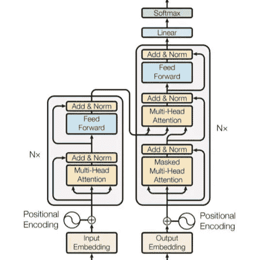
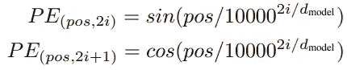
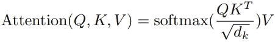
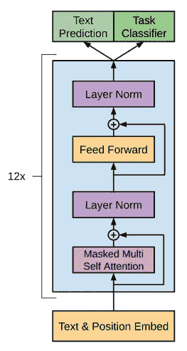

# 变形金刚:它们是什么，我如何制作一个？

> 原文：<https://pub.towardsai.net/transformers-what-are-they-and-how-can-i-make-one-6393b7ba57cf?source=collection_archive---------0----------------------->

## NLP 任务转换器的简单总结，以及使用 PyTorch 制作文本生成转换器的指南。

苏珊·d·威廉姆斯在 [Unsplash](https://unsplash.com/?utm_source=medium&utm_medium=referral) 上的照片

如果你对机器学习感兴趣，你可能已经注意到文本生成在过去几年里一直是一个热门话题。埃隆·马斯克的 GPT 模型，以及最近的[谷歌的 PaLM](https://ai.googleblog.com/2022/04/pathways-language-model-palm-scaling-to.html) 模型，都属于广义语言模型的浪潮，可以处理从翻译到文本摘要到代码完成的任何事情。令人兴奋的是，这些书呆子的努力已经闯入主流新闻，围绕伪感觉和人类可通过的文本生成器构成的威胁展开了辩论。

在本质上，这些模型(及其竞争对手)都是一个通用架构的变体，是 2017 年一篇题为[注意力是你所需要的全部](http://papers.neurips.cc/paper/7181-attention-is-all-you-need.pdf)的论文开始的旅程的一部分。在本文中，我们将使用 2017 架构从头开始训练我们自己的文本生成器。

何必呢？这是个很好的问题。如果您需要一个文本生成器来解决一个实际的问题，您最好的选择是使用领先的 LLM(大型语言模型)。这些模型接受了海量数据的训练，仅在计算能力上就花费了数百万美元，拥有数千亿个参数(相比之下，我的模型只有几百万个)。每个 LLM 都可以按原样使用，如果您有一个高度专门化的领域，可以对一些 LLM 进行微调。

但是用别人的模式是一回事。如果你想真正理解**一个变形金刚模型是如何工作的，没有比自己做一个然后把它拆开更好的方法了。**

# 关于你的一些事情

要理解这篇文章，你需要了解什么是深度学习。但是你不需要之前做过深度学习模型。如果你想遵循代码，你需要理解 python。但这可能是你对 PyTorch 的第一次介绍。如果你想制作自己的模型，你需要能够在 GPU 上运行你的代码(我用的是 Sagemaker，稍后会详细介绍)。

# 前言说够了，什么是变压器

转换器是一种特殊的深度学习架构，擅长序列到序列的任务。一个典型的应用是翻译—例如，输入可能是一个英语句子(一个单词序列)，输出可能是法语翻译。Transformer 模型查看英语句子并预测第一个法语单词；然后，它查看英语句子和第一个法语单词，并预测第二个法语单词。等等。其他应用包括文本摘要和聊天机器人式的问答。

这种方法也适用于开放式文本生成:对于任何输入的单词序列，该模型只是预测下一个单词和下一个单词，同时记住整个输入句子和所有已经预测的单词。然后，变形金刚可以自动完成你的句子或代码，或者只是给你写一个故事。

安德里亚·德·森蒂斯峰**T3[Unsplash](https://unsplash.com/?utm_source=medium&utm_medium=referral)上的照片**

传统的变压器由编码器和解码器组成。编码器被训练成将输入序列转换成向量序列(张量)，向量序列一起编码关于每个单词的语义含义和位置的信息。解码器被训练使用这个张量来预测输出序列，一次一个单词(或记号)。

# 听起来很酷，告诉我更多

单词嵌入的想法已经存在很长时间了——将单个单词表示为 n 维向量，这样相似的单词在 n 维空间中就会彼此靠近。就其本身而言，这对于像短句的情感建模这样的事情已经足够了，但是缺少句子结构本身的任何编码意味着我们需要更多的技巧来生成文本。 ***Jonty 爱数据科学*** 与 ***科学爱 Jonty 数据*** 不同，即使词袋表示完全相同。

流行的答案是使用递归神经网络。这将允许每一步进入下一步，允许一定程度的顺序记忆。唯一的问题是训练这些令牌很慢，因为它们不能并行化——您必须一次一个令牌地遍历序列。

然后是变形金刚。

原变压器架构来自瓦斯瓦尼等人 [*关注是你所需要的*](https://proceedings.neurips.cc/paper/2017/file/3f5ee243547dee91fbd053c1c4a845aa-Paper.pdf) *(2017)*

左边的灰框是编码器。右边的灰框是解码器。我们将一个源序列输入编码器，将一个目标序列输入解码器，并尝试一次一个单词地预测目标序列。

让我们浏览每一层。

第一部分非常简单。输入序列是嵌入的，也就是说，每个单词都被转换成一个向量。目标序列也是如此。这些嵌入是作为整体培训的一部分学习的。

接下来是位置嵌入，一个非常天才的技巧。没有 LSTM 或 RNN 的循环架构，我们需要一些方法来编码每个单词在句子中的位置。答案是使用以下公式为序列中的每个单词创建一个位置向量:

图片来自瓦斯瓦尼等人 [*关注就是你需要的一切*](https://proceedings.neurips.cc/paper/2017/file/3f5ee243547dee91fbd053c1c4a845aa-Paper.pdf) *(2017)*

简而言之，每个单词被赋予一个向量来表示它在序列中的相对位置； *pos* 是序列中单词的索引，而 *i* 是该单词的位置向量的索引。正弦函数的使用确保了序列中的每个字都获得一个唯一的向量，第*个字和第*个字总是获得相同的向量，而不管序列长度如何，并且对于给定的偏移量，两个字之间存在固定的线性关系，而不管它们出现在序列中的什么位置。如果你感兴趣，你可以在这里更深入地研究数学。这些位置向量被简单地添加到单词向量中，以赋予它们位置信息。我们称这个结果为**上下文张量**。

下一位是变形金刚真正的秘制酱— **注意**。

图片来自瓦斯瓦尼等人 [*关注是你所需要的一切*](https://proceedings.neurips.cc/paper/2017/file/3f5ee243547dee91fbd053c1c4a845aa-Paper.pdf) *(2017)*

这看起来很复杂，如果你阅读这个主题，你会看到对查询、键和值的引用(由于这个概念在搜索引擎中的应用)。真正重要的是你在计算向量之间的“兼容性”。

在编码器中，我们有“自我关注”。q、K 和 V 都是同样的东西——我们的**上下文张量**。将我们的上下文张量本身相乘产生一组权重，当两个单词相似时，该权重大，当它们不相似时，该权重小。再乘以上下文张量就得到原始上下文张量的缩放版本——其中每个单词向量现在都有一些相关单词的信息。类似的事情发生在解码器中，唯一的区别是掩码用于确保转换器不能提前看到它试图预测的单词。

更有趣的是“编码器-解码器注意”，其中 Q 是我们的目标上下文张量，K 和 V 都是编码器的输出(即来自我们的源上下文张量)。在这种情况下，结果是源上下文张量的缩放版本，其中来自源序列的与目标序列相关的单词被强调。这意味着当我们一步一步地通过我们的目标，一次预测一个单词，随着目标序列的发展，源序列的不同部分将被突出显示。本质上，我们将相关源词的信息放入每个目标词的向量中。请看[这里](https://jalammar.github.io/illustrated-transformer/)或者[这里](https://towardsdatascience.com/illustrated-guide-to-transformers-step-by-step-explanation-f74876522bc0)看一个更彻底的，有插图的演示。

为什么这一切如此巧妙？这是转换器允许每个单词知道其他单词的方法。它意味着一个完整的序列可以被一次处理，并且对相邻单词之间的短时记忆没有限制。

更具体地说，在计算注意力之前，每个张量(或者在自我注意的情况下，同一个张量三次)被投影到不同的、已学习的线性空间中。而架构中提到的**多头**意味着我们不是只计算一次注意力，而是多次计算，每次都涉及不同的线性投射。然后将结果连接并投射回来。所有这些都给了模型学习序列中不同单词之间不同关系的灵活性。

最后，编码器和解码器模块中有一个标准前馈层，编码器和解码器实际上是相同层的堆叠。这种堆叠类似于图像模型中的堆叠层，其中每一层馈入下一层，允许更高层了解更多细粒度的特征。就是这样！唷。

# 我想这有一定的道理，但是我怎么才能做出一个变压器呢？

如果你没有遵循以上所有的建议，那真的没关系。实际上*制作*变压器更重要。所以…

皮特·赖特在 [Unsplash](https://unsplash.com/?utm_source=medium&utm_medium=referral) 上的照片

是时候把手弄脏了！

对于这个例子，我使用的是[英国政府请愿数据](https://explore.data.parliament.uk/?learnmore=e-Petitions)(其中包含根据 [*开放议会许可 v3.0*](https://www.parliament.uk/site-information/copyright-parliament/open-parliament-licence/) 许可的*议会信息)。*

每份请愿书都有一个标题和一段描述——我们的任务是创建一个可以从标题生成描述的模型。这是一个序列到序列的任务，代码可以很好地移植到任何其他序列到序列的任务——无论是翻译、文本摘要还是一般的文本生成(在这种情况下，输入将是一些文本，而目标只是下一个文本)。上述代码很大程度上依赖于 PyTorch 的精彩教程[(做了一些调整，以使其与我们的数据一起工作，并帮助我们询问代码做了什么)。](https://pytorch.org/tutorials/beginner/translation_transformer.html)

如果您发现这一部分开始听起来像废话，我鼓励您快速进入下一部分，在这一部分，我们将通过一个简单的例子来理解模型到底在做什么。文章末尾提供了完整的代码。现在，不再拖延…

我们将从进口开始。为此，我使用了 AWS Sagemaker 笔记本和 ml.g4dn.2xlarge 实例，并将数据存储在 S3 桶中。您可以使用 Colab 或您自己的 GPU 设置，您只需要更改负责加载数据的代码行。

接下来，我们需要基于 PyTorch IterableDataset 对象创建我们自己的 Dataset 类，因为这将有助于我们稍后制作一个数据加载器…这就是 PyTorch 期望的输入。这非常简单——py torch 希望有以下三种方法，我们只需将“数据”设置为一个元组列表，每个元组保存一个源和目标序列(请愿书的标题和描述)。

下一个任务是从我们的数据中创建一个词汇表。这只是意味着我们用一个数字来表示数据中的每个唯一的单词。我们在我们的词汇表中添加了四个特殊的符号——一个表示未知的标记(以防我们以后试图输入一个不在我们的词汇表中的单词),一个表示填充，一个表示序列的开始，一个表示结束。与一些语言任务不同，我们不做任何预处理来进行词干或词汇化，也不删除停用词或大写:我们的模型需要了解这两者，以便令人信服地生成文本。

现在是时候编写模型的主要部分了。让我们提醒自己我们在做什么:

原变压器架构来自瓦斯瓦尼等人 [*关注就是你所需要的*](https://proceedings.neurips.cc/paper/2017/file/3f5ee243547dee91fbd053c1c4a845aa-Paper.pdf) *(2017)*

PyTorch 非常方便地提供了一个覆盖编码器和解码器(灰色方框)的[变压器模块](https://pytorch.org/docs/stable/generated/torch.nn.Transformer.html)。它的参数甚至默认为 2017 年 *Attention is All You Need* 论文中使用的参数(比如堆叠的编码器/解码器层数，以及关注块的“头”数)。因此，我们真正需要做的是添加一个嵌入层，一个位置编码层，和一个最终的线性层。

幸运的是，PyTorch 再次为嵌入和线性层提供了开箱即用的解决方案。

这看起来很复杂，但是`forward`*方法讲述了主要的故事。源序列和目标序列都被嵌入(每个单词都变成一个向量)，然后每个都得到一轮位置编码，然后都被插入 PyTorch 的 Transformer 模块。然后我们添加一个线性层到输出中……这是代码中的图表(除了 Softmax 层，我们将在后面处理)。`encode`和`decode`方法允许我们只应用编码器或解码器，这在训练后使用模型时会很有用。*

*你可能已经注意到了一些关于面具的内容。我们需要从模型中隐藏任何填充(我们不希望模型预测填充)，并且我们需要防止模型提前看到它试图预测的单词(这将是欺骗)。我们可以用以下函数创建这些遮罩:*

*这并不十分重要，但如果你在意的话，你可能已经发现目标遮罩是一个三角形矩阵。这是因为它是在对目标序列计算自我注意之后在解码器内应用的。解码器自我关注的输出将是一个正方形矩阵，保存目标单词的每个组合的分数。三角口罩保证了第一个字只能看自己，第二个字只能看自己，第一个字，第三个世界只能看自己和前两个字等等。*

*我们快到了。现在是时候创建一个真实的`Seq2SeqTransformer`实例了。我们传入一些参数；具体来说，我们选择 512 长度的嵌入向量，8 个用于注意模块的“头”,以及 3 个编码器和解码器层的堆栈。然后，我们初始化一些随机权重，将我们的模型传递到 GPU 上，并设置自己来计算交叉熵损失。*

*现在我们有了一个`Seq2SeqTransformer`的实例，我们可以使用 [torchinfo](https://github.com/TylerYep/torchinfo) 来查看 PyTorch Transformer 模块内部的真实情况。这个摘要是针对一个特定的批次，其中源序列是 21 个标记长，目标序列是 128 个标记长，但是这些长度可以是任意的，并且它们随批次而变化。*

**

*照片由 [Simran Sood](https://unsplash.com/@simran01_fashionphotography) 在 [Unsplash](https://unsplash.com/?utm_source=medium&utm_medium=referral) 上拍摄*

*太多了，但我们正在努力。我们需要一些额外的函数，在将原始句子转换成模型输入/目标张量时会调用这些函数。*

*训练前的最后一件事！我们需要一个函数来训练每个时期(通过模型的每个完整周期来更新其参数)，另一个函数来验证每个时期(测试我们从训练数据中保留的验证数据的结果有多好)。*

*现在终于到了训练的时候了！*

*是的，这不是最好的交叉熵分数，但我们现在保留判断。*

# *遍历模型*

*最后一部分可能很有意义，但也可能毫无意义。您可能有一个工作模型，或者您可能仍然在与 torch text 喜欢抛出的奇怪的导入错误作斗争(如果是这样，也许[检查](https://github.com/pytorch/text#installation)您的版本是兼容的)。无论哪种方式，我认为理解这个模型的最好方法是从中取一个例子。*

*我们将接受验证集中的第一份请愿书，这份请愿书是关于学校需要实用技能，以便……让我们的孩子远离毒品和谋杀。很显然。*

*我们首先将源句子和目标句子分成记号(单词和标点符号)，使用我们的词汇查找将每个记号替换为一个整数，然后添加特殊记号来表示每个序列的开头和结尾。实际上，我们会有一批几个句子，所以我们在这里实际上是在玩一个批量大小为 1 的游戏。*

*下一件事，我们需要做的是创建我们的面具。当我们将目标序列传递给解码器时，为了训练和评估，解码器将尝试为目标序列的每个部分预测下一个标记。它将查看第一个令牌并尝试预测第二个令牌，它将查看第一个和第二个令牌并尝试预测第三个令牌，依此类推。我们不是重复地将相同目标序列的不断增加的比特馈送给解码器，而是传递整个东西并计算一次自我注意。我们的目标掩码只是确保解码器不会提前窥视。您可以将每一行读取为引用目标序列中的一个位置，并将每个负无穷大读取为一个掩码；第一个令牌只能看自己，第二个令牌可以看自己和第一个令牌，以此类推。这是模型的*自回归*性质，转换器学习查看源序列和目标序列的一部分，以便预测掩码下的下一个单词。*

*好了，我们来做一些预测吧！*

*我们只是给了我们的模型源序列和目标序列，以及我们的各种掩码，模型给了我们一些*逻辑*(非归一化概率)。在幕后，该模型采用我们的源和目标序列，应用令牌嵌入和位置编码，将结果通过编码器和解码器(在多头关注下完成)，并最终通过末端的线性层。产生的张量具有以下维度:*

*   *56:因为这就是我的输出序列的长度*
*   *1:因为我的批量是 1*
*   *30315:因为这是我全部词汇中的标记数*

*换句话说，对于目标序列中的每个位置，该模型为我的词汇表中的每个可能的标记提供了一个非规范化的概率。我们来看看哪些代币获得大概率。*

*相当酷！该模型正确地猜测第一个单词应该大写，如果我们回头看真实的描述，我们可以看到真实的单词被预测为前两个单词的第五大可能性(超过 30k 种可能性)。源序列的影响意味着主题倾向于学校和儿童，逐渐暴露的目标序列的影响确保了语法意义(不同于真正的答案)。*

*总结一下，让我们计算一下这个例子的损失。这实质上是看“正确”答案的概率有多高，对于自由文本生成来说，这总是一个很差的分数，因为我们不会因为预测出可信的甚至语义上与目标相似的句子而得到奖励。*

# *我们可以试一下模型了吗？*

*使用该模型来生成一些新的请求与我们刚刚经历的过程类似，除了不是稳定地揭示“该”目标序列，而是稳定地组合一个全新的输出序列。为此，我们将最终利用`Seq2SeqTransformer`中的`encode`和`decode`方法。*

*具体来说，我们将输入一个请愿书标题，模型将为我们的请愿书描述的第一个词给出概率。我们将选择概率最高的一个词，并将其放回模型中，然后模型将给出第二个词的概率。在每一步，我们将选择概率最高的单词。这被称为*贪婪搜索*，虽然有其他可能更好的选项(*波束搜索*)，但*贪婪搜索*是最简单的。*

*我们`Seq2SeqTransformer`的`decode` 方法实际上是利用 PyTorch 的`TransformerDecoder`模块的`forward`方法，我们`Seq2SeqTransformer`的`encode`方法实际上是利用 PyTorch 的`TransformerEncoder`模块的`forward`方法。在这两种情况下，我们的`Seq2SeqTransformer`在应用前面提到的编码器/解码器模块之前，对序列应用令牌和位置嵌入。所以在上面的代码中，我们嵌入了源序列，并通过编码器得到“内存”，即解码器期望作为输入的最后一个编码层的输出(参见`TransformerDecoder`模块代码[这里](https://pytorch.org/docs/stable/_modules/torch/nn/modules/transformer.html#TransformerDecoder))。我们将它与序列的开始一起传递给解码器，序列开始时只是一个 **< bos >** 令牌，但它在每个周期增长，以包括上一个周期预测的最可能的单词。*

*击鼓！以下是实际运行的模型:*

*所以…不是最好的。我们已经在 3 万个数据点上训练了 5000 万个参数，所以我们会有一些过度拟合。该模型对一些话题如 NHS 和英国退出欧盟很满意，但完全不知道人工智能是什么意思。话虽如此，我们基本上得到了相当不错的语法。*

# *最后的想法*

*值得注意的是，许多多面手模型已经转移到只有*解码器的*架构。当将一种类型的序列映射到另一种类型时(例如将英语翻译成法语或总结文本)，我们使用的原始*编码器-解码器*架构是有意义的。但是对于在连续文本(如维基百科语料库)上训练的自动回归文本生成，您的目标序列只是源序列的更长版本。这意味着相同的数据被输入两次，导致冗余的权重被训练。因此，研究这些广义 LLM 的研究人员通常会移除编码器，以支持更多的解码器层。*

**

*GPT-2 架构如图[佩雷兹等人(2001)](https://www.researchgate.net/publication/349521999_Automatic_Code_Generation_using_Pre-Trained_Language_Models)*

*GPT-3 和 PaLM 就是这种趋势的例子。它们也是如此庞大的预训练模型，基于如此海量的数据进行训练，以至于它们认为自己是“少量学习”的例子。也就是说，即使模型被简单地训练来预测序列中的下一个单词，通过提供几个推理问题的例子(例如，英语句子及其法语翻译)，模型也被训练来使用这个“上下文”来为期望的任务提供更好的预测(在这个例子中是法语翻译，但是也可以是摘要、代码完成、问题答案、聊天机器人等)。).GPT-2 是为更传统的迁移学习设计的，其中预先训练的模型针对特定的任务进行微调；GPT-3 同样可以进行微调，但它太大了(而且受到严密保护)，因此需要使用 OpenAI 的 API。*

*最后，为了完整起见，请注意一些其他模型转而转储解码器，支持仅使用*编码器的*架构，从谷歌的 BERT(来自变压器的双向编码器表示)开始。编码器与解码器几乎相同，主要区别在于解码器被屏蔽以避免窥视未来。由于 BERT 更适合于文本分类或文本相似性等任务，而不是下一个令牌预测，所以它希望查看整个句子。它不想自动回归。其方法是随机屏蔽输入文本中某处的标记，并训练编码器堆栈来预测缺失的单词。其结果是一个预先训练好的模型，可以针对特定的任务进行微调，或者从中提取语境化的单词嵌入。*

# *这一切的目的是什么？*

*您现在理解了什么是转换器，我认为这在一个所有先进的文本生成器都是某种形式的转换器的世界中非常重要！*

*你可以在这里找到本文[中使用的完整代码。](https://github.com/JontyHabs/mediums/tree/main/Notebooks)*

# *参考*

*[1] S. Narang 和 A. Chowdhery， [Pathways 语言模型(PaLM):扩展到 5400 亿个参数以实现突破性性能](http://ai.googleblog.com/2022/04/pathways-language-model-palm-scaling-to.html) (2022)，谷歌人工智能博客*

*[2] A. Vaswanit 等人，(2017)，第 31 届神经信息处理系统会议(NIPS 2017)，美国加州长滩*

*[3] A. Kazemnejad，[变压器架构:位置编码](https://kazemnejad.com/blog/transformer_architecture_positional_encoding/) (2019)*

*[4] J. Alammar，[《图解变压器》](https://jalammar.github.io/illustrated-transformer/) (2018)*

*[5] M. Phi，[变压器图解指南-逐步解释](https://towardsdatascience.com/illustrated-guide-to-transformers-step-by-step-explanation-f74876522bc0) (2020)，朝向数据科学*

*[6] [用 nn 进行语言翻译。变压器和手电筒](https://pytorch.org/tutorials/beginner/translation_transformer.html)*

*[7] L. Perez，L. Ottens 和 S. Viswanathan，[使用预训练语言模型的自动代码生成](https://www.researchgate.net/publication/349521999_Automatic_Code_Generation_using_Pre-Trained_Language_Models) (2021)，斯坦福大学计算机科学系*