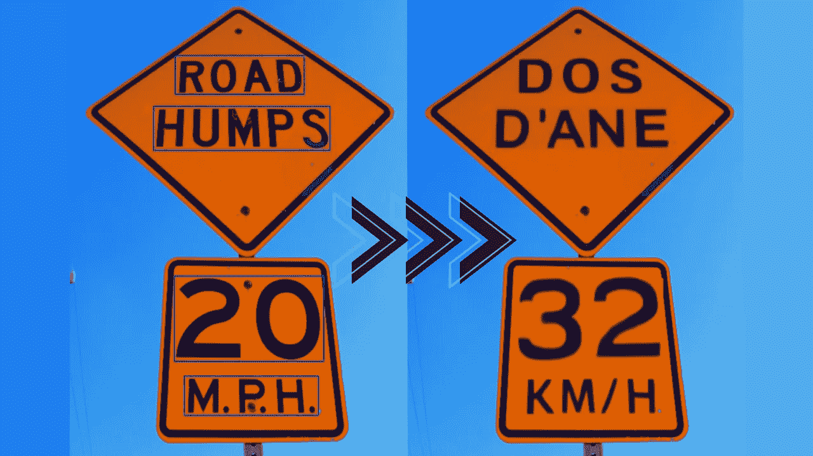
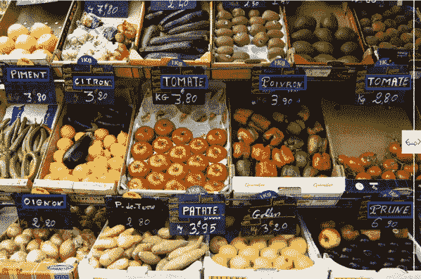
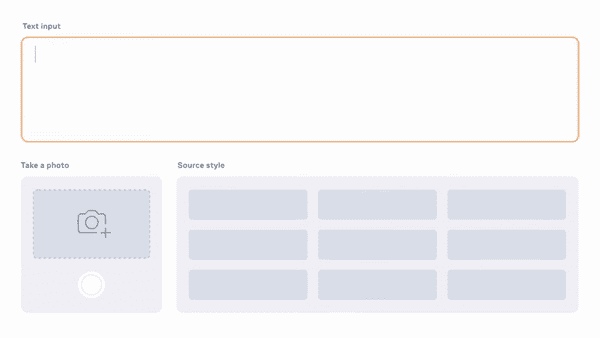
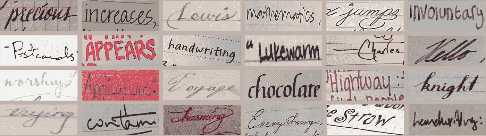
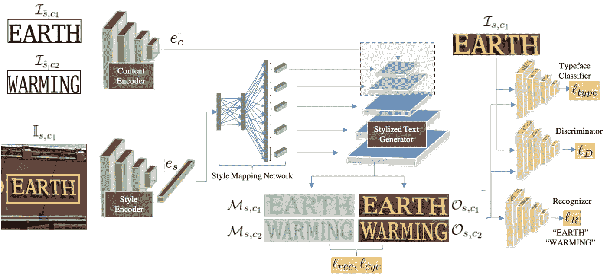
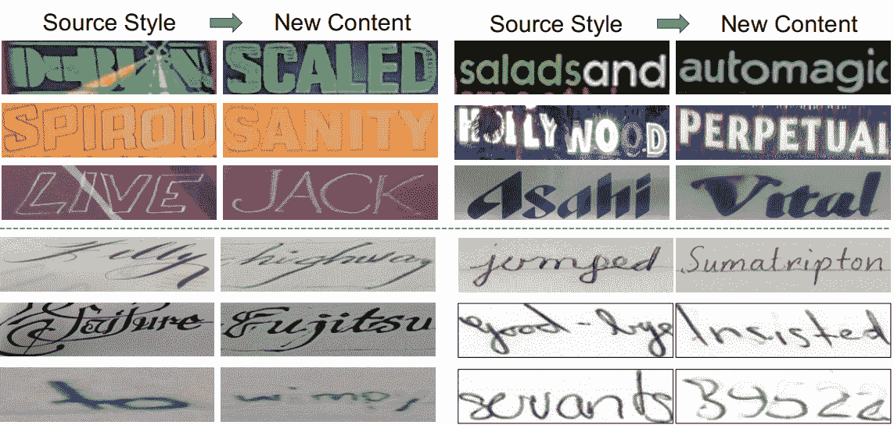

# 从模拟样式的图像翻译文本:TextStyleBrush

> 原文：<https://pub.towardsai.net/translate-text-from-images-emulating-the-style-textstylebrush-1b73af3d0ac9?source=collection_archive---------2----------------------->

## [人工智能](https://towardsai.net/p/category/artificial-intelligence)

## 这个新的脸书人工智能模型可以用你自己的语言翻译或编辑图像中的每一个文本，遵循相同的风格！

> *原载于*[*louisbouchard . ai*](https://www.louisbouchard.ai/textstylebrush/)*，前两天看了我的博客***！**

**

> *在文末的视频中可以看到更多关于 TextStyleBrush 可以实现什么的例子！*

*想象你在另一个你不会说该语言的国家度假。你想试试当地的餐馆，但是他们的菜单用的是你不会说的语言。我认为这不会太难想象，因为我们大多数人已经面临这种情况，无论你看到菜单项或方向，你不能理解写的是什么。嗯，在 2020 年，你会拿出你的手机，谷歌翻译你看到的东西。2021 年你甚至不需要再打开谷歌翻译，试着把你看到的一个一个写下来翻译。相反，你可以简单地使用脸书人工智能的这个新模型，用你自己的语言翻译图像中的每一个文本！这甚至不是这项技术的主要应用，但即使这样也很酷。更酷的是，他们的翻译工具实际上使用了与 deep fakes 类似的技术来改变图像中的单词，使其遵循与原始单词相同的风格！*

**

*从法语到英语的实时翻译。 [Praveen Krishnan 等人，(2021)，TextStyleBrush](https://ai.facebook.com/research/publications/textstylebrush-transfer-of-text-aesthetics-from-a-single-example/)*

*它可以使用一个单词作为例子，从任何图片复制文本的样式！就像这样…*

**

*一次性翻译示例。 [Praveen Krishnan 等人，(2021)，TextStyleBrush](https://ai.facebook.com/research/publications/textstylebrush-transfer-of-text-aesthetics-from-a-single-example/)*

*这对于增强现实中照片般逼真的语言翻译来说是惊人的。这只是第一篇关于这种模型在他们为这项任务发布的新数据集上训练的论文，已经非常令人印象深刻了！这对于视频游戏或电影来说可能是惊人的，因为你将能够翻译出现在建筑物、海报、标志等上的文本。超级容易，使沉浸更加个性化和令人信服的每个人都基于选择的语言，而不必手动 photoshop 每一帧或完全重拍场景。正如你所看到的，它也可以使用单个单词进行手写。它从单个单词示例中进行归纳并复制其风格的能力是这种新的人工智能模型如此令人印象深刻的原因。事实上，它不仅理解文本的排版和书法，还理解它出现的场景，无论是在弯曲的海报上还是来自不同的背景。*

**

*典型的文本传输模型以有监督的方式用一种特定的风格来训练，并且使用带有文本分段的图像。这意味着你需要知道图片中的每一个像素是什么，不管它是不是文本，这是非常昂贵和复杂的。相反，他们使用自我监督的训练过程，在训练过程中，文本的样式和分段不会提供给模型。只给出实际的单词内容。我说他们为这个模型发布了一个数据集，它只用一个词就能做到。这是因为在训练期间，模型首先学习在这个新数据集上完成任务的通用方法，该数据集具有许多示例。该数据集包含大约 9 000 个不同表面上的文本图像，仅带有单词注释。*

**

*数据集示例。 [Praveen Krishnan 等人，(2021)，TextStyleBrush](https://ai.facebook.com/research/publications/textstylebrush-transfer-of-text-aesthetics-from-a-single-example/)*

*然后，它使用来自输入图像的新单词，以我们称之为“一次转换”的方式学习它的风格。这意味着，仅从一个包含要更改的单词的图像示例中，它将自动调整模型，以适合任何其他单词的精确样式。如你所知，这里的目标是理清图像上出现的文本内容，然后在新文本上使用该文本的样式，并将其放回图像上。这种从实际图像中分离文本的过程是以一种自我监督的方式学习的，我们马上就会看到。
简而言之，我们将一幅图像作为输入，然后创建一幅只有翻译文本的新图像。*

**

*风格和内容的编码和解码过程。 [Praveen Krishnan 等人，(2021 年)，TextStyleBrush](https://ai.facebook.com/research/publications/textstylebrush-transfer-of-text-aesthetics-from-a-single-example/)*

*这难道不像给你的脸拍照，只是改变它的特定特征来匹配另一种风格，就像我上周发表的关于发型的文章一样吗？如果你还记得，我说过这和 deepfakes 的工作原理非常相似。也就是说，还有什么比 StyleGan2 更好的方法呢？style gan 2 是从另一幅图像生成图像的最佳模型。*

*现在，我们来了解一下它是如何做到这一点的，也就是培训过程。他们训练这个模型，使用预先训练的字体分类网络和文本识别网络来测量它在这些未标记图像上的性能。这就是它以自我监督的方式学习的原因，因为它无法直接访问输入图像的标签或基础事实。*

**

*模型概述。 [Praveen Krishnan 等人，(2021)，TextStyleBrush](https://ai.facebook.com/research/publications/textstylebrush-transfer-of-text-aesthetics-from-a-single-example/)*

*这一点，再加上与输入图像相比较的新文本在生成的图像上计算的真实性度量，允许在没有监督的情况下训练模型，其中我们确切地告诉它图像中有什么，旨在获得照片般逼真和准确的文本结果。这两个网络都将通过首先检测图像中的文本(这将是我们的基本事实)，然后将新文本与我们想要写的内容进行比较，并将其字体与原始图像的文本字体进行比较，来判断生成的文本与预期的文本有多接近。使用这两个已经训练好的网络允许基于 StyleGan 的图像生成器在没有任何先前标签的情况下对图像进行训练。然后，该模型可以在推理时使用，或者换句话说，在现实世界中，在没有我们讨论的其他两个网络的任何图像上，仅通过基于训练的 StyleGAN 的网络发送图像，该网络生成具有修改的文本的新图像。它将通过分别理解文本的风格和内容来实现其翻译。其中样式来自实际图像，内容是已识别的字符串和要生成的字符串。在这里，我刚刚提到的“理解”过程是一个编码器，这里用绿色显示，将信息压缩成一般信息，应该准确地表示我们真正想要从这个输入中得到什么。然后，这些编码的一般信息被发送到基于 image StyleGAN 的生成器中，以蓝色显示，根据所需的细节在不同的步骤中发送。这意味着内容和样式首先被发送，因为它需要被翻译。然后，我们将在生成的图像中强制使用该样式，方法是通过在训练过程中学习到的最佳比例，在多个步骤中将它迭代地输入到网络中。这使得生成器可以控制文本外观的低分辨率到高分辨率的细节，而不是像通常所做的那样，如果我们只将样式信息作为输入发送，就仅限于低分辨率的细节。当然，有更多的技术细节来适应一切并使其工作，但如果你想了解更多关于他们如何在更具技术性的方面实现这一点的信息，我会让你阅读下面参考资料中链接的他们的伟大论文。*

*我还想提一下，他们公开分享了一些复杂场景的问题，其中照明或颜色变化会导致问题，就像我之前介绍的其他基于 GAN 的应用程序一样，损害了真实感将你的脸转换为卡通或改变图像的背景。看到这些限制是至关重要的，也是非常有趣的，因为它们将有助于加速研究。*

**

*失败的例子。 [Praveen Krishnan 等人，(2021)，TextStyleBrush](https://ai.facebook.com/research/publications/textstylebrush-transfer-of-text-aesthetics-from-a-single-example/)*

*以一种更积极的方式结束，这只是第一篇以这种概括水平攻击这一复杂任务的论文，它已经非常令人印象深刻了。我等不及要看下一个版本了！*

*一如既往的感谢你的阅读，下期再见！*

## *观看视频*

*来我们的 [**Discord 社区与我们聊天:** **一起学习 AI**](https://discord.gg/learnaitogether)和*分享你的项目、论文、最佳课程、寻找 Kaggle 队友等等！**

*如果你喜欢我的工作，并想与人工智能保持同步，你绝对应该关注我的其他社交媒体账户( [LinkedIn](https://www.linkedin.com/in/whats-ai/) ， [Twitter](https://twitter.com/Whats_AI) )，并订阅我的每周人工智能 [**简讯**](http://eepurl.com/huGLT5) ！*

# *支持我:*

*   *支持我的最好方式是成为这个网站的成员，或者如果你喜欢视频格式，在[**YouTube**](https://www.youtube.com/channel/UCUzGQrN-lyyc0BWTYoJM_Sg)**上订阅我的频道。***
*   ***在经济上支持我的工作***
*   ***在[媒体](https://whats-ai.medium.com/)上跟我来***

# ***参考***

*   ***Praveen Krishnan，Rama Kovvuri，Guan Pang，Boris Vassilev，和 Tal Hassner，AI，(2021)，" TextStyleBrush:从一个单独的例子传递文本美学"，[https://scontent . fymq 3-1 . FNA . FBC dn . net/v/t 39.8562-6/10000000 _ 944085403038430 _ 37984959048688_ NC _ cat = 108&CCB = 1-3&_ NC _ sid = ae5e 01&_ NC _ OHC = jcq 0 M5 JB V8 ax 9 p 0 hnd&_ NC _ ht = s content . fymq 3-1 . FNA&oh = ab 1c 3f 244468 ca 196 c 76 b 81 a 299 FFA 1&OE = 60 ef 2 b 81](https://scontent.fymq3-1.fna.fbcdn.net/v/t39.8562-6/10000000_944085403038430_3779849959048683283_n.pdf?_nc_cat=108&ccb=1-3&_nc_sid=ae5e01&_nc_ohc=Jcq0m5jBvK8AX9p0hND&_nc_ht=scontent.fymq3-1.fna&oh=ab1cc3f244468ca196c76b81a299ffa1&oe=60EF2B81)***
*   ***数据集脸书 AI 造:[https://github . com/face book research/imgur 5k-手写-数据集？FB clid = iwar 0 praxhf 8 VG-5 H3 fa 0 bear rmed 21 hfo CJ-so 8v 0 QM wk 7 ub 21 dvy _ jqgiVo](https://github.com/facebookresearch/IMGUR5K-Handwriting-Dataset?fbclid=IwAR0pRAxhf8Vg-5H3fA0BEaRrMeD21HfoCJ-so8V0qmWK7Ub21dvy_jqgiVo)***