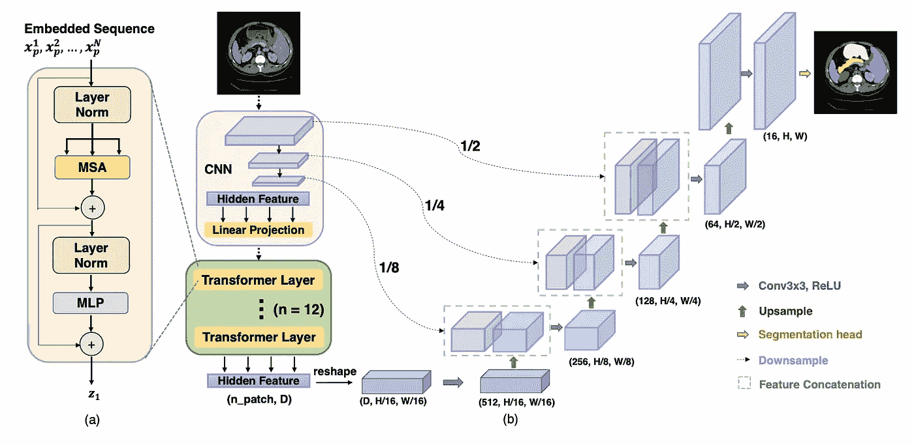
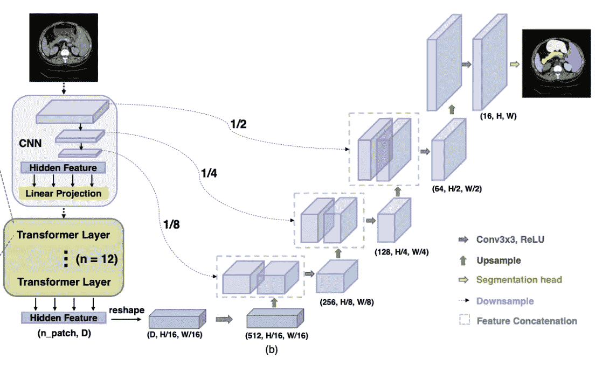
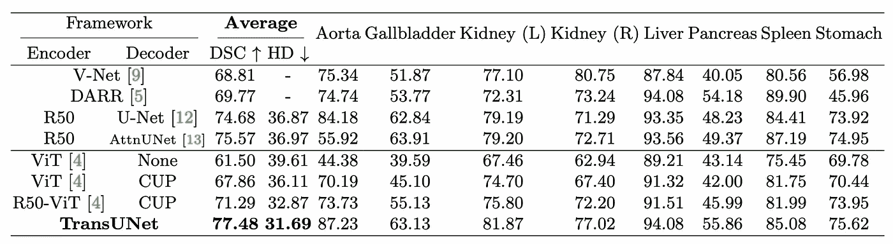

# TransUNet —革新传统的图像分割

> 原文：<https://pub.towardsai.net/transunet-no-more-cnns-for-image-segmentation-278e85c81914?source=collection_archive---------0----------------------->

## ***结合 CNN 和 Transformer 更新 U-Net，在图像分割任务上实现 SOTA 结果。***

# 目录

[🔥直觉](#e484)
[🔥TransUNet](#8e89)
∘ [下采样(编码)](#9938)
∘ [上采样(解码)](#230c)
[🔥结果](#ccf6)
[🔥](#0809)实现
引用[实现](#900a)

[贾斯珀盖伊](https://unsplash.com/es/@jasperguy?utm_source=medium&utm_medium=referral)在 [Unsplash](https://unsplash.com?utm_source=medium&utm_medium=referral) 上的照片

# 🔥直觉

如今， [U-Net](https://medium.com/@mlquest0/unet-clearly-explained-a-better-image-segmentation-architecture-f48661c92df9#3e17) 已经主导了图像分割任务，尤其是在医学影像领域。在迄今为止提出的大多数 U-网中，卷积神经网络(CNN)被广泛用作它们的底层结构。

然而，**由于卷积核尺寸较小，CNN 只能有效利用短程(或本地)信息**，在具有远程关系特征的任务中，无法充分探索远程信息。

[通常用于处理自然语言处理任务的变形金刚](https://medium.com/inside-machine-learning/what-is-a-transformer-d07dd1fbec04)，可以有效地探索长程信息，但**它们在探索短程信息方面不如 CNN**。

在图像分割任务中，利用细胞神经网络的能力可以弥补 Transformer 的不足，反之亦然，陈等人提出了 **TransUNet** ，这也是**第一个由 Transformer** 构建的图像分割模型。*同样值得一提的是，作者通过首次尝试使用纯变压器架构进行图像分割，验证了将 CNN 和变压器相结合的有希望的结果。然而，它的效果不如在他们的架构中引入 CNN，因为变压器在利用本地特性方面不如 CNN。*

# **🔥TransUNet**

我们知道在 [U-Net](https://medium.com/@mlquest0/unet-clearly-explained-a-better-image-segmentation-architecture-f48661c92df9#3e17) (图 1)中有一个**编码器**(下采样路径)和一个**解码器**(上采样路径)。下采样路径会将图像的特征编码到高级映射中，上采样路径会使用其细节来生成与输入维数相同的最终掩膜。

图 Ronneberger 等人的[原始论文](https://arxiv.org/abs/1505.04597)中的 U-Net 图。

类似地，TransUNet 还包括一个**编码器**和一个**解码器**，用于编码和解码图像信息以产生一个分割。与传统的 U-Nets 不同，TransUNet 使用一种混合 CNN-Transformer 架构**作为编码器，以学习来自 CNN 的高分辨率空间信息和来自 Transformer 的全局上下文信息。**

图 2: TransUNet 架构设计概述。MSA 代表多头自我关注，MLP 代表多层感知器。

要分解步骤:

## 下采样(编码)

*   首先，使用 CNN 作为特征提取器来为输入生成特征图，如图 2 中的粉色方框所示。
*   对于特征提取器的每一级，输出特征图(*编码中间高级特征图*)然后被**连接**到同一级的解码器路径，如图 2 中的虚线箭头所示。
*   然后，通过**线性投影，**将特征图表征(矢量化)成形状(n_patch，D)的 2D 嵌入，D 是嵌入的总长度。嵌入是预先训练好的，将保留特征图的位置信息(*如果你不理解，现在不用担心，因为它不会太妨碍你理解 trans unet*)。
*   在获得嵌入之后，它们被馈送到**12**24】变换器层中，以从图像中编码较少的短程信息和较多的远程信息。每一层如图 2 (a)所示，使用多头自注意( **MSA** )和多层感知器( **MLP** )模块。MSA 是变压器的基本构建模块，在这里[解释](https://paperswithcode.com/method/multi-head-attention)，MLP 只是由几个完全连接的层组成。
*   最后，**为了准备上采样路径**，输出被整形为(D，H/16，W/16)。H/16 和 W/16 意味着由于之前的操作，此时的高度和宽度已经缩小了 16 倍。

图 TransUNet 架构概述的简化版本。

## 上采样(解码)

上采样过程非常简单(*没有任何花哨的技术*)。

*   首先，来自 CNN-Transformer 编码器的输入由具有 ReLU 激活的 **3x3 卷积层运行，上采样**，然后**将**与**第三级** CNN 特征提取器的输出连接。
*   所得到的特征图然后通过与 ReLU 激活层**的 3×3 卷积再次运行**。该输出然后与来自第二级**CNN 特征提取器的输出连接。**
*   再次重复步骤**。现在，输出是形状为 **(C，H，W)** 的遮罩，其中 C =目标类的数量，H =图像高度，W =图像宽度。**

作者还指出**更密集地结合低级特征通常会导致更好的分割精度**。

# 🔥结果

该模型在 Synapse 多器官分割数据集上运行。通过骰子相似系数和 Hausdorff 距离来评估最终得分。

如您所见，TransUNet 的表现优于大多数现有的 SOTA 架构，如 V-Net、ResNet U-Net、ResNet Attention U-Net 和 Vision Transformers，这表明基于 Transformer 的架构在利用自我关注方面优于其他基于自我关注的 CNN U-Net。

表 1:与其他 SOTA 图像分割模型相比，TransUNet 的性能总结。

# 🔥履行

[官方 TransUNet 实施](https://github.com/Beckschen/TransUNet)

谢谢你！❤️:我们可以恳求你考虑给我们一些掌声吗！❤️

# 参考

[TransUNet:变形金刚为医学图像分割制造强大的编码器](https://arxiv.org/pdf/2102.04306.pdf)