# 基于端到端树的算法 I:决策树

> 原文：<https://pub.towardsai.net/tree-based-algorithm-i-decision-tree-38cfe7f762b6?source=collection_archive---------2----------------------->


选择哪条路！！

## 介绍

这个博客旨在向读者介绍决策树的概念、直觉和幕后的数学。在旅程中，我们将学习如何用 python 构建决策树，以及与这种健壮算法相关的某些限制。

这个名字可能看起来很吸引人，但是树算法只是简单的基于规则的算法，我们已经在日常生活中不知不觉地使用了。监督学习的这种变体既可以用于分类，也可以用于回归。

## 什么是决策树？

决策树是一种监督算法，它使用流程图的概念来解决问题。现在，为了理解这个概念，考虑一个场景，其中需要根据某些特征来预测明天是否会下雨。我们已经看到的一种方法是使用逻辑回归。

让我们为上面的问题陈述设置一个简单的实验，根据压力和湿度对给定的一组点进行分类，是否会下雨。

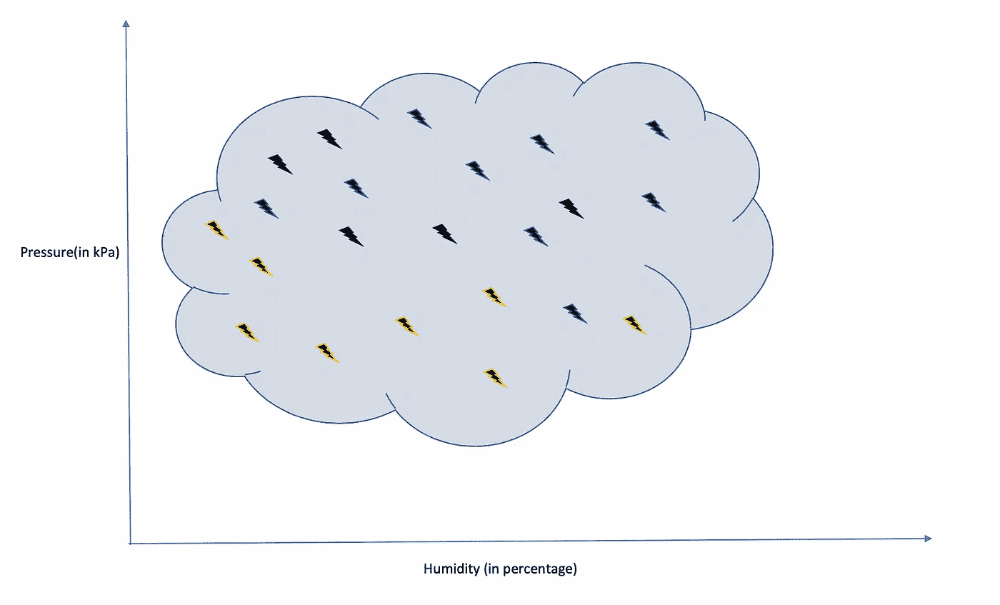

x1，x2 是湿度和压力的轴。黄点表示无雨，黑点表示下雨。

湿度以百分比计量，压力以千帕计量。

如果一个人使用他的直觉，如果湿度高于某个阈值，那么下雨的可能性就很高。所以他所做的只是根据湿度将数据集分成两半。

x1 = 70(假设)是阈值。

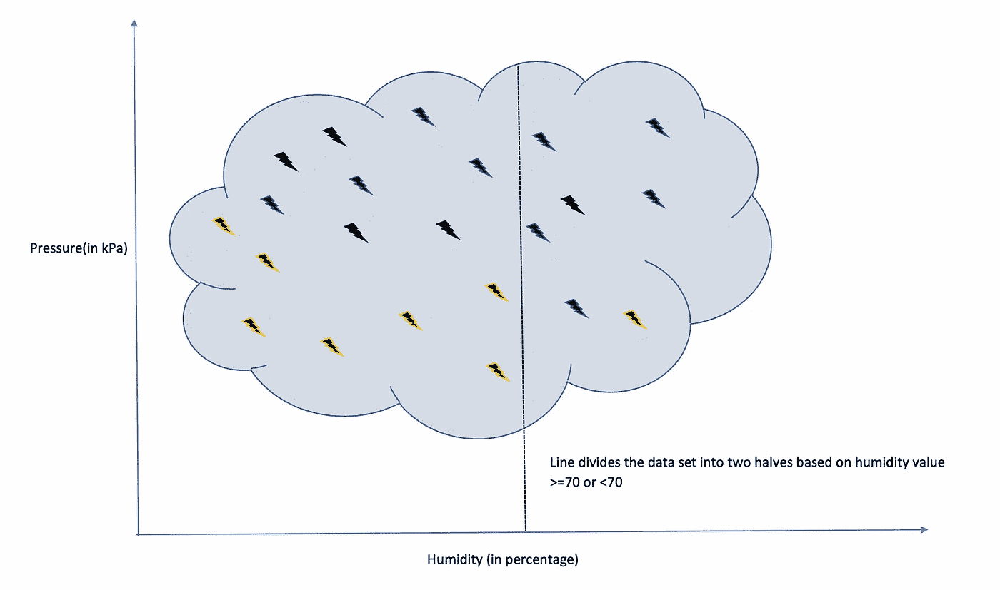

x1 指湿度轴上的值。左边是 R2，右边是 R1。

现在，我们有了一些规则来分割数据集，并创建两个区域 R1 和 R2。我们在点数分类方面取得了一些进展。下一个问题是我们的分成有多好。

可以有多种方法来验证我们的决定。测量之一可以简单到计算每个区域中误分类点的比例。误分类点的定义是所有标签与区域标签不同的点都被错误分类。在我们的场景中， *R1 代表降雨，因此*所有非降雨点都被视为分类错误。同样， *R2 代表无雨，*所以所有对应于雨的点都被错误地分类了。

让我们称这个测度为 **M** ( *R* )，其中 *R* 表示区域。

对于 *R1* ， **M** ( *R1* ) = 1/7

同理对于 *R2，*米 ( *R2* ) = 8/15

总体度量可以是 **M** ( *R1* )和 **M** ( *R2* )的任意组合；一种方法是取其平均值。这种方法的唯一问题是它没有考虑该区域的体积/密度。所以一个更好的结合它们的方法是通过权重，与每个区域的大小成比例。

**M 的计算( *R* )**

*R* ***:整体区域，n 个点即*** *|R| = n*

*|R1| = n1，|R2| = n2*

*n1 + n2 =n*

*R****=****R1****U***R2

*w1 = R1 地区的权重*

*w2 = R2 地区的权重*

w1 + *w2 =1*

**M**(*R*)= w1 ***M**(*R1*)+*w2 ****M**(*R2*)

=*n1/(n1+N2)****M**(*R1*)+*N2/(n1+N2)****M**(*R2*)

在我们的例子中 n1 = 7， *n2 = 15，***M**(*R1*)= 1/7， **M** ( *R2* ) = 7/15

**M**(*R*)= 7/22 *(1/7)+15/22 *(8/15)= 0.41

越小的 M 越好。

对 **M** ( *R* )的另一种解释是根据聚类的类内和类间概念，其中高的类间方差和低的类内方差导致良好定义的分离的聚类。

让我们继续，并根据压力值进一步细分这两个区域。

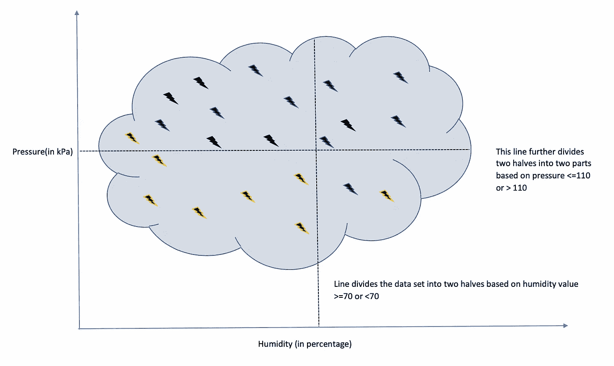

r 分为四部分，R11 左下，R21 右下，R12 左上，R22 右上。

现在，它看起来比之前只基于湿度的分裂要好一些。我让读者来计算 M(R)值并验证上述论点。

这种将参数空间反复分割成更小空间的整个实验就是我们所说的决策树分类方法。从形式上来说，决策树是一种基于树的决策及其结果的算法。

节点代表评价，每个评价的结果作为一个分支，叶节点作为一个类。从叶节点到每个内部节点并最终到根节点的整个路径作为决策/分类规则。
上述实验的图形符号如下图所示。

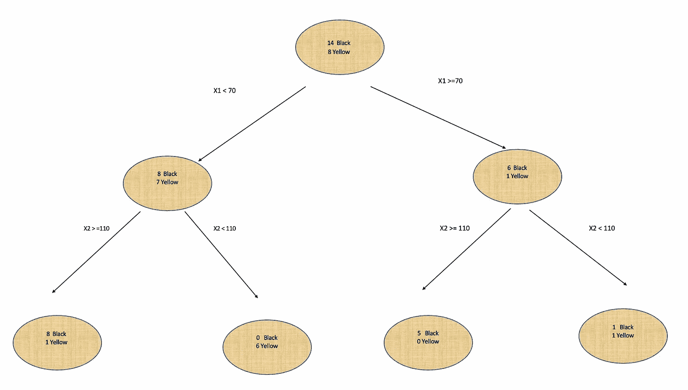

决策树的流程图。

在深入研究之前，这是了解决策树的每个元素的好时机。

*   根节点:位于顶部的节点，包含整个样本。
*   分支节点/子节点:拆分后获得的节点。
*   父子:分裂的节点称为父节点，分支节点称为子节点。
*   拆分值:评估恰好将父代拆分为子代时的值。分裂的过程被称为分裂。
*   叶节点/终端节点:没有子节点的子节点。
*   子树:至少有一个叶节点的任何一组分支节点。
*   边:任意两个节点之间的路径，连接两个节点的线。
*   节点深度:从该节点到根节点的边数。
*   节点高度:到达叶节点的最大边数。
*   修剪:修剪掉树中预测能力较弱的部分的过程。

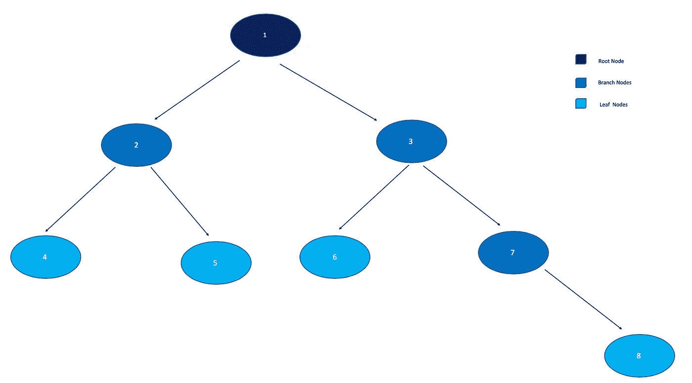

描绘树木的不同组成部分。🌲

*   根的深度为 0；高度是 3，因为在这种情况下到达叶片 8 的最大步幅是 3。
*   任何叶节点的高度都是 0。
*   节点 3 的深度为 1，高度为 2。
*   节点 4 的深度是 2。

我们已经讨论了一个度量来决定分裂的良好性。接下来，我们讨论一些其他指标，如基尼系数、熵、卡方、方差。

**其他指标**

***【基尼指数】*** :

一个节点的基尼系数是该节点中任意随机选择的点被错误分类的概率，如果它被分配了那个类别的标签。

设 pi:标签为 I 的点的概率
GI(point) = pi*(它属于除 I 以外的标签的概率)=pi(1-pi)

假设存在 M 个类别/标签。

GI(node)= GI(所有点)之和= pi(1-pi)之和对于所有 I 属于{1，2，..，M}。

GI(node) = 1- pi**2 — p2**2 — … -pM**2

对于二元分类；
GI(node) = 1 — pi**2 — p2**2，其中 p1 是 yes 的概率，p2 是 no 的概率。

考虑一个二进制值的节点( ***S*** )说是或否。

***S*** = {是，不是，不是，是，是，是，是，是，不是，不是}

p1 =可能是:#Yes/(#Yes + #No)

p2 = No 的概率:#No/(#Yes + #No)

#表示基数或计数

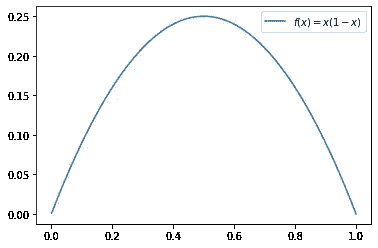

x(1-x)的绘图

因为 p1 + p2 = 1

GI = 2p1*p2

如果我们想要高 p1，那么 No 的情况应该相当低，反之亦然。这个对称的措施符合我们的目的。

从上面的图中我们看到，对于 p1 = p2，它是最佳的。

总的来说，GI 是 *w1*G1* (节点 1) + *w2*G1* (节点 2)，其中 *w1* 和 *w2* 是那个节点的权重。

GI 越低分裂越好。

地理信息的 Python 实现

让我们在我们的降雨预测问题中计算 GI。

*根据湿度分割*:

w1 = 7/22，w2 = 15/22
对于节点 1
p1 = 6/7，p2 = 1/7
g1 = 0.24
对于节点 2
p1 = 8/15，p2 = 7/15
G2 = 0.5
GI(湿度)= 0.42

*基于压力的分割:*

w1 = 14/22，w2 = 8/22
对于节点 1
p1 = 13/14，p2 = 1/14
g1 = 0.13
对于节点 2
p1 = 1/8，p2 =7/8
g2 = 0.22
**GI(压力)= 0.16**

因此，分割应基于压力。

***2。基于熵的信息增益***

*熵被定义为自我信息的期望值 I(x)*

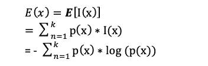

考虑一个样本，我们假设有一个未知的过程(随机变量)产生这个样本。最大似然原则获得最大化样本和过程的参数。

如果一个人观察到一个具有不太可能的值的数据点，我们称之为自我信息，因为它给出了关于随机变量的更多信息。

最真实的例子可以是抛硬币；如果你知道它偏向尾部，那么由于没有获得任何信息，自我信息将为 0。类似地，对于无偏硬币，它将是最大值，即 1。

信息增益= 1-熵

根据概率 E(node) = -p*log(p) -q*log(q)，p+q = 1
这里还评估每个节点的熵，然后取加权平均值作为熵来决定分裂。

***3。*卡方:**

*根据父子节点的统计显著性评估分裂的另一种方法*

c(节点)=(实际—预期)**2 /(预期)**2

这个计算在我之前关于适者生存的博客里有。

**4*4。差异:***

到目前为止，我们讨论的度量是针对分类变量的；在连续变量的情况下，我们使用方差。方法是一样的，计算每个节点的方差，然后用加权方差决定拆分。

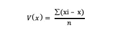

x =平均值

> 不同决策树算法使用不同的度量。

**模型复杂度**

现在，我们已经了解了如何将根节点拆分为分支节点。如果我们在最后继续做这个过程，我们最终将同质叶节点作为一个类标签。过度拟合的风险很高，为了克服这一点，复杂性也增加了；我们开始删除不包含足够信息的节点。这个过程被称为树的修剪，我们对交叉验证集进行评估。

克服过度拟合和模型复杂性的另一种方法是试验分类器的不同参数。

*   树的最大深度。 **max_depth** *int，default=None*
*   一片叶子上的最小点数。**min _ samples _ leaf**int 或 float，默认=1
*   叶节点的最大数量。 **max_leaf_nodes *int，default = None***
*   节点中要分割的最小点数。**min _ samples _ split***int 或 float，默认=2*
*   最大功能。 **max_features** *int，float or {"auto "，" sqrt "，" log2"}，默认=None*
*   分割**的杂质**和**的最小减少量。最小 _ 杂质 _ 减少*浮动，默认=0.0***
*   其他因素取决于用例。

## Python 实现

*数据集:降雨数据集快照。*

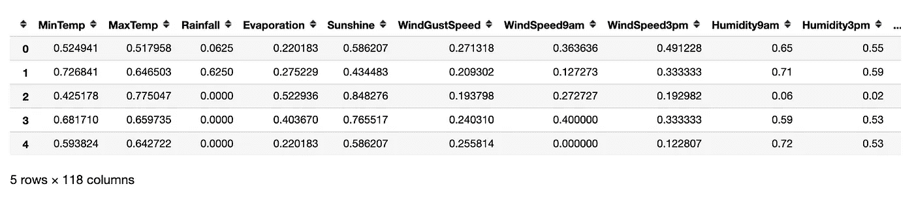

118 个特征

目标= *【正常降雨】*

我们已经完成了 EDA 和数据预处理，你可以在之前的博客中看到我们实现了逻辑回归。因此，目前，您可以假设这些数据是干净的。

形象化

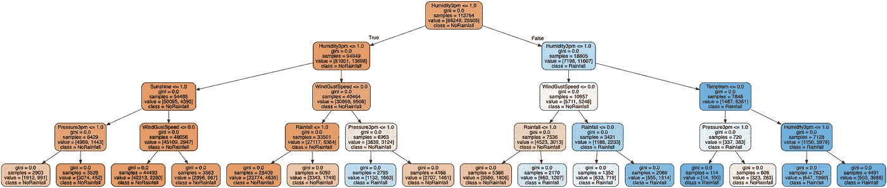

树 4 的深度。

此数据集的基尼系数和熵的比较。

像 sklearn 中的所有估计器一样，决策树分类器也有一个预测和评分方法。

我们知道，默认的标准是基尼系数，用一个熵值怎么样。

基于基尼系数的模型得分:0.834

基于熵的模型得分:0.836

在这个数据集中，对于相同的超参数，熵的表现略好于基尼系数。

另一个衡量分类器的标准在我之前的[博客](https://medium.com/analytics-vidhya/model-validation-for-classification-5ff4a0373090)中有。

**特征重要性，及其计算**

一旦模型被训练，下一个任务是找出控制模型的基本特征。特性的重要性对于说服其他人相信我们的模型以及推理是非常有用的。来自数据的洞察力有助于任何服务的流程构建。

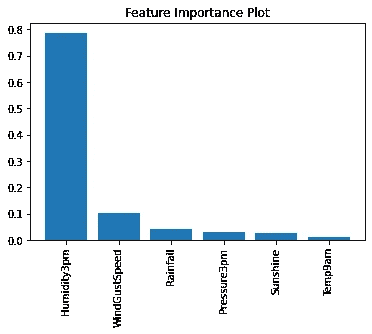

这是一个描述特征重要性的图

**超参数调谐**

有不同的技术来调整超参数；它本身就是一个全新的范例。可以有一个关于如何优化你的模型超参数的独立博客。

在这次演讲中，我们将使用 Grid-searchCV，它只是对估计器的给定参数进行彻底的搜索，在我们的例子中是决策树分类器。它在网格搜索中使用交叉验证技术，根据提供的评分方法得出最佳参数。

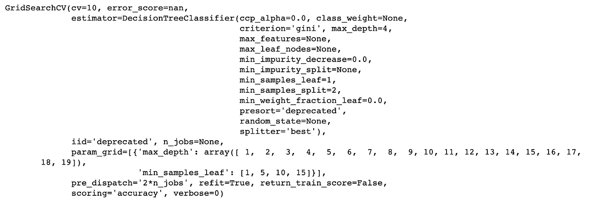

```
print(grid.best_score_)
print(grid.best_params_)
print(grid.best_estimator_)0.8403836694950619
{'max_depth': 8, 'min_samples_leaf': 10}
DecisionTreeClassifier(ccp_alpha=0.0, class_weight=None, criterion='gini',
max_depth=8, max_features=None, max_leaf_nodes=None,
min_impurity_decrease=0.0,   min_impurity_split=None,
min_samples_leaf=10, min_samples_split=2,
min_weight_fraction_leaf=0.0, presort='deprecated',
random_state=None, splitter='best')
```

所以我们看到最好的参数是 *{'max_depth': 8，' min_samples_leaf': 10}，*和*精度 0.84，*比普通模型好。

我让读者包括一些其他超参数，如*标准、最大 _ 叶 _ 节点、最小 _ 样本 _ 分割、最大 _ 特征、最小 _ 杂质 _ 减少、*，并微调模型。

**修剪**

修剪树中预测能力较弱的部分的过程。

如上所述，修剪用于将模型推广到看不见的数据，也就是说，减少过度拟合和复杂性。理解这种现象的另一种方式是，一个人应该知道何时停止，但出于实际目的，我们从来不知道添加/删除单个节点会如何大幅改变分数。上述现象也被称为[视界](https://en.wikipedia.org/wiki/Horizon_effect)效应。

在我们的例子中，训练精度是 0.8349，测试精度是 0.8344，这是非常相似的，因此不存在过度拟合的情况。

然而，让我们看看修剪是如何工作的及其 python 实现。

有不同的方法，无论是预修剪或早期停止🛑，它有自己的挑战，如前所述，所以在这里我们将张贴修剪。

> 我们将讨论 L. Breiman、J. Friedman、R. Olshen 和 C. Stone 的论文中提到的一种后剪枝实现。

**最小成本复杂度剪枝**

*最小代价复杂度剪枝是* *直观地为增加的拆分增加惩罚的一种方式。*

我们为树 T 定义一个代价 C(α，T)，其中α ≥0 称为复杂度参数。

C(α，T) = C(T) + α|T|，

C(T):叶/终端节点的总误分类

|T|:树 T 中终端节点的数量

为了更进一步，让我们试着理解 C(T)


c(t):节点 t 中点的误分类概率
整棵树的误分类概率:使用全概率公式。


亲子不平等

父母的误分类率总是大于孩子的加权和。因此，如果我们继续分裂，错误分类就会减少，最终导致过度拟合。

给定一棵树 T < T_max,

T_max: max possible tree.

If α=0: largest tree selected

for α tending to infinity single root node tree.

To get optimal T(α), we need to minimize C(α, T).

C(α ,T(α)) = min (C(α ,T)) for all T < T_max

min exists since we will have only finitely many values of T.

For optimum

1.  C(α ,T(α)) = min (C(α ,T)) for all T < T_max)
2.  C(α, T) = C(α ,T(α)) ===> T(α) ≤ T，否则存在一棵更大的树。

对于单个节点，我们将得到 C(α，T) = C(T) + α

考虑一棵树(树枝),它的根是 T，用 T_t 表示

C(T_t) ≤ C(t)，来自亲子不等式方程。

α_opt 是等式成立时的值，即

C(T_t) = C(t)

C(T_t) + α|T_t| = C(t) + α|t| = C(t) + α

α(| T T |-1)= C(T)-C(T T)

αopt = C(T)-C(T T)/(| T T |-1)

最弱链路:具有最小α_opt 值的任何非终端节点

我们剪枝最弱的环节，直到α_ opt≥CCP _α参数。

**Python 实现**

决策树分类器有方法**cost _ complexity _ pruning _ path**(*self*， *X* ， *y* ， *sample_weight=None* )计算剪枝的路径。它为每个步骤返回最佳α和相应的总叶杂质。

在我们的例子中，我使用了一个 sklearn 可视化脚本进行修剪。

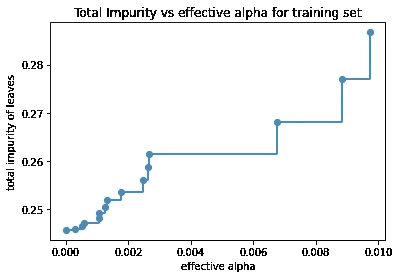

```
Number of nodes in the last tree is: 3 with ccp_alpha: 0.061183857976855216
```

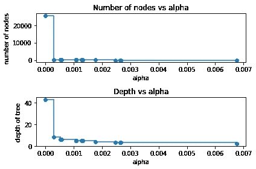

我们用最后一个观察来总结剪枝，它在准确性和 alpha 之间。

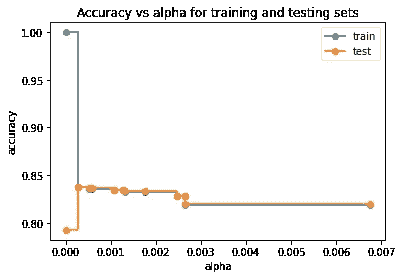

最初，测试 acc 约为 0.78，而系列 1 随着α增加而达到平衡。

在这篇博客中，我们学习了决策树的工作原理、python 实现、超参数调整和修剪。

我希望你喜欢它😊！！🥂