# 人工智能趋势—2022 年 8 月

> 原文：<https://pub.towardsai.net/trends-in-ai-august-2022-2c7327bf1928?source=collection_archive---------0----------------------->

## 谷歌 3%的新代码是由语言模型编写的，DeepSpeed 用于与万亿级专家混合进行推理，击败神经标度定律，在信息检索中进行提示，语言模型级联，等等。

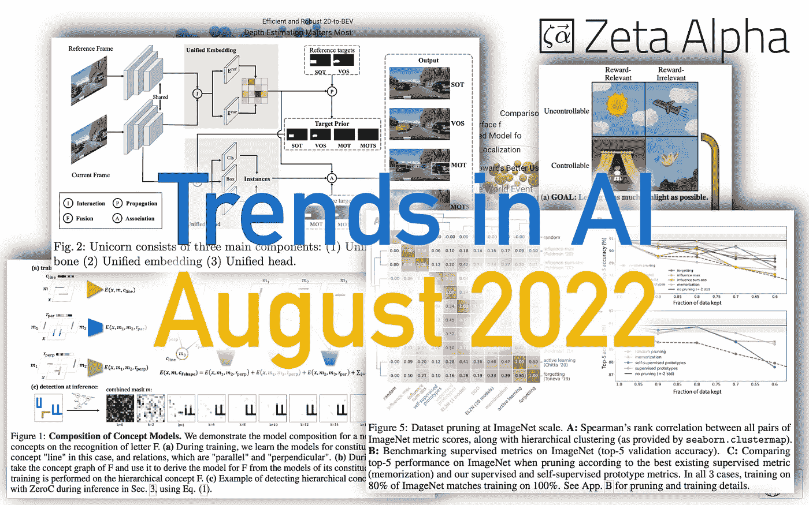

图片由 [Zeta Alpha](http://www.zeta-alpha.com) 提供。

虽然 blockbuster research 在过去的一个月中略有放缓，但可能是因为夏季的原因，会议又以全速进行:西雅图的[NAACL](https://2022.naacl.org/)，马德里的[SIGIR](https://sigir.org/sigir2022/)，还有 ICML 的[，我们在 GPT-3 的帮助下为这些会议制作了一个特别指南](https://www.zeta-alpha.com/post/can-ai-help-us-understand-icml-2022)。首先，我们想强调的其他新闻有:

*   [Google 分享了代码生成在公司内部的使用方式](https://ai.googleblog.com/2022/07/ml-enhanced-code-completion-improves.html)。TL；几乎所有新代码的 3%是通过接受来自语言模型的建议而生成的，建议接受率约为 25%，编码迭代持续时间减少了 6%，平均每次接受 21 个字符。
*   [AI21 实验室筹集 6400 万美元，雄心勃勃要与 OpenAI 竞争。由](https://techcrunch.com/2022/07/12/openai-rival-ai21-labs-raises-64m-to-ramp-up-its-ai-powered-language-services/?guccounter=1&guce_referrer=aHR0cHM6Ly93d3cuZ29vZ2xlLmNvbS8&guce_referrer_sig=AQAAAC9VRCH84zB6NLauX7XYt0Wr8M-ZR83b19Jd4VfWkffs_yODkFmCZGZDXoe_HZm-bscbI2G26VWRkweUytIm8iuK0arfbO4hVln6Qahxk9mLBT4U8HruDpXoWNWOBA6F1daf6wCiwnbL_Fe_orTu-v-wq2zlo-LlABqiMBwOhdvA) [Yoav Shoham](https://www.yoavshoham.net/) 、 [Ori Goshen](https://twitter.com/origoshen?lang=en) 和 [Amnon Shashua](https://il.linkedin.com/in/amnon-shashua) 创建和领导的公司将开发更复杂的语言模型。
*   Ian Goodfellow 离开苹果加入 Oriol Vinyals 领导下的 deep mind，Andrej Karpathy 在领导特斯拉自动驾驶研究部门 5 年后离开特斯拉。
*   Yolo-v7 发布了…两次！这里有一点名称的冲突:[这是新论文](https://arxiv.org/abs/2207.02696)和[它的实现](https://github.com/WongKinYiu/yolov7)，还有[这也是 YOLO-v7 项目](https://github.com/jinfagang/yolov7)，它已经开发了几个月，现在将被重命名为更通用的 YOLOvn。
*   Nicola Richmond 是 Benevolent AI 的新副总裁，这是一家将现代深度学习技术应用于药物发现的初创公司。
*   [Meta AI 发布了 Sphere，这是一个网络规模的语料库，用于更好的知识密集型 NLP](https://ai.facebook.com/blog/introducing-sphere-meta-ais-web-scale-corpus-for-better-knowledge-intensive-nlp/) ，这是它的 [GitHub repo](https://github.com/facebookresearch/sphere) 。该数据集是作为 [CCNet](https://github.com/facebookresearch/cc_net) 的子集管理的，旨在加强自然语言处理和信息检索之间的交叉研究。

# 🔬研究

每个月，我们都会分析最新的研究文献，并选择 10 篇你应该知道的论文。这个月我们将讨论强化学习(RL)、标度律、信息检索、语言模型等主题。

## [1。超越神经缩放定律:通过数据修剪实现幂律缩放](https://arxiv.org/abs/2206.14486)

*作者:Ben Sorscher，Robert Geirhos，Shashank Shekhar，Surya Ganguli，Ari S. Morcos。*

**❓为什么→** 标度律是现代神经网络中普遍存在的经验现象，其中观察到的误差是训练集大小、模型大小或两者的幂。虽然一些人接受了这一事实，设计了一个专注于扩大规模的研究议程，但许多人认为一定有办法建立更好的模型，而不需要惊人的规模。本文探索了一种技术——数据剪枝——可以提高神经网络“拍”标度律的学习效率。

**💡关键见解→** 在这项工作的背景下，修剪是指从训练数据集中删除训练数据样本，而不是修剪神经网络的权重。所提出的方法背后的直觉很简单:想象一下，您可以为一个模型将训练数据集中的样本从“容易学习”到“难学习”进行排序。一个典型的数据集将包含太多的*易学*样本——也就是说，更少的样本就足以在这些样本上达到良好的性能——而来自*难学*的样本太少——这意味着你需要更多的样本来正确训练模型。

解决这个问题的一种方法是扩大整个训练数据集，因为如果有足够大的规模(假设数据分布是均匀的)，您最终将获得足够多的“难学”样本。但是那非常浪费。如果我们可以使用先验知识来筛选包含易学和难学样本的更好平衡的训练数据集，会怎么样？这就是本文的研究内容。

这个问题可以被形式化为试图找到一个**修剪度量**来分配给每个训练样本(其*硬度*的代理)，然后使用该度量将训练数据集修剪到期望的大小。他们在本文中提出了一个新的度量标准，可以与需要标记数据的现有工作相媲美。

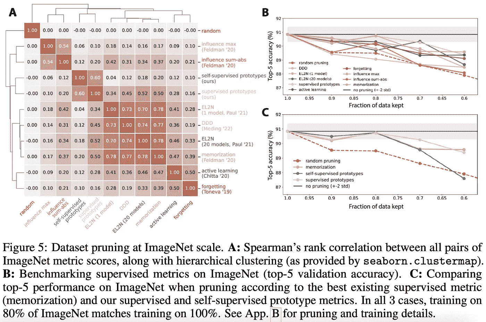

来源:[https://arxiv.org/pdf/2206.14486.pd](https://arxiv.org/pdf/2206.14486.pdf)

然而，在我看来，最有趣的贡献是他们关于无标签数据修剪的部分。他们对预训练的 ImageNet 模型的嵌入执行 k-means 聚类，并将每个样本的硬度定义为其到最近质心的距离:直觉是容易学习的原型样本将最接近质心，而难以学习的样本将远离其聚类质心。结果显示了如何在不牺牲性能的情况下削减 ImageNet 中大约 20%的训练样本。

公平地说，论文中的结果并不令人惊讶，但其背后的关键思想有可能在其他任务中有用，如图像分割、语言建模或任何其他多模态数据集管理。

## [2。去噪 MDP:学习比世界本身更好的世界模型](https://arxiv.org/abs/2206.15477) | [项目页面](https://ssnl.github.io/denoised_mdp/) | [代码](https://github.com/facebookresearch/denoised_mdp/)

*作者:、西蒙·s·杜、安东尼奥·托雷巴、菲利普·伊索拉、、田远东。*

**❓为什么→** 这个*世界*包含了许多与你能够浏览的信息无关的信息。许多机器学习技术的核心是从噪音中辨别相关和有用的*信号*——或模式——的能力。

**💡关键见解→** 这项工作通过识别由代理人控制的**和与奖励**相关的**信息，形式化了在强化学习环境中分离“有用信息和无关信息”的问题，如下图所示。**

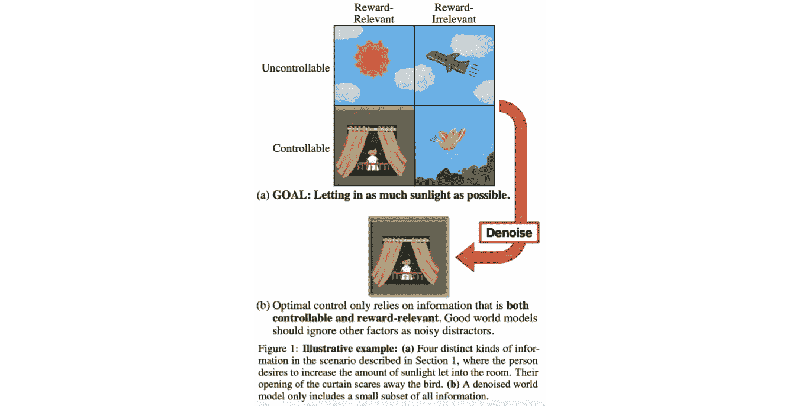

来源:[https://arxiv.org/pdf/2206.15477.pdf](https://arxiv.org/pdf/2206.15477.pdf)

基于这一想法，作者提出了去噪的 MDPs(马尔可夫决策过程)，这是一种学习状态表示的因子分解的方法，它使用信息论原理来解开状态的可控和奖励相关位。它的要点是，状态的不同因素应该最大或最小地预测其他因素，这取决于它们的关系，这使得作者能够为代理设置一个可变的目标来优化(您需要查看论文以获得真正的数学好东西)。

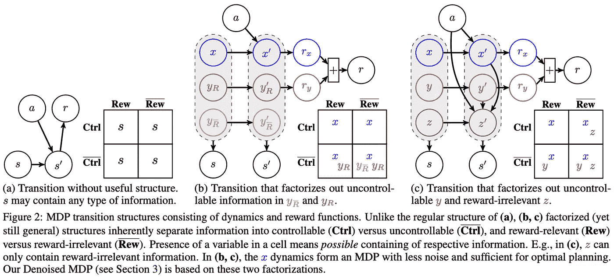

资料来源:https://arxiv.org/pdf/2206.15477.pdf

结果是一个世界模型，它明确地模拟了哪些信息应该作为噪声被丢弃，哪些信息应该用于模拟代理的决策。作者证明了这种方法在 DeepMind 控制套件中如何具有竞争力，有趣的是，他们通过训练解码器重建输入，定性地展示了去噪的 MDP 表示是如何工作的，这样你就可以理解状态的信号表示学习捕捉什么。你可以在他们的[项目页面](https://www.tongzhouwang.info/denoised_mdp/)上观看。

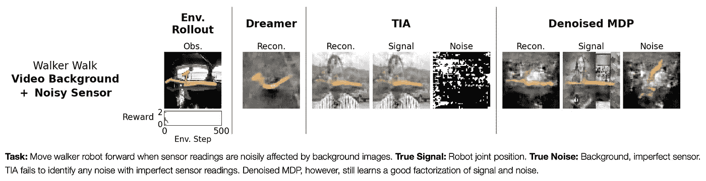

来源:[https://www.tongzhouwang.info/denoised_mdp/](https://www.tongzhouwang.info/denoised_mdp/)

## [3。参数有效的提示调整使得通用的和校准的神经文本检索器](https://arxiv.org/abs/2207.07087) | [代码](https://github.com/THUDM/P-tuning-v2/tree/main/PT-Retrieval)

*由翁林潭、小刘、凯旋纪、、薛、、、董、、胡、。*

❓为什么→ 提示在过去的几年里已经在自然语言处理方面取得了长足的进步，现在它似乎也很有希望用于信息检索。

**💡关键见解→** 提示调整是一项技术，通过向序列模型的输入添加可训练的提示标记，使预训练的冻结模型适应给定的任务。这种方法相对于更常见的全模型微调的一个主要优点是，它只需要重新训练参数的一个小子集，这更加有效，并且还使得原始预训练模型的可重用性更高。

现在，他们训练了密集段落检索器(通过查询和文档嵌入的最近邻搜索进行检索)和具有后期交互的 ColBERT⁴类型模型(包括查询和文档的联合建模)。这里的区别是，他们不是微调整个模型，而是只微调一个提示符，同时保持预先训练的 LM 冻结。他们的实现基于 P-Tuning v 方法，这是一种更高级的提示调整形式，其中可训练提示不仅附加到输入，还附加到转换器的每一层。

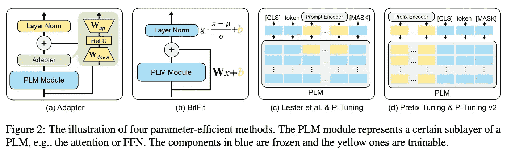

来源:https://arxiv.org/pdf/2207.07087.pdf

结果中最有趣的部分是归纳。虽然在域内基准测试中，即时调优的性能与完全微调相当，但在 BEIR 基准测试的各种跨域数据集上，即时调优的性能明显优于完全微调。

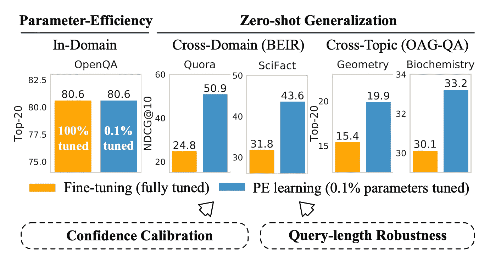

来源:https://arxiv.org/pdf/2207.07087.pdf

然而，这项工作再次加强了一个假设，即提示及其所有优势是微调的可行替代方案，并且可能会越来越受欢迎。

## [4。DeepSpeed 推理:以前所未有的规模实现变压器模型的高效推理](https://arxiv.org/abs/2207.00032) | [代码](https://github.com/microsoft/DeepSpeed)

*作者:Aminabadi，Samyam Rajbhandari，Zhang，Ammar Ahmad Awan，，Elton Zheng，Jeff Rasley，Shaden Smith，Olatunji Ruwase，Yuxiong He。*

**❓why→**deep speed——微软开发并使用的大型神经网络大规模分布式训练框架——现在除了训练也用于推理。

**💡关键见解→** 在过去的一年里，大型变压器架构的前景已经多样化，因为专家模型的稀疏混合成功地扩大了万亿参数范围内的模型。这些架构的主要优势在于，它们的尺寸更大，表达能力更强，但在推理时，只使用了一个与输入相关的权重子集，这使它们更加高效(如果实现也经过优化的话！).缺点是有效地训练和运行这些模型更加复杂，因为大多数现有的深度学习库和硬件都不是用这种类型的计算设计的。

虽然 DeepSpeed 以前被设计为能够训练大型转换器，但最新的更新专注于在所有类型的 Transmodels(包括稀疏激活的体系结构)上使推理在延迟和吞吐量方面更快。

我们谈论的是一个能够在数百个 GPU、CPU 和 NVMe 内存规模的异构硬件中实现并行性的系统，即使大型模型无法容纳在聚合 GPU 内存中，也能实现高速推理。

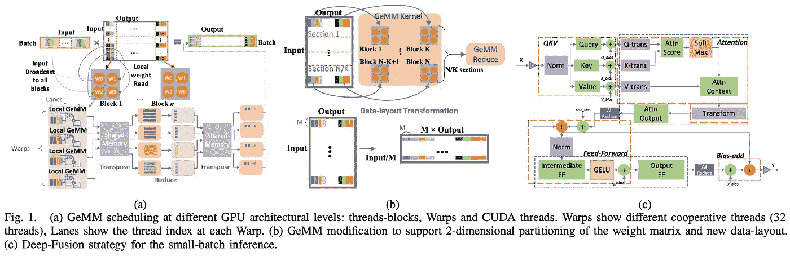

来源:https://arxiv.org/pdf/2207.00032.pdf

老实说，虽然大多数阅读本文的人都不需要使用这样的框架来训练万亿级模型，但如果你对训练和运行大规模神经网络背后的工程感兴趣，这仍然是一篇令人着迷的文章。

## [5。语言模型(大部分)知道他们知道什么](https://arxiv.org/abs/2207.05221)

*作者 Saurav Kadavath 等人*

**❓为什么→** 性能远非 ML 车型唯一可取的属性。准确了解他们对自己的输出有多自信可能更重要，尤其是在注重安全的应用中。

**💡关键见解→** 校准是机器学习中使用的概念，用于指示模型的预测置信度有多好(例如，输出有 90%确定性的完美校准模型应该是*正确* 9/10 倍，不多也不少)。

这项工作首先通过以多项选择的方式制定提示来研究 LMs 回答问题的校准，其中模型的输出是带有答案的单个标记。假设单个标记是一个答案，则可以直接从该标记的模型似然性来计算概率，对有效标记答案(例如，A、B 或 C)进行归一化。

虽然 LMs 对提示设计和格式非常敏感，但如果有合适的问题公式，大型 LMs 可以很好地校准。有趣的是，这种能力会在更小的尺度上分解(见下图)，也会在非常低或非常高的置信度的尾部分解。

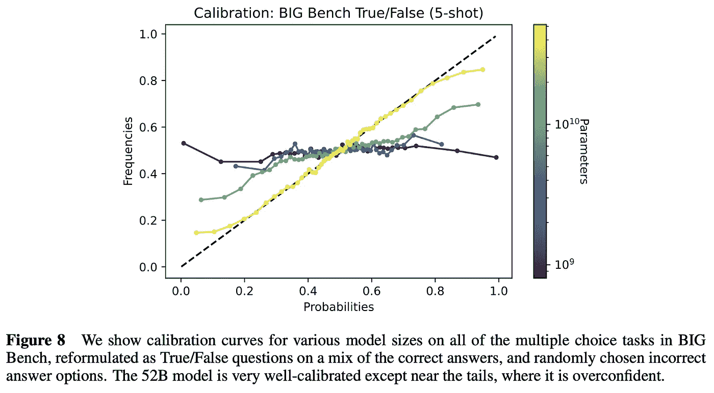

来源:https://arxiv.org/pdf/2207.05221.pdf

这篇论文深入探讨了比你在论文中发现的更多的校准比较和分析模式，但要点仍然是:LMs *知道他们所知道的*(校准良好)，但结果仍然非常容易受到即时变化的影响，模型需要足够大。

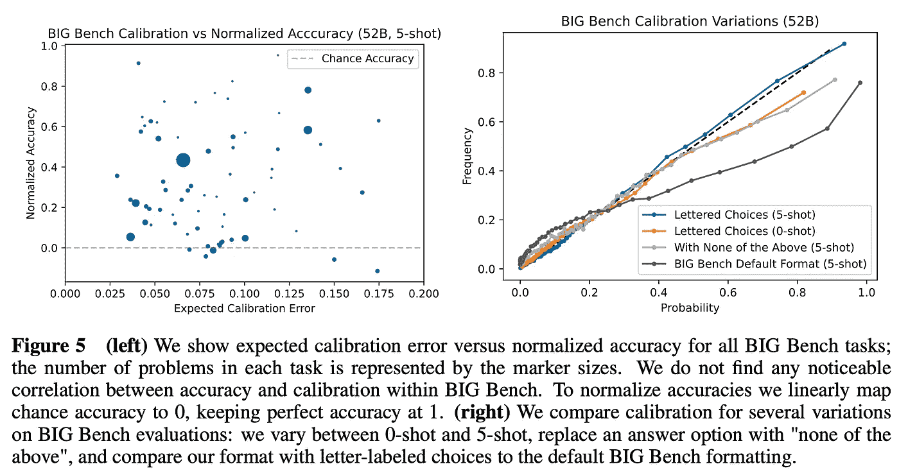

来源:https://arxiv.org/pdf/2207.05221.pdf

## [6。走向物体跟踪的大统一](https://arxiv.org/abs/2207.07078)(独角兽🦄)| [代码](https://github.com/MasterBin-IIAU/Unicorn)

*由、、孙培泽、、袁泽焕、罗平、陆虎川。*

**❓为什么→** 在过去的几年里，清理和统一机器学习模型架构在 NLP 中被证明是卓有成效的，现在是视频计算机视觉任务的时候了。

**💡关键见解→** 当涉及到与视频相关的任务时，现有的高性能模型仍然倾向于依赖于特定任务的设计，并因此过度专业化其特定应用。

作者提出了一种单模型架构，该架构在 4 种目标跟踪模式下具有竞争力:单目标跟踪(SOT)、多目标跟踪(MOT)、视频目标分割(VOS)和多目标跟踪和分割(MOTS)。

这种架构非常复杂，通过下图可以很好地理解。概括地说，它从嵌入图像的统一主干开始，然后为参考帧和当前帧计算统一嵌入。转换器用于统一嵌入和当前帧之间的特征交互，以输出对应于所有对象跟踪风格的类、框和遮罩。

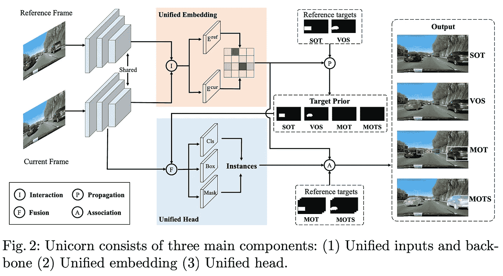

来源:[https://arxiv.org/pdf/2207.07078.pdf](https://arxiv.org/pdf/2207.07078.pdf)

该系统在 LaSOT、TrackingNet、MOT17、BDD100K(和其他)等几个目标跟踪基准上进行了基准测试，并在大多数目标跟踪基准中建立了新的一流性能。

来源:[https://arxiv.org/pdf/2207.07078.pdf](https://arxiv.org/pdf/2207.07078.pdf)

## 7。标度律与模型架构:归纳偏差如何影响标度？

*作者:Yi Tay、Mostafa Dehghani、周欣宇·阿布纳、郑亨元、威廉·费杜斯、Rao Jing feng、莎兰·纳朗、Vinh Q. Tran、Dani Yogatama、唐纳德·梅兹勒。*

**❓为什么→** 我们在特定的计算/数据规模下通过基准模型遗漏了一些现象？是的。

**💡关键见解→** 作者针对各种架构进行了数百次不同规模的实验:普通、高效和高级变压器、MLP 混频器和基于卷积的模型。实验包括用自回归语言建模进行预训练，这导致上游性能(语言困惑)，随后对 GLUE、SuperGLUE 和 SQuAD 进行监督微调(下游性能)。

TL；博士直截了当。虽然不是所有规模体制中的最佳选择，但 vanilla Transformer 显示了跨规模的最稳健和一致的性能扩展结果。其他有用的智慧花絮是:

*   基于卷积和 MLP 的架构在预训练(上游性能)方面表现良好，但在微调时无法正确传递。当涉及到学习转移时，这指向了架构归纳偏差的重要性。
*   高效的变压器只能在一定的规模范围内与全神贯注的变压器竞争，如果规模足够大，就会落后。

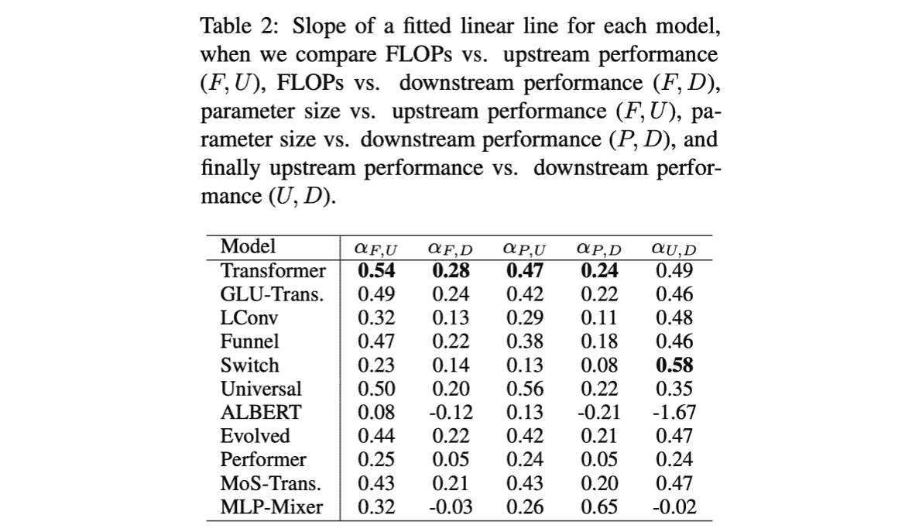

来源:https://arxiv.org/pdf/2207.10551.pdf

## [8。离散键值瓶颈](https://arxiv.org/abs/2207.11240)

*作者:弗雷德里克·特勒布尔、阿尼鲁德·戈亚尔、纳西姆·拉哈曼、迈克尔·莫泽尔、川口健二、约舒阿·本吉奥、伯恩哈德·舍尔科夫。*

**❓为什么→** 随着 ML 中的基准文化缓慢但肯定地将焦点转移到域外推广，为其量身定制的归纳偏见将变得更加相关。

**💡关键见解→** 这种方法是我们之前从 Bengio 的小组强调的更长的研究议程的一部分(例如[通过共享的全局工作空间在神经模块之间进行协调](https://arxiv.org/abs/2103.01197)),重点关注在架构中引入信息流的瓶颈如何导致在非分布集合中更健壮和更好地概括的表示。在这种情况下，所提出的方法包括 3 个步骤:

*   使用在大型数据集上预训练的编码器将高维输入(例如图像)编码到嵌入中。
*   将嵌入分割成 C 个较低维度的头部，并从在训练期间冻结的一组预定义向量中找到最近的邻居。然后使用头部上最近邻居的表示来重构嵌入。离散值代码在解码器的训练期间被冻结。
*   解码器获得重构的嵌入作为输入，并产生特定于任务的输出。

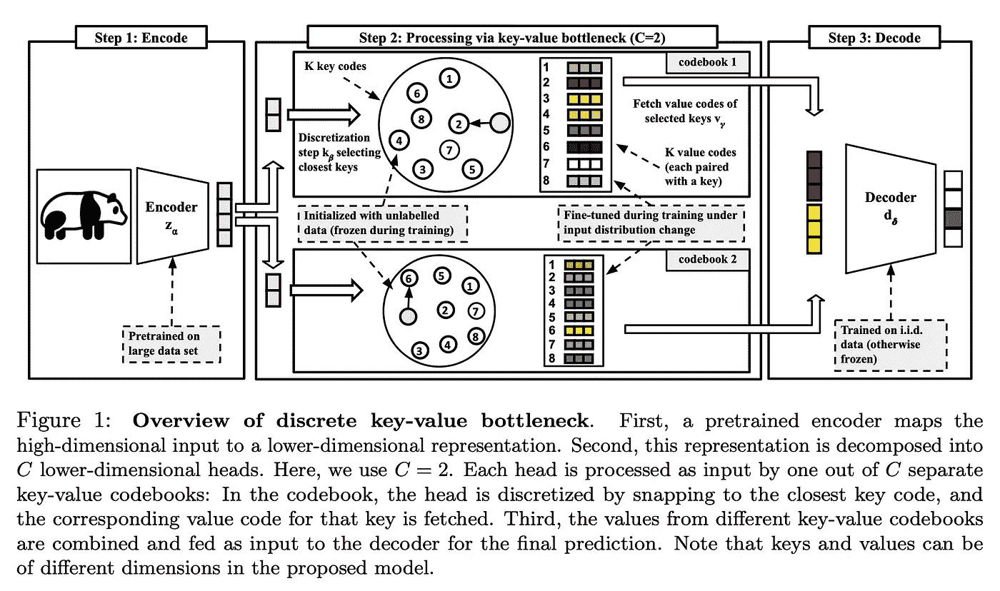

来源:https://arxiv.org/pdf/2207.11240.pdf

实验的重点是这样的设置，即一个模型为一个发行版进行了训练，然后适应了一个新的发行版，如下图所示。该模型通过对 i.i.d .数据进行训练、更新解码器权重以及保存码本来初始化。当使模型适应分布偏移时，解码器被冻结，只有码本值被更新。

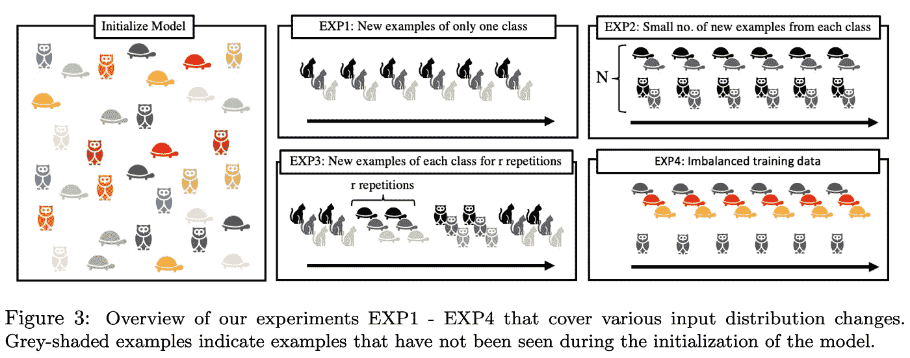

来源:https://arxiv.org/pdf/2207.11240.pdf

他们的实验证明了这种方法如何减少灾难性遗忘，并产生更可靠的预测。这项工作不会有很大的短期影响——结果不是突破性的——但其中一些想法可能是下一次*真正*推广的关键催化剂。

## [9。语言模型级联](https://arxiv.org/abs/2207.10342)

*作者:David Dohan、Winnie Xu、Lewkowycz、Jacob Austin、David Bieber、Raphael Gontijo Lopes、Wu、Henryk Michalewski、Rif A. Saurous、Jascha Sohl-dickstein、和 Charles Sutton。*

**❓为什么→** 大型语言模型变得如此强大，以至于它们越来越多地被用作强化学习或数据增强等其他应用的黑盒构建模块。

**💡关键见解→** 这项工作从概率编程的角度形式化了语言模型的交互:随机变量的有向图形模型，它映射到自然语言字符串。这被证明是一个强大的语言来分析现有的先进的提示技术，如 Scratchpad⁶或 chain-of-thought⁷.此外，它可以用来设计新形式的相互作用的 LMs 或先进的促进技术。

这种方法的实际价值仍然是一个问题，但它有可能成为一种强大的概念工具，通过抽象出经典的深度学习工具箱(权重、嵌入、梯度下降、目标函数)，为新的更高级别的推理机制创造空间，来构建复杂的 ML 系统。

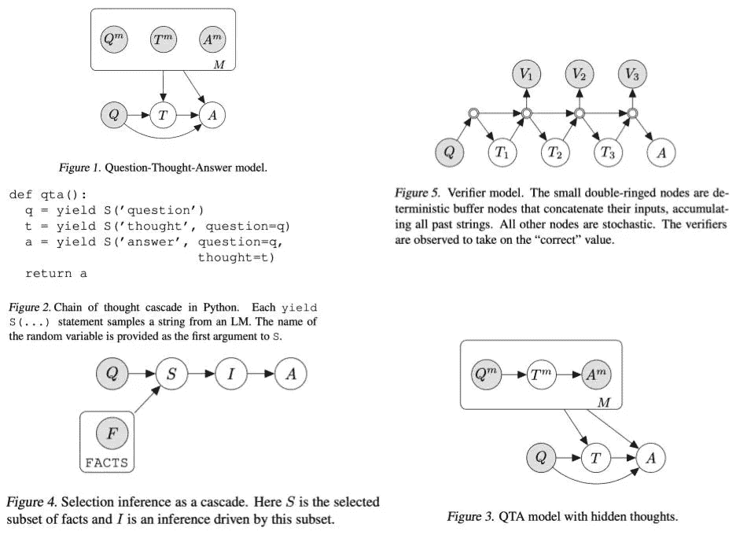

资料来源:https://arxiv.org/pdf/2207.10342.pdf

## [ZeroC:推理时零炮概念识别和获取的神经符号模型](https://arxiv.org/abs/2206.15049)

*作者:吴泰林、梅根 Tjandrasuwita、吴、刘凯文、Rok Sosi、Jure Leskovec。*

**❓为什么→** 神经象征物兑现了它的承诺..？

**💡关键见解→** ZeroC 是一种将概念表示为构成概念模型的图形的方法(即像线条一样的主要形状)。本文的主要目标是建立一个能够在推理时识别未知概念的系统。例如，在下图中，模型没有看到字母 F，但它能够理清其组成部分(线条)及其关系(角度和位置)，将它们表示为一个具有 3 个节点和 3 条边的显式图形。

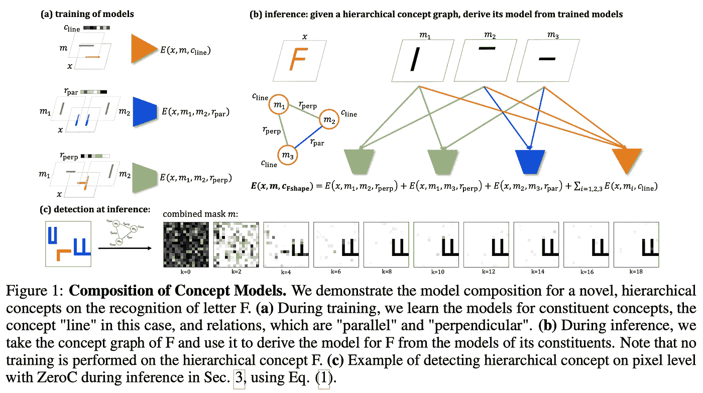

来源:https://arxiv.org/pdf/2206.15049.pdf

训练这种系统的方法依赖于基于能量的模型(EBM):提供正和负的图像/图形表示对，并最小化正对的能量，同时考虑表示的图形不变性。实验表明，在基本形状和关系非常简单的适度 gridworld 环境中取得了成功，但这代表着向学习结构丰富的表示迈出了第一步，这种表示在少量学习和概括的上下文中可能会变得有用。

*参考文献:*

*【1】《神经语言模型的标度律》作者 Jared Kaplan、Sam McCandlish、Tom Henighan、Tom B. Brown、Benjamin Chess、Rewon Child、Scott Gray、Alec、Jeffrey Wu、Dario Amodei2020.*

*【2】《P 调 v2:即时调优可媲美跨尺度跨任务的通用调优》，肖柳，姬凯旋，傅以成，翁林潭，杜，，杨，，2022。*

*【3】*《BEIR:信息检索模型零距离评估的异质基准》

*南丹·塔库尔、尼尔斯·雷默斯、安德烈亚斯·吕克尔、阿布舍克·斯里瓦斯塔瓦、伊雷娜·古雷维奇；2021.*

*【4】《科尔伯特:通过语境化的后期交互对伯特进行高效和有效的段落搜索》，Omar Khattab，Matei Zaharia2020.*

*【6】《展示你的作品:用语言模型进行中间计算的便签本》Maxwell Nye 等人 2021。*

*【7】《思维链提示引发大语言模型推理》作者:Jason Wei、王学智、Dale Schuurmans、Maarten Bosma、Brian Ichter、、Ed Chi、Quoc Le、Denny Zhou2022.*