# 人工智能趋势—2022 年 7 月

> 原文：<https://pub.towardsai.net/trends-in-ai-july-2022-44a06a37f598?source=collection_archive---------0----------------------->

## NLLB-200 从元人工智能机器翻译的全新开源突破，通过观看视频学习演奏《我的世界》，Yann LeCun 走向人类级人工智能的道路，用于文档检索的新神经语料库索引器，Minerva 如何解决定量推理问题，艺术光辉领域，扩散语言模型，检索增强计算机视觉等等…

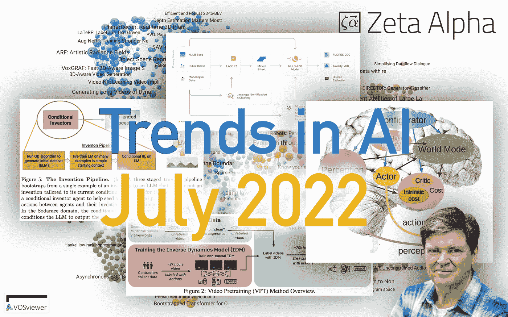

图片由 [Zeta Alpha](http://wwww.zeta-alpha.com) 提供。

当夏天到来时，人工智能世界的活动除了加速什么也没做。当一些人忙于辩论 LaMDA 聊天机器人的感知能力，或者欣赏 DALL-E mini 创造的成果时，这个月已经挤满了来自大实验室的研究大片:Google、Meta、open ai……谷歌的另一个自回归文本到图像生成模型，名为 *Parti* ，它是基于 Pathways 架构发布的，与 DALL-E 2 和 Imagen 竞争，但它几乎没有引起注意。 [CVPR 带来了总计超过 2600 篇关于计算机视觉的论文](https://search.zeta-alpha.com/?fs=d&q=&doc_sources=CVPR&d=l3m)，包括像自动唇读这样的瑰宝，以及新 SOTA 在自动驾驶领域的论文。新闻和代码方面也不慢，本月我们将重点介绍:

*   [大科学](https://bigscience.huggingface.co/)——一项由 HuggingFace 牵头的训练大型多语言模型的合作开源努力——经过数月的初步研究和实验，达到了他们的[1760 亿参数模型](https://bigscience.huggingface.co/blog/model-training-launched) (BLOOM)的训练运行迭代目标。我们很高兴看到这项工作的研究成果。
*   [AQ laboratory/openfold](https://github.com/aqlaboratory/openfold):Alpha Fold 2 的开源实现，可以让你自己训练模型或者用他们自己的预训练模型进行推理
*   [py-why/dowhy](https://github.com/py-why/dowhy) :一个成熟的因果推理 Python 库，支持因果假设的显式建模和测试。
*   [谷歌开源 T5X](https://github.com/google-research/t5x) ，一个改进的 T5 代码库，包括 1.6T param Switch-C 和 395B param Switch-XXL 型号。

# 🔬研究

每个月，我们都会分析最新的研究文献，并选择 10 篇你应该知道的论文。本月我们将讨论机器翻译(ML)、强化学习(RL)、扩散模型、信息检索、辐射场等主题。

## [1。没有语言落后:以人为中心的机器翻译](https://research.facebook.com/publications/no-language-left-behind/) | [博文](https://research.facebook.com/publications/no-language-left-behind/) | [代码](https://github.com/facebookresearch/fairseq/tree/nllb)

*NLLB 团队，Marta R. Costa-jussà，James Cross，Angela Fan 等人*

**❓Why** →单一机器翻译模式，为 200 多种语言提供一流质量，平均 BLEU 分数提高 44%。这本身就是一件大事。再加上许多 MT 以前没有的低资源语言，以及所有这些现在都可以开源的事实，您就会看到影响。

**💡关键见解** → NLLB 设法在自动挖掘的来自 200 多种语言的 bitext 数据上训练了一个具有 540 亿个参数的单一稀疏混合专家变压器模型。在这篇长达 190 页的优秀论文中，详细描述了挖掘数据、清理数据和确保模型不会产生有毒幻觉的方法。

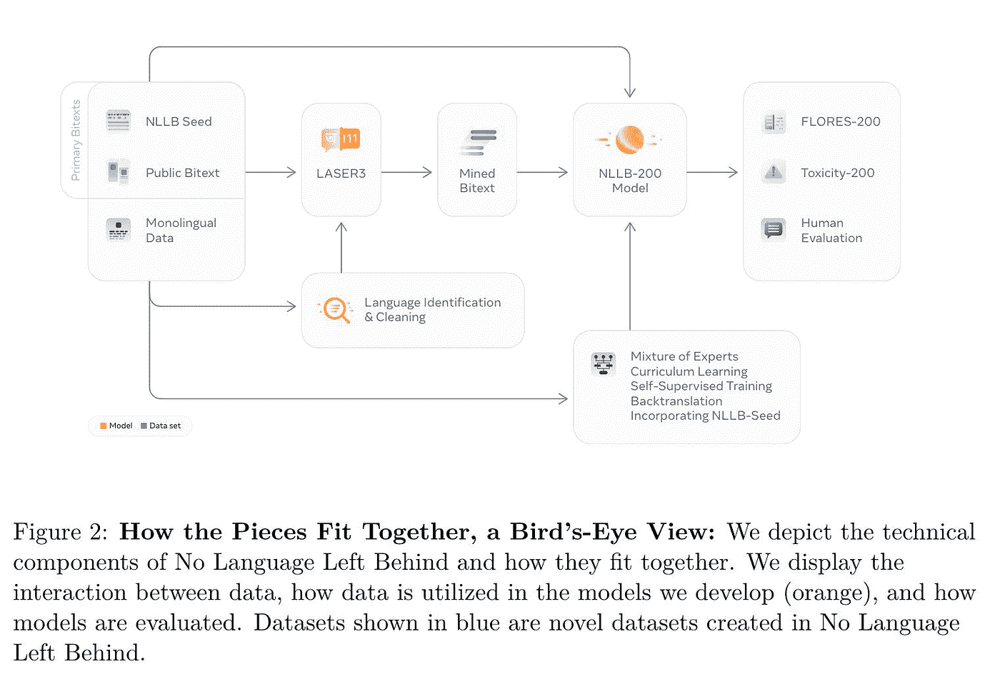

来源:[https://research . Facebook . com/file/585831413174038/No-Language-Left-Behind-Scaling-Human-Centered-Machine-Translation.pdf](https://research.facebook.com/file/585831413174038/No-Language-Left-Behind--Scaling-Human-Centered-Machine-Translation.pdf)

训练模型涉及到许多巧妙的技巧，如分层放弃、课程学习和模型提炼。一种叫做 **LASER3** 的新型多语言句子嵌入模型在这一切中扮演着核心角色。对于一些更精细的技术细节，也可以查看早期的论文“ [**训练稀疏翻译模型的技巧**](https://arxiv.org/abs/2110.08246)**”**或独家 [Zeta Alpha 对该项目的主要科学家之一 Angela Fan](https://www.youtube.com/watch?v=IJZE7LikM3c&t=4s) 的采访。

NLLB 的论文，或者说书，真的很值得一读，涵盖了从技术细节、语言分析、伦理考量、影响分析到基准测试的所有内容。在 FLORES-101 数据集上，BLEU 得分平均提高了 44%，令人印象深刻…

但当然，每个人都很好奇这个模型与谷歌翻译相比如何。也对其进行了评估。平均而言，NLLB-200 模型的质量与低资源语言有明显的优势。它增加了大约 70 种语言，这些语言以前没有(好的)机器翻译模型。最重要的区别？NLLB-200 在麻省理工学院的许可下是完全开源的。

除了其他好处之外，它还提供了 204 种语言的 Flores-200 评估数据集。NLLB-Seed:39 种语言的 Seed 培训数据。LASER3:句子编码器，用于识别 148 种语言的对齐双文本。训练数据重建:重建 NLLB 训练数据的脚本。最后，机器翻译模型涵盖 202 种语言，包括:

*   NLLB-200:54.5 b 稀疏门控专家混合模型
*   3.3B 和 1.3B 高密度变压器型号
*   从 NLLB-200 中提炼出的 1.3B 和 600M 高密度变压器模型
*   训练和生成脚本来重现我们的模型

感谢 Meta 与世界分享这一切。这无疑将极大地推进机器翻译的进一步研究、全球知识获取和跨语言交流。我们希望这也有助于在冲突地区更好地进行内容审核，这是脸书的一个已知问题，并且这种模式的开源性质不会导致这些语言地区的大规模监控和审查增加。毕竟，通往地狱的道路是由良好的意愿铺成的。

## [2。通过大型模型进化](https://arxiv.org/abs/2206.08896)

*作者:乔尔·雷曼、乔纳森·戈登、肖恩·贾恩、卡迈勒·恩多斯、凯西·叶、肯尼斯·斯坦利。*

**❓为什么→** 虽然大型语言模型(LMs)本身是研究的沃土，但一种趋势正在出现，LMs 被用作解决其他任务的算法的构建模块。例如，扩充数据集[1]。现在它们被用在进化计算的环境中:作为变异算子。

**💡关键见解→** 进化算法是遵循进化原则来解决任务的算法:拥有一群可以重组、变异并与其环境相互作用的候选解，以逐渐适应不断变化的条件或优化某些适应目标。就像地球上的其他生命形式是如何存在的一样。

遗传编程是用进化算法生成计算机程序(程序合成)的任务。使用进化计算进行程序综合的最大挑战之一是，如果你完全随机地变异一个候选程序来获得一个新的候选程序*，你将非常低效地搜索可能程序的空间。*

*有没有公开的代码差异来源，以及赋值操作符可以从中学习的注释？答对了。GitHub 的代码 diffs 和提交消息！这项工作用这些构建了一个数据集，并训练了一个大型 LM 来学习人类式的方法来改进代码，发现比遵循手工规则更复杂的突变。此外，这个大的 LM 可以在强化学习环境中连续微调，在强化学习环境中，为训练 LM 再次输入正奖励突变。*

*实现这一切是相当复杂的，涉及到对训练数据的大量仔细管理以及平衡所有移动部分。作者展示了这种算法如何与一个名为 Sodarace 的游戏一起工作，该游戏的目标是发明由点质量和弹簧组成的在空间移动的 2D 生物。该模型必须生成发明这些生物的原始 Python 程序，从一个基本种子开始，这是一个生成基本 sodaracer 的程序。*

*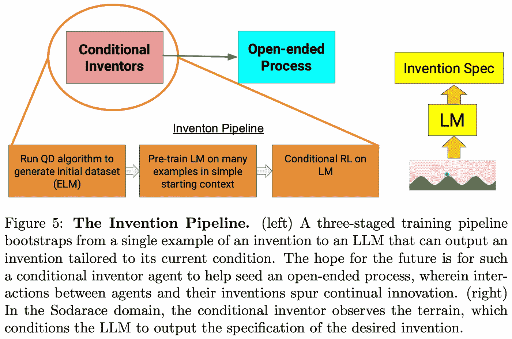*

*来源:https://arxiv.org/pdf/2206.08896.pdf*

*作者认为，由表达性 LM 指导的进化方法导致了卓越的开放性，这是贯穿整篇论文的主要主题。这可能会重振人们对进化算法的兴趣，在深度学习的阴影下，进化算法在过去几年可能已经停滞不前。*

## *[3。Diffusion-LM 改进可控文本生成](https://arxiv.org/abs/2205.14217)*

**作者:向，约翰·希克森，伊桑·古尔拉贾尼，珀西·梁，桥本达生。**

***❓为什么→** 扩散模型不断征服领域。*

***💡关键见解→** 控制语言模型的文本生成以满足某些约束(如情感和结构)是很棘手的(例如，生成一个肯定的句子，并且是主语-动词形容词宾语)。*

*先前关于扩散应用于文本的工作将语言视为离散的，通过离散地迭代破坏令牌来应用扩散过程，模型必须学会重建这些令牌(有点像迭代掩蔽语言建模)。然而，在这项工作中，他们将扩散过程**直接应用于连续嵌入**，这更接近于我们在图像中习惯的扩散过程。嵌入在高维空间中反复漂移，并且仅在该过程的最后被离散化成记号。*

*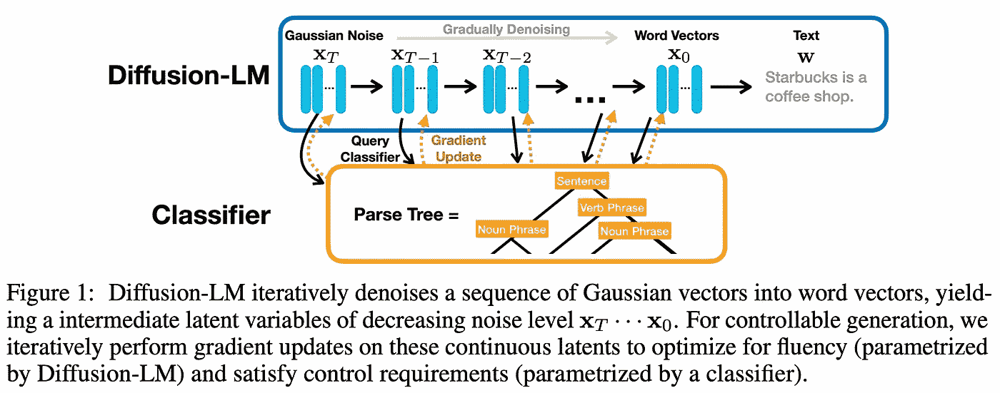*

*来源:[https://arxiv.org/pdf/2205.14217.pdf](https://arxiv.org/pdf/2205.14217.pdf)*

*使用扩散模型作为语言模型的主要好处之一是，通过评估在每个扩散步骤中满足约束的程度，并使用该目标的梯度来更新扩散中间状态(见上图)，它非常容易地引导整个扩散过程中的生成。*

*作者展示了这种设置如何在几个受控语言建模任务中工作，控制语义内容、词性、语法树和语法跨度等方面。实验结果表明，这种方法大大优于以前的控制文本生成的工作。*

## *[4。基于记忆的大规模模型编辑](https://arxiv.org/abs/2206.06520)*

**作者:埃里克·米切尔，林于超，安托万·博瑟卢，克里斯托弗·曼宁，切尔西·芬恩。**

***❓为什么→** 当前类似 GPT 的 LMs 的主要限制之一是，一旦训练结束，他们对世界的知识就冻结了。我们如何克服这一局限？*

***💡关键见解→** 以前的工作通过让 LMs 与某种可以改变的显式知识库交互来解决更新 LMs 中知识的问题。例如，web-GPT [5]可以从网上搜索文档，并将前 k 名的结果附加到提示中，这样它就可以关注该上下文来回答诸如“梅西在巴萨吗”之类的问题。这与常规 LMs 相比提高了模型的实际准确性。*

*本文提出的方法在概念上非常简单:允许用户向由问答对组成的*编辑内存添加条目。在推断过程中，范围分类器确定提示是否在任何记忆编辑的范围内，并相应地将输入重定向到两个模型之一:原始冻结 LM 或反事实模型，该模型将相关编辑记忆作为提示的上下文(见下图)。**

*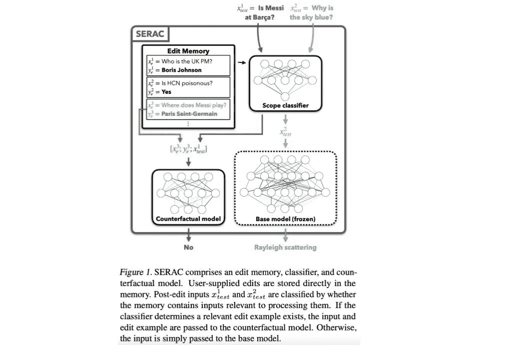*

*这种方法的一个主要优点是，它不需要像 web-GPT 那样对整个知识语料库进行持续的管理，而是简单地迭代更新用户添加的事实。此外，它可以添加到现有的大型冻结 LMs 中，无需使用一些非参数存储系统从头开始重新训练。*

## *[5。用于文档检索的神经语料库索引器](https://arxiv.org/abs/2206.02743)*

**作者*王瑜婧等人*。**

***❓为什么→** 我们在 3 月份强调了[可区分搜索索引(DSI)](/trends-in-ai-march-2022-18774a13c101):在神经网络中完全参数化整个语料库，并通过文档标识符的自回归生成来执行文档检索。这项工作将它推向了一个新的高度！*

***💡关键见解→** 差异化搜索索引[6]是一种*大胆的*信息检索(IR)方法，我们早在三月份就强调过。不是通过做一些词汇匹配、嵌入最近邻搜索或通过交叉编码重新排序来检索文档；模型*简单地*记忆文档语料库，并且**自回归地生成与给定查询**相关的文档 id 列表。这是一个令人惊讶的先验，因为文档 id 不包含语义相关的信息:如果一个新文档出现并被赋予一个新的 id，您无法推断出它的内容。*

*这种检索范例有几个明显的缺点，例如在训练完成后不能容易地扩展文档集合的事实，但是最初的结果非常令人鼓舞，特别是在零射击设置中，其中模型在没有人注释的查询-文档对的情况下学习，并且它从仅依赖于文档集合的自我监督的目标中学习。*

*这项工作基本上通过应用几个设计改进从 DSI 思想中挤出了更多的性能:一个查询生成模型(Doc2Query [6])，它扩展了查询的覆盖范围，使用了性能最好的语义 id(在 DSI 中提出)，以及一个特殊的权重解码器。*

*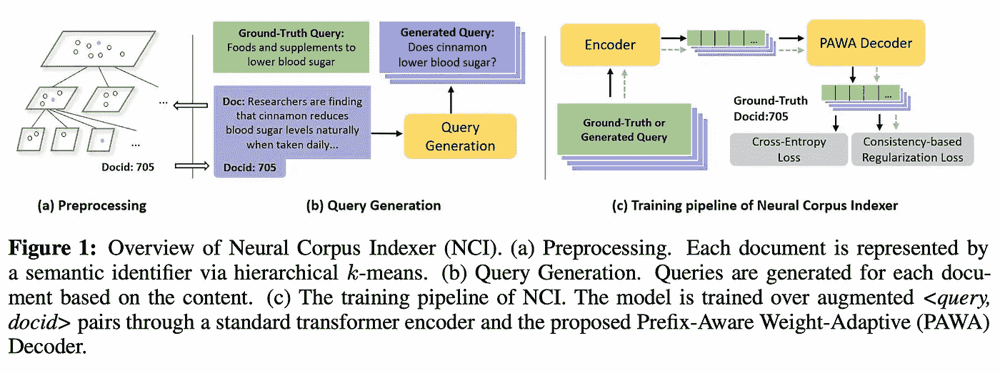*

*他们在 NQ320k 检索任务上测试了他们的模型，结果非常好，尽管有一个问题。他们比较的一些模型只在 MS-Marco 上训练，然后在 NQ320k 上测试，所以这不是一个真正公平的比较。尽管如此，与最初的 DSI 相比，它们实现了令人难以置信的性能提升(例如，1 的召回率从 40%提高到 89%)。从它们的消融来看，只有查询生成模块对性能有巨大的影响，而其他提出的方法(如它们的特殊解码器)几乎没有影响，这是一个非常相关的发现。*

*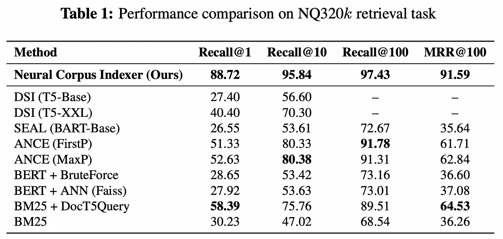*

*来源:[https://arxiv.org/pdf/2206.02743.pdf](https://arxiv.org/pdf/2206.02743.pdf)*

## *[6。视频预训练(VPT):通过观看未标记的在线视频学习行动](https://arxiv.org/abs/2206.11795) | [博客文章](https://openai.com/blog/vpt/) | [代码](https://github.com/openai/Video-Pre-Training)*

**由 OpenAI 等人撰写**

***❓为什么→** 标记是昂贵的，强化学习往往非常低效，尤其是在 Minecraft 这样的开放游戏中。本文提出了一个非常技术来解决这个问题，可靠地自动标记游戏视频。*

***💡关键洞见→** 根据先前的图像和动作(换句话说是自回归的)来学习游戏中代理人的下一步动作是很困难的。然而，如果你让模型访问一个视频游戏的整个过去和未来的帧，猜测在一个给定的帧正在采取的行动变得更容易。他们利用这个简单的技巧来更有效地处理需要多少人工标签。*

*首先，让我说这篇论文的标题可能会误导人:视频预训练(VPT)实际上*会从视频中标记动作*。但他们没有让人们去做，而是训练一个模型用动作来注释原始视频。他们让自己的模型访问过去和未来的帧，而不是自动回归(即，根据过去的动作/帧猜测将采取什么动作)，这使得注释动作的任务更容易学习(即，根据过去和未来的视频帧猜测正在采取什么动作)。*

*他们将学习标记原始视频的模型称为逆动力学模型(IDM)，该模型通过让人们玩《我的世界》并记录他们所有的行动来收集 2k 小时的数据进行训练。他们收集的视频数据集包括来自互联网的 27 万小时的《我的世界》游戏，经过过滤和清理后缩减到 7 万小时，然后自动标记为 IDM 模型。*

*通过行为克隆在这个数据集上训练一个代理:通过只看到先前的帧和动作来预测应该采取的动作。其中一个关键结果是，它对未来标记视频以构建 IDM 模型有多大帮助。*

*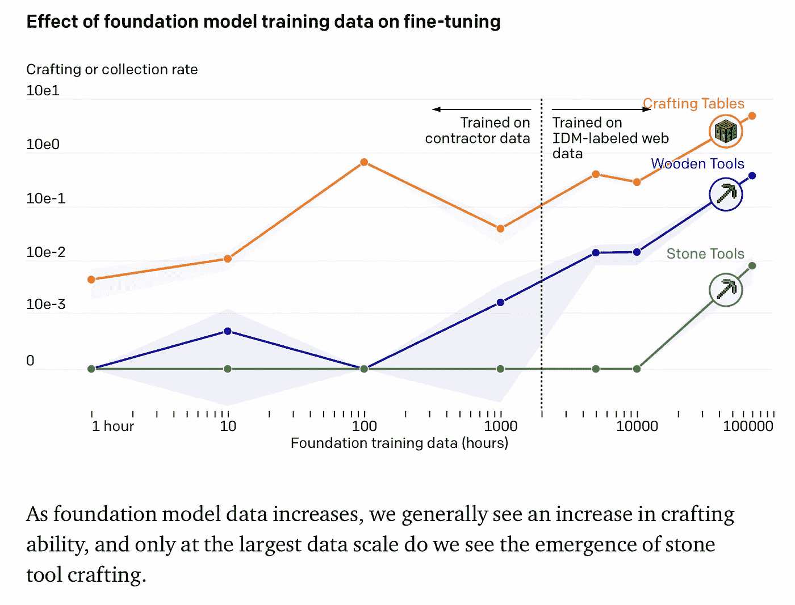*

*来源:[https://openai.com/blog/vpt/](https://openai.com/blog/vpt/)*

*除了行为克隆，他们还研究了强化学习的微调，其中模型有机会探索任意轨迹并为此获得奖励。虽然随机初始化的 RL 代理无法发现游戏中重要的复杂动作序列，但当从 BC 上训练的 VPT 模型初始化时，RL 微调工作得更好，它可以更加一致和有效地发现复杂的动作序列。*

## *[7。用语言模型解决定量推理问题](https://arxiv.org/abs/2206.14858) | [演示页面](https://minerva-demo.github.io/#category=Algebra&index=1) | [博文](https://ai.googleblog.com/2022/06/minerva-solving-quantitative-reasoning.html)*

**作者:奥托刀·卢科维兹、安德列森、大卫·多汉、伊桑·戴尔、亨里克·米切莱夫斯基、维奈·拉马谢什等人**

***❓为什么→** 扎实的推理能力——尤其是定量的——经常被指出是大型语言模型的弱点之一。这是大型 LMs 的一个基本限制吗？还是可以简单地通过扩大规模和更巧妙地处理训练数据来绕过它？*

***💡关键见解→** 事实证明，通过对正确数据和正确技巧的训练，LMs 是数学或物理等定量推理问题的熟练解决者。这项工作建立在 PaLM [8]之上(参数多达 540B！)添加来自 arXiv 和 math 网页的带有 *mathy* 文本的 118GB 数据。为了对数学进行编码，他们只是留下了 rax LaTeX 表达式，而不是像以前的作品那样将其展平。他们训练的所有模型都是基础手掌的微调。*

*他们还发现，使用高级提示对绩效至关重要:思维链和便笺式提示；其由简单的迅速重新格式化策略组成，该策略已经显示出根据经验提高预训练的 LMs 的一般推理能力。*

*最后，他们还发现，使用多数表决也大大提高了模型的性能，其中生成了一个问题的候选解决方案池，并在共享最常见结果的解决方案中选择了一个解决方案。*

*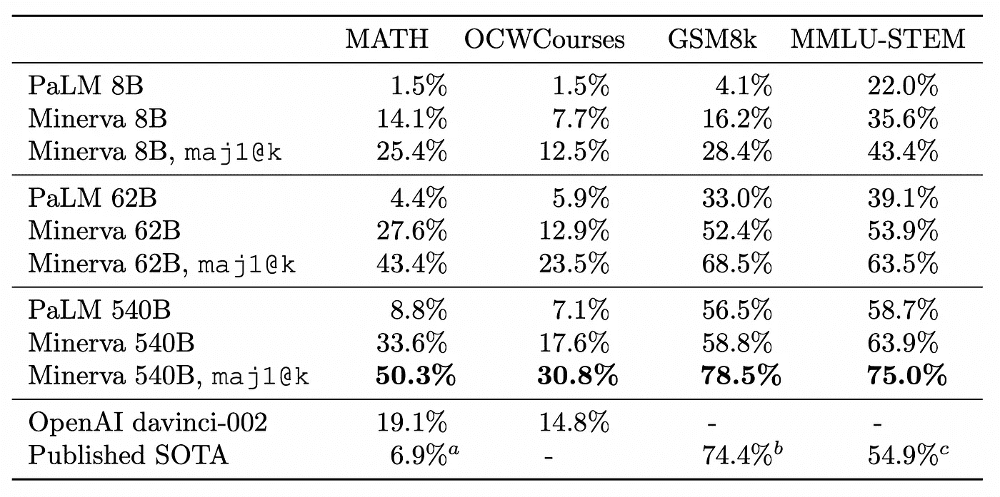*

*来源:[https://arxiv.org/pdf/2206.14858.pdf](https://arxiv.org/pdf/2206.14858.pdf)*

*毫无疑问，这离健壮的符号推理还很远，它显示了使用正确的技巧和优化，普通语言建模在推理中能走多远。如果你对 LMs 推理的子领域感兴趣，可以看看最近[推出的乐高变形金刚:综合推理任务](https://arxiv.org/abs/2206.04301)。*

## *[8。通往自主机器智能的道路](https://openreview.net/pdf?id=BZ5a1r-kVsf) (JEPA)*

**作者 Yann LeCun。**

***❓为什么→** 在本吉奥的《意识先验》[3]和辛顿的《忧郁》[4]之后，勒村加入了他的图灵奖共同获奖者的行列，展示了他认为通向人类级人工智能的道路。*

***💡关键见解→**Yann le Cun 的这份长篇立场文件解释了他对如何实现人类水平智能的愿景，尽管他谦虚地表明，实现这一目标并不仅仅是陈述手部波动原则。根据我们对儿童发展和大脑功能的了解，他专注于对“世界模型层次结构”的需求，通过这种结构，一个模型可以不断地将其感知与它在广泛的时间和空间尺度上如何映射到世界如何工作的现有模型相匹配，他称之为能量最小化。*

*用当前的强化学习术语来说，他基本上是在倡导一种基于模型的范式，这种范式具有高级表示学习——主要由自我监督学习提供动力。*

*老实说，很难说这样的论文有多大用处。一方面，值得称赞的是，一家大型私人研究实验室的首席科学家会公开分享他的研究愿景。另一方面，这篇论文提出了一个认知架构，就像我们在过去看到的数百个一样，在神经科学领域取得了一些解释性的成功，但在建造智能机器的工程方面却没有那么多。这条道路会让我们更接近人类水平的人工智能吗，或者我们应该寻找其他地方，因为就像普兰克所说的“*科学进步一次一个葬礼*”？*

*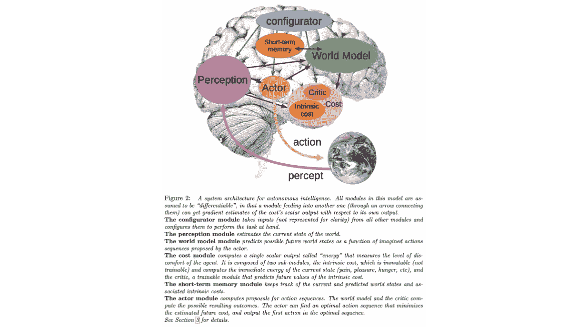*

*来源:https://openreview.net/pdf?id=BZ5a1r-kVsf*

## *[9。ARF:艺术辐射场](https://arxiv.org/abs/2206.06360) | [项目页面](https://www.cs.cornell.edu/projects/arf/) | [编码](https://github.com/Kai-46/ARF-svox2)*

**作者:，尼克·科尔金，赛比，栾福军，许泽祥，伊莱·谢克特曼，诺亚·斯内夫利。**

***❓为什么→** 有点像风格转换，但用于 3D 渲染。*

***💡关键洞察力→** 神经辐射场(NeRF [9])是一种神经网络，可以合成给定场景的新的真实感视图。这项工作提出了一个 NeRF，能够生成任意风格的场景视图。*

*为此，他们向损失函数添加了一个称为最近邻特征匹配(NNFM)的样式项，该样式项引导模型产生具有相似图像表示(即 VGG 特征)的输出。然而，这并不像听起来那么简单，需要许多优化技巧来实现这一点，例如延迟反向传播，这使得可以在全分辨率图像上进行训练，而不是只在图像像素的子集上进行训练。*

*作者解释说，现有的在点云或网格上操作的 3D 风格化方法对几何重建误差敏感，而本文提出的方法不是这种情况，这是其核心优势之一。*

*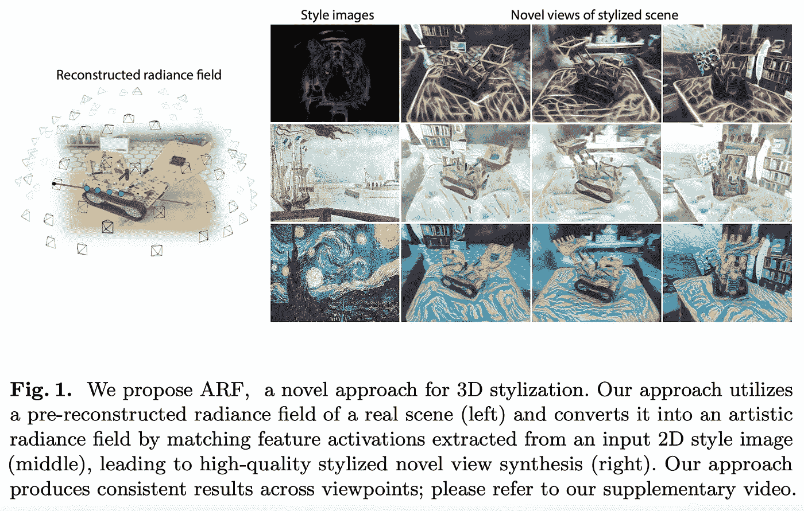*

*来源:https://arxiv.org/pdf/2206.06360.pdf*

*这可能有点噱头，但这背后肯定有艺术潜力，尤其是在虚拟现实和视频游戏的背景下。结果太酷了，不能不包括在这里！你*必须*在[的项目页面上展示他们的视频，以便更好地感受 3D 场景的风格。](https://www.cs.cornell.edu/projects/arf/)*

## *10。用于长尾视觉识别的检索增强分类*

**作者:亚力山大·龙、印伟、Thalaiyasingam Ajanthan、Vu Nguyen、Pulak Purkait、Ravi Garg、Alan Blair、沈春华、Anton van den Hengel。**

***❓为什么→** 从分布的长尾数据中学习是困难的:一个模型需要从这种数据的很少实例中学习。用显式检索模块扩充 ML 是我们过去强调过的一种趋势，它已经改善了文本生成等领域。现在也应用于图像分类。*

***💡关键见解→** 输入图像通过两个系统并行传送:常规基本图像编码器和检索模块。检索模块将图像编码成嵌入，并在与文本片段配对的图像数据库中找到其最近的邻居，文本片段可以是标签或更长的标题。然后，来自图像的文本片段列表被连接起来，并被馈送到一个类似 BERT 的文本编码器，该编码器产生一个文本嵌入。*

*来自基本图像编码器的嵌入和来自文本编码器的嵌入在归一化后被加在一起，为网络的分类层提供关于被分类图像的额外信息，这在低数据区是有用的。假设这个过程是端到端可区分的，它可以被端到端地联合训练。*

*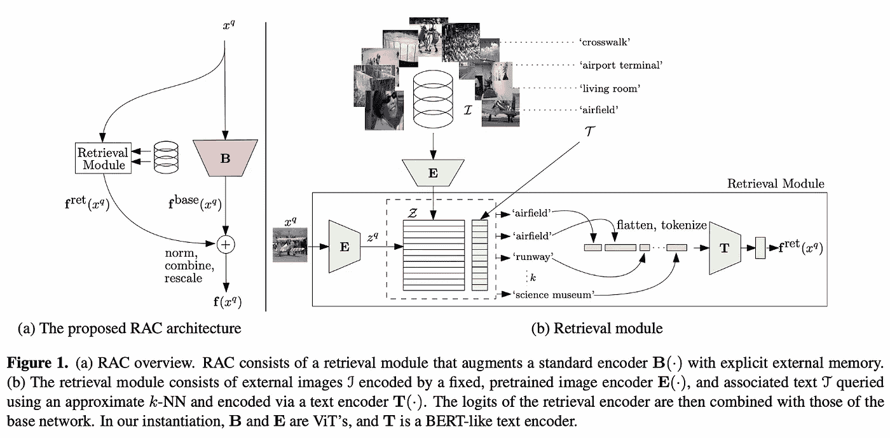*

*资料来源:https://arxiv.org/pdf/2202.11233.pdf*

*最有趣的发现之一是，通过充分平衡的学习目标，检索模块学会关注尾部类，因为基本编码器没有足够的标记样本来进行适当的学习，如下图所示(参见对于样本计数低的类，仅检索模块的每类分类精度如何提高)。*

*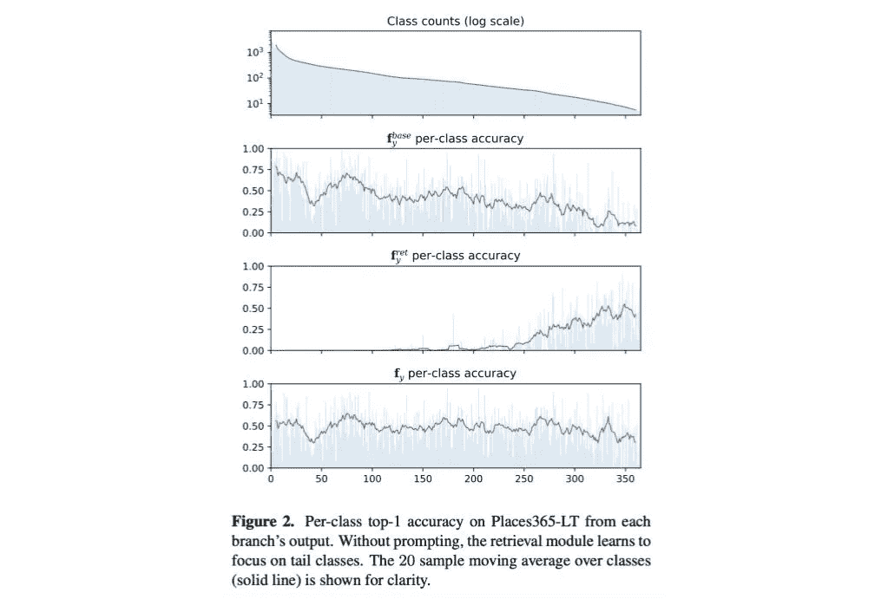*

*来源:https://arxiv.org/pdf/2202.11233.pdf*

**参考文献:**

**【1】*[*in pars:使用大型语言模型*](https://arxiv.org/abs/2202.05144) *进行信息检索的数据扩充，作者 Luiz Bonifacio、Hugo Abonizio、Marzieh Fadaee、Rodrigo Nogueira2022.**

**【2】*[*语言模型通用接口*](https://arxiv.org/abs/2206.06336) *“由郝亚茹、、宋浩宇、、黄少汉、、、、、韦福如；2022.**

**【3】*[*意识在先*](https://arxiv.org/pdf/1709.08568.pdf) *《约书亚·本吉奥》，2019。**

**【4】*[*如何在神经网络中表示部分-整体层次*](https://arxiv.org/abs/2102.12627)*《Geoffrey hint on》，2022。**

**【5】【web GPT:具有人类反馈的浏览器辅助问答】作者* [*中野玲一郎*](https://arxiv.org/search/cs?searchtype=author&query=Nakano%2C+R) *等 2021。**

**【6】*[*变压器内存作为可微搜索索引*](https://arxiv.org/abs/2202.06991) *由*[*Yi Tay*](https://arxiv.org/search/cs?searchtype=author&query=Tay%2C+Y)*等 2022。**

**【7】*[*文档扩展通过查询预测*](https://arxiv.org/abs/1904.08375) *“作者 Rodrigo Nogueira，Wei Yang，，Kyunghyun Cho2019.**

**【8】*[*PaLM:用通路*](https://arxiv.org/abs/2204.02311) *进行缩放语言建模 Aakanksha Chowdhery 等人 2022。**

**【9】"*[*NeRF:将场景表示为用于视图合成的神经辐射场*](https://www.ecva.net/papers/eccv_2020/papers_ECCV/html/1473_ECCV_2020_paper.php) *"作者:Ben Mildenhall、Pratul P. Srinivasan、Matthew Tancik、Jonathan T. Barron、Ravi Ramamoorthi、Ren Ng。2020.**