# 人工智能趋势—2022 年 6 月

> 原文：<https://pub.towardsai.net/trends-in-ai-june-2022-b96e6875e6fb?source=collection_archive---------0----------------------->

## 多模态多任务强化学习来自 Deepmind 的**加托**炮弹休克 AGI 预测。DALLE 2 面临来自谷歌 **Imagen** 的新竞争。当我们要求他们“**让我们一步一步地思考…** ”时，是否即将与法学硕士进行推理。？再加上强化学习的扩散模型，一种将 GNNs 应用于视觉的新方法，理解探索，等等…

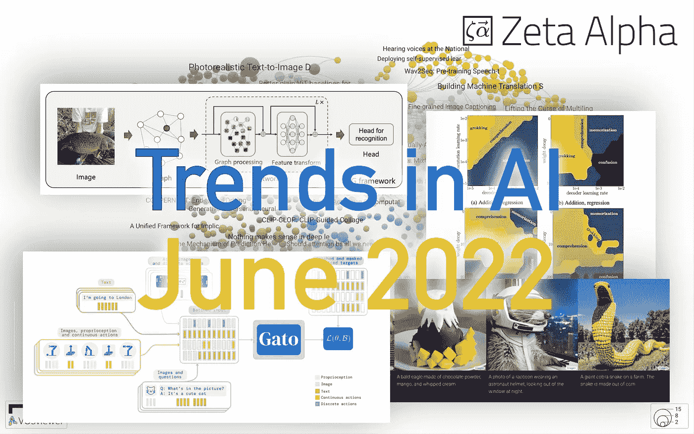

图片由 [Zeta Alpha](https://www.zeta-alpha.com) 提供。

随着我们进入六月，人工智能世界并没有停止，新故事和研究的步伐再次加快。ACL 会议于上个月在都柏林举行，这是第一次亲自参加的大型会议之一，这无疑是回归常态的又一步。让我们从一些发布亮点开始:

*   [Neutone](https://neutone.space/) 是一个新的音频插件社区，专注于连接研究和创意。它让研究人员轻松发布基于机器学习的音频处理插件，音频创作者可以方便地访问它们。
*   [RNNs 还是不会投降](https://www.reddit.com/r/MachineLearning/comments/umq908/r_rwkvv2rnn_a_parallelizable_rnn_with/)。BlikDL(一名独立研究人员)构建了一个高性能的 RNN，可以与基于 transformer 的模型竞争。训练可以并行化，使其更有效，推理仍然只依赖于先前的隐藏状态
*   关于机器学习的一个有趣的讨论是关于你是否可以相信实验室的论文。核心论点是，目前，拥有非常熟练的工程师的实验室将知道如何挤压每一个百分比的性能，以便论文中的结果最终反映出背后的人对过程的优化有多好，而不是对所提出方法的内在价值的衡量。

# 🔬研究

每个月，我们都会分析最新的研究文献，并选择 10 篇你应该知道的论文。本月我们将讨论多模态、强化学习(RL)、扩散模型、信息检索、提示等主题。

## [1。多面手经纪人](https://arxiv.org/abs/2205.06175) | [博客帖子](https://www.deepmind.com/publications/a-generalist-agent)

*斯科特·里德、康拉德·żołna、埃米利奥·帕里索托等人*

❓Why →我们一直强调多模态是人工智能未来的关键支柱之一，最近来自 flamingo⁴. deep mind 的通用视觉语言模型就是一个例子同样来自 Deepmind 的这项工作将多模态带到了一个新的水平:一个单一的模型在来自数百个不同数据集的视觉、文本和控制(例如 RL)数据上进行训练。

**💡关键见解** → El 加托应用了一个只有解码器的变压器(1.2B 参数)的常用配方，该变压器被训练来预测下一个令牌的自回归。但是现在，它们不再是语言专用的标记，而是将通用输入序列化到嵌入中，这些嵌入可以表示:

*   文本，通过 32000 单词词汇量的句子进行标记。
*   大小为 16x16 的图像补丁。这些是使用单个 ResNet 嵌入的，而不是使用 DALL E 1 这样的离散化图像标记。
*   像 Atari 按钮按压这样的离散值用 0 到 1023 之间的值来标记。
*   用于控制的连续值(例如视频游戏中的操纵杆位置)也被离散化为具有 0 到 1023 之间的值的令牌。

做出许多复杂的选择，以确保所有任务都可以用一系列嵌入来表示(例如，控制策略的观察/动作/分隔符)，但其要点相对简单。此外，与纯文本语言模型不同，加托主要是在监督设置下训练的，从数百个数据集中抽取标记样本，并一步一步地输入模型，以预测下一个令牌。这意味着，对于机器人或雅达利游戏等控制问题，加托通过行为克隆来学习，而不是像在 RL 设置中通常做的那样与环境积极互动。

结果表明，这是一个可行且成功的方法，但目前还不至于让 SOTA 崩溃。最终的模型可以做一些事情，比如给图像加标题、保持对话、玩雅达利游戏等等。他们对可伸缩性的分析表明，他们的模型远未达到最高性能，因此我们预计类似的可伸缩性方法将在未来几个月内出现！

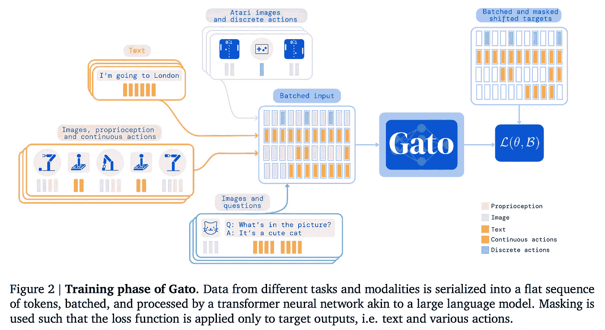

来源:https://arxiv.org/pdf/2205.06175.pdf

## [2。灵活行为合成的扩散规划](https://arxiv.org/abs/2205.09991) | [项目页面](https://diffusion-planning.github.io) | [代码](https://github.com/jannerm/diffuser) | [Colab 笔记本](https://colab.research.google.com/drive/1YajKhu-CUIGBJeQPehjVPJcK_b38a8Nc?usp=sharing)

迈克尔·詹纳、杜宜伦、约书亚·b·特南鲍姆和谢尔盖·莱文。

**❓Why** →扩散模型已经被证明对图像合成非常有用，正在寻找新的途径大放异彩，例如基于模型的 RL。

**💡关键见解** →现有的基于模型的 RL 方法通常会学习环境动态，然后使用经典的无梯度轨迹优化器进行决策。假设学习到的环境动态只是一种近似，轨迹优化器可能会利用近似的动态弱点，得出不能很好地转化为原始环境的*对抗式*轨迹，从而损害性能。

这项工作利用扩散模型将轨迹优化作为学习过程的一部分，减少当前轨迹优化器的缺陷，并旨在实现:

*   长期可扩展性:基于总体轨迹精度而不是单步误差的训练，避免短视的故障模式。
*   任务组合性:在扩散过程中添加辅助损失函数来调节计划抽样的简单方法。
*   时间合成性:通过在每个扩散步骤施加局部一致性来实现全局轨迹一致性。
*   有效的非贪婪计划:模型和计划者联合优化的目的是组件之间的协同交互，而不是对抗。

在广义上，考虑一个轨迹，它是{状态，动作}对的因果序列。扩散过程应用于这个序列，逐渐将噪声添加到每个{状态，动作}对，然后模型学习反转这个过程:从只有噪声的轨迹开始，逐渐改进它，直到它是一个*好的*轨迹。

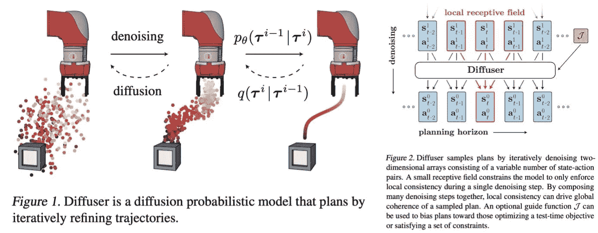

来源:[https://arxiv.org/pdf/2205.09991.pdf](https://arxiv.org/pdf/2205.09991.pdf)

在他们的实验中，提出的扩散器与现有的方法相比具有竞争力；但也许更有趣的是，模型得出的轨迹似乎满足了上面提到的 4 个目标:长期地平线计划、任务、时间组成和非贪婪计划。你可以在他们的[项目页面](https://diffusion-planning.github.io/)查看一些视频示例，查看[他们的代码](https://github.com/jannerm/diffuser)，甚至可以用 [colab 笔记本](https://colab.research.google.com/drive/1YajKhu-CUIGBJeQPehjVPJcK_b38a8Nc?usp=sharing#scrollTo=1PWx-SaieF74)玩玩。

这种方法代表了一种与现有规划者不同的重要概念，并有可能成为新研究的沃土。

## [3。具有深度语言理解的真实感文本到图像扩散模型](https://arxiv.org/abs/2205.11487)

*作者奇特万·萨哈利亚，陈伟霆等人*

**❓Why** →来自 OpenAI 的 DALL E 2 可以说是 4 月份最大的亮点，因为它推动了复杂和逼真图像生成的边界，引发了关于这种模型的能力和局限性的激烈辩论。现在谷歌公布了一款可以媲美 DALL E 2 的机型:Imagen。虽然没有人能与 OpenAI 营销天才相提并论，但这也是一项值得关注的工作。

**💡关键见解** →这种被称为 Imagen 的方法与 DALL E 2 类似，它使用扩散模型来生成图像，但它与它不同的是它如何表示提示以及如何实现高分辨率图像。

文本表示来自纯文本的冻结语言模型(T5)，图像生成由扩散模型(此时通常如此)执行，具有两个超分辨率上采样步骤，高达 1024x2014。它使用训练技术，如无分类器指导，让它学习有条件和无条件的生成。引入的另一种技术是动态阈值处理，它防止扩散过程在图像的某些区域饱和，这是一种损害图像保真度的现象，尤其是当文本条件生成的权重很高时。

在结果方面，他们在 COCO 数据集上达到了最先进的水平，零射 FID 得分为 7.27，甚至比 DALL E 2 更好。然而，客观地评估图像生成是具有挑战性的，所以对这些数字要有所保留。一般来说，这一代似乎与 DALL E 2 相当，但我们需要与这两个系统进行长时间的交互，以更好地了解它们之间的比较，这在目前是不可能的。

这篇论文的一个重要发现是，尽管没有像 CLIP [10]那样以多模态方式训练，但这种表示方式的效果令人惊讶。此外，他们发现，增加预训练语言模型的大小比增加生成图像的扩散模型的大小更能改善图像生成。

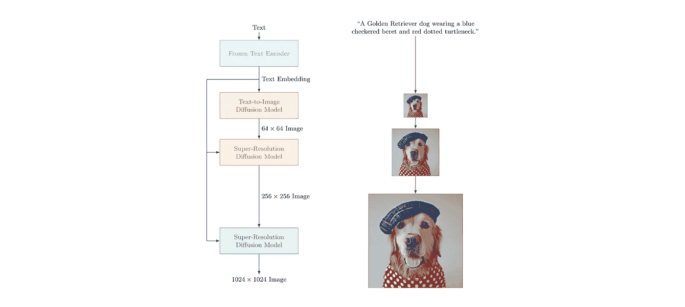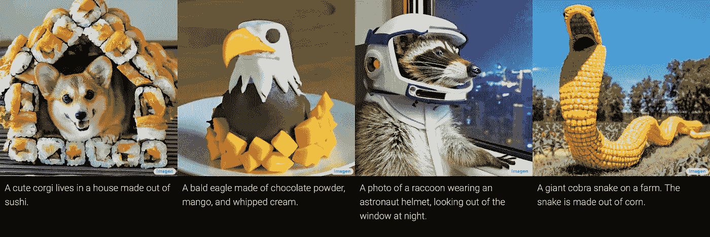

来源:[https://imagen . research . Google](https://imagen.research.google)

## [4。大型语言模型是零射击推理器](https://arxiv.org/abs/2205.11916)

*作者:小岛康誉武，谢恩·顾，马谢尔·里德，松尾丰，岩泽雄介。*

**❓Why** →一个令人难以置信的有效而简单的提示语言模型的方法。

**💡关键见解** →本文基本发现，在 GPT-3 和其他类似模型的提示中添加简单的短语“让我们一步一步地思考”显著提高了推理性能。这一发现与思维链提示(CoT)⁹)相一致，该研究表明，通过明确地将推理作为自然语言提示的一部分，推理和事实准确性可以在一次性学习中得到提高。下图简洁地说明了所有这些技术之间的相互关系。

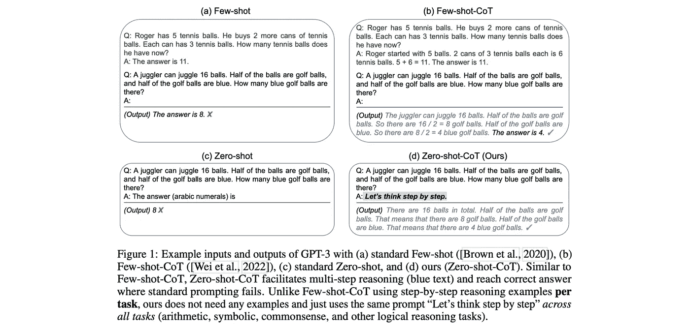

来源:https://arxiv.org/pdf/2205.11916.pdf

基于这样的发现，作者提出了一个零发射 CoT，这是一个在零发射环境中引出一种思维链推理的模板，而不像以前那样需要人工的思维链提示。例如，模板可以首先添加“让我们一步一步地思考”提示后缀，使用模型的输出作为思维链，然后通过添加另一个提示后缀(例如“因此阿拉伯数字中的答案是”)来执行答案提取，运行模型进行一个最终推理步骤。

结果显示了简单选择模板和提示会产生多大的差异。在《GPT 3》发布两年后，如此多唾手可得的果实仍在提示空间等待收集，这仍然令人着迷。

## [5。视觉 GNN:一幅图像抵得上节点图](https://arxiv.org/abs/2206.00272)

*由、、郭建远、唐&由吴。*

**❓Why** →我们经常假设图像应该被规范化地表示为像素网格。如果我们用图表来表示它们会怎么样？

**💡关键见解** →本文提出了*视觉 GNN* (ViG)，一种为视觉任务提取图形级特征的架构。图像的图形表示简单地通过将图像分成小块、嵌入这些小块并构建一个图来获得，其中边表示嵌入空间中最近的邻居。然后将该图输入 GNN，该图由图卷积(GCNN)、线性变换和激活函数的巧妙组合组成，避免了 gcnn 的常见缺陷，如过度平滑。

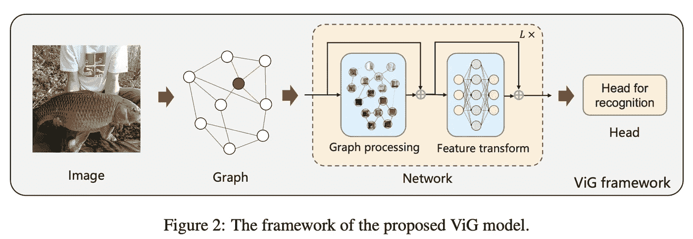

与经典 ResNets 类似，作者发现 GNN 受益于“金字塔结构”，其中空间特征迭代地聚合成更深的特征，这些特征组合了来自图像/图形的越来越大的邻域的信息。

Imagenet 上的结果要么是 SOTA，要么可以与现有的 ResNets⁵、ViTs⁶或 MLP-based⁶架构相媲美。这再次强化了日益增长的怀疑，即深度学习中的特定架构没有我们过去认为的那么重要，规模和数据不是性能的主要驱动因素。

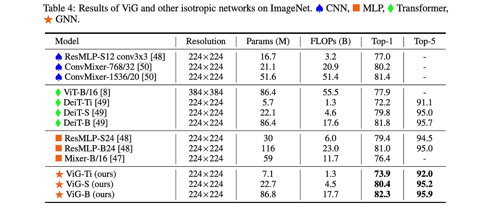

来源:https://arxiv.org/pdf/2206.00272.pdf

## [6。统一语言学习模式](https://arxiv.org/abs/2205.05131)

*伊泰、穆斯塔法·德赫加尼等人*

**❓Why** →基于自我监督语言建模的预训练现在是 NLP 的支柱。尽管如此，这种技术仍然存在不同的风格，根据经验显示互补的优势和劣势。把所有的都拿过来不是很好吗？

**💡关键见解** →考虑以下现有 LM 预处理方法的分类:

*   香草或因果语言建模。“预测下一个标记”，其中每个标记只能关注前面的标记。
*   前缀语言建模:“预测下一个标记”，但是现在所有的输入标记都可以相互关注。
*   跨度损坏、掩码语言建模(MLM)或双向语言建模。“填补空白”，在这里所有的代币都可以照顾到所有的代币。

自回归 LMs 擅长文本生成和提示，而 MLM 更擅长提取强大的通用语言表示。预训练任务的统一可以通过对“输入-目标”任务进行去噪的角度来理解:模型学习重建被破坏的输入并预测目标。通过在输入和目标域中定义不同定性类型的组合长短跨度的去噪，所得到的目标函数组合了我们最初描述的不同目标的质量。

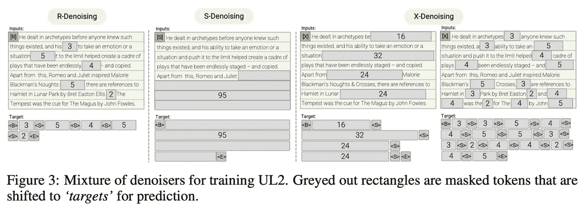

来源:[https://arxiv.org/pdf/2205.05131.pdf](https://arxiv.org/pdf/2205.05131.pdf)

简单来说，R-denoiser 模仿 T⁵⁸学习目标，S-denoiser 类似 GPT，X-denoiser 是两者的结合。

结果是一个模型，可以成功地运行在监督微调和一次性提示范例。当单独与之前的学习目标进行比较时，UL2 通常优于它们，尽管并非普遍如此。这是未来基础模型即服务的一个有希望的方向，它可以同时用于(1)生成强大的通用文本嵌入和(2)通过提示和文本生成解决零触发任务 *a la* GPT。

## [7。UViM:具有学习指导代码的视觉统一建模方法](https://arxiv.org/abs/2205.10337)

亚历山大·科列斯尼科夫、安德烈·苏珊诺·平托、卢卡斯·拜尔、翟晓华、耶利米·哈姆森和尼尔·霍尔斯比。

**❓Why** →虽然 NLP 已经看到了基于语言建模和变形器的预训练的跨任务技术的统一，但计算机视觉(CV)在不同任务的架构和方法方面仍然更加分散，例如对象分割、着色、修复或深度映射。

**💡关键见解** →基础模型学习给定输入图像的像素级输出。传统上，像素级的依赖性很难建模，因此特定任务的归纳偏差经常被引入到学习过程中。

这项工作提出引入一个辅助的*受限的 oracle* 模型，其目标是在广泛的像素级 CV 任务中指导基本模型的训练。这个*受限的 oracle* 获取基础事实输出(例如，每像素分割图)并生成一个包含关于手头任务的有用信息的短的离散令牌序列。直觉是，通过联合优化基础模型和受限预言，预言将找到帮助基础模型预测的方法，使它能够更有效地学习复杂的任务，而不需要特定于任务的设计选择。请注意，在训练期间，模型并不纯粹执行预测，因为来自基本事实标签的信息是通过引导代码有目的地泄露到模型中的。

虽然结果并不挑战现有技术，但它证明了受限 oracle 指导提高了基础模型的性能，并且是更通用的视觉方法的可行研究方向。

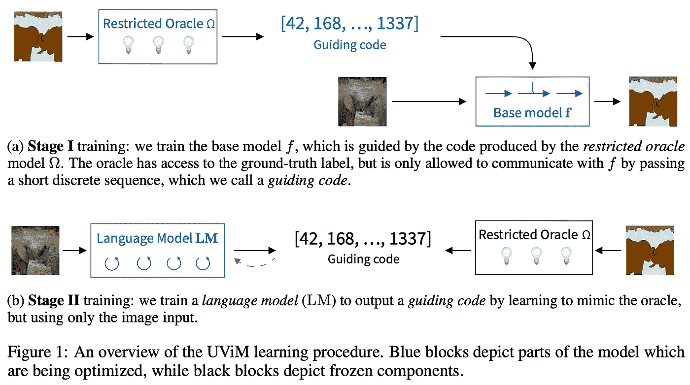

来源:[https://arxiv.org/pdf/2205.10337.pdf](https://arxiv.org/pdf/2205.10337.pdf)

## [8。检索增强型机器学习](https://arxiv.org/abs/2205.01230)

*作者:Hamed Zamani、Fernando Diaz、Mostafa Dehghani、Donald Metzler 和 Michael Bendersky。*

**❓Why** →依靠增加参数计数来提高 ML 模型的性能似乎是成功的，但也是脆弱的、不可持续的和不透明的。最近的工作结合了信息检索和语言模型显示了更有前途的参数效率，同时更一般化，可伸缩性，可解释性和鲁棒性。

**💡关键见解** →今年之前的作品，如 Web-GPT (OpenAI)、RETRO (Deepmind)或 LaMDA (Google)，已经展示了与检索模型交互的语言模型如何显示更好的参数利用率和鲁棒性；额外的好处是能够向系统添加信息，而不需要重新训练整个模型。

这是一篇非常有用的立场文件，它奠定了与检索系统交互的 ML 模型的概念基础。检索增强的 ML 模型只是一个机器学习预测模型，它与内存模块显式交互，可以通过检索模型查询信息(见下图)。

作者还提供了案例研究的例子，作为潜在的途径，检索增强 ML 正在研究，并显示出有希望的未来。这些包括知识基础、记忆增强的 ML、检索增强的输入表征和通过记忆的概括。

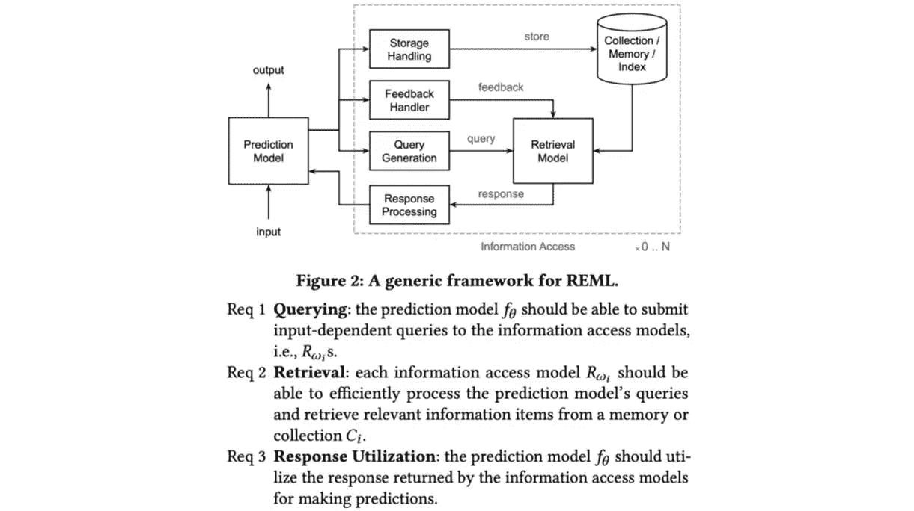

来源:https://arxiv.org/pdf/2205.01230.pdf

## [9。一个现代的自我参考权重矩阵，它学习修改自己](https://arxiv.org/abs/2202.05780)

*作者:友川·伊里、伊曼诺尔·施拉格、罗伯特·科索达斯、于尔根·施密德胡伯。*

❓Why →元学习(也称为学会学习，学会学习，等等)一直是人工智能中的一个想法，其重要性在抽象中不言而喻，但却很难推广。虽然这项工作首次出现在今年 2 月初，但它最近在 ICML 会议上被接受，并引发了更多的讨论。

**💡关键见解** →这是一项应用现代技术来重温 1991 年 Schmidhuber 团队的元学习理念的工作。Schmidhuber 的博客文章覆盖了元学习的历史背景，可以很好地理解这一系列工作的动机。

这种想法是将变形金刚中使用的许多多头注意力重新概念化为快速和慢速神经网络(或权重矩阵)的组合，其中慢速神经网络的目的是修改快速神经网络，这成为一种更通用的形式主义，以建立可以元学习的神经网络(即，可以在良性循环中“改善自己”)。

他们在监督学习(特别是少数镜头)和多任务强化中测试了这种方法，表明这是一种可行的技术，尽管没有达到令人瞠目结舌的性能。

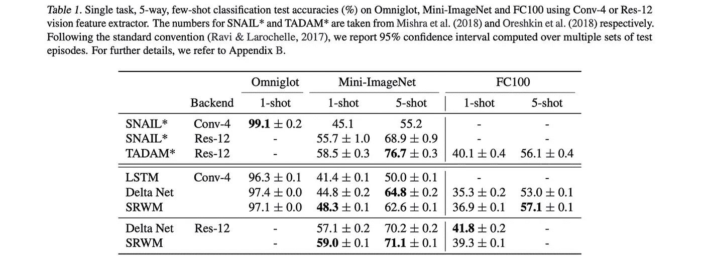

来源:[https://arxiv.org/pdf/2202.05780.pdf](https://arxiv.org/pdf/2202.05780.pdf)

老实说，我有点怀疑在与旧方法相关的替代术语和抽象下重新审视现有方法有多大用处:归根结底，这可以说与多头注意力没有什么不同。这可能会让人觉得对论文的贡献进行了不必要的混淆。尽管如此，用新的眼光看同样的事情可以揭示有价值的新奇见解，所以这毕竟是一个挑战，但值得一读！

## 10。走向理解探索:一种有效的表征学习理论

*作者:刘子铭、瓦伊尔·基图尼、尼克拉斯·诺尔特、埃里克·j·米乔德、马克斯·泰格马克和迈克·威廉姆斯。*

**❓Why** →使用具有有效理论和相图的物理工具箱来理解神经网络表现出的一个令人困惑的现象:摸索。

**💡关键见解** →搜索是一种令人困惑的现象，神经网络在过度适应训练集后会表现出对测试集的过度概括。这已经在算法数据集上得到证明，例如学习整数之间的二元运算，它从训练集中提取某些组合，并在测试集上使用它们来确定泛化。

有效理论通常在物理学中使用，它是某种现象的描述性模型，并不声称反映了所述现象的任何真正的潜在因果结构。

为了构建有效的表征学习理论，本文给出了基于嵌入空间几何的结构定义。在此基础上，它分析需要多大的训练集来恢复算法数据集的底层结构，以使模型推广到测试集。

在神经网络中，表征学习阶段被定义为学习表征的 4 个机制:

*   **理解**:培训和考试成绩同步提高。
*   **摸索**:培训和测试绩效较高，但在培训绩效达到稳定水平后出现泛化。
*   **识记**:训练成绩高但考试成绩低。
*   **困惑**:训练和测试表现都很差。

然后，可以为选择的各种超参数绘制相图，例如表示编码器/解码器学习速率，或者训练/测试分割比等等。有趣的是，他们的有效理论正确地预测了诸如训练/测试数据分割等参数的相变的边界条件。

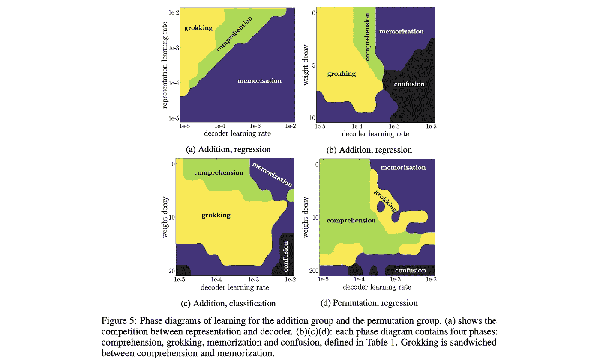

来源:[https://arxiv.org/pdf/2205.10343.pdf](https://arxiv.org/pdf/2205.10343.pdf)

论文中的大多数结果来自玩具设置中的算法数据集，但作者推测，训练动力学中的分析将适用于更一般的情况，并提供了一个简单的变压器示例。即使这是一个充满希望的假设，学习新的基础抽象也是有用的，有助于直观地将复杂现象概念化，这是物理学家擅长的。

此外，理解来自神经网络的复杂涌现现象对于有效地开发越来越大的模型非常有帮助，在这种情况下，扫描设计选择和超参数在计算上是不可行的。

*参考文献*

*[1]《感知者:具有迭代注意的一般感知》，作者:安德鲁·耶格尔、菲利克斯·吉梅诺、安德鲁·布洛克、安德鲁·齐塞曼、奥里奥尔·维尼亚尔斯、若昂·卡雷拉，2021。*

*[2]“分层文本-条件图像生成与剪辑潜伏”，Aditya Ramesh，Prafulla Dhariwal，Alex Nichol，Casey Chu，陈唐山，2022。*

*[3]“搜索:超越小算法数据集过度拟合的一般化”，作者:Alethea Power、尤里·布尔达、哈里·爱德华兹、伊戈尔·巴布什金、韦丹特·米斯拉，2022 年。*

*【4】《火烈鸟:少镜头学习的视觉语言模型》让·巴普蒂斯特·阿拉亚克等 2022。*

*[5]《“深度残差学习”用于图像识别》何，，，，任，，2015。*

*【6】《一幅图像抵得上 16x16 个字:大规模图像识别的变形金刚》，作者:阿列克谢·多索维茨基、卢卡斯·拜尔、亚历山大·科列斯尼科夫、德克·韦森博恩、翟晓华、托马斯·安特辛纳、穆斯塔法·德赫加尼、马蒂亚斯·明德勒、格奥尔格·海戈尔德、西尔万·盖利、雅各布·乌兹科雷特、尼尔·豪斯比，2020 年。*

*[7]“MLP 混音器:一个全 MLP 的建筑愿景”，作者:伊利亚·托尔斯泰欣、尼尔·霍尔斯比、亚历山大·科列斯尼科夫、卢卡斯·拜尔、翟晓华、托马斯·安特辛纳、杰西卡·容、安德烈亚斯·施泰纳、丹尼尔·凯泽斯、雅各布·乌兹科雷特、马里奥·卢西奇、阿列克谢·多索维茨基，2021 年*

*[8]“用统一的文本到文本转换器探索迁移学习的极限”，作者:科林·拉弗尔、诺姆·沙泽尔、、凯瑟琳·李、·纳朗、迈克尔·马泰纳、周燕琪、、彼得·刘，2019。*

*【9】《思维链提示在大型语言模型中引发推理》作者:Jason Wei，王学智，Dale Schuurmans，Maarten Bosma，Brian Ichter，，Ed Chi，Quoc Le，Denny Zhou，2022。*

*【10】《从自然语言监督中学习可转移的视觉模型》，作者:亚历克·拉德福德、琼·金旭、克里斯·哈拉西、阿迪蒂亚·拉梅什、加布里埃尔·高、桑迪尼·阿加瓦尔、吉里什·萨斯特里、阿曼达·阿斯克尔、帕梅拉·米什金、杰克·克拉克、格雷琴·克鲁格、伊利亚·苏茨基弗，2021。*