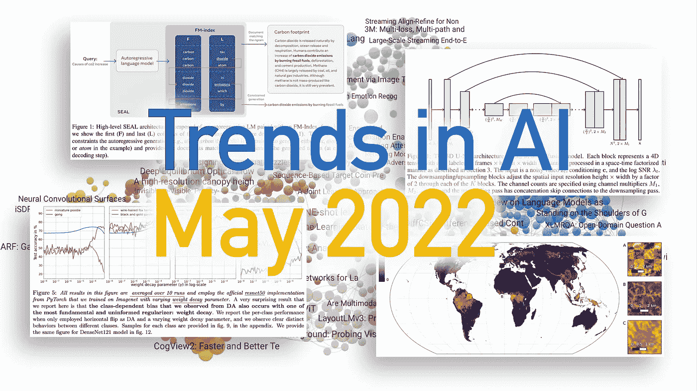
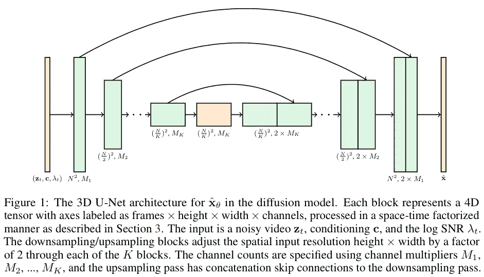
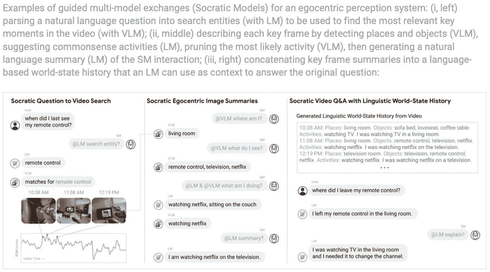
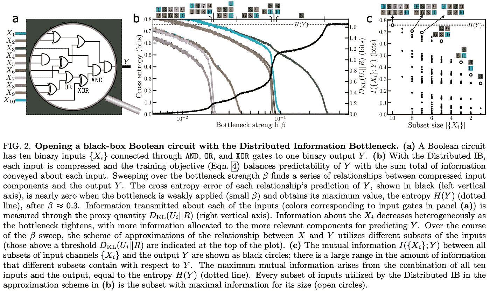
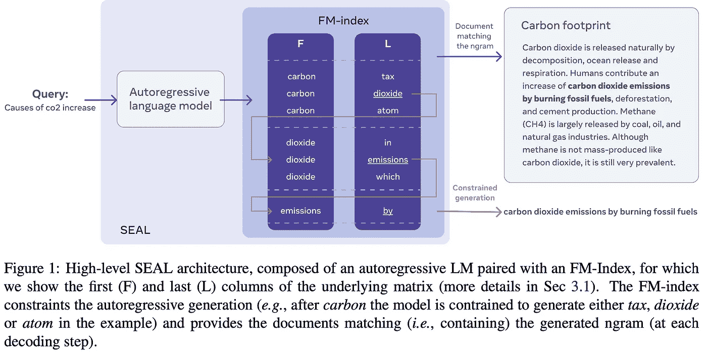
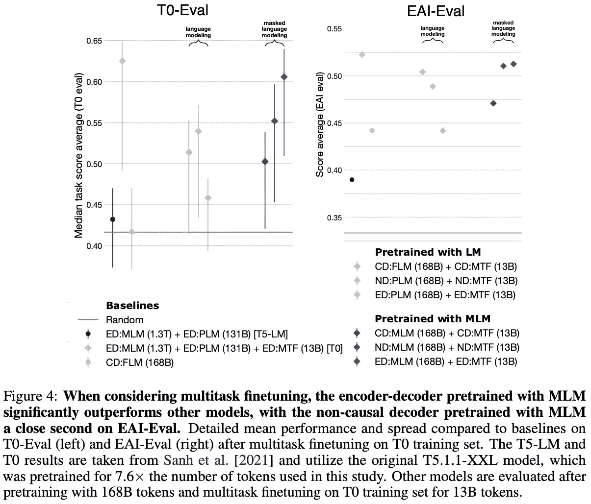
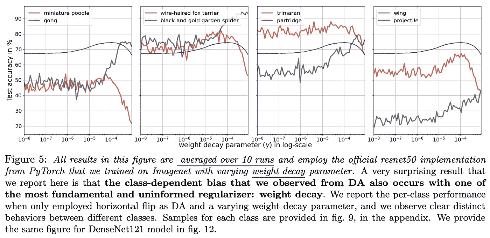
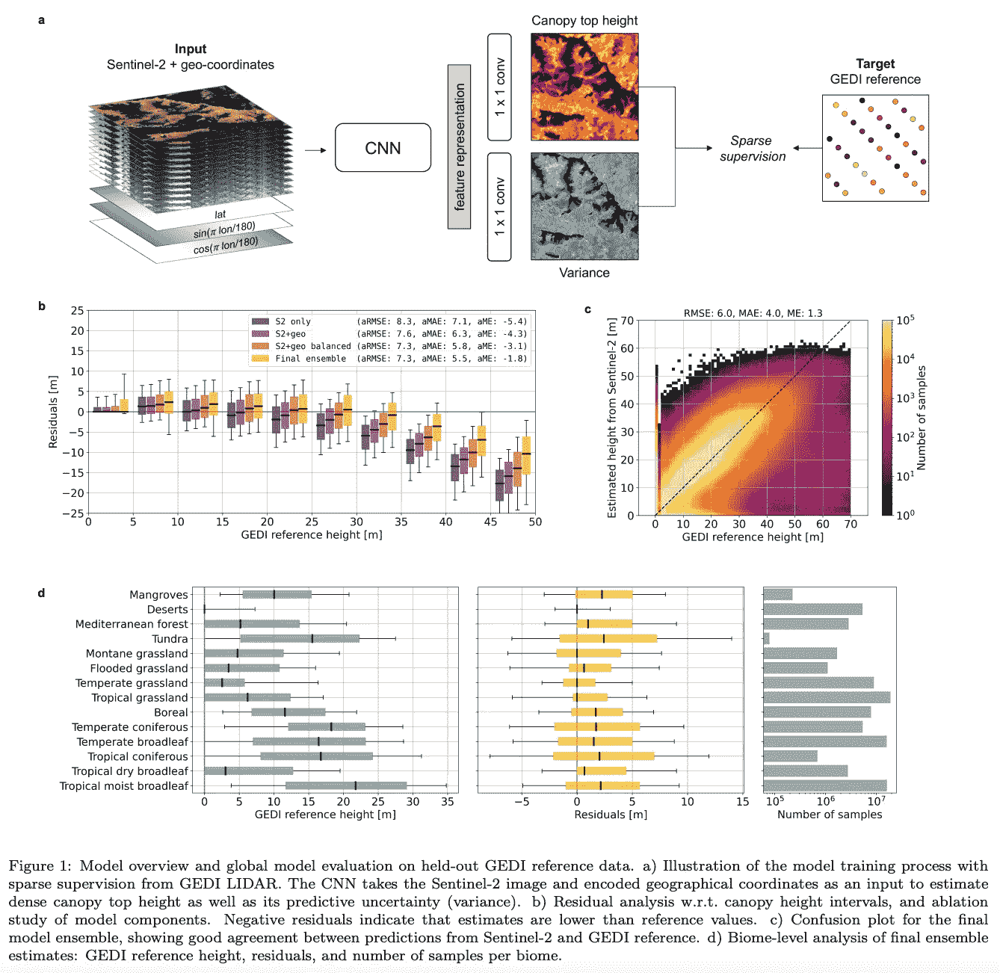

# 人工智能趋势—2022 年 5 月

> 原文：<https://pub.towardsai.net/trends-in-ai-may-2022-bbb668a1735d?source=collection_archive---------0----------------------->

## 每月新闻和研究论文精选:开源 DALLE 2，Meta 公开分享 175B GPT-3 克隆，视频扩散模型，自回归搜索引擎，对抗性后门攻击，等等。

图片由 [Zeta Alpha](http://www.zeta-alpha.com) 提供。

随着我们离开 ICLR 会议，接近 2022 年的赤道，很难想象人工智能的世界会变得更加活跃。再一次，我们很难从大量有趣的内容中只选择最热门的故事和研究。让我们从一些新闻开始:

*   [谷歌最近的一篇论文展示了该公司几位知名研究人员和工程师，描绘了机器学习碳足迹的未来前景](https://arxiv.org/abs/2204.05149)。由于数量级的训练和推断效率的提高，与运行 ML 模型相关的排放将趋于平稳并最终减少。该论文还鼓励所有研究人员在其所有出版物中公布碳足迹数据，以获得对该问题的更准确理解。
*   [LAION-5B:开放大规模多模态数据集的新时代](https://laion.ai/laion-5b-a-new-era-of-open-large-scale-multi-modal-datasets/)是最大规模的图文对数据集，拥有近**60 亿**个样本。也许你应该在点击下载按钮之前检查一下你的可用存储空间，数据集大小高达 240TB。
*   [lucidrains](https://github.com/lucidrains)/[dalle 2-py torch](https://github.com/lucidrains/DALLE2-pytorch):虽然 DALLE2 的代码还不可用，但是 luci drains 已经为 god you 提供了该模型的开源实现，您可以随意摆弄。

# 🔬研究

每个月，我们都会分析最新的研究文献，并选择 10 篇你应该知道的论文。这次涵盖的主题包括对抗性攻击、偏见、扩散模型、信息检索等等。

## [1。视频扩散模型](https://arxiv.org/abs/2204.03458) | [项目页面](https://video-diffusion.github.io)

*乔纳森·何、蒂姆·萨利曼斯、阿列克谢·格里岑科、陈伟霆、穆罕默德·诺鲁齐和大卫·j·弗利特。*

**❓为什么→** 如果你在关注这个博客系列(你应该这样做),你应该听说过扩散模型。这些模特在过去的一年里表现出色。超越甘斯成为图像生成镇中最酷的孩子，最近成为使 DALL E 2 不可否认地令人印象深刻的酱料中的关键成分。嗯，现在扩散模型从图像升级到视频。这可能是 DALL E 3 将激光目光投向的方向吗？

**💡关键见解→** 扩散是一种生成性建模范式，允许您通过迭代逆转扩散过程(即在每一步添加可微分噪声)从噪声样本中生成数据(图像、声音、文本)[此视频包含全面的解释](https://www.youtube.com/watch?v=W-O7AZNzbzQ)。该作品是第一个成功应用扩散模型生成视频的作品。

神经网络的架构是一个标准的 U-NET-一个用于建模视觉的常见架构，它结合了卷积层和注意力层，适合于包括帧或时间维度。这是在只有 16 帧和小分辨率(64x64)的短视频上训练的，它们使用无分类器指导来实现文本条件生成。这个过程非常类似于图像上的扩散模型；但是为了将这种方法扩展到更长的视频，新的*梯度调节方法*，这让他们能够内插或外推视频的新帧，作为一个条件扩散过程。

由此产生的视频并不十分逼真，但仍然是一个实质性的进步:[亲自检查一下](https://video-diffusion.github.io)！

来源:[https://arxiv.org/pdf/2204.03458.pdf](https://arxiv.org/pdf/2204.03458.pdf)

图像生成方面的另一项相关工作是 [VQGAN-CLIP:使用自然语言指导的开放域图像生成和编辑](https://arxiv.org/abs/2204.08583)，如果不是因为达尔·2⁷抢了它的风头，它将会成为最大的亮点。

## [2。苏格拉底模型:用语言构建零距离多模态推理](https://arxiv.org/abs/2204.00598) | [项目网站](https://socraticmodels.github.io)

*作者:Andy Zeng、黄芷晴、Stefan Welker、Krzysztof Choromanski、Federico Tombari、Aveek Purohit、Michael Ryoo、Vikas Sindhwani、李炯楷、Vincent Vanhoucke 和 Pete Florence。*

**❓为什么→** 单峰性有时被认为是生成语言模型的弱点(从现在开始是 LMs ),通过查看文本，你对世界的了解就只有这么多。但也许它不需要在图像上接受训练来回答关于图像的问题，也许它只是可以与另一个看过图像的模型进行交互。

**💡关键见解→** 本文是关于让基础模型在不同模态(视频、图像、音频、文本……)上接受训练，通过结构化对话进行交互，以增强这些模型的零镜头和少量镜头多模态能力。这种想法背后的动机是，从不同数据形态学习的模型将学习关于世界的不同和互补信息，这些信息可以在零射击设置中利用，而不需要一起微调所有模型。

这种交互发生在一个对话框中，因此这个框架被命名为“苏格拉底模型”，概括地说，它有点像下面这样。想象一下，你想回答关于视频的复杂问题，视觉语言模型(VLM)可以为视频的每一帧生成字幕，包含视频中的地点和对象等信息。然后，可以提示 LM 生成场景的第一人称(以自我为中心)摘要，并回答关于它的复杂问题。这种通过文本的基本交互可以扩展到音频和图像等其他形式。

本文中的许多结果很难用现有的方法进行比较，因为还没有真正的基准来衡量这样一个系统的能力。因此，这更像是一篇“嘿，这是可能的”的论文，而不是一篇“这远远超过了现有的方法”的论文。尽管如此，这仍然代表了一个潜在的有影响力的研究方向，尤其是考虑到当前机器学习的*化*的趋势。

来源:[https://Socratic models . github . io](https://socraticmodels.github.io)

Deepmind 最近还发布了 [🦩火烈鸟:一个用于少量镜头学习的视觉语言模型](https://storage.googleapis.com/deepmind-media/DeepMind.com/Blog/tackling-multiple-tasks-with-a-single-visual-language-model/flamingo.pdf)(以及 [explainer 博客帖子](https://www.deepmind.com/blog/tackling-multiple-tasks-with-a-single-visual-language-model))，展示了他们的零镜头和少量镜头表现，将是苏格拉底模型的自然匹配。

## [3。在机器学习模型中植入无法检测的后门](https://arxiv.org/abs/2204.06974)

*作者:Shafi Goldwasser、Michael P. Kim、Vinod Vaikuntanathan 和/或 Zamir。*

**❓为什么→** 从头开始学习 ML 算法可能很难，这就是为什么将模型的实现和训练外包给第三方越来越受欢迎。什么会出错？

**💡关键见解→** 本文理论性很强，但要点很简单。作者证明，第三方可以训练并提供一个分类模型，该模型对常规数据表现得不可检测，但具有计算上不可检测的后门，通过该后门，对手可以向任何输入添加不可检测的扰动(一个*数字签名*)，以将输出更改为任何期望的错误分类。

想象一下，有人向你的银行出售一个信用评分模型，该模型输出一个关于是否应该批准贷款的二元预测。银行托管并运行这个模型，他们可以看到它所做的一切。尽管如此，他们无法发现它有一个后门，让任何对手申请人引入一个*数字签名*，这将确保输出是积极的。

看看更平凡的例子，即使是目前非常流行的公共预训练模型也可能包含无法检测的后门，使对手能够操纵推理！可以想象，这也对开箱即用的特别可解释方法产生了一些怀疑，这些方法可能包含这样的后门，也使它们不可信或不可靠。

该文件展示了问题的正式设置，并调查了各种级别的安全性，这是相当迷人的。目前还不清楚这一切在多大程度上是可行的；然而，随着模型变得越来越复杂，其内在的可解释性也越来越差，ML 模型的这些基本安全问题需要认真考虑。

## [4。分布式信息瓶颈揭示复杂系统的解释结构](https://arxiv.org/abs/2204.07576) | [代码](https://colab.research.google.com/github/murphyka/distributed-ib/blob/main/Distributed_Information_Bottleneck_Boolean_circuit,_Mona_Lisa,_Titanic.ipynb)

基兰·a·墨菲和达尼·s·巴塞特。

**❓为什么→** 纳夫塔利·蒂什比(Naftali Tishby)倡导的信息瓶颈原理是一个强有力的透镜，通过它人们可以理解神经网络(NNs)中的学习。这种观点能阐明复杂数据的什么？

**💡关键见解→** 表征学习可以从信息论的角度来理解。概括地说，表示服从于准确性和复杂性之间不可避免的权衡；学习目标可以根据涉及输入、输出和潜在表征的交互信息来定义。Tishby 在 20 世纪 90 年代后期正式提出了这一原则，后来应用它来提高我们对深 NNs 的理解，这仍然是今天争论的话题。

这种方法的核心思想是，学习任何有意义的数据都需要约束，因为*学习需要遗忘。*现在谈到本文，建议将复杂的交互分解成各种瓶颈，以便更容易地对复杂的交互进行建模。这很有趣，因为这篇论文很大程度上源于物理学背景，所以它的动机是让模型学习输入呈现的**可理解的交互**。

实际上，这意味着一堆 VAEs⁴为一个输入的不同分区并行运行。作者展示了这种方法如何在逆向工程逻辑门，分解图像，并在物理学中模拟凝聚态物质。

这是*约束是一种强大的归纳偏向*工作的另一个例子，因此它并不真的期望在大多数领域内的基准测试中击败现有的模型，但它仍然是健壮和可解释的学习的一个迷人的方向。

来源:[https://arxiv.org/pdf/2204.07576.pdf](https://arxiv.org/pdf/2204.07576.pdf)

## [5。自回归搜索引擎:生成子字符串作为文档标识符](https://arxiv.org/abs/2204.10628)

*Michele Bevilacqua、Giuseppe Ottaviano、Patrick Lewis、Wen-tau Yih、Sebastian Riedel 和 Fabio Petroni。*

**❓为什么→** 语言模型+信息检索从我们看到的 2022 年就已经是热门话题了。在这两个领域的交叉点上，概念上的障碍正在被打破，下一代通用搜索引擎正在从中出现。

**💡关键见解→** 最近，我们在我们的博客系列和播客中讨论了差异化搜索 Index⁵ (DSI)论文:让一个 LM 直接输出给定查询的文档 id，这非常有效。在某种意义上，本文构建了一个相关的系统，它利用 LMs 进行检索，克服了 DSI 的一些限制，如可伸缩性，轻松地建立了一个新的最先进的性能基准，如 KILT benchmark⁶.

在常规索引中，预先计算并显式存储文档特征，如字数或密集嵌入，这样，给定一个查询，可以计算得分作为段落相关性的代理。在这种情况下，自回归文本到文本 LM(又名类似 GPT)为段落学习独特的 n 元语法作为它们的标识符。在推断时，给定一个查询，LM 输出约束搜索中最可能的 n 元语法，使得每个 n 元语法得到一个似然性分数，该分数可以被解释为段落相关性的度量，从而导致可扩展的检索。嗯，实际上还有相当多的细节来完成这项工作，但它确实很好地实现了苏格兰短裙的艺术水平。

来源:https://arxiv.org/pdf/2204.10628.pdf

经过几年基于交叉编码器或密集检索的神经信息检索，脱离这些范例的可能性是令人兴奋的！

## [6。什么样的语言模型架构和预训练目标最适合零镜头泛化？](https://arxiv.org/abs/2204.05832)

*作者:Thomas Wang，，Daniel Hesslow，Teven Le Scao，Hyung Won Chung，Iz Beltagy，Julien Launay 和 Colin Raffel。*

**❓为什么→** 最近的历史告诉我们，训练大规模的 LMs 可以产生变革性的见解，例如在语言任务中出现令人印象深刻的零命中率表现(例如 GPT-3)。但当只有部分图片公开时，这些见解有些有限，这正是 BigScience 大放异彩的地方。

**💡key insights→**[big science](https://bigscience.huggingface.co/)是一项由 Huggingface 带头的社区驱动的工作，用于训练大规模多语言语言模型，这导致了几个出版物详细介绍了它的设计、迭代和来自开源精神的训练，因此社区可以从实际细节中学习到训练一个大规模 LM 到底需要什么。这一系列研究的见解已在最近几个月发表，这是调查建筑+学习目标选择问题的最新版本。

作者比较了架构和训练目标的组合:因果/非因果解码器或编码器-解码器，以及自回归与掩蔽语言建模。TL；对于零和少数镜头性能，通常的仅解码器自回归语言建模是架构和训练目标的最佳选择。

来源:[https://arxiv.org/pdf/2204.05832.pdf](https://arxiv.org/pdf/2204.05832.pdf)

## 7 .[。OPT:打开预先训练好的变形金刚语言模型](https://arxiv.org/abs/2205.01068) | [代码](https://github.com/facebookresearch/metaseq) | [博文](https://ai.facebook.com/blog/democratizing-access-to-large-scale-language-models-with-opt-175b/)

*作者:Susan Zhang，Stephen Roller，Naman Goyal 等人*

**❓为什么→** F̶a̶c̶e̶b̶o̶o̶k̶ Meta 在 [BigScience](https://bigscience.huggingface.co/) 之前完全开源了他们的 GPT-3 版本，BigScience 正在[公开培训一个类似但多语言的模型](https://huggingface.co/bigscience/tr11-176B-ml-logs/tensorboard)，预计将在未来几个月内发布。

**💡关键见解→** 老实说，关于它已经没有太多可以说的了，这几乎是 GPT-3 的克隆，具有巨大的吸引力，它是最大的完全公开的预训练语言模型。

通过[浏览 GitHub 库](https://github.com/facebookresearch/metaseq)你会发现最有趣的花絮，其中包含代码、部署、训练和运行该模型的指令，以及详细的报告和训练该模型的幕后情况。

## [8。正则化和数据扩充的效果取决于类别](https://arxiv.org/abs/2204.03632)

兰德尔·巴勒斯特里罗、莱昂·博图和扬·勒昆。

**❓为什么→** 聚合性能指标非常有用，因为它们让我们可以通过查看单个量化分数(如平均性能)来比较各种模型的性能。虽然这种实践广泛而有用，但它可能会掩盖与手头任务高度相关的定性行为。换句话说，两个平均性能相当的模型仍可能呈现出显著不同的故障模式，因此，全面了解一个模型的行为非常重要，尤其是当它将被部署并对实际的*现实世界*决策产生影响时。

**💡关键见解→**ML 模型中的偏差通常被认为是由训练数据引起的；然而，已经表明，它可能会作为其他选择的结果出现，这些选择可能看起来是无害的，如选择损失/度量、修剪、数据扩充等。本文展示了某些正则化技术如何在一小组类中极大地损害性能，而在总体性能指标(如平均精度)上几乎检测不到。

本文探讨了这一现象，通过训练一个图像分类器与不同的数据增强技术，如随机裁剪或颜色抖动影响每类性能。例如，严重的颜色抖动对检测篮球的准确性有负面影响，而斑马纹检测保持不变；或者随机种植对“线虫”来说是一个很好的补充，但如果过度，对狮子来说就太可怕了。经过深入的经验和理论分析，本文最后呼吁新的无偏正则化方法。

像这样的结果是实实在在的证据，证明欺骗我们自己认为我们理解一个算法执行得有多好是多么容易；提醒一下，不要只看表层指标，深入了解是非常重要的，特别是当模型将在那里部署时。此外，本文还呼吁设计无偏差正则化方法。

来源:https://arxiv.org/pdf/2204.03632.pdf

## [9。一个高分辨率的地球冠层高度模型](https://arxiv.org/abs/2204.08322)

Nico Lang、Walter Jetz、Konrad Schindler 和 Jan Dirk Wegner。

**❓为什么→** 这篇论文有点随意，很酷，也很有趣。

**💡关键见解→** 树冠高度相当于植被的高度，可以通过树木顶端的海拔减去它们所在地面的海拔来计算。事实证明，全球范围内的林冠高度是全球碳循环的一个显著量，因此在全球范围内更准确地建模是研究环境现象(如森林砍伐、气候变化或生物多样性建模)的关键。

但是精确地绘制世界各地的树有多高是很困难的。[全球生态系统动力学调查(GEDI)](https://gedi.umd.edu) 是一项旨在收集激光雷达数据以测量全球垂直森林结构的任务，但它仅限于仅占地球表面 4%的稀疏测量，而且，连续测量是不可能的，这使得研究进化成为不可能。相比之下，光学卫星图像，如来自[哨兵-2](https://en.wikipedia.org/wiki/Sentinel-2) 的图像很容易获得。这项工作提出用深度学习融合这两个数据源，开发一个地球树冠高度的概率模型。

来源:https://arxiv.org/pdf/2204.08322.pdf

其他最近的工作将引起环保人士的兴趣是[机器学习和深度学习——生态学家的评论](https://arxiv.org/abs/2204.05023)和[机器学习培训的碳足迹将趋于平稳，然后收缩](https://arxiv.org/abs/2204.05149)(谷歌对自己的未来充满希望)。

## 10.数据集和基准

鉴于本月有趣的数据集和基准测试工作的数量，我们决定将它们归入这个 TL；DR 列表👇

[通过对 1，600 多项语言任务的上下文指令进行基准归纳](https://arxiv.org/abs/2204.07705)，自然指令 v2 →旨在测量模型对给定自然语言指令的各种未知任务的归纳。

[Winoground:探索视觉语言组合的视觉和语言模型](https://arxiv.org/abs/2204.03162) →类似于 Winograd 模式挑战，但对于图像语言对:需要*世界知识*来消除歧义的模糊问题。

[海量:100 万例多语言自然语言理解数据集，包含 51 种不同类型的语言](https://arxiv.org/abs/2204.08582) →新的多样化多语言 NLU 基准。

*参考文献:*

*【1】《U-Net:生物医学图像分割的卷积网络》Olaf Ronnenberger 等人 2015。*

*【2】《论基金会模式的机遇与风险》Rishi Bommasani 等人*

*[3]《信息瓶颈法》Naftali Tishby 等 1999。*

*[4]“自动编码变分贝叶斯”Diederik P. Kingma 等人 2013*

*【5】《变压器记忆作为差异化搜索索引》易泰等 2022*

*[6]《苏格兰短裙:知识密集型语言任务的标杆》法比奥·彼得罗尼等著 2020。*

*[7]“具有剪辑潜在性的分层文本条件图像生成”，Aditya Ramesh 等人，2022。*