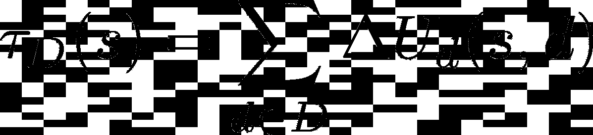
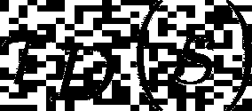
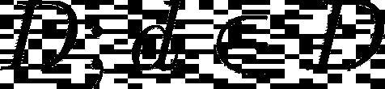
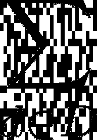
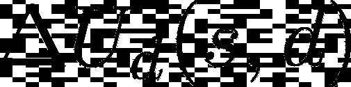
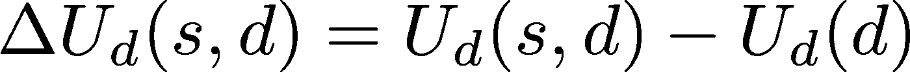
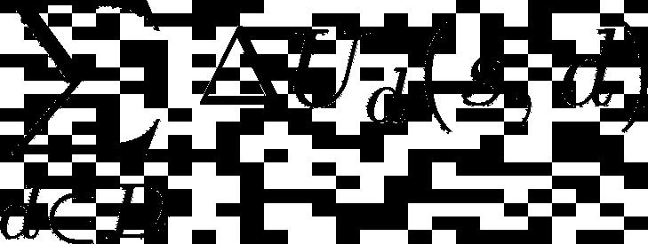
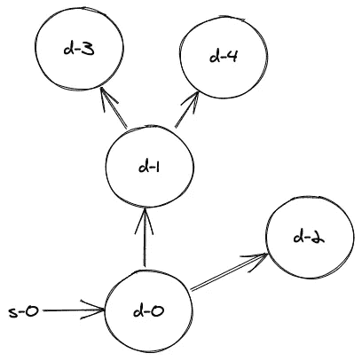
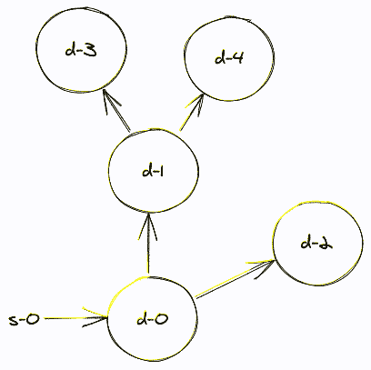
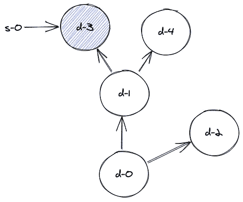

# 真理=效用

> 原文：<https://pub.towardsai.net/truth-utility-a17e1410ccec?source=collection_archive---------0----------------------->

## [未来](https://towardsai.net/p/category/future)，[数学](https://towardsai.net/p/category/mathematics)，[意见](https://towardsai.net/p/category/opinion)

## 一种新认识论的定义及其含义

来源:Unsplash 的托德·夸肯布什

我们已经正式进入后真相时代。

随着[假货](https://www.brookings.edu/research/fighting-deepfakes-when-detection-fails/)、[说谎政客](https://www.nytimes.com/2016/08/24/opinion/campaign-stops/the-age-of-post-truth-politics.html)、以及[苏尔科维](https://www.rand.org/pubs/perspectives/PE198.html) [造谣](https://www.thelondoneconomic.com/politics/power-telling-lies/10/03/) [造势](https://www.thetimes.co.uk/article/leaked-emails-expose-russian-dirty-tricks-cmfkskj82)的兴起，连*是*都很难搞清楚什么是真相。

有几个月，我陷入了怀疑的深渊，对我认为的“真实”失去了控制，我不得不变得非常愚蠢，想出一个我们都可能同意的正式定义。我认为，真理是由这种表达方式给出的:

就是这样。这是事实。

我将很快定义术语，很明显，我正在抽象掉许多混乱的细节，但我将试图说服你，这种基本结构符合我们的许多非正式直觉，对决策有用——甚至可能在不久的将来作为自动化科学家的目标函数。更好的是:也许它可以用作搜索系统或新闻源的目标函数，只返回按真实值排序的顶级结果。

如果你全盘接受这个定义，我会告诉你它有一些有趣的含义，但不会马上显现出来。如果你根本不相信这个定义，我邀请你把所有的批评、反例和挑战放在评论里，这样我就可以相应地更新了。

# *τ*真理函数

你会注意到的第一件事是真理是一个*函数。*

这个基本框架已经在重要的方面与我们的直觉一致:真理不是一个独自漂浮在空中的价值，它是一个陈述的属性——我们在这里写为 ***s*** 。陈述本身也没有真值:它们总是基于一些背景，*。*

*一些基本的直觉验证:陈述*“男孩跑了”*没有任何真值，除非你给它一个上下文。如果上下文涉及一个男孩跑步，那么这个陈述是正确的。如果上下文不包括一个男孩跑，那么它是假的。你既需要一个陈述***s*** 又需要一组语境 ***D*** 来评价真理，即使 ***D*** 的意思是“所有可能的语境”(比如重言式在*所有*语境中都成立！).*

*有人可能会说，如果语句是完全限定的(即“男孩在跑，时间和地点就在有男孩在跑的地方”)，我们就可以取消上下文的概念，但因为上下文是一种易于使用的速记，所以我们将使用它。*

# *上下文设置， *D**

****D*** 是一个域:一个*集合*的上下文 ***d*** 。*

**

**是一组自洽的真陈述。这抓住了这样一个想法，即 **s** 的真理，在某种程度上，是其与已建立的真实陈述的一致性的函数。**

**然而，某些*₀可能包含与*₁中的语句不一致的语句，即使 **s** 与两者都一致。比如，拿 ***d*** ₀来说就是牛顿经典力学的全部，拿 ***d*** ₁来说就是爱因斯坦的广义相对论。**【重力存在】*与两种语境都是一致的，它的真值应该在每一种语境中被逐一评估，尽管这两种**在别处根本不一致。*******

# ***真值是数字***

******

***𝛕函数的结果是一个和，这可能没有逃过你的眼睛。***

***这暗示了一些怪异的事情:***

1.  ***真值由子组件组成。***
2.  ***真值可以通过加法运算。***

***我还想加强另一个约束:真值是数字。这意味着当你把一个正真值加到另一个正真值上时，结果是更真实的东西。负真值让某些事情*变得不那么真实*。***

> **当你把一个正真值加到另一个正真值上，结果是更真实的*。***

***为什么这是一个有用的概念？好了，我们已经确定了一个语句 ***s*** 可以在上下文 ***d*** ₀和 ***d*** ₁，你选择的 ***D*** 中求值。假设我们有三个语句 ***s*** ₀、 ***s*** ₁和 ***s*** ₂，具有以下属性:***

*   ******s*** ₀与 ***d*** ₀也不是 ***d*** ₁***
*   ******s*** ₁与 ***d*** ₀一致但与 ***d*** ₁不一致***
*   ******s*** ₂既符合*d***d***₁****

***似乎很自然地说𝛕ᴅ(***s***₀)<𝛕ᴅ(***s***₁)<𝛕ᴅ(***s***₂)其中***d =****{**d*₀、要得到一个具体的例子，我们再一次借用物理学。***

******

***发光的以太，由[摄影记者](https://www.pexels.com/@skitterphoto)提供。***

***让我们把这些陈述理解为:***

*   ******年代*** ₀:光是一波在[发光的以太](https://en.wikipedia.org/wiki/Luminiferous_aether#:~:text=Luminiferous%20aether%20or%20ether%20(%22luminiferous,not%20be%20able%20to%20do.)***
*   ******s*** ₁:光是一种粒子***
*   ******s*** ₂:光是一种波和一种粒子***

***域 **D** 由 **:** 组成***

*   ******d***₀: {*[*迈克尔逊-莫雷*](https://en.wikipedia.org/wiki/Michelson%E2%80%93Morley_experiment) *实验被进行**[*光激发电子在*](https://en.wikipedia.org/wiki/Photoelectric_effect)*****
*   *******d*** ₁: { *“进行了迈克尔逊-莫雷实验”*、*“光在离散量子中激发电子”、“光产生衍射图样***}******

****在这种情况下，*₀与迈克尔逊-莫雷实验在两种语境下都是不一致的， ***s*** ₁与*d*₁中的“衍射图样”表述却不一致，而 ***s*** ₂与两者都是一致的。还是那句话，我感觉很自然的说𝛕ᴅ(***s***₀)<𝛕ᴅ(**s**₁)<𝛕ᴅ(***s***₂)其中***d =****{****d**********

***如果真值是布尔值，这种排序就不会发生——这里有更多的数字(或者至少是序数)在起作用。正如下一节将阐明的，我将断言真值不仅是数字，而且是真正的数字。***

# ***真理是边际效用***

***这可能会引起争议，但请耐心听我说。***

******

***在上下文*中的 ***s*** 的真值，从根本上说，是由我们得到的比不包括它时多多少的效用决定的。****

***这里的效用是由一个效用函数(又名目标函数)**【𝐝】*定义的。烤入我们批注的是这样的想法，即**【𝐝】*是由上下文*指定的，意思是，不仅是*d*的一组语句，而且是*和 ***s*** 中的*任务*的语句*********

**值得强调的是，我们对绝对效用**𝐝*的关心程度不如我们对边际效用*****u****𝐝*的关心程度。*****

******

***这个定义的核心是反事实思维，因为我们必须估计在*用于(或不用于)某些任务的世界中 ***Ud*** 会是什么样子，并将其与在*实际*情况下测得的 ***Ud*** 进行比较。****

***我们再来看一个例子。假设我们在上下文*= {*、*、*、【口罩缓解传播】、【未能缓解传播导致死亡】*中评估语句*=。上下文 ***d*** 还附带一个最大化效用函数***Ud***=***-virus deaths(s，d)*** 。*****

******

***说真的，戴上面具。资料来源:疾病预防控制中心***

***如果 ***Ud(d)*** =-22 万，但是 ***Ud(s，d)*** =-10 万，那么我们可以说*δ****u****𝐝****(s，d)***= 10 如果 ***d*** 是我们域中唯一的上下文 ***D*** ，我们可以说𝛕ᴅ(***s***)= 120000—一个正数，从而*真，*值。***

***你应该戴口罩。***

***我记得我对真理必然与任务相关的想法感到非常不舒服。但是，没有比一个声明是否能被有效地用于某项任务更能检验其真实性的了，无论是预测月亮的位置还是发起一场成功的社交媒体运动。***

***真相必定有用的暗示可能会让你想起愤怒的老人在国会对国家科学基金会预算的叫嚷，以及我们如何“浪费金钱”研究 T2 螳螂虾或其他什么。但值得注意的是，我们估计真实值的领域 ***D*** 可以是巨大的和前瞻性的:肯定有一些未来的背景，对虾的研究可以提高材料科学或医学的性能，使蓝天研究成为真理的引擎，即使在当前的背景下效用很低。***

***真实的陈述不一定现在就有用，但在一个看似合理的世界、过去或想象中的未来一定有用。***

> ***真实的陈述不一定现在就有用，但它们必须在一个看似合理的世界中有用，无论是过去还是未来。***

# ***“现实”一词在哪里？！***

***让我们重申我们对真理的表述。***

******

***有一个术语来描述上下文域、效用函数和要评估的陈述，但是没有提到“事实”或“现实”。但真理不就是“对现实的忠实”吗？如果事情不是…真实的，怎么可能是真的呢？***

***首先，“现实”是不明确的，我知道有 0 种方法可以精确地描述陈述和现实之间的距离。大多数对现实的定义也调用了其中的真理，所以把真理框定为现实的一个函数充其量是一种循环。***

***其次，无论如何，我们从来没有明确地试图在日常生活中尽可能准确地表现“现实”。极有可能的是，我们自己的感觉和知觉系统通过启发式和近似法来构建我们对世界的描述——足以帮助我们生存和繁衍。***

***第三:假设*有*一个精确的距离度量来量化陈述对现实的保真度，你可以将这个距离度量作为效用函数的一部分放入域 ***d*** 。在这种情况下，任务可能是“尽可能准确地表现现实”，使真理的“忠实于现实”定义成为我在这里提出的边际效用定义的特例。***

***不过，我要重复一遍:尽可能准确地描述现实并不是我们想要做的事情。只是没什么帮助。请记住，地图不是领土，地图之所以有用，是因为它是一片广阔得令人难以理解的土地的简洁表示。我们使用地图正是因为它们*不*准确:它们*有用*。***

> ***我们使用地图正是因为它们*不*准确:它们*有用*。***

******

***照片由 [Pexels](https://www.pexels.com/photo/beige-analog-gauge-697662/?utm_content=attributionCopyText&utm_medium=referral&utm_source=pexels) 的 [Ylanite Koppens](https://www.pexels.com/@nietjuh?utm_content=attributionCopyText&utm_medium=referral&utm_source=pexels) 拍摄***

# ***除了惯例，共识并不重要***

******

***的确，当你看到这个标志时，你应该停下来。照片由[戴维斯·桑切斯](https://www.pexels.com/@dudumatik?utm_content=attributionCopyText&utm_medium=referral&utm_source=pexels)从[佩克斯](https://www.pexels.com/photo/alto-road-signage-2214770/?utm_content=attributionCopyText&utm_medium=referral&utm_source=pexels)拍摄***

***你会注意到的另一件事是，没有一个术语来描述一个陈述与他人的信仰有多一致。认识论 101 的新生对于“真理”是什么的标准二年级答案在这里很容易被反驳。***

***这应该是一个令人满意的结果:邪教和再教育营在制造共识方面非常出色，但很少有人会声称他们是真理创造者。***

***有这样一种情况，共识很重要:但它完全融入了效用函数 ***Ud*** 。当对许多人来说，就某件原本武断的事情达成一致是有益的(T21)时，它就变成了真理。例如，如果你的目标函数 ***Ud*** 是在城市街道上驾驶车辆时尽可能长时间地存活，那么*真的*你应该在停车标志处停车。在纽约，你应该在路的右边行驶，这也是事实。再深入一点:如果你的目标是运行一个正常运转的经济，那么法定货币是有价值的。因为我们大家都同意这一说法是有益的。***

# ***宽广的真理是更好的真理***

******

***真值函数包括对几个独立且可能不相关的领域的边际效用求和。这里的含义是，如果一个语句在许多独立的审查领域中导致性能增强，那么它就比只在一两个领域中增强性能的语句更真实。直觉上我不会想到这一点，但深入思考后，它实际上很好地映射了我们如何在科学中排列命题。***

***想想法律和理论之间的区别。定律是确定性关系的直接表达。例如，[理想气体定律](https://en.wikipedia.org/wiki/Ideal_gas_law)将气体的摩尔数与其温度、压力、体积等联系起来。理想气体定律是*真实的*，并且在预测气体的各种属性将如何变化的许多上下文中是有用的。***

***但是气体的[动力学分子理论](http://chemed.chem.purdue.edu/genchem/topicreview/bp/ch4/kinetic4.html)呢？它也是有用的，但我认为它比理想气体定律的严格功能记录更有用，主要是因为它的洞察力现在可以用于除预测气体各种属性变化之外的其他场合。现在它可以用来预测扩散可能如何发生，不同高度的大气密度等。—超越封闭容器内气体原始环境中关系的严格记录的所有应用。我认为理论比法律更真实，因为这种解释可以移植到发展它的地方以外的多种环境中。***

***另一个极端是——让我们考虑神经网络在大量输入和输出的情况下学习的权重，而不是科学定律。我认为这些权重*是真实的*，因为它们实际上模拟了那些输入和输出之间的关系。但是如果另一种方法是简单地写一个小而密集的方程来模拟相同的关系，我会称这种替代方法*更真实*——仅仅因为它可以跨多个不同的上下文移植，并且可以直接操作，而神经网络的权重只在它被部署的上下文中有用，在特定的操作系统上，以特定的格式，等等。等等。***

# ***深刻的真理是最真实的真理***

***我们已经看到，如果一个陈述在各种环境中广泛有用，那么它就是真的，这说明了可移植性和可操作性是真值的强大驱动力。我想考虑的另一个观点需要我强加一些结构。***

******

***让我们说，上下文——记住，一致的真实陈述的集合——并不是孤立存在的，而是可以通过依赖关系联系起来的。你之所以希望有这样的结构，是因为在每一个分支层次，你希望上下文能够不一致，即使它们有一些共享的父上下文，它们都是一致的。***

***现在，让我们评估可以添加到*₀.的陈述的真值如果结果是增强效用，并且仍然与子节点一致，那么它也应该增强效用，或者至少对于那些子节点是 0 值。****

********

****现在，如果我们将语句插入到 ***d* ₃** ，中，我们的真值上限就会小得多。它只能希望增强自身和子上下文的效用。****

******

***我认为这解释了为什么我们认为某些陈述是深刻的或基本的。当某个东西是“深层真理”时，它实际上是在特定领域的依赖树的更深处。***

***所以，如果你在寻找一种方法来最大化你寻求真相的杠杆作用:深入。***

# ***谦逊:真理存在于表面，而不是点上***

***这种框架的另一个后果是没有特权语句。一个陈述 ***s*** ₀可以产生一些正的真值，但是一个与之矛盾的陈述 ***s*** ₁可以产生一个等价的真值，如果它在许多情况下对边际效用有相同的影响。***

******

***来源:雅格布·贝托洛特***

***一个现成的例子是描述手性或电磁时的[右手定则](https://en.wikipedia.org/wiki/Right-hand_rule)——没有什么特别的理由我们不能以某种方式改变这个惯例，并利用科学和技术取得同样多的成就。一个更有争议的例子是:哥本哈根对物质的解释——它说物质在被测量和波函数坍缩之前不具有某些属性。但是 Broglie-Bohm [先导波理论](https://en.wikipedia.org/wiki/De_Broglie%E2%80%93Bohm_theory)在各种情况下的实用性可能是相同的，因此也是相同的。除了在单一的统一惯例本身就是主要附加值的情况下，他们都没有垄断真理。***

***有一个完整的表面陈述映射到真值上，并且它们中的许多将处于给定的相同上下文的水平上，即使它们彼此不一致。***