# 在您的下一个分析中尝试这些熊猫显示配置

> 原文：<https://pub.towardsai.net/try-these-pandas-display-configurations-in-your-next-analysis-72589648d9a0?source=collection_archive---------0----------------------->

## 使用这些有用的熊猫显示定制，让你的 Jupyter 笔记本更像样

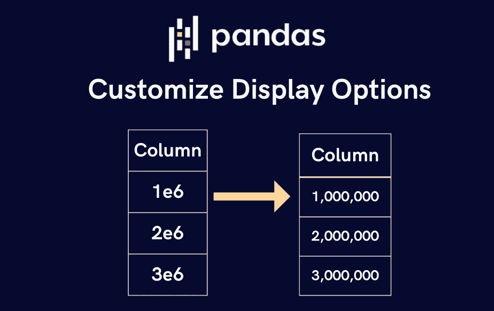

作者图片

使用 Pandas 分析数据时，您可能会遇到以下与显示相关的问题:

1.  **如果文本过长，则无法看到全文。在下图中，URL 被缩短了。**

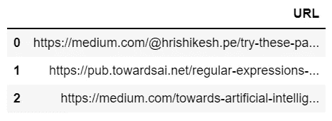

冗长的文本在熊猫中被截断(图片由作者提供)

2.默认情况下，熊猫使用科学记数法显示**大浮点数，例如 1，000，000.5 显示为 1.000e+06**

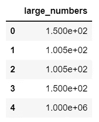

使用科学符号显示大型彩车(图片由作者提供)

**3。浮点型列中的小数位数精度**不一致。例如，在下图中，col_1 在小数点后有一位，而 col_2 在小数点后有三位。虽然这不会影响您的分析，但在与他人共享您的笔记本时，它可能看起来不太好。

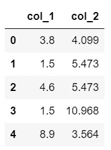

各列的精度不一致(图片由作者提供)

在这个故事中，我将讲述如何使用以下常见的熊猫显示定制来解决这些问题。

**目录清单**

1.  自定义要显示的行数
2.  自定义要显示的列数
3.  自定义列宽
4.  使浮点列中的小数位数精度保持一致
5.  禁用科学符号
6.  奖金！

**注意:** *这些选项仅改变数据的显示方式。它不影响基础数据。*

1.  **自定义显示多少行**

打印大数据框时，默认情况下，pandas 会显示前 5 行和后 5 行，如下图所示。

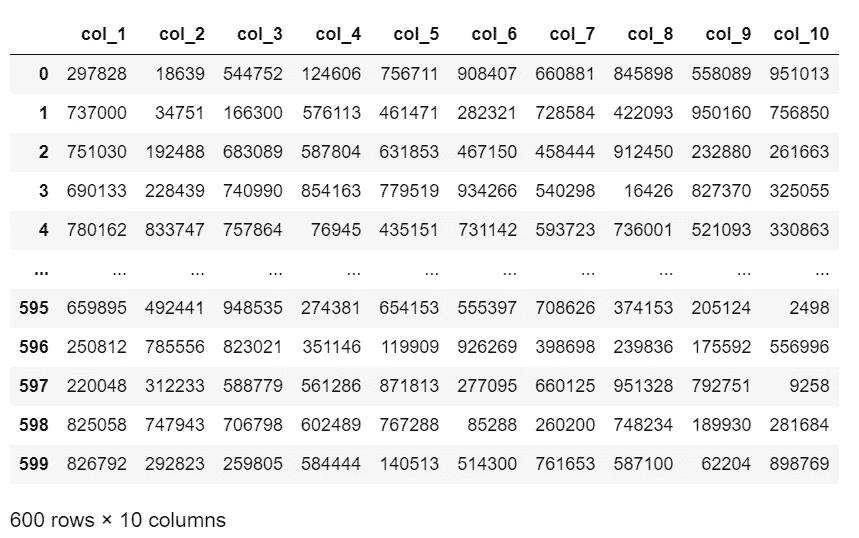

熊猫默认显示 10 行(图片由作者提供)

然而，我们可以通过设置显示选项`display.max_rows`的值来改变要显示多少行。让我们把它设置为 4。

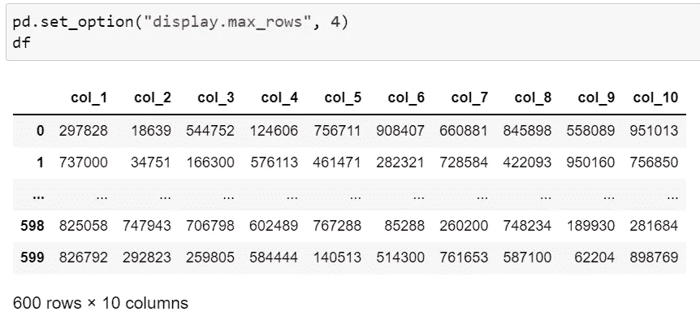

将“display.max_rows”设置为 4 后显示 4 行(图片由作者提供)

您也可以使用`pd.reset_option("display.max_rows")`重置选项，返回默认行为。

**2。自定义显示多少列**

您可以通过设置`display.max_columns`自定义打印数据框时显示的列数。

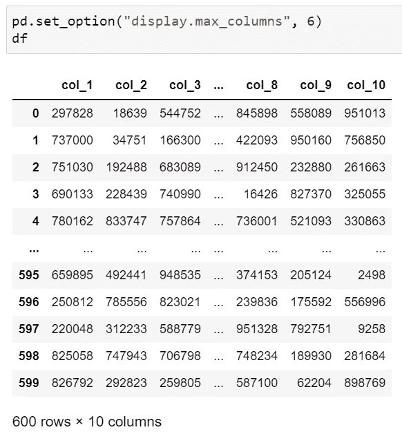

通过将“display.max_columns”设置为 6 来显示 6 列(图片由作者提供)

像前面一样，您也可以使用`pd.reset_option("display.max_columns")`重置该选项，返回到默认行为。

**3。自定义列宽**

在下图中，我们无法看到前两行的完整文本，因为它们的字符长度超过了 50。

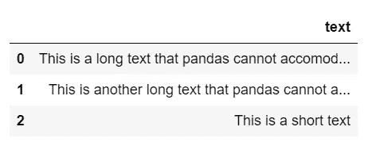

熊猫中冗长的文字被缩短(图片由作者提供)

然而，将`display.max_colwidth`设置为 70 后，我们可以看到整个文本。您可以根据您的数据选择不同的数字。

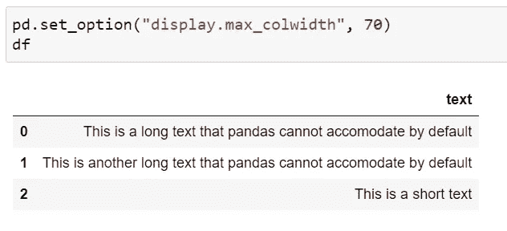

通过将“display.max_colwidth”设置为 70 来显示全文

也可以使用`pd.reset_option("display.max_colwidth")`重置该选项。

**4。使浮动列中的小数位精度一致**

目前，col_1 和 col_2 的小数位精度不一致，如下所示。

浮动列中不一致的小数精度(图片由作者提供)

通过将`display.float_format`设置为`"{:.2f}".format`，我们可以使格式一致。如下图所示，该选项只会影响浮点列，不会影响整数列。

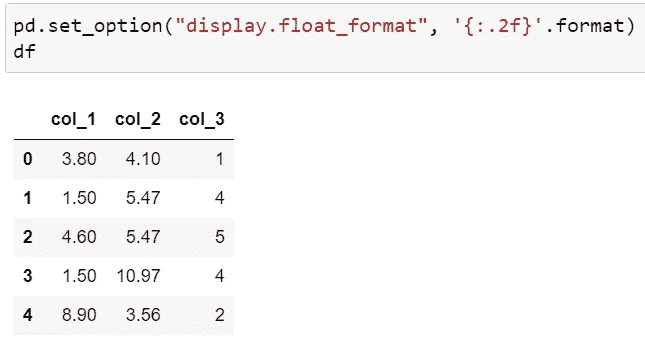

通过将“display.float_format”设置为“{:.2f}”，使浮点列中的小数位精度保持一致。格式(图片由作者提供)

使用`pd.reset_option("display.float_format")`可以重置该选项

**5。禁用科学符号**

默认情况下，熊猫在科学记数法中显示较大的浮点值。

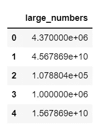

大浮点数以科学记数法显示(图片由作者提供)

通过将`display.float_format`设置为`"{:,.2f}".format`，我们可以添加一个千位分隔符，并将小数位数精度设置为两位小数。

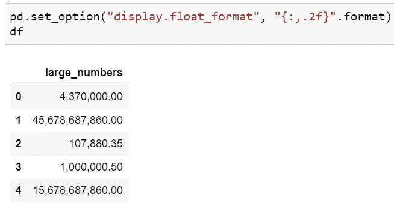

通过将“display.float_format”设置为“{:，. 2f}”，添加千位分隔符。格式(图片由作者提供)

您也可以通过将`display.float_format`设置为`"$ {:,.2f}".format`在数字前添加一个`$`符号来表示货币。

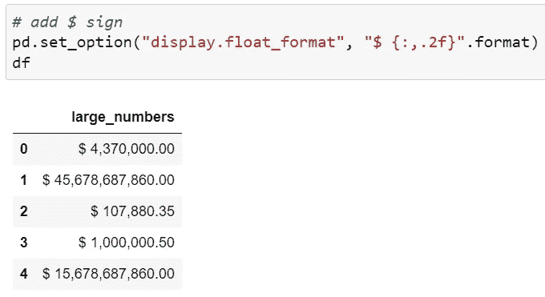

通过将“display.float_format”设置为“$ {:，. 2f}”，在数字前添加$。格式(图片由作者提供)

**6。奖金**

脱机工作时，如何找到所有这些有用的显示选项？诀窍是使用`pd.describe_option()`，你将得到所有可用选项的列表。

但是，如果您正在寻找一个特定的选项，您可以在`pd.describe_option()`中输入选项名称作为参数。例如，`pd.describe_option("max_rows")`将打印`display.max_rows`选项的描述。

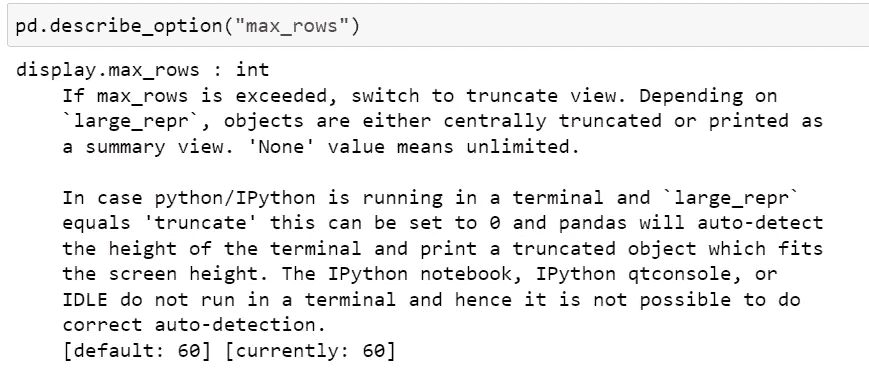

使用' pd.describe_option("max_rows ")'获取" display.max_rows "选项的描述(图片由作者提供)

**参考** [熊猫选项和设置](https://pandas.pydata.org/docs/user_guide/options.html)

**走之前！**

我希望你喜欢这个故事，并发现它很有用。如果你想听更多这样的故事，请在 [Medium](https://medium.com/@hrishikesh.pe) 上关注我，并且请[给我买杯咖啡](https://www.buymeacoffee.com/hrishikeshds)😊。

*我的其他故事你可能会喜欢…*

 [## 如何在 Pandas 中使用条件格式改进您的分析报告

### Pandas 中使用 Styler API 的类似 Excel 的条件格式

medium.com](https://medium.com/@hrishikesh.pe/improve-your-analytical-report-with-conditional-formatting-in-pandas-76039fd3ccb5)  [## Python 中的正则表达式:基础知识

### 正则表达式允许你从文本中提取重要信息。看看这个中型故事，学习正则表达式的基础知识…

pub.towardsai.net](/regular-expression-regex-in-python-the-basics-b8f2cd041bdb)