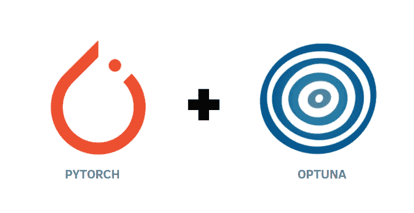
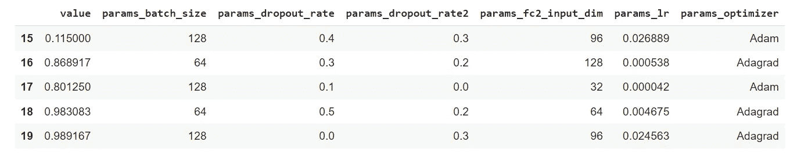
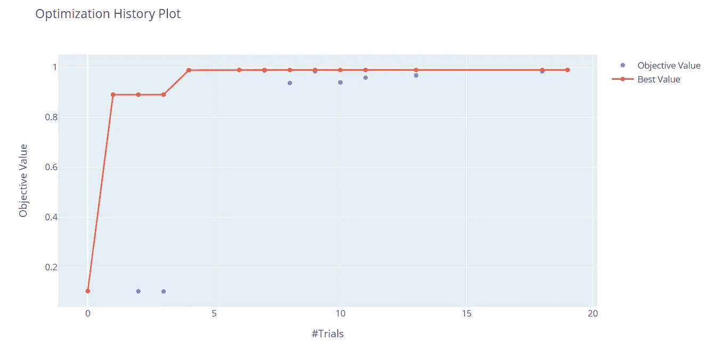
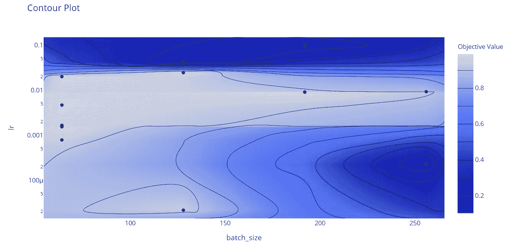
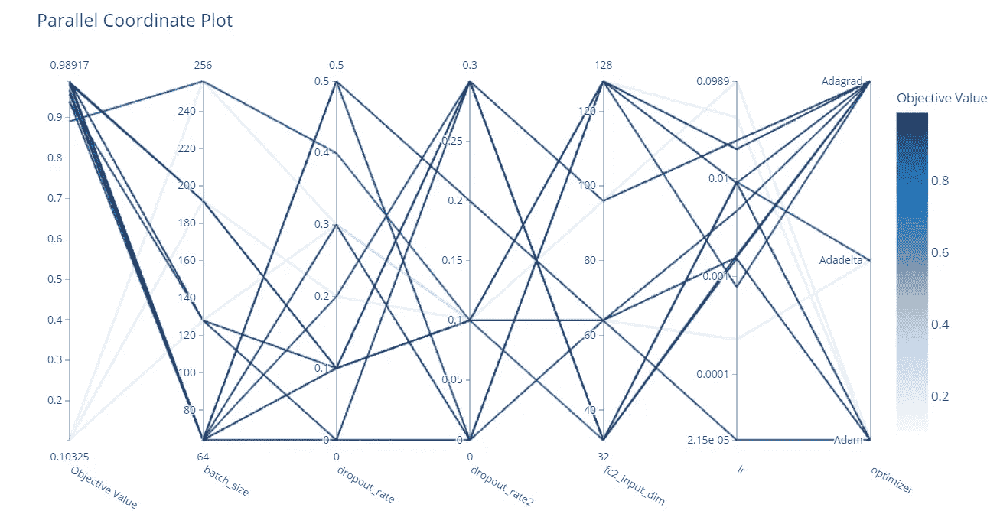
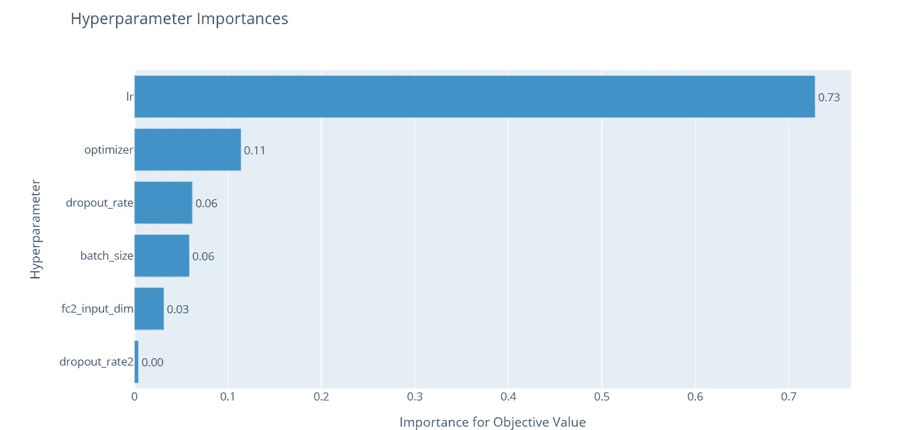

# 使用 Optuna 调整 Pytorch 超参数

> 原文：<https://pub.towardsai.net/tuning-pytorch-hyperparameters-with-optuna-470edcfd4dc?source=collection_archive---------0----------------------->

## [机器学习](https://towardsai.net/p/category/machine-learning)

作者插图

*这篇文章是 Pytorch 构建深度学习模型系列指南的第五篇。下面，是全系列:*

1.  [*Pytorch 初学者教程*](/pytorch-tutorial-for-beginners-8331afc552c4)
2.  [*操纵 Pytorch 数据集*](https://medium.com/mlearning-ai/manipulating-pytorch-datasets-c58487ab113f?sk=5d4cf7bd62d527d7c968b8db696b633f)
3.  [*理解 DL 模型中的张量维度*](/understanding-tensor-dimensions-in-deep-learning-models-with-pytorch-4ee828693826)
4.  [*CNN &功能可视化*](https://medium.com/dataseries/visualizing-the-feature-maps-and-filters-by-convolutional-neural-networks-e1462340518e)
5.  *用 Optuna 调整超参数(本帖)*
6.  [*K 折交叉验证*](https://medium.com/dataseries/k-fold-cross-validation-with-pytorch-and-sklearn-d094aa00105f)
7.  [*卷积自动编码器*](https://medium.com/dataseries/convolutional-autoencoder-in-pytorch-on-mnist-dataset-d65145c132ac)
8.  [*去噪自动编码器*](https://ai.plainenglish.io/denoising-autoencoder-in-pytorch-on-mnist-dataset-a76b8824e57e)
9.  [*变分自动编码器*](https://medium.com/dataseries/variational-autoencoder-with-pytorch-2d359cbf027b)

*本系列的目标是通过实现示例尽可能使 Pytorch 更直观、更容易理解。互联网上有许多教程可以使用 Pytorch 构建多种类型的具有挑战性的模型，但同时也会令人困惑，因为当您从一个教程转到另一个教程时，总会有轻微的差异。在这个系列中，我想从最简单的主题开始，到更高级的主题。*

# 奥普图纳

[Optuna](https://optuna.org/) 是一个自动化超参数搜索的超参数优化框架，可应用于机器学习和深度学习模型。由于它使用采样和修剪算法来优化超参数，所以它非常快速和高效。此外，它允许以直观的方式动态构建超参数搜索空间。在这篇文章中，我将结合 Pytorch 和 Optuna 来寻找 MNIST 数据集上表现最好的 CNN 模型。我将一步一步地展示要优化的函数和超参数，它们都是应用 Optuna 所需要的。

# 带 Optuna 的 MNIST 分类器

我们首先需要安装库 Optuna 来使它工作:

之后，让我们导入库和数据集:

下一步是一起定义卷积神经网络的超参数来调整。

在 Optuna 中，目标是最小化/最大化目标函数，该函数将一组超参数作为输入，并返回一个验证分数。对于每个超参数，我们考虑不同范围的值。

优化的过程被称为研究，而目标函数的每次评估被称为试验。在模型架构中调用“建议 API ”,为每个试验动态生成超参数。

有许多函数来定义超参数的范围:

*   `suggest_int`为第二个全连接层的输入单元建议整数值
*   `suggest_float`建议丢弃率的浮点值，作为第二个卷积层(步长为 0.1 时为 0–0.5)和第一个线性层(步长为 0.1 时为 0–0.3)后的超参数引入。
*   `suggest_categorical`为优化器建议分类值，这将在后面显示

如果你想检查其他功能，你应该看文档[这里](https://optuna.readthedocs.io/en/v1.4.0/reference/trial.html)。

我还定义了一个函数来尝试训练集中 batch_size 的不同值。它将训练数据集和批量大小(稍后将在目标函数中定义)作为输入，并返回训练和验证加载器对象。

# 最佳化

最重要的步骤是定义目标函数，它使用抽样程序来选择每个试验中超参数的值，并返回该试验中获得的验证准确度。

之后，我们可以最终创建一个`study`对象来最大化目标函数。我们用`study.optimize(objective,n_trials = 20)`进行研究，我们将试验次数固定为 20 次。你可以根据问题的复杂程度来改变它。

为了更容易地可视化最近 5 次试验中选择的超参数，我们可以构建一个 DataFrame 对象:

很明显，表现最好的模型在第 20 次试验中获得了 98.9%的验证准确率。此外，您可以看到在该试验中选择的超参数值。

# 使用 Optuna 进行可视化

有许多有趣的可视化方法有助于观察优化的不同方面。我们可以看到随着试验次数的增加，客观值是如何增加的。

在 x 轴上，我们有试验，而在 y 轴上有客观值，它对应于验证的准确性。仅用 20 次试验，我们就可以看到我们达到了 90%以上的好成绩。

我们还可以展示不同超参数之间的关系。在这种情况下，我们只关注批量大小和学习率:

等高线图是 3D 图，其中第三维由目标值构成。从中间的聚类(它以浅蓝色着色，表示有非常高的验证准确性),我们可以观察到这些结果是在中等学习率(介于 0.001 和 0.01 之间)和低/中等批量的情况下获得的。

通过平行坐标图，我们可以观察到所有的优化历史，这些优化历史被认为是:

另一个有用的表示由超参数重要性构成。因此，我们有兴趣了解哪些超参数对模型性能的影响最大。

从图中可以看出，学习率对目标值的影响最大，而其余的超参数对学习率的影响很小。辍学率对性能有很小的影响，但仍然需要降低过度拟合的风险。

# 最终想法:

我希望这篇文章能帮助你对 Optuna 有一个大致的了解。我发现相对于其他方法，如光线调节，它非常直观和快速。这里的 GitHub 代码是。感谢阅读。祝您愉快！

你喜欢我的文章吗？ [*成为会员*](https://eugenia-anello.medium.com/membership) *每天无限获取数据科学新帖！这是一种间接的支持我的方式，不会给你带来任何额外的费用。如果您已经是会员，* [*订阅*](https://eugenia-anello.medium.com/subscribe) *每当我发布新的数据科学和 python 指南时，您都会收到电子邮件！*