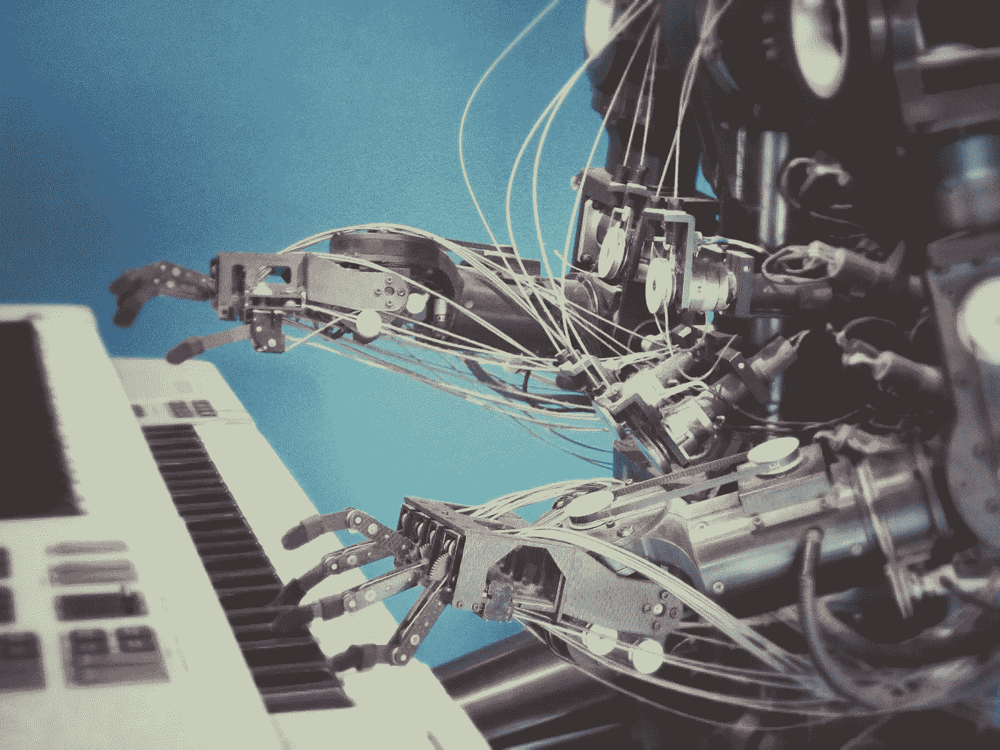
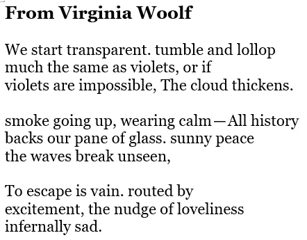

# 图灵、维诺格拉德或何去何从

> 原文：<https://pub.towardsai.net/turing-winograd-or-whither-af9c5a99f7dc?source=collection_archive---------0----------------------->

[附身摄影](https://unsplash.com/@possessedphotography?utm_source=unsplash&utm_medium=referral&utm_content=creditCopyText)在 [Unsplash](https://unsplash.com/s/photos/artificial-intelligence?utm_source=unsplash&utm_medium=referral&utm_content=creditCopyText) 上拍照

## [人工智能](https://towardsai.net/p/category/artificial-intelligence)、[机器智能](https://towardsai.net/p/category/machine-intelligence)、[意见](https://towardsai.net/p/category/opinion)

## 当我们问机器能否思考时，我们在质疑什么？

文学理论中一个有趣的概念是，如果一个读者想要理解一个文本，那么他会找到一个与他自己的世界观相一致的文本解释，或者更准确地说，是与他认为该文本涉及的世界观相一致的解释。通常，为了实现这样的愿望，读者需要通过阅读字里行间来填补自己知识的空白，以及作者逻辑或修辞的空白。**这样，所有的文本本质上都是由作者发起并由读者延续的对话，读者可能错误地形成了作者的意图。**

得知这个概念后，我迷恋上了用书籍和杂志上的文字片段来写无意义的诗歌。ᵃ我对读者试图从我精心挑选的单词和短语中解读含义，并通过这样做在结果行中找到自己的含义的想法感到兴奋；也许这种兴奋是一种虐待狂——我不知道——但在我剪切粘贴的创作过程中，每首诗对我来说都开始有了个人意义，所以也许不是。

关于我的缺点已经说得够多了。现在让我们探索这个概念对人工智能领域的重要性，特别关注文本生成任务。

# 机器会思考吗？

> 计算机能否思考的问题并不比潜水艇能否游泳的问题更有趣。
> 
> ——e·w·迪杰斯特拉

虽然任何引发了关于计算机是否能够思考的讨论的问题都可以根据其激发兴趣的能力而被归类为有趣的问题，但我承认，任何主要取决于语义解释的问题都可以被归类为无趣的问题，不管它已经被讨论到什么程度，因为任何旨在解决这样一个问题的讨论都不可能产生令人满意的、不可辩驳的是或否的答案，并且没有成效的讨论可能本质上是无趣的。ᵇ

不管怎样，要问一台机器是否能思考，首先必须定义一台*机器*，以及动词*思考*，如果没有特定的机器，没有关于该机器处理信息能力的明确共识，也没有对“T4”思考的确切定义，这可能很难。

我不会讨论语义不确定性的所有潜在来源，而是只关注其中一个:**当一个人声称在思考时，他指的是什么？**

由于说英语的人通常使用这个词，to *think* 可以被认为是 to *believe* 或 to*be the opinion*的同义词；或者随着动作的进行去*得出结论*，去*思考*或者去*沉思*，去*沉思*或者去*沉思*，去*反思*或者去*深思*，去*抽象*或者去*形成意见*，去*连接*或者去*迷失；*等等。**不幸的是，这些典型的应用并不比原始动词*去思考、*** 更能表明思考背后的动作，因此它们不能用来确定机器是否能思考。

# 人类能思考吗？

从生物学的角度来看，我听说在思考过程中，当神经元放电时，大脑中会发生一些电化学反应——也许是以二进制的方式，也许是以更细微的方式，但仍然会放电——尽管机器在设计上肯定是无脑的，但我也听说它们以类似于生物大脑的方式处理信息。然而，从语义的角度来看，这种相似性似乎来自类比，而不是同一性，因为机器所做的根本不像生物大脑所做的那样感觉。

如果*思考*是为了保留其标准的人类中心主义内涵，那么很明显，计算机不能思考，因为只有人类(或许，如果你觉得慷慨，其他哺乳动物也可以)可以思考。然而，如果将*思考*简化为意味着*基于输入*产生输出(开始和结束定义了过程，并且黑盒中发生的动作机制)，那么计算机显然可以思考——尽管这种情况更通常被称为*计算，*只是*觉得*更适合。

我们对思想的狂妄自大也许可以从每个人最喜欢的唯我论格言得到最好的支持:我思故我在。换句话说，我对自己存在的确定性——这是我唯一能确定的事情——取决于我的思考能力。当被放在这样的基座上时，因为我自信地把我所做的描述为思考，我对思考是什么有第一手的知识，并且我假设像我一样的其他人，即其他人类，也可以思考(尽管我没有证据)，不管在我的头骨的黑箱中形成思想、得出结论、沉思等等在物理上意味着什么，并且这个事业，可以说，有一个思考，并不等同于计算，因为我不计算:我思考(至少我认为我是这样做的)。

**显然，从语义的角度来看，即使是一个无趣的问题也会变得有趣，但这也是一条相当低效的推理路线。**

# 《模仿游戏》

> 原问题，“机器能思考吗？”我认为这毫无意义，不值得讨论。
> 
> ——a·m·图灵

虽然他像 Dijkstra 一样声称，机器是否能够思考的问题不值得讨论，但在 1950 年的《T4》*Mind:A Quarterly Review of Psychology and Philosophy**，*中，Alan Turing 写了超过 10，000 字的文章来探讨这个主题，驳斥了对机器能够思考的可能性的说法，并设计了一种测试，可以作为直接询问这个可鄙问题的替代方法。

在这篇文章中，图灵设计了他著名的模仿游戏，也就是今天通常所说的图灵测试。在游戏过程中，询问者必须通过问一系列问题来试图确定一对参赛者，即人类和计算机中的哪一个是人类。这些问题的范围不受限制，因此询问者可以直接询问参赛者是否是人类或其他问题(例如，你最喜欢的食物是什么？)这将要求计算机参赛者采取人类角色(即，谎言或适当的计算机等价物)来避免暴露自己。

每个参赛者以他/她/它认为合适的方式回答问题(无论是通过思想、计算、渗透还是你拥有的任何其他方式)，最后，如果机器被询问者错误地识别为人类参赛者，那么它就被认为通过了图灵测试。换句话说，作为游戏的结果，**我们获得了一个人的意见，即机器是否能给出比一个真实的人类成员更有说服力的问题答案**。ᶜ

# 机器学习向何处去？

> 然而，我们应该考虑到，在欺骗中，精心策划的巧妙的欺骗比科学更容易成功，也更快。
> 
> J. R .皮尔斯

虽然转向测试可能仍然是最著名的机器智能测试，但它有一个重大缺陷:**因为模仿游戏依赖于一个询问者的主观判断和一个人类参赛者的表现，而不是客观和独立的标准，它更倾向于机器的欺骗能力，而不是推理能力。**因此，虽然在 1950 年左右，该测试能够作为一项思维实验提供思考的食粮，但就其评估机器推理能力的能力而言，该测试在实践中非常有限。

图灵本人很清楚上述问题；然而，在某种程度上，他似乎认为这与其说是一个缺陷，不如说是一个特性:

> 据称，审讯者只需向他们提出一些算术问题，就能区分机器和人。这台机器会因为其致命的准确性而被揭露。对此的回答很简单。这台机器…会故意引入错误，故意迷惑询问者。

虽然计算机成功模仿人类的能力可能对某些人来说是有趣的，或者对某些任务来说是可取的，但我不认为通过确定计算机是否能很好地模仿人类就能令人满意地解决计算机是否能思考的原始问题，因为我认为，计算机思考的问题更关心逻辑的应用和人类表现出的灵活学习的倾向，而不是在此基础上实现的类似人类的结果。

**换句话说，如果一台计算机能够应用非人类的但灵活学习的逻辑来产生非人类的但内在一致的结果，那么它可能更像一个有思想的实体，而不是一台简单地超越人类的计算机。** ᵈ ᵉ

# 伊莱扎效应

> 欺骗之所以有效，至少部分是因为我们对我们所能接受的合法对话极其宽容。
> 
> ——h·j·莱维斯克

伊莱扎效应很好地说明了模仿游戏的上述缺点的重要性，它不仅仅是一种哲学练习。伊莱扎效应以臭名昭著的伊莱扎聊天机器人命名，它可以令人信服地模仿罗杰精神分析学家，伊莱扎效应描述了一个人对计算机程序产生的反应读得太深的倾向。在伊莱扎效应下，一个与机器互动的人可能会认为他收到的回应是由一个*思维*实体的所有意图产生的。

即使一个人意识到他正在与一台机器互动，伊莱扎效应也会发生，但如果这个人认为他正在与另一个人互动，这种效应甚至会更加阴险。⁴ **这是否意味着机器是虐待狂？可能吧，但是这个问题完全没意思，**所以我会在后续文章中详细讨论这个问题。

继续前进。

# 如果不是，那是什么？

> 图灵试图避免的是假设我们能够产生智能行为的哲学讨论；但是我们如何到达那里是完全开放的，包括各种各样的内部活动，而外部方面一切都很平静。
> 
> ——h·j·莱维斯克

当计算机第一次被介绍时，思维机器的想法可能对一些人来说很牵强，对另一些人来说很可怕，对那些有足够的先见之明和勇气既不怀疑也不害怕的人来说很有趣。因此，为了将对话从怀疑论者和懦夫的怀疑和担忧中引开，图灵反驳了思考机器收到的主要批评，并设计了模仿游戏，以促进他认为更有价值的关于可以用来评估机器能力的方法的讨论。

然而，今天人们已经很好地理解了，对于一台真正智能的机器来说，它必须做的不仅仅是对输入做出看似类似人类的反应。因此，作为更好地鉴定机器智能的方法，提出了 Winograd 模式(WS)挑战。

在 WS 挑战赛中，可以提出如下问题:“Mark 无法从 Paul 后面看到舞台，因为他太矮了。谁太矮了，马克还是保罗？”对于这种代词解决的问题，需要对语言的非平凡理解，因为没有空间推理就不可能先验地知道谁*太矮了。因此，尽管这个问题对于任何一个以英语为母语的成年人来说都很容易回答，但对于计算机来说却很难回答。*

和图灵的模仿游戏一样，WS 挑战赛要求机器对语言有*的理解*；然而，与游戏不同的是，该挑战基于是非阅读理解问题，而不是对话方法。**因此，WS challenge 在两个主要方面是对图灵模仿游戏的改进:(1)它不太可能被欺骗性的机器所吸引，以及(2)它可以在没有专家评委的情况下被客观地评分。**

能通过 Winograd 模式挑战的计算机会思考吗？谁知道呢？—也许所有的物质都是有意识的，也许生命是一场模拟。

# 最后的想法

当我们质疑机器的思维、学习和智能时，我们倾向于将计算机与人类相提并论，因为我们与思维有着不可思议的密切关系，所以也许思维等术语不适合用来描述机器做什么，因为要问机器是否能思考等问题，机器必须被拟人化到通常不恰当和不舒服的程度。

因此，也许我们不应该用我们以人类为中心的词汇来询问机器，而是应该问它们是否足够准确来完成我们作为一个物种不再想被打扰的任务。计算机能否思考*的问题*没什么意思，因为用来描述决策机制的语义以及该机制与人脑的相似性并不重要，只要计算机能够合乎道德地、准确地完成它被编程的任务。ᶠ

然而，我认为，如果计算机学习的过程没有很大的进步，要求机器以比鹦鹉学舌更复杂、比欺骗更诚实的方式模仿人类对于某些任务来说是不可能的，例如友好的交流任务，这种任务需要防御机制和困扰普通人类动物的误用之间的可爱平衡，并且对于其他任务来说是完全不相关的，例如数字计算， 因为计算机完成这类任务的能力已经远远超过了任何人，而让它的能力变得迟钝以匹配我们的能力是非常愚蠢的。

因此，也许计算机只是简单地计算，只有人类会思考，或者也许大脑只是一台笨拙而灵活的电脑；也许，也许，但是~ 2600 字过去了，题目还是没什么意思。

# 笔记

a.作者策划的诗歌废话

b.一个问题是否有趣的问题也是一个语义学的问题，因此它本身也很可能是无趣的，当然，这取决于一个人对*有趣*的定义；这种逻辑无限地继续*下去*而不会变得更有趣或更无趣。

c.我不知道通过图灵测试的计算机会对人类参赛者说些什么，但我认为它一定会说些什么，即这种说法不可避免地取决于计算机的复杂程度，而且不管非人类参赛者的复杂程度如何，这种说法都不太好。

d.同样的逻辑也可以适用于人类:一个能记住数学中一个问题的解决方法的人不一定理解如何解决这个问题，就像一个行为正直的公民不一定思想纯洁一样；然而，在某些情况下，结果(即及格分数或优秀公民)才是人们所关心的。

e.沿着这些思路，从理性主义的角度来看，也许使用人类制造的例子来产生人工智能的整个努力从根本上来说是有缺陷的，因为这样的例子只能用于制造人类模仿品，而不是有思想的机器。

f.如果我们在讨论机器意识，那么我可能不得不修改这些陈述，但这是一个完全不同的哲学层面，远远超出了本文的范围。

# 文献学

1.图灵，A. M .，I. — [计算机器和智能](https://doi.org/10.1093/mind/LIX.236.433)，《心智》，LIX 卷，第 236 期，1950 年 10 月，第 433 — 460 页。

2.皮尔斯，J. 1969。[语音识别何去何从？](https://pdfs.semanticscholar.org/0155/01c4d26a92993332ada795e27b126ae3028a.pdf) JASA 46 (4B): 1049 — 1051。

3.2011 年 H. J。[威诺格拉图式挑战赛](https://citeseerx.ist.psu.edu/viewdoc/download?doi=10.1.1.729.9814&rep=rep1&type=pdf)。AAAI 春季研讨会:常识推理的逻辑形式化。

4.以及其他人[伊莉莎效应](https://en.wikipedia.org/wiki/ELIZA_effect#cite_note-Hofstadter1996-1)。维基百科。