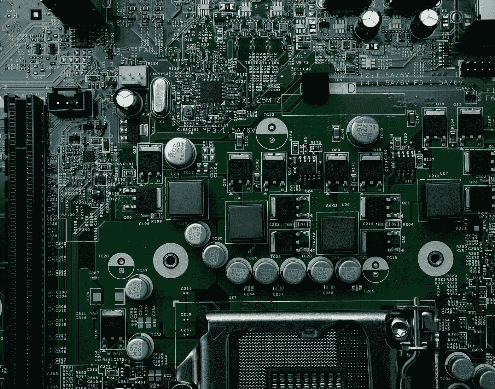
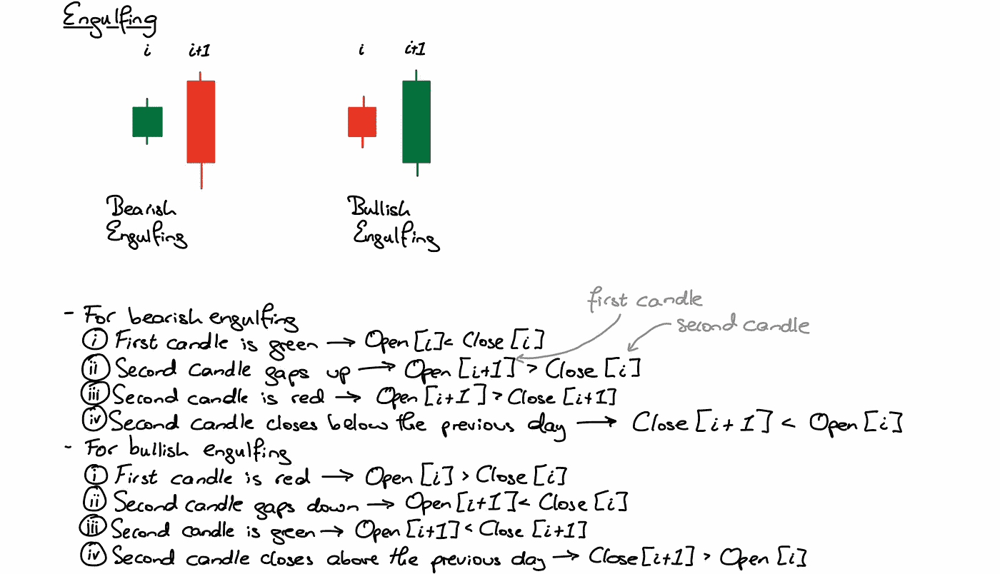
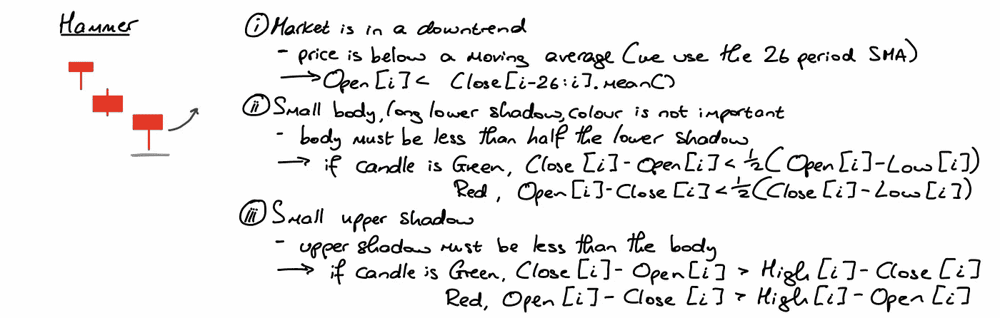
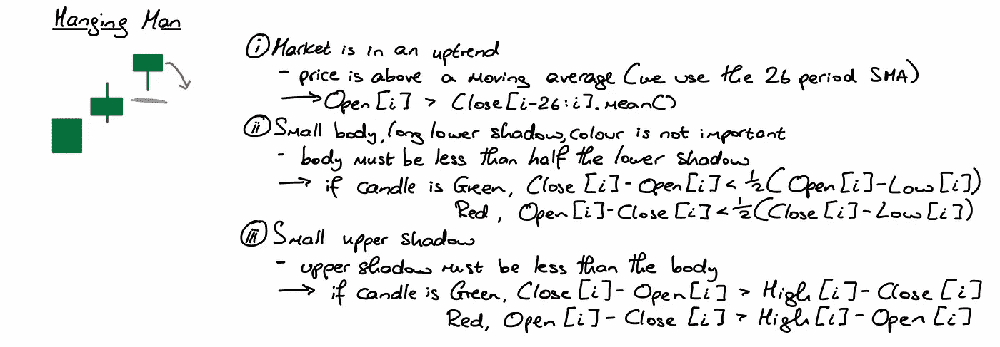
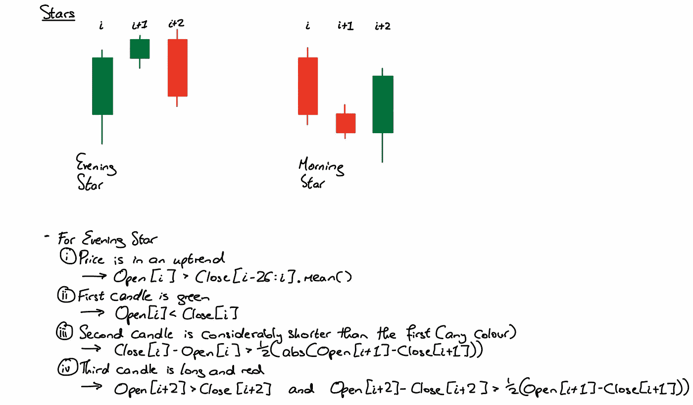

# 在算法交易的客观规则中转动烛台反向模式

> 原文：<https://pub.towardsai.net/turning-candlestick-reversal-patterns-in-objective-rules-for-algo-trading-49a4988b5ad7?source=collection_archive---------2----------------------->

## [意见](https://towardsai.net/p/category/opinion)

由[迈克尔·泽兹奇](https://unsplash.com/@lazycreekimages?utm_source=unsplash&utm_medium=referral&utm_content=creditCopyText)在 [Unsplash](https://unsplash.com/?utm_source=unsplash&utm_medium=referral&utm_content=creditCopyText) 上拍摄的照片

某些烛台模式已被发现是一系列市场趋势逆转的潜在指标。然而，我们有时会遇到一个问题，因为我们有大量的选择，比如货币、股票、商品等等。我们可能会错过抓住这些反转的机会，本质上是把钱留在桌子上，而我们本可以在趋势的顶点抓住它。这篇文章代表了将这些模式系统化的第一步，这样我们就可以在数百个市场推广它们，而不必亲自盯着每一张图表。我对这篇文章的目标定义如下->采取共同的烛台逆转模式，并把他们变成系统的规则和/或伪代码，以便他们可以纳入算法。

## 指向注释

我的编码背景以 Python 为中心，所以我使用的一些词汇与您在典型的 Python 程序中可能找到的词汇相似。我试图让代码尽可能接近伪代码，但是在您阅读本文之前，我想澄清几点。

*   任何 2 或 3 个烛台模式上面的字母和数字代表我们将在阵列中找到的特定蜡烛的索引。例如，两个烛台模式中的第一根蜡烛可以在索引 I 处找到，第二根蜡烛可以在索引 i+1 处找到。
*   我假设我们有 4 个数组可以使用，它们由它们所代表的数据命名(变量 Open 将包含我们所讨论的资产的所有历史开盘价)。
*   为了访问收盘价变量的第 I 个元素，我们使用符号 Close[i]。
*   Close[i-26:i]意味着取数据集之前的所有 26 个值。这将用于计算任何简单的移动平均线，表示为 SMA。
*   函数 abs()将返回在中计算的和的绝对值(正)。如果我们不知道蜡烛是红的还是绿的，这是很有用的，这不会影响反转形态的存在。

## 吞没

熊市和牛市吞没是 2 个烛台模式。它们最初包括一根红色或绿色的小蜡烛，接着是一根颜色相反的大得多的蜡烛。从基本面的角度来看，我们通常倾向于将这些时刻视为少数剩余多头或空头的最终阻力。反对的投资者接手，推动价格与之前的方向相反。第二根蜡烛线的大小很重要，因为它的目的是完全“吞没”第一根蜡烛线，发出强烈的反转趋势的信号。

作者图片

## 锤子

下跌趋势之后往往会出现震荡。这是一个看涨信号，因为它象征着熊市失去了动力。长长的下影线表明在这个时间段的早些时候空头的强力推动，但最终低点和收盘之间的距离告诉我们，在接近尾声时，势头转回多头，他们以优势收盘。一个小的上影线也告诉我们，没有太大的空头压力使价格回落。我们预计蜡烛过后价格会上涨。

作者图片

## 绞刑者

悬挂的人看起来和锤子完全一样，但发生在上升趋势中。正如我们在前面的例子中所做的，我们使用相对于移动平均线的位置来确定资产的趋势。这是应该评估的第一个条件，如果不满足，我们就不会在那个特定的时间点寻找这根蜡烛。尺寸是这里必须考虑的另一个重要特征。规模自然会根据你所关注的资产类别而有所不同。我试着尽可能远离具体的数字，因为这不会转化为每种情况，这是我们努力实现的目标。例如，在研究特斯拉股票时，最大长度为 15 的主体可能是可以接受的，但如果我们研究英镑/美元汇率，就可能是这样。我发现的最佳解决方案是使用相对计算。我把下阴影和身体对比，上阴影和下阴影对比，确保蜡烛的整体形状保持不变。

作者图片

## 明星

星星是 3 个蜡烛图案，由两种类型组成，晚星和晨星。昏星是我们的熊市指标，从一根大绿蜡烛开始。接下来是一根更小的蜡烛，可以是红色或绿色，我定义它的长度小于原来蜡烛的一半。较小的蜡烛之后是一个大的红色蜡烛，它必须至少和原来的蜡烛一样大。晨星是我们的看涨版本，本质上看起来和晚星完全一样，但是颜色颠倒了。

作者图片

还有许多烛台反向模式，我们可以把它们变成一套具体的规则。在以后的文章中，我会将更复杂的模式系统化，比如头和肩、杯和柄以及双层底。我还将在我们过程的下一步添加一些文字，在这一步中，我们将伪代码转换为实际的 Python 代码，所以请密切注意！

感谢您花时间阅读这篇文章。如果你喜欢这些内容，我将推出一份新的算法金融时事通讯，名为 Algo Fin，你可能会感兴趣。这篇时事通讯将探索数据科学和金融之间的联系，最初的重点是货币市场，但我希望在未来建立更多的途径。时事通讯目前是免费加入的，因为我仍计划为付费订户推出，所以如果这听起来像是你可能感兴趣的东西，它绝对值得查看[这里](https://algofin.substack.com/p/coming-soon)！。