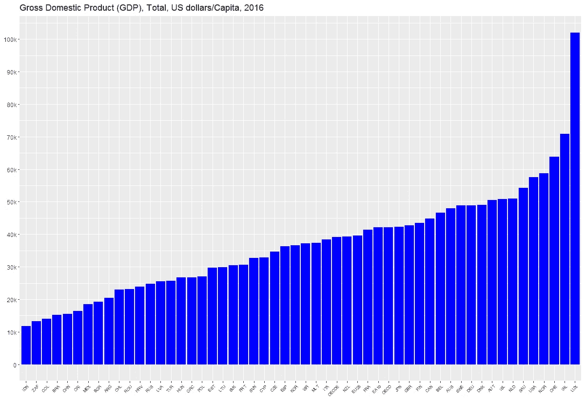
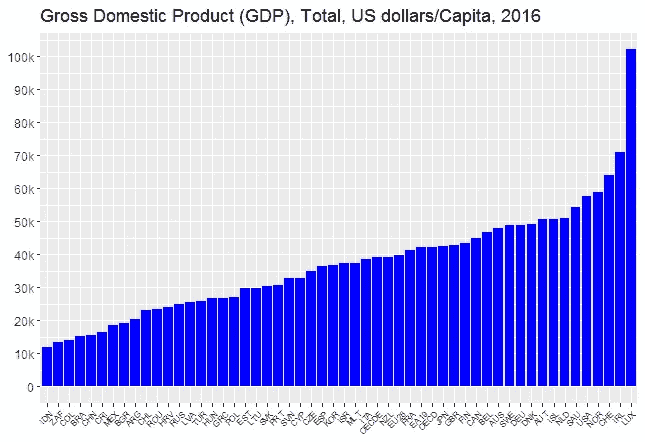

# 使用 R 的 ggplot 包的柱状图教程

> 原文：<https://pub.towardsai.net/tutorial-on-barplots-using-rs-ggplot-package-b7f86104a974?source=collection_archive---------1----------------------->

## 使用 R ggplot | [朝向 AI](https://towardsai.net/) 的条形图

## 对三个不同数据集的柱状图使用 R 的“ggplot”包



本教程将通过 3 个例子讨论如何使用 R 的 ggplot 软件包生成柱状图。另一个使用 python 的 matplotlib 包进行数据可视化的教程可以在这里找到: [**数据可视化教程:天气数据。**](https://medium.com/towards-artificial-intelligence/tutorial-on-data-visualization-weather-data-52efa1bef183)

# 1.2016 年电动汽车市场份额

该代码使用 global_EV_2016.csv 数据集绘制了选定国家电动汽车(EV)的全球市场份额:从该报告中获得的全球 EV 数据:[https://www . IEA . org/publications/free publications/publication/globalevoutlook 2017 . pdf](https://www.iea.org/publications/freepublications/publication/GlobalEVOutlook2017.pdf)。

这个例子的代码可以从这个资源库下载:[https://github . com/bot 13956/2016 _ market _ share _ electric _ cars _ using _ R](https://github.com/bot13956/2016_market_share_electric_cars_using_R)。

**导入必要的库**

```
library(readr)
library(tidyverse)
```

**数据导入和准备**

```
data<-read_csv("global_EV_2016.csv",col_names = FALSE)
head(data)
data<-data[-c(1,2),]
names(data)<-c("country","sales_bev","stock_bev","sales_phev","stock_phev","shares")
head(data)
```

**为数据可视化生成柱状图**

```
data%>%drop_na(shares)%>%mutate(shares=parse_number(shares))%>%
       filter(shares>=0.91)%>%
       ggplot(aes(reorder(country, shares),shares))+
       geom_col(fill="blue")+
       coord_flip()+ theme(axis.title.x=element_blank())+
       theme(axis.title.y=element_blank())+
       ggtitle("Market share of electric vehicles in selected countries (%)")
```


# 2.个人营销电子邮件柱状图

该代码使用 marketing_emails.csv 数据集生成了 5 个月期间来自百思买电子(BBY)、沃尔格林制药(WGN)和沃尔玛零售(WMT)的个人营销电子邮件柱状图。

这个例子的代码可以从这个库下载:[https://github.com/bot13956/barplot_marketing_emails](https://github.com/bot13956/barplot_marketing_emails)。

**导入必要的库**

```
library(readr)
library(tidyverse)
```

**数据导入和准备**

```
df<-read.csv("marketing_emails.csv")
df<-df%>%mutate(digit = seq(5,1,-1))
df%>%head()
df2<-data.frame(digit=c(df$digit,df$digit,df$digit),type=sort(as.vector(replicate(5,c("BBY","WGN","WMT")))), 
                quantity=c(df$Best,df$Walgreen,df$Walmart))
df2%>%head(n=10)
```

**为数据可视化生成柱状图**

```
df2%>%ggplot(aes(digit,quantity,fill=type))+geom_col(position = "dodge", width = 0.75)+
  xlab("month")+ ylab("quantity")+
  scale_x_continuous(breaks = as.integer(seq(1,5)), labels = c('Jul','Aug','Sep','Oct','Nov'))+
  ggtitle("quantity of marketing emails from BBY, WGN, & WMT in 2018")+theme_classic()+
  theme(
    plot.title = element_text(color="black", size=11, hjust=0.5, face="bold"),
    axis.title.x = element_text(color="black", size=11, face="bold"),
    axis.text.x = element_text(color="black", size=11, face="bold"),
    axis.text.y = element_text(color="black", size=11, face="bold"),
    axis.title.y = element_text(color="black", size=11, face="bold"),
    legend.title = element_blank()
  )
```


# 3.部分国家 2016 年 GDP 柱状图

该代码使用 gdp.csv 数据集生成选定国家的 2016 年 GDP 柱状图，该数据集可从以下网站获得:[https://data.oecd.org/gdp/gross-domestic-product-gdp.htm](https://data.oecd.org/gdp/gross-domestic-product-gdp.htm)。

这个例子的代码可以从这个库下载:[https://github.com/bot13956/GDP_barplot_using_R](https://github.com/bot13956/GDP_barplot_using_R)。

**导入必要的库**

```
library(tidyverse)
library(scales)
```

**数据导入和准备**

```
data<-read.csv("gdp.csv")
head(data)
names(data)[1]="location"
ind<-order(data$Value)
data<-data%>%mutate(location=location[ind],Value=Value[ind])
```

**为数据可视化生成柱状图**

```
data%>%ggplot(aes(reorder(location,Value),Value))+geom_col(fill="blue")+
scale_y_continuous(breaks=seq(0,100000,10000),               labels=c("0","10k","20k","30k","40k","50k","60k","70k","80k","90k","100k"))+
theme(axis.text.x = element_text(angle = 45, hjust = 1,size=6))+
theme(axis.title.x=element_blank())+
theme(axis.title.y=element_blank())+
ggtitle("Gross Domestic Product (GDP), Total, US dollars/Capita, 2016 ")
```



总之，我们已经展示了如何使用 R 的 ggplot 包生成柱状图。