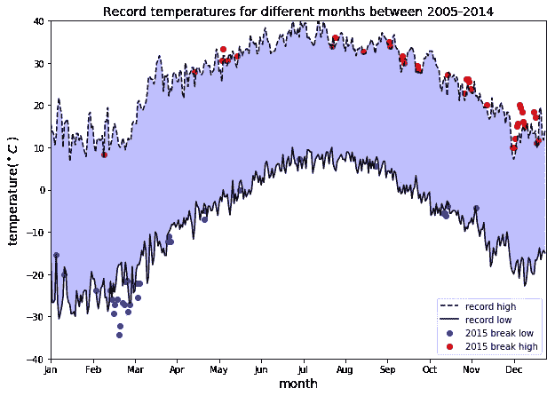
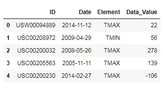

# 数据可视化教程:天气数据

> 原文：<https://pub.towardsai.net/tutorial-on-data-visualization-weather-data-52efa1bef183?source=collection_archive---------0----------------------->

## [数据可视化](https://towardsai.net/p/category/data-visualization)， [Python](https://towardsai.net/p/category/programming/python)

## 使用 Python 的 Matplotlib 进行气象数据分析和可视化



**数据可视化**与其说是**科学**，不如说是一门**艺术**。为了产生良好的可视化效果，您需要将几段代码放在一起，以获得出色的最终结果。本教程演示了如何通过分析天气数据产生良好的数据可视化。

该代码执行以下操作:

1.  它返回了 2005 年至 2014 年期间一年中每天的最高纪录和最低纪录的折线图。一年中每一天的最高温度和最低温度之间的区域用阴影表示。
2.  覆盖 2015 年打破十年记录(2005-2014 年)最高或最低记录的任何点(最高和最低)的 2015 年数据散点。

**数据集**:本项目使用的 NOAA 数据集存储在文件`weather_data.csv`中。这些数据来自国家环境信息中心(NCEI)每日全球历史气候网络(GHCN-Daily)的一个子集。GHCN-Daily 由来自全球数千个地面站的每日气候记录组成。这些数据是从美国密歇根州安阿伯附近的数据站收集的。

本文的完整代码可以从这个资源库下载:[https://github.com/bot13956/weather_pattern](https://github.com/bot13956/weather_pattern)。

# **1。导入必要的库和数据集**

```
**import** **matplotlib.pyplot** **as** **plt**
**import** **pandas** **as** **pd**
**import** **numpy** **as** **np**
df=pd.read_csv('weather_data.csv')
df.head()
```



# 2.**数据准备和分析**

```
#convert temperature from tenths of degree C to degree C
df['Data_Value']=0.1*df.Data_Valuedays=list(map(**lambda** x: x.split('-')[-2]+'-'+x.split('-')[-1], df.Date))
years=list(map(**lambda** x: x.split('-')[0], df.Date))df['Days']=days 
df['Years']=yearsdf_2005_to_2014=df[(df.Days!='02-29')&(df.Years!='2015')]
df_2015=df[(df.Days!='02-29')&(df.Years=='2015')]df_max=df_2005_to_2014.groupby(['Element','Days']).max()
df_min = df_2005_to_2014.groupby(['Element','Days']).min()
df_2015_max=df_2015.groupby(['Element','Days']).max()
df_2015_min = df_2015.groupby(['Element','Days']).min()record_max=df_max.loc['TMAX'].Data_Value
record_min=df_min.loc['TMIN'].Data_Value
record_2015_max=df_2015_max.loc['TMAX'].Data_Value
record_2015_min=df_2015_min.loc['TMIN'].Data_Value
```

# 3.生成数据可视化

```
plt.figure(figsize=(10,7)) plt.plot(np.arange(len(record_max)),record_max, '--k', label="record high") plt.plot(np.arange(len(record_max)),record_min, '-k',label="record low") plt.scatter(np.where(record_2015_min < record_min.values),             record_2015_min[record_2015_min < record_min].values,c='b',label='2015 break low')plt.scatter(np.where(record_2015_max > record_max.values),             record_2015_max[record_2015_max > record_max].values,c='r',label='2015 break high') plt.xlabel('month',size=14) plt.ylabel('temperature($^\circ C$ )',size=14) plt.xticks(np.arange(0,365,31), ['Jan','Feb', 'Mar','Apr','May','Jun','Jul','Aug','Sep','Oct','Nov','Dec']) ax=plt.gca() ax.axis([0,365,-40,40]) plt.gca().fill_between(np.arange(0,365),record_min, record_max,                   facecolor='blue',alpha=0.25) plt.title('Record temperatures for different months between 2005-2014',size=14) plt.legend(loc=0) plt.show()
```


总之，我们已经展示了如何使用 Python 的 Matplotlib 库生成简单的数据可视化图。

本文的完整代码可以从这个资源库下载:【https://github.com/bot13956/weather_pattern[。](https://github.com/bot13956/weather_pattern)