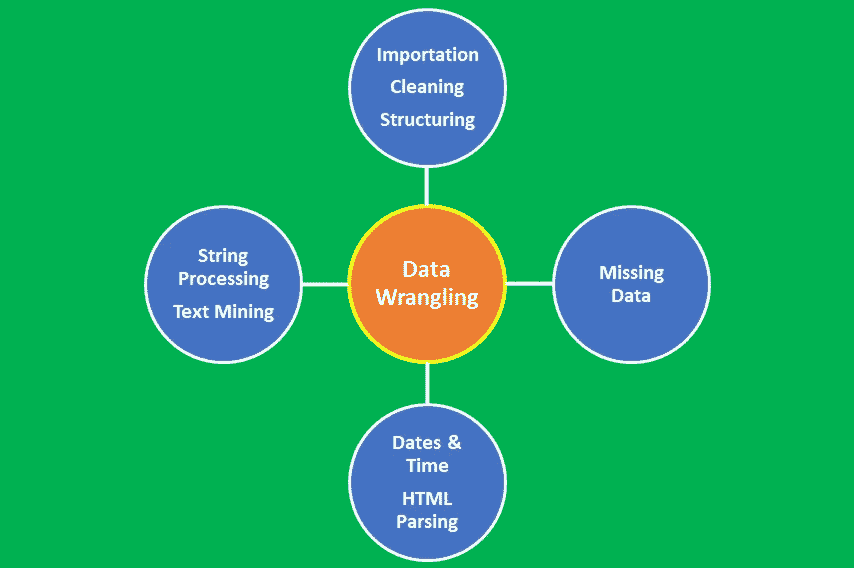
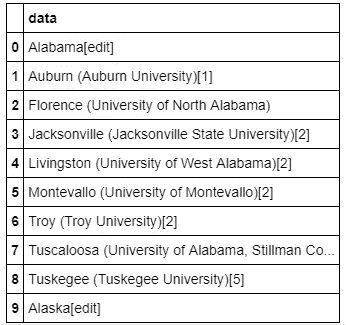
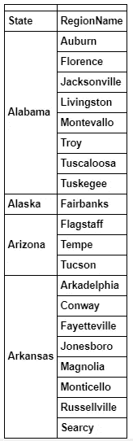
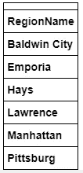
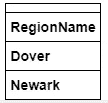
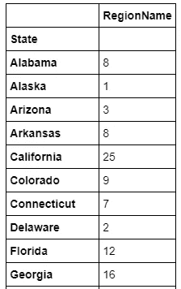

# 数据争论教程:大学城数据集

> 原文：<https://pub.towardsai.net/tutorial-on-data-wrangling-college-towns-dataset-a0e8f8dfb6ae?source=collection_archive---------1----------------------->

## 数据角力教程| [走向 AI](https://towardsai.net)



数据争论是指将数据从原始形式转换为便于分析的整洁形式的过程。数据争论是数据预处理中的一个重要步骤，包括几个过程，如数据导入、数据清理、数据结构化、字符串处理、HTML 解析、处理日期和时间、处理缺失数据和文本挖掘。

对于任何数据科学家来说，数据争论的过程都是至关重要的一步。在数据科学项目中，很少能够轻松访问数据进行分析。数据更有可能在文件、数据库中，或者从网页、tweets 或 pdf 等文档中提取。知道如何争论和清理数据将使您能够从数据中获得关键的洞察力，否则这些洞察力将被隐藏。

本教程将演示数据争论的过程。您将了解以下内容:

1.  非结构化数据的导入
2.  使用字符串处理技术清理和组织非结构化数据
3.  将非结构化数据转换为结构化数据
4.  执行结构化数据的分析

本文的数据集和代码可以从这个资源库下载:[https://github . com/bot 13956/unstructured _ data _ university _ towns](https://github.com/bot13956/unstructured_data_university_towns)。

**项目目标:**这段代码从非结构化的 [**university_towns.txt 数据集**](https://github.com/bot13956/unstructured_data_university_towns) 中返回大学城及其所属州的数据框架。最终清理的数据帧的格式如下:

```
DataFrame( [ [“Michigan”, “Ann Arbor”], [“Michigan”, “Yipsilanti”] ], columns=[“State”, “RegionName”] )
```

其中显示了州以及给定州的大学城名称。

# **导入必要的库**

```
**import** **pandas** **as** **pd**
**import** **numpy** **as** **np**
```

# **导入非结构化、不干净的数据集**

```
df=pd.read_table("university_towns.txt",header=**None**)
df.columns=["data"]
df.head(10)
```



**表 1:大学城及其所属州的非结构化、不干净数据集。**

正如我们从**表 1** 中看到的，数据集是非结构化的、不干净的，在进行任何进一步分析之前需要进行大量整理。

让我们定义一个字典，它可以用来将状态映射到它们各自的两个字母的缩写:

```
states = {'OH': 'Ohio', 'KY': 'Kentucky', 'AS': 'American Samoa', 'NV': 'Nevada', 'WY': 'Wyoming', 
          'NA': 'National', 'AL': 'Alabama', 'MD': 'Maryland', 'AK': 'Alaska', 'UT': 'Utah', 
          'OR': 'Oregon','MT': 'Montana', 'IL': 'Illinois', 'TN': 'Tennessee', 'DC': 'District of Columbia', 
          'VT': 'Vermont','ID': 'Idaho', 'AR': 'Arkansas', 'ME': 'Maine', 'WA': 'Washington', 'HI': 'Hawaii',
          'WI': 'Wisconsin','MI': 'Michigan', 'IN': 'Indiana', 'NJ': 'New Jersey', 'AZ': 'Arizona', 
          'GU': 'Guam', 'MS': 'Mississippi','PR': 'Puerto Rico', 'NC': 'North Carolina', 'TX': 'Texas', 
          'SD': 'South Dakota', 'MP': 'Northern Mariana Islands','IA': 'Iowa', 'MO': 'Missouri', 'CT': 'Connecticut',
          'WV': 'West Virginia', 'SC': 'South Carolina', 'LA': 'Louisiana',  'KS': 'Kansas', 'NY': 'New York', 
          'NE': 'Nebraska', 'OK': 'Oklahoma', 'FL': 'Florida', 'CA': 'California', 'CO': 'Colorado', 
          'PA': 'Pennsylvania', 'DE': 'Delaware', 'NM': 'New Mexico', 'RI': 'Rhode Island', 'MN': 'Minnesota',
          'VI': 'Virgin Islands','NH': 'New Hampshire', 'MA': 'Massachusetts', 'GA': 'Georgia',
          'ND': 'North Dakota', 'VA': 'Virginia'}
```

# **按字母顺序排列状态**

```
order_states=np.sort(pd.Series(states).values)
order_states;
```

# 数据清理、准备和组织

```
NewState=[]
**for** i **in** range(0,len(order_states)):
    **for** j **in** range(0,len(df.data)):
        **if** (order_states[i] +'['+'edit'+']'==df.data[j]):
            NewState=np.append(NewState,order_states[i])StateRegion=[]
**for** i **in** range(0,len(NewState)):
    **for** j **in** range(0,len(df.data)):
        **if** (NewState[i] +'['+'edit'+']'==df.data[j]):
            n = j + 1
    StateRegion=np.append(StateRegion,n)StateName=[]
CityName=[]
**for** i **in** range(0,len(NewState)-1):
    **for** j **in** range(0,len(df.data)):
        **if** (NewState[i] +'['+'edit'+']'==df.data[j]):
            n = j + 1
    **while** (NewState[i+1] +'['+'edit'+']'!=df.data[n]):
          StateName=np.append(StateName,NewState[i])
          CityName=np.append(CityName,df.data[n])
          n = n + 1CTYNAME=[]
**for** i **in** CityName:
    CTYNAME=np.append(CTYNAME, i.split('(')[0])city_new=[]
**for** i **in** CTYNAME:
    **if** i[-1]==' ':
        city_new = np.append(city_new,i[:-1])
    **else**:
        city_new=np.append(city_new,i)
```

# 构建清理后的数据集

```
df_final=pd.DataFrame([])StateName=np.append(StateName,'Wyoming')
city_new=np.append(city_new, 'Laramie')
df_final['State']=StateName
df_final['RegionName']=city_newdf_final.set_index(['State','RegionName'],inplace=**True**)df_final.head(20)
```



表 2:显示各州及其大学城的干净且结构化的数据集。

将**表 1** 与**表 2** 进行比较，我们看到**表 2** 中的数据集代表一个干净且结构化的数据集，现在可用于进一步分析。

# 使用争论数据集的数据分析

堪萨斯州和特拉华州的大学城

```
df_final.loc['Kansas']
```



**表 3:堪萨斯州的大学城。**

```
df_final.loc['Delaware']
```



**表 4:特拉华州的大学城。**

**b)给定州的大学城数量**

这可以使用以下代码获得:

```
df_final.reset_index().groupby('State').count()
```



**表 5:每个州的一些大学城的样本输出。**

总之，我们已经展示了如何使用数据角力将未清理的非结构化数据集转换为整齐的形式，以备进一步分析。对于任何数据科学家来说，数据争论的过程都是至关重要的一步。知道如何争论和清理数据将使您能够从数据中获得关键的洞察力，否则这些洞察力将被隐藏。

本文的数据集和代码可以从这个存储库下载:[https://github . com/bot 13956/unstructured _ data _ university _ towns](https://github.com/bot13956/unstructured_data_university_towns)。