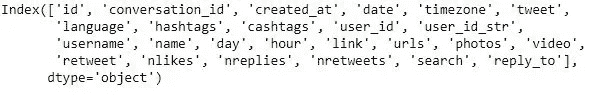
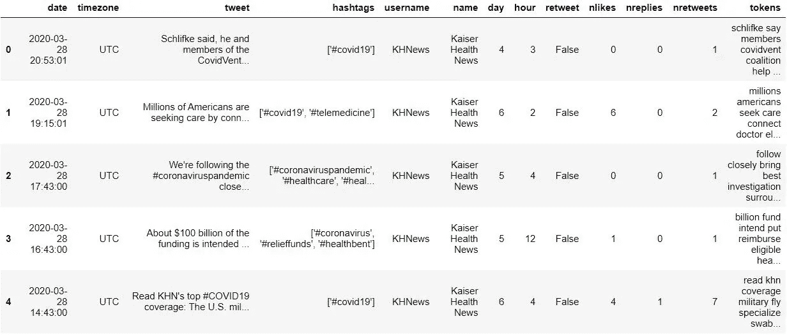

# Tweet 主题建模:清理和预处理 tweet

> 原文：<https://pub.towardsai.net/tweet-topic-modeling-part-2-cleaning-and-preprocessing-tweets-e3a08a8b1770?source=collection_archive---------1----------------------->

## [网页抓取](https://towardsai.net/p/category/web-scraping)、[编程](https://towardsai.net/p/category/programming)、[自然语言处理](https://towardsai.net/p/category/nlp)

## 这是一个多部分的系列，展示了如何为任何 tweets 集合收集、预处理、应用和可视化短文本主题建模


***免责声明:*** *本文仅出于教育目的。我们不鼓励任何人抓取网站，尤其是那些可能有条款和条件反对此类行为的网站。*

# 介绍

主题建模是一种无监督的机器学习方法，目标是找到文本文档集合(语料库)中的“隐藏”主题(或聚类)。它真正的优势在于，你不需要带标签或带注释的数据，而是只接受原始文本数据作为输入，这也是它不受监督的原因。换句话说，模型在看到数据时并不知道主题是什么，而是使用所有文档中单词之间的统计关系来生成它们。

最流行的主题建模方法之一是**潜在狄利克雷分配(LDA)** ，这是一种生成概率模型算法，揭示了管理文档语义的潜在变量，这些变量代表抽象主题。LDA(以及一般的主题建模)的典型应用是将其应用于一组新闻文章，以识别共同的主题或话题，如科学、政治、金融等。然而，LDA 的一个缺点是它不能很好地处理较短的文本，如 **tweets。**这是最近的**短文本主题建模(STTM)** 的方法，其中一些建立在 LDA 之上，派上用场并且表现更好！


拥有健康专用 Twitter 账户的主要新闻来源(*作者图片*)

这一系列帖子旨在展示和解释如何使用 Python 来执行和应用特定的 STTM 方法(**Gibbs Sampling Dirichlet Mixture Model**或 **GSDMM** )来处理 Twitter 上的健康推文。它将是数据搜集/清理、编程、数据可视化和机器学习的结合。我将在接下来的 4 篇文章中依次讨论所有主题:

> [第 1 部分:从 Twitter 上抓取推文](https://medium.com/towards-artificial-intelligence/tweet-topic-modeling-using-twint-to-scrape-tweets-part-1-a9274e5199d2)
> 
> ***第二部分:清理和预处理推文***

[*第三部分:应用短文本主题建模*](https://medium.com/towards-artificial-intelligence/tweet-topic-modeling-part-3-using-short-text-topic-modeling-on-tweets-bc969a827fef)

[*第四部分:可视化主题建模结果*](https://medium.com/towards-artificial-intelligence/tweet-topic-modeling-part-4-visualizing-topic-modeling-results-with-plotly-66d5dbaaf7fb)

这些文章不会深入到 LDA 或 STTM 的细节，而是解释他们的直觉和需要知道的关键概念。鼓励有兴趣对 LDA 有更透彻的统计理解的读者查看这些伟大的文章和资源 [**这里**](http://www.cs.columbia.edu/~blei/papers/Blei2012.pdf) 和 [**这里**](https://ldabook.com/index.html) 。

作为先决条件，确保你的电脑上安装了 [Jupyter Notebook](https://jupyter.readthedocs.io/en/latest/install.html) 、 [Python](https://www.python.org/downloads/) 、&、 [Git](https://git-scm.com/downloads) 。

好吧，我们继续！

# 第 2 部分:清理和预处理 Tweets

在我们的[上一篇文章](https://medium.com/towards-artificial-intelligence/tweet-topic-modeling-using-twint-to-scrape-tweets-part-1-a9274e5199d2)中，我们使用 [Twint](https://github.com/twintproject/twint) 从 Twitter 上搜集了一些推文，并将所有原始数据合并成一个 csv 文件。刮刀给我们的数据格式没有任何改动。如果您刚刚加入我们的第 2 部分，此处提供的 csv 供您参考。

本文将重点关注原始推文的预处理。这一步很重要，因为未经预处理的原始推文是高度非结构化的，包含冗余和经常有问题的信息。根据我们的目标，推文中有很多我们可能不需要或不想要的噪音:

> 如何在社交疏远时不练习情感疏远？@哈佛健康[https://t.co/dSXhPqwywW](https://t.co/dSXhPqwywW)#哈佛健康[https://t.co/H9tfffNAo0'](https://t.co/H9tfffNAo0)

例如，上面的标签、链接和@ handle 引用对于我们的主题建模方法来说可能不是必需的，因为这些术语并没有真正为从 tweet 中发现固有主题提供有意义的上下文。另外，如果我们希望保留标签，因为它们可以为我们的另一个分析目的服务，我们很快就会看到在我们的原始数据中已经有一个`hashtags`列将它们保存在一个列表中。

## **删除不必要的专栏和重复的推文**

首先，我们将把搜集到的 tweets 加载到一个数据框中。从 Twint 提供的原始抓取数据有许多列，其中少数包含null 或`NaN`值。我们将删除这些内容，并查看所有 tweets 的实际值保留在哪些列中。

```
import pandas as pd
tweets_df = pd.read_csv(‘data/health_tweets.csv’)
tweets_df.dropna(axis='columns', inplace=True)
tweets_df.columns
```



移除具有空值的列后，数据框中剩余的列

现在我们有了一个精简的列集，可以选择保留哪些列。我将保留那些对主题建模或探索性目的最有用或最具描述性的，但您的列表可能会根据您的目标而有所不同。

```
tweets_df = tweets_df[['date', 'timezone', 'tweet', 
                       'hashtags', 'username', 'name', 
                       'day', 'hour', 'retweet', 'nlikes', 
                       'nreplies', 'nretweets']]
```

作为一个健全的检查——我总是喜欢删除任何重复的内容，以防同一条推文被多次发布或意外地被多次删除！

```
tweets_df.drop_duplicates(inplace=True, subset="tweet")
```

## **预处理实际的推文**

接下来，我们要清理数据帧中每条记录的实际`tweet`，并移除我们不想要的任何额外的“噪音”。我们需要做的第一件事是导入(如果需要，安装)一些 Python 模块。我们还将定义一串`punctuation`符号；这代表我们想要从 tweet 中删除的任何符号或字符，因为我们只关心单词。

```
import pandas as pd
import re
import gensim
from nltk.stem import WordNetLemmatizerpunctuation = ‘!”$%&\’()*+,-./:;<=>?[\\]^_`{|}~•@’
```

使用上面的模块，我发现创建负责特定预处理任务的各种函数是最容易的。这样，您可以轻松地将它们重新用于您可能正在处理的任何数据集。

要删除任何链接、用户、标签或音频/视频标签，我们可以使用以下使用[正则表达式(Regex)](https://docs.python.org/3/library/re.html) 的函数。

为了应用必要的自然语言处理(NLP)技术，例如标记化和词条化，我们可以使用下面的函数。

**记号化**是将文档(一条推文)分解成单词、标点符号、数字等的过程。**词条释义**是利用词汇和词形分析，将单词转换为其*词条*或词典形式的方法。例如，单词**研究**、**研究**和**研究**将被转换为**研究**。

作为标记化过程的一部分，最佳实践是删除**停用词**，这些停用词基本上是一组常用词，本身并不能提供多少有意义的上下文。这让我们可以专注于重要的单词。一个例子是单词*、*等等。我们使用上面来自 [Gensim](https://radimrehurek.com/gensim/parsing/preprocessing.html) 的预定义列表，排除少于 3 个字符的任何单词。

接下来，我们的主函数`preprocess_tweet`除了在 tweet 中应用小写和去除标点符号、额外的空格或数字之外，还应用了上面定义的所有函数。它返回一个干净的令牌列表，这些令牌已经针对给定的 tweet 进行了词汇化。*此外，我们还定义了一个* `*basic_clean*`*函数，该函数只清理 tweet，而不对可能要求所有单词完整的用例应用记号化或词条化。*

为了使事情变得更简单，并能够在您正在处理的任何文件中根据需要重用函数，我创建了一个单独的文件来存储所有函数，我们可以轻松地导入这些函数，并使用它们在一次代码运行中返回预处理的数据框。最棒的是，它可以用于任何文本数据集合，如 Reddit 帖子、文章标题等。！

**完整的 Tweet 预处理器代码**

现在，让我们尝试将我们定义的所有预处理步骤应用到数据框中，并查看结果。

```
from tweet_preprocessor import tokenize_tweets
tweets_df = tokenize_tweets(tweets_df)
tweets_df.head(5)
```

我们可以看到增加了一个新的`tokens` 栏目，看起来不错！



在我们结束之前，让我们确保将预处理数据集保存到一个 csv 文件中。你也可以在这里找到它的副本[。](https://github.com/bicachu/short-text-topic-modeling-tutorial/blob/main/data/preprocessed_tweets.csv)

```
tweets_df.to_csv(r’data/preprocessed_tweets.csv’, index = False,   
                 header=True)
```

在本系列的[下一部分](https://medium.com/towards-artificial-intelligence/tweet-topic-modeling-part-3-using-short-text-topic-modeling-on-tweets-bc969a827fef)中，我们将开始做有趣的事情，开始分析推文并运行我们的短文主题建模算法，以查看我们收集的推文中存在哪些趋势和主题健康问题！

[](/tweet-topic-modeling-part-3-using-short-text-topic-modeling-on-tweets-bc969a827fef) [## Tweet 主题建模第 3 部分:在 tweet 上使用短文本主题建模

### 这是一个多部分的系列，展示了如何为任何集合抓取、预处理、应用和可视化短文本主题建模…

pub.towardsai.net](/tweet-topic-modeling-part-3-using-short-text-topic-modeling-on-tweets-bc969a827fef) 

**参考资料和其他有用资源**

*   [词汇化和词干差异的详细说明](https://blog.bitext.com/what-is-the-difference-between-stemming-and-lemmatization/)
*   [停止字的解释](https://kavita-ganesan.com/what-are-stop-words/#.X9aTPthKiUk)
*   [预处理代码](https://gist.github.com/bicachu/09cc71bb4b0e3711eaf1556b12fa7ad7)，可用于任何一组文本数据