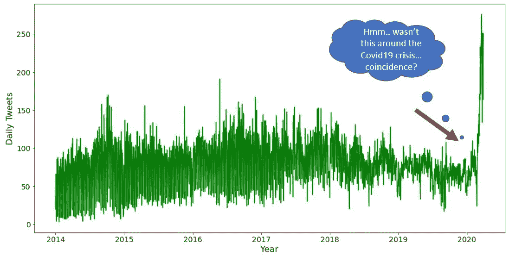
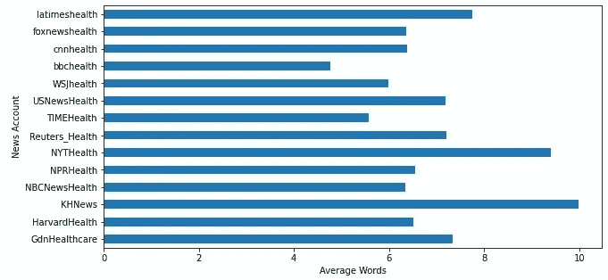
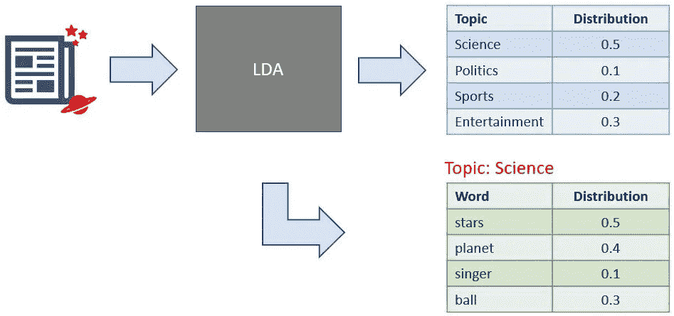
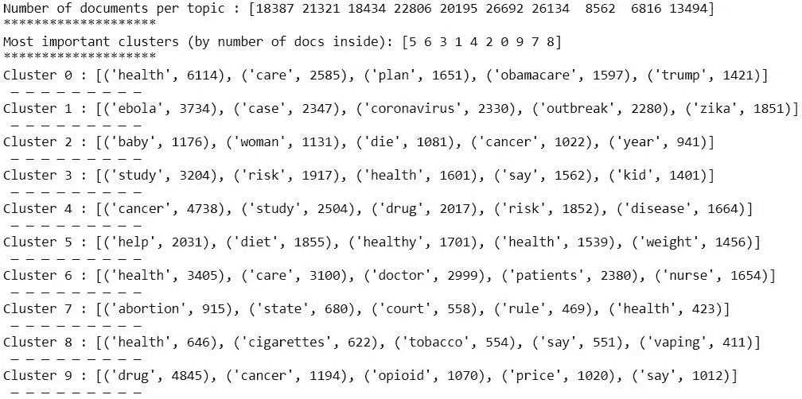
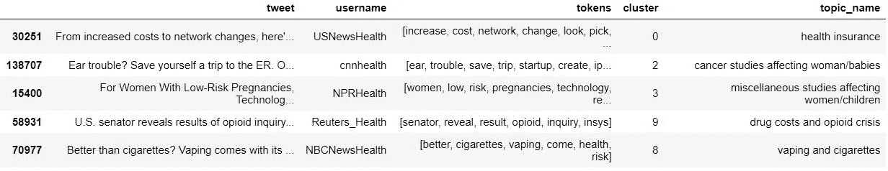

# Tweet 主题建模:在 tweet 上使用短文本主题建模

> 原文：<https://pub.towardsai.net/tweet-topic-modeling-part-3-using-short-text-topic-modeling-on-tweets-bc969a827fef?source=collection_archive---------0----------------------->

## [数据挖掘](https://towardsai.net/p/category/data-mining)，[自然语言处理](https://towardsai.net/p/category/nlp)，[编程](https://towardsai.net/p/category/programming)

## 这是一个多部分的系列，展示了如何为任何 tweets 集合收集、预处理、应用和可视化短文本主题建模


***免责声明:*** *本文仅出于教育目的。我们不鼓励任何人抓取网站，尤其是那些可能有条款和条件反对此类行为的网站。*

# 介绍

主题建模是一种无监督的机器学习方法，目标是找到文本文档集合(语料库)中的“隐藏”主题(或聚类)。它真正的优势在于，你不需要带标签或带注释的数据，而是只接受原始文本数据作为输入，这也是它不受监督的原因。换句话说，模型在看到数据时并不知道主题是什么，而是使用所有文档中单词之间的统计关系来生成它们。

最流行的主题建模方法之一是**潜在狄利克雷分配(LDA)** ，这是一种生成概率模型算法，揭示了管理文档语义的潜在变量，这些变量代表抽象主题。LDA(以及一般的主题建模)的典型应用是将其应用于一组新闻文章，以识别共同的主题或话题，如科学、政治、金融等。然而，LDA 的一个缺点是它不能很好地处理较短的文本，如 **tweets。**这是最近的**短文本主题建模(STTM)** 的方法，其中一些建立在 LDA 之上，派上用场并且表现更好！


拥有健康专用 Twitter 账户的主要新闻来源(*作者图片*)

这一系列帖子旨在展示和解释如何使用 Python 来执行和应用特定的 STTM 方法(**Gibbs Sampling Dirichlet Mixture Model**或 **GSDMM** )来处理 Twitter 上的健康推文。它将是数据搜集/清理、编程、数据可视化和机器学习的结合。我将在接下来的 4 篇文章中依次讨论所有主题:

> [第 1 部分:从 Twitter 上抓取推文](https://medium.com/towards-artificial-intelligence/tweet-topic-modeling-using-twint-to-scrape-tweets-part-1-a9274e5199d2)
> 
> [第二部分:清理和预处理推文](https://medium.com/towards-artificial-intelligence/tweet-topic-modeling-part-2-cleaning-and-preprocessing-tweets-e3a08a8b1770)
> 
> ***第三部分:应用短文本主题建模***

[*第四部分:可视化主题建模结果*](https://medium.com/towards-artificial-intelligence/tweet-topic-modeling-part-4-visualizing-topic-modeling-results-with-plotly-66d5dbaaf7fb)

这些文章不会深入到 LDA 或 STTM 的细节，而是解释他们的直觉和需要知道的关键概念。鼓励有兴趣对 LDA 有更透彻的统计理解的读者查看这些伟大的文章和资源 [**这里**](http://www.cs.columbia.edu/~blei/papers/Blei2012.pdf) 和 [**这里**](https://ldabook.com/index.html) 。

作为先决条件，确保你的电脑上已经安装了 [Jupyter Notebook](https://jupyter.readthedocs.io/en/latest/install.html) 、 [Python](https://www.python.org/downloads/) 、&、 [Git](https://git-scm.com/downloads) 。

好吧，我们继续！

# 第 3 部分:应用短文本主题建模(STTM)

在[上一篇文章](https://medium.com/towards-artificial-intelligence/tweet-topic-modeling-part-2-cleaning-and-preprocessing-tweets-e3a08a8b1770)中，我们对所有的推文进行了预处理，为数据集中的每条推文生成了一个带有词汇化标记的数据框架。如果您刚刚加入我们的第 3 部分，此处提供的最终 CSV[供您参考。](https://github.com/bicachu/short-text-topic-modeling-tutorial/blob/main/data/preprocessed_tweets.csv)

本文将通过执行一些初步的探索性分析，然后在我们的数据上使用 GSDMM 算法构建一个 STTM 模型管道来生成主题。然后，我们将解释我们的结果，并尝试根据每个主题中的单词分布来分配主题。

## 探索性数据分析

让我们从做一些 EDA 开始。由于我们使用健康新闻推文数据集的关键目标之一是探索一段时间内的趋势，因此了解每日推文计数的密度可能是有用的。

```
import pandas as pd
import matplotlib.pyplot as plt
tweets_df = pd.read_csv(r'data/preprocessed_tweets.csv') #load data# convert datetime to date and add year column
tweets_df['date'] = pd.to_datetime(tweets_df['date'],
                                   errors='coerce')
tweets_df['year'] = tweets_df['date'].dt.year
tweets_df['date'] = tweets_df['date'].dt.date# plot tweet daily counts over time
tweets_df.groupby('date')['tweet'].count().plot(kind='line', color='green', figsize=(16,8))
plt.xlabel('Year')
plt.ylabel('Daily Tweets')
plt.show()
```



看起来在 2020 年数据集时间线的末尾，每天的推文会有一个巨大的峰值。这实际上对于包含健康新闻推文的数据集是有意义的，因为这大约是 2020 年新冠肺炎健康疫情的开始👨‍⚕️⚕️️.

另一个我们可能想看看的领域是不同新闻来源的推文中剩余的平均字数(当然是在我们去掉停用词之后)。

```
# calculate number of tokens for each tweet
tweets_df[‘ntokens’] = tweets_df[‘tokens’].str.split().str.len()# plot average word count by user
tweets_df.groupby(‘username’)     
                 [‘ntokens’].mean().plot(kind=’barh’,figsize=(10,5))
plt.xlabel(‘Average Words’)
plt.ylabel(‘News Account’)
plt.show()
```



看起来大多数新闻来源平均有 6-8 个令牌。我不知道你怎么想，但对我来说，这听起来像是短文本的 A+范例！

## STTM 概述

在我们开始实现 STTM 方法之前，让我们多谈一谈为什么我们要用它来代替传统的主题建模算法，比如 LDA。从一个*非常*高的水平，LDA 产生 2 个统计分布:

> 1)每个主题的一组单词分布
> 
> 2)每个文档的一组主题分布

这意味着，生成的每个主题都有相关的概率，即单词与其密切相关，并且文档可以由多个主题组成，每个主题都有自己的权重。例如，如果您的文档是一篇新闻📰关于 stars⭐和球形行星🌎，LDA 可能会生成以下主题和单词分布:



一篇科学新闻文章的主题/单词分布的简单但合理的例子

这在中型或大型文本中很有效，但在短文本中并不总是如此(< 50 words) because of these key characteristics:

*   Each short text lacks enough word co-occurrence information.**单词共现**是两个单词在文本中同时出现的机会，它有助于推断所生成主题的单词分布。
*   由于包含最少的单词，大多数主题可能仅由一个主题生成。
*   文本中单词的统计信息不能完全捕获语义相关但很少共现的单词。

因此，大多数 STTM 技术最初假设一篇短文本仅来自一个主题，从而减少了我们在 LDA 中看到的重叠主题。

## 吉布斯采样狄利克雷混合模型

我们将为 STTM 使用的特定模型是 Gibbs 抽样 Dirichlet 混合模型(GSDMM ),它是一种改进的 LDA 算法，使用一个主题分配给一个文本的简单假设。

在深入研究它的代码之前，让我们用一个叫做**电影组过程(MGP)** 的类比来理解它在高层做了什么，这个类比是由介绍它的研究人员提出的。

这个想法很简单。想象一下，一位教授正在带领一班学生上电影课。开始上课时，学生们都被要求写下他们最喜欢的电影(相对入围)。学生代表文档，他们的电影列表代表单词。接下来，学生被随机分配到`K`桌。目标是以这样一种方式对他们进行聚类和分组，即同一桌的学生分享相似的电影兴趣。最后，教授反复阅读班级花名册；每次叫到学生的名字时，他们必须选择满足以下一个或两个条件的新表:

*1——选择一张学生人数多于当前学生人数的桌子。*

*2——选择一张桌子，让学生们分享相似的电影兴趣。*

条件 1 提高了**完整性，**所有对电影有相似兴趣的学生都坐在同一张桌子上，而不是分散在不同的桌子上。条件 2 有助于导致更好的**同质性**，确保*只有利益相似的*成员才会参与进来。在满足这些条件并不断重复它们直到我们接近最优(收敛)之后，我们期望一些表消失，而另一些表增长。希望学生们最终能得到一个最佳的桌子配置。简单来说，这就是 GSDMM 算法的作用！


电影群组过程类比的视觉效果(图片由作者提供)

## STTM 实施

现在，我们将开始建立我们的 STTM 管道，并在我们的健康新闻推特数据集上运行。如果使用你自己的数据集，这部分假设你已经预处理和标记了你的推文。否则可以参考[第二部分](https://medium.com/towards-artificial-intelligence/tweet-topic-modeling-part-2-cleaning-and-preprocessing-tweets-e3a08a8b1770)。

我们要做的第一件事是将 GSDMM 模型从 [GitHub](https://github.com/rwalk/gsdmm) 加载到一个名为`gsdmm`的文件夹中。在终端中运行以下命令。

```
git clone [https://github.com/rwalk/gsdmm.git](https://github.com/rwalk/gsdmm.git) gsdmm
```

接下来，我们将导入模型。使用我们之前在 EDA 中加载的数据帧，我们将把我们的令牌转换成一个列表，然后创建一个最终的列表列表来保存我们所有 tweets 中的所有令牌。这是必要的，因为这是模型的正确输入格式。

```
import numpy as np
import pandas as pd
import pickle
import gsdmm
from gsdmm import MovieGroupProcess
from tqdm import tqdm# convert string of tokens into tokens list
tweets_df['tokens'] = tweets_df.tokens.apply(lambda x:  
                                             re.split('\s', x))# create list of  token lists
docs = tweets_df['tokens'].tolist()
```


**文档**的输出样本 gsdmm 模型所需的输入

在运行模型之前，我们需要了解并选择 GSDMM 的超参数:

*   **K** —代表模型将找到的最大主题数。回想一下，GSDMM 将清空无用的集群，并最终尝试找到主题的“真实”数量。这在理论上可行，但高度依赖于您的数据集和使用的其他超参数。例如，如果您将 K 设置为 300 来运行它，您可能会发现自己得到 300 个主题，这些主题对于您的数据可能是真实的，也可能是无用的。在我们的例子中，考虑到每条推文都很短，而且事实上所有推文都已经在健康主题领域下，我选择了`K=10`，因为我们正在寻找健康方面的子主题。为了进一步阅读，有几种不同的方法来选择一个理想的 K，我在最后的参考文献中包括了这些方法。
*   **Alpha α** —关于 MGP，Alpha 控制一个因素，该因素决定当一个表是空的时，它被移除的容易程度(低 alpha =更少的表)。结果，随着 alpha 的增加，非空聚类的数量将变得更大，并且将会有更多的只有一个或几个文档的聚类。默认情况下，值`α=0.1`在大多数数据集上工作良好。
*   **Beta β** —关于 MGP，Beta 控制如何根据表的相似性而不是表的流行度为学生选择表(低 beta =更多相似的聚类)。结果，随着 beta 的增加，非空聚类的数量将变得更小，因为该模型将更加强调选择流行的聚类而不是相似的聚类。默认情况下，`β=0.1`值适用于大多数数据集。
*   **N_iters** —对于 MGP，这表示迭代的次数或每个学生被教授重新分配到新表的次数。根据[原始研究论文](https://dl.acm.org/doi/10.1145/2623330.2623715)，虽然我们将使用`n_iters=30`作为默认值，但 GSDMM 收敛速度相当快，并且稳定性通常在 10 以内。

配置好超参数后，我们就可以训练模型了！✊

```
# train STMM model
mgp = MovieGroupProcess(K=10, alpha=0.1, beta=0.1, n_iters=30)
vocab = set(x for doc in docs for x in doc)
n_terms = len(vocab)
y = mgp.fit(docs, n_terms)# save model
with open(‘dumps/trained_models/10clusters.model’, ‘wb’) as f:
 pickle.dump(mgp, f)
 f.close()
```

一旦模型训练完成(*注意:训练需要一些时间，这取决于你的数据集和迭代*)，我们将想要探索发现的主题并对它们进行评估。首先，让我们定义一些帮助器函数来简化这个过程。

下面的代码将为我们提供对每个集群中的 tweets 数量及其热门词分布的统计洞察。

```
doc_count = np.array(mgp.cluster_doc_count)
print(‘Number of documents per topic :’, doc_count)
print(‘*’*20)# topics sorted by the number of documents they are allocated to
top_index = doc_count.argsort()[-10:][::-1]
print(‘Most important clusters (by number of docs inside):’,   
       top_index)
print(‘*’*20)# show the top 5 words in term frequency for each cluster 
topic_indices = np.arange(start=0, stop=len(doc_count), step=1)
top_words(mgp.cluster_word_distribution, topic_indices, 5)
```



结果乍一看还蛮不错的！以下是我们可以从一些主题中推断出的一些一般模式:

*   第 0 类似乎涉及医疗保健及其背后的政治
*   **集群 1** 似乎只关注病毒和疫情
*   **聚类 5** 似乎与健康的生活方式和节食有关
*   集群 7 似乎涉及正在进行的堕胎权利讨论
*   **第 8 类**似乎侧重于香烟和蒸汽对健康的影响

如果我们想深入了解某些单词对特定的集群有多重要，我们可以使用前面定义的`cluster_importance`函数来创建一个主题-单词矩阵，其中每个值代表该特定主题的单词重要性。

```
phi = cluster_importance(mgp) # initialize phi matrix
phi[1][‘coronavirus’]
```

输出值:0.000000000001

```
phi[0][‘coronavirus’]
```

**输出:**0.000000000001

在这里，我们可以看到“冠状病毒”一词对于聚类 1(似乎与病毒有关)的值为 0.016，但是对于聚类 0(似乎与医疗保健和政治有关)的值相对很小。

一旦我们完成了探索，对聚类结果感到满意，下一步就是给每个聚类分配实际的人类可解释的主题。记住，主题建模会产生“潜在的”主题。在流程的最后，我们仍然需要一个人来解释集群，并定义每个集群的内容。这样做是一门艺术🎨不过。

让我们为我们的 10 个集群而努力吧！

```
topic_dict = {}
topic_names = [‘healthcare & policy’,
               ‘virus/outbreaks’,
               ‘cancer studies affecting woman/babies’,
               ‘miscellaneous studies affecting women/children’,
               ‘cancer & heart disease’,
               ‘diet & exercise’,
               ‘health & medical workers’,
               ‘abortion’,
               ‘vaping & cigarettes’,
               ‘drug costs & opioid crisis’]for i, topic_num in enumerate(topic_indices):
 topic_dict[topic_num]=topic_names[i]
```

定义好主题后，我们现在可以使用我们的`topic_allocation`函数为每条 tweet 分配一个主题。

```
topic_allocation(tweets_df, docs, mgp, topic_dict)
```

*注意:该自定义主题分配功能是在* `*gsdmm*` *模块中原有的* `*choose_best_label*` *功能的基础上构建的，该功能选择最有可能属于某个文档的主题。如果你希望在分配主题时使用一个最小阈值，以便为任何不符合设置阈值的推文分配一个“其他”主题，你可以向帮助器函数添加一些代码，以接受一个额外的阈值输入参数。在分配主题之前，您需要调整代码来检查这种情况。*

让我们来看看我们的推文及其指定主题的样本。

```
tweets_df[[‘tweet’, ‘username’, ‘tokens’, ‘cluster’,   
           ‘topic_name’]].sample(5)
```



我们做到了！这些完美吗？没有——但是我们数据集中的每条推文现在都标有我们定义的潜在主题，以及我们的 GSDMM 模型产生的潜在主题。💪 🚀 🎆

[**完整笔记本**](https://github.com/bicachu/short-text-topic-modeling-tutorial/blob/main/sttm_notebook.ipynb)

在我们结束之前，让我们确保将数据框保存到一个 csv 文件中。你也可以在这里找到它的副本[。](https://github.com/bicachu/short-text-topic-modeling-tutorial/blob/main/data/sttm_10topics_results.csv)

```
tweets_df.to_csv(r’data/sttm_10topics_results.csv’, index = False,  
                 header=True)
```

在本系列的下一个也是最后一个部分中，我们将开始使用热图和气泡图来更好地可视化和分析我们的主题建模结果！

## 额外收获:提取和存储每个主题模型的单词统计

如果你想看看我们如何提取每个主题的热门词、文档数、词频和词的重要性，请参考我笔记本的最后一部分[这里](https://github.com/bicachu/short-text-topic-modeling-tutorial/blob/main/sttm_notebook.ipynb)。使用许多辅助函数的代码要复杂得多，并且还需要具备 Python 的中级知识，尤其是使用各种数据结构。尽管如此，它还是很有价值的，可以帮助我们创建第 4 部分中绘制气泡图所需的数据。

*我要感谢*[*maty as Amrouche*](https://medium.com/u/ad07e8173fb2?source=post_page-----bc969a827fef--------------------------------)*启发了这个项目，并提供了我能够利用的关于 GSDMM 的类似教程——查看下面参考资料中他的有用教程！*

[](/tweet-topic-modeling-part-4-visualizing-topic-modeling-results-with-plotly-66d5dbaaf7fb) [## Tweet 主题建模第 4 部分:用 Plotly 可视化主题建模结果

### 这是一个多部分的系列，展示了如何为任何集合抓取、预处理、应用和可视化短文本主题建模…

pub.towardsai.net](/tweet-topic-modeling-part-4-visualizing-topic-modeling-results-with-plotly-66d5dbaaf7fb) 

**参考资料和其他有用资源**

*   总体 STTM [研究论文](https://arxiv.org/pdf/1904.07695.pdf)
*   [GSD mm 的原始研究论文](https://dl.acm.org/doi/10.1145/2623330.2623715)
*   [STTM 笔记本](https://github.com/bicachu/short-text-topic-modeling-tutorial/blob/main/sttm_notebook.ipynb)本文供图
*   Matyas Amrouche 的 [STTM 文章](https://towardsdatascience.com/short-text-topic-modeling-70e50a57c883)
*   gsdmm [Github 页面](https://github.com/rwalk/gsdmm)
*   使用话题连贯性选择 K[指南](https://www.machinelearningplus.com/nlp/topic-modeling-gensim-python/#14computemodelperplexityandcoherencescore)