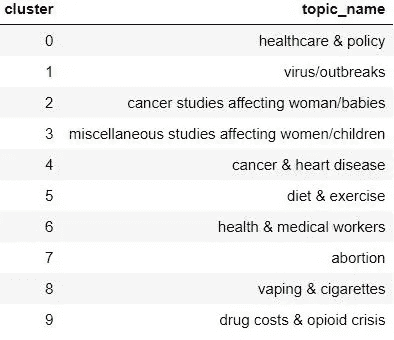
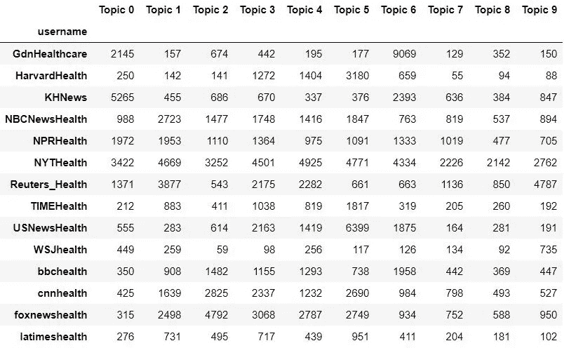
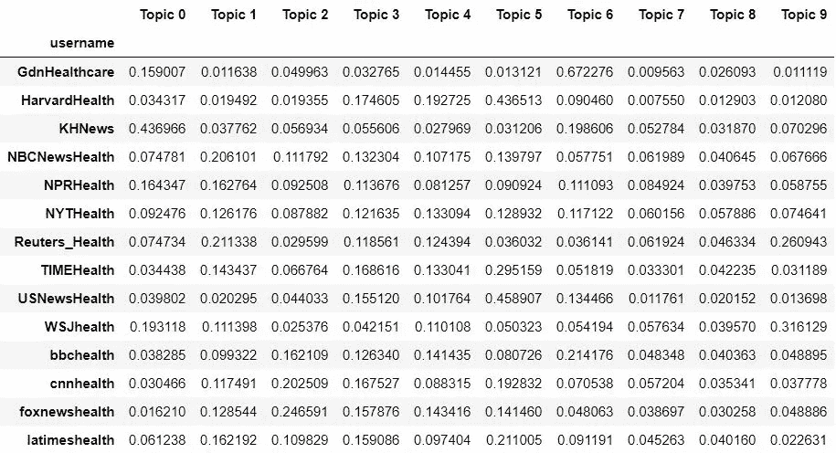
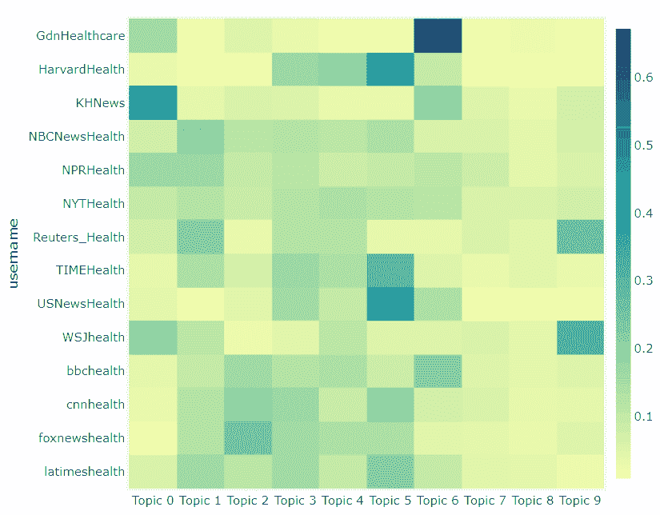
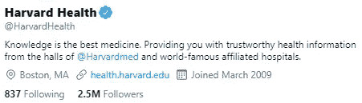
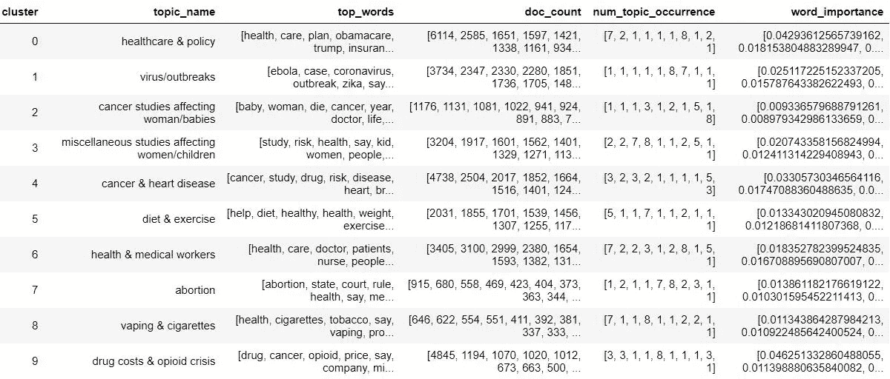
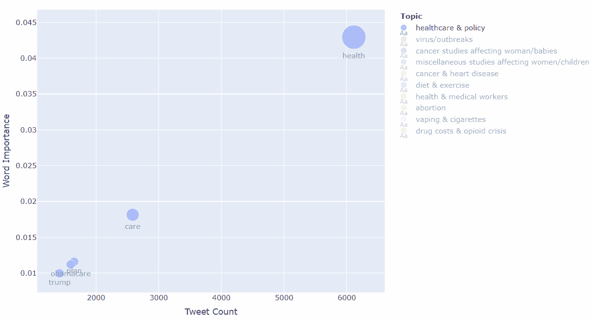

# Tweet 主题建模:用 Plotly 可视化主题建模结果

> 原文：<https://pub.towardsai.net/tweet-topic-modeling-part-4-visualizing-topic-modeling-results-with-plotly-66d5dbaaf7fb?source=collection_archive---------2----------------------->

## [数据可视化](https://towardsai.net/p/category/data-visualization)，[自然语言处理](https://towardsai.net/p/category/nlp)，[编程](https://towardsai.net/p/category/programming)

## 这是一个多部分的系列，展示了如何为任何 tweets 集合收集、预处理、应用和可视化短文本主题建模


***免责声明:*** *本文仅出于教育目的。我们不鼓励任何人抓取网站，尤其是那些可能有条款和条件反对此类行为的网站。*

# 介绍

主题建模是一种无监督的机器学习方法，目标是找到文本文档集合(语料库)中的“隐藏”主题(或聚类)。它真正的优势在于，你不需要带标签或带注释的数据，而是只接受原始文本数据作为输入，这也是它不受监督的原因。换句话说，模型在看到数据时并不知道主题是什么，而是使用所有文档中单词之间的统计关系来生成它们。

最流行的主题建模方法之一是**潜在狄利克雷分配(LDA)** ，这是一种生成概率模型算法，揭示了管理文档语义的潜在变量，这些变量代表抽象主题。LDA(以及一般的主题建模)的典型应用是将其应用于一组新闻文章，以识别共同的主题或话题，如科学、政治、金融等。然而，LDA 的一个缺点是它不能很好地处理较短的文本，如 **tweets。**这是最近的**短文本主题建模(STTM)** 的方法，其中一些建立在 LDA 之上，派上用场并且表现更好！


拥有健康专用 Twitter 账户的主要新闻来源(*作者图片*)

这一系列帖子旨在展示和解释如何使用 Python 来执行和应用特定的 STTM 方法(**Gibbs Sampling Dirichlet Mixture Model**或 **GSDMM** )来处理 Twitter 上的健康推文。它将是数据搜集/清理、编程、数据可视化和机器学习的结合。我将在接下来的 4 篇文章中依次讨论所有主题:

> [第 1 部分:从 Twitter 上抓取推文](https://medium.com/towards-artificial-intelligence/tweet-topic-modeling-using-twint-to-scrape-tweets-part-1-a9274e5199d2)
> 
> [第二部分:清理和预处理推文](https://medium.com/towards-artificial-intelligence/tweet-topic-modeling-part-2-cleaning-and-preprocessing-tweets-e3a08a8b1770)
> 
> [第三部分:应用短文本主题建模](https://medium.com/towards-artificial-intelligence/tweet-topic-modeling-part-3-using-short-text-topic-modeling-on-tweets-bc969a827fef)
> 
> ***第四部分:可视化主题建模结果***

这些文章不会深入到 LDA 或 STTM 的细节，而是解释他们的直觉和需要知道的关键概念。鼓励有兴趣对 LDA 有更透彻的统计理解的读者查看这些伟大的文章和资源 [**这里**](http://www.cs.columbia.edu/~blei/papers/Blei2012.pdf) 和 [**这里**](https://ldabook.com/index.html) 。

作为先决条件，确保你的电脑上安装了 [Jupyter Notebook](https://jupyter.readthedocs.io/en/latest/install.html) 、 [Python](https://www.python.org/downloads/) 、&、 [Git](https://git-scm.com/downloads) 。

好吧，我们继续！

# 第 4 部分:可视化主题模型结果(使用 Plotly)

在[之前的文章](https://medium.com/towards-artificial-intelligence/tweet-topic-modeling-part-3-using-short-text-topic-modeling-on-tweets-bc969a827fef)中，我们已经成功训练了一个 STTM 模型，并为我们数据集中的所有推文分配了主题。如果您刚刚加入我们的第 4 部分，此处[提供的最终 CSV](https://github.com/bicachu/short-text-topic-modeling-tutorial/blob/main/data/sttm_10topics_results.csv)供您参考。

本文将使用 [Plotly、](https://plotly.com/python/getting-started/)构建各种数据可视化，包括热图和气泡图，以分析任何带标签的主题建模结果。本文不会深入讨论 Plotly 框架(如果你有兴趣学习更多关于 Plotly 数据可视化的知识，我强烈推荐你查看这些文章[这里](https://towardsdatascience.com/python-for-data-science-a-guide-to-data-visualization-with-plotly-969a59997d0c)和[这里](https://towardsdatascience.com/visualization-with-plotly-express-comprehensive-guide-eb5ee4b50b57))。

## 设置

首先，让我们确保在我们的环境中安装了 Plotly。

```
pip install plotly
```

接下来，让我们加载任何必要的模块，并读取我们的结果数据集。

```
import numpy as np
import pandas as pd
import plotly.graph_objects as go
import plotly.express as px

tweets_df = pd.read_csv(r’/data/sttm_10topics_results.csv’)
```

[Graph_objects](https://plotly.com/python/graph-objects/) 是 Plotly 最初引入的默认组件，用于绘制各种图形和图表。Express 是他们发布的一个较新的框架，它包含的功能可以让你一次轻松快速地创建完整的可视化。它适用于结构化数据框。我们将使用 express 函数，但是了解 graph 对象是有好处的，因为根据您要做的事情，使用任何一种都有利弊。

最后一件事——让我们创建一个新的数据框`topics_df` ,它只保存我们定义的集群和主题名称。这将在稍后交互式探索我们的热图时派上用场。

```
topics_df = tweets_df[[‘cluster’,‘topic_name’]] 
                      .drop_duplicates()
                      .sort_values(by=’cluster’)
topics_df.reset_index(inplace=True, drop=True)
topics_df
```



## **热图可视化用户间的话题密度(新闻来源)**

我们想要生成的第一个可视化结果是一个热图，它可视化了新闻源中主题的分布。换句话说，对于每个用户，他们的推文有多少比例是关于主题 1 和主题 2 等等。

在我们绘制任何东西之前，我们需要进行一些数据辩论，并创建一个新的数据框架，使我们能够按照预期可视化主题计数。幸运的是，我们可以使用一个简洁的 pandas pivot table 特性来统计每个用户每个主题的 tweets 数量。



接下来，我们要将上面的值转换成百分比，因为我们对每个用户的主题的相对分布组成感兴趣。如果我们只看总计数，对用户进行比较是没有意义的，因为一些用户可能比其他人更频繁地发微博。



如果不了解 Plotly 的框架和功能，乍一看下一部分可能很难理解。本质上，我们希望动态地创建一个自定义的字符串列表(包括 HTML 标记),以表示当我们将鼠标悬停在热图矩阵中的每个值上时，我们希望显示的文本。当我们最终绘制时，该数据将与`hoverinfo`属性一起使用。

现在——你期待已久的时刻到了；让我们创建我们的热图！🔥



瞧啊。我们现在有一个互动热图，显示了主题和用户之间的推文密度。如您所见，我们可以将鼠标悬停在热图中的每个框上，深入了解特定的详细信息，例如我们定义的主题描述。有趣的是，哈佛健康有很多与主题 5(饮食和锻炼)相关的主题，这与他们基于 Twitter 账户的整个哲学和目的相一致。



来源:[推特网址](https://twitter.com/harvardhealth?lang=en#:~:text=Harvard%20Health%20(%40HarvardHealth)%20%7C%20Twitter)

## 热图**显示不同时间(年)的主题密度**

在完成第一个之后，绘制下一个热图来可视化多年的主题是相当容易的。我们可以使用上面的大部分代码，在相关的地方更改变量名。在生成数据透视表时需要注意的两个关键区别是:

1.  使用**指标= '年'**
2.  不使用比值，而是使用总数，因为每年的推文数量(除了 2020 年)相当均匀，更容易看到推文的数量以及它们如何随着时间的推移与主题相关而变化。当然，如果需要，我们可以很容易地使用比率。

我不会再用完整的代码来烦你，但你可以在最后提到的笔记本中找到所有代码。然而，这里是最终的热图可视化。🔥


你看到的第一件事是，2020 年的推特数量很低👇这是意料之中的，因为我们的数据只涵盖了今年第一季度。然而，主题 1(病毒/疫情)仅在该时间段就有超过 3000 条推文，这充分说明了**新冠肺炎对我们媒体新闻平台的影响。想象一下，如果我们在 2020 年的剩余时间里继续收集推文；我们的数据集可能会非常不平衡！这张热图显示的其他一些有趣的花絮是:**

*   话题 0(医疗保健&政策)在 2017 年表现最强。这与🇺🇸总统唐纳德·川普当选后恰逢争议性的政策讨论开始出现，因为它与奥巴马医改和重组该国的医疗保健计划有关。
*   穗📈主题 1 的(病毒/疫情)出现在 2014 年和 2016 年，这与埃博拉和寨卡病毒疫情的时间表相关。

> 你从可视化中看到了哪些有趣的见解？欢迎在下方留言评论！

## **气泡图可视化各主题热门词汇**

我们要看的最后一个可视化效果是一个气泡图，它显示了每个主题的热门词汇(如气泡)和一些关于它们的一般统计数据。

作为奖金演练的一部分，我们将在第 3 部分末尾使用我们创建的数据框来捕获所有主题及其单词/统计数据(参见笔记本[此处](https://github.com/bicachu/short-text-topic-modeling-tutorial/blob/main/sttm_notebook.ipynb))。您可以在这里找到该数据[的`.pkl`文件，因为您会需要它。](https://github.com/bicachu/short-text-topic-modeling-tutorial/blob/main/data/sttm_10topics_words.pkl)

首先，让我们将 pickle 文件加载到一个数据框中并查看它。

```
topic_words_df = pd.read_pickle(‘data/sttm_10topics_words.pkl’)
topic_words_df
```



**数据框架:**主题 _ 单词 _df

😮我承认，这是一个看起来很吓人的数据框，但是**它给了我们绘制泡泡图所需的一切。**让我们来分解最后 4 个关键列:

*   `top_words`=该主题的前 10 个单词列表
*   `doc_count`=该主题中每个词的 tweet 计数列表
*   `num_topic_occurrence`=所有热门词中每个词的频率计数列表
*   `word_importance`=该主题中每个单词重要性分数列表

例如，单词“health”的`num_topic_occurrence`为 7，因为它出现在 7/10 聚类的顶部单词中。每个列表中的所有值相对于该主题的相应单词以相同的降序排列(顶部单词优先)。这对于绘图非常重要——在本系列的第 3 部分中，我们做了所有繁重的工作，确保以这种方式操作数据。

现在剩下要做的就是策划了！💹我们将只使用每个主题的前 5 个单词，因为这样更容易阅读。`num_topic_occurrence`值将用于控制气泡的大小，以便更大的气泡指示在集群中更常见的单词。因此，气泡直径越小的单词越能反映特定主题。



现在你知道了——我们的泡沫在图表上时隐时现！🎈😉

这个交互式图表的一个很大的好处是，它可以让你很容易地通过切换话题来比较热门词汇。此外，它还直观地向您展示了哪些单词可能很常用，但也很常见。例如，我们可以看到单词' **health'** 的气泡较大，代表' **healthcare & policy'** 主题，而气泡单词如***{trump，obamacare，plan}*** 较小，表明这些对于理解集群的潜在主题更有用。也许在这个项目的未来迭代中，我们会希望在我们的停用词中添加“健康”。

## [完整的可视化笔记本代码](https://github.com/bicachu/short-text-topic-modeling-tutorial/blob/main/sttm_visualization_notebook.ipynb)

# 项目系列摘要

我们关于健康推文的**短文本主题建模**系列到此结束。希望您喜欢这些内容，并且能够将讨论的过程应用到您自己的文本数据集合中！

可视化和分析部分的一些真正有趣的用途是，您现在可以构建自己的迭代管道来收集一系列不同超参数值的主题建模结果。然后，您将拥有一个包含所有训练过的主题模型结果的完整合并数据集，并可以将它输入到一个交互式仪表板或 web 应用程序中(查看我的 Plotly-Dash interactive [仪表板项目](https://github.com/bicachu/topic-modeling-health-tweets)以了解各种可能性)。

如果你喜欢它的内容或者对你有所帮助，欢迎在下面给我留言，告诉我你对什么样的教程或者故事更感兴趣。如果有兴趣——我可能会写几个关于使用 [Plotly-Dash](https://plotly.com/dash/) 的故事作为这个系列的延续。敬请期待！

**参考资料和其他有用资源**

*   STTM 可视化[笔记本](https://github.com/bicachu/short-text-topic-modeling-tutorial/blob/main/sttm_visualization_notebook.ipynb)
*   [剧情入门教程](https://towardsdatascience.com/getting-started-with-plot-ly-3c73706a837c)
*   [Plotly Express 文档](https://plotly.github.io/plotly.py-docs/generated/plotly.express.html)