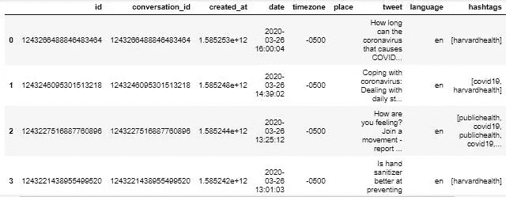

# 推文主题建模:使用 Twint 抓取推文

> 原文：<https://pub.towardsai.net/tweet-topic-modeling-using-twint-to-scrape-tweets-part-1-a9274e5199d2?source=collection_archive---------3----------------------->

## [网页抓取](https://towardsai.net/p/category/web-scraping)，[编程](https://towardsai.net/p/category/programming)

## 这是一个多部分的系列，展示了如何为任何 tweets 集合收集、预处理、应用和可视化短文本主题建模


拥有健康专用 Twitter 账户的主要新闻来源(*作者图片*)

***免责声明:*** *本文仅出于教育目的。我们不鼓励任何人抓取网站，尤其是那些可能有条款和条件反对此类行为的网站。*

# 介绍

主题建模是一种无监督的机器学习方法，目标是找到文本文档集合(语料库)中的“隐藏”主题(或聚类)。它真正的优势在于，你不需要带标签或带注释的数据，而是只接受原始文本数据作为输入，这也是它不受监督的原因。换句话说，模型在看到数据时并不知道主题是什么，而是使用所有文档中单词之间的统计关系来生成它们。

最流行的主题建模方法之一是**潜在狄利克雷分配(LDA)** ，这是一种生成概率模型算法，揭示了管理文档语义的潜在变量，这些变量代表抽象主题。LDA(以及一般的主题建模)的典型应用是将其应用于一组新闻文章，以识别共同的主题或话题，如科学、政治、金融等。然而，LDA 的一个缺点是它不能很好地处理较短的文本，如 **tweets。**这是最近的**短文本主题建模(STTM)** 的方法，其中一些建立在 LDA 之上，派上用场并且表现更好！

这一系列帖子旨在展示和解释如何使用 Python 来执行和应用特定的 STTM 方法(**Gibbs Sampling Dirichlet Mixture Model**或 **GSDMM** )来处理 Twitter 上的健康推文。它将是数据搜集/清理、编程、数据可视化和机器学习的结合。我将在接下来的 4 篇文章中依次讨论所有主题:

> ***第一部分:从 Twitter 中抓取推文***

[*第二部分:清理和预处理推文*](https://medium.com/towards-artificial-intelligence/tweet-topic-modeling-part-2-cleaning-and-preprocessing-tweets-e3a08a8b1770)

[*第三部分:应用短文本主题建模*](https://medium.com/towards-artificial-intelligence/tweet-topic-modeling-part-3-using-short-text-topic-modeling-on-tweets-bc969a827fef)

[*第四部分:可视化主题建模结果*](https://medium.com/towards-artificial-intelligence/tweet-topic-modeling-part-4-visualizing-topic-modeling-results-with-plotly-66d5dbaaf7fb)

这些文章不会深入到 LDA 或 STTM 的细节，而是解释他们的直觉和需要知道的关键概念。鼓励有兴趣对 LDA 有更透彻的统计理解的读者查看这些伟大的资源 [**这里**](http://www.cs.columbia.edu/~blei/papers/Blei2012.pdf) 和 [**这里**](https://ldabook.com/index.html) 。

作为先决条件，确保你的电脑上安装了 [Jupyter Notebook](https://jupyter.readthedocs.io/en/latest/install.html) 、 [Python](https://www.python.org/downloads/) 、&、 [Git](https://git-scm.com/downloads) 。

好了，我们开始吧！

# **第 1 部分:**使用 Twint 从 Twitter 中抓取推文

任何机器学习或数据分析任务最重要的第一步是获得所需的数据。

在本次演示(以及后续文章)中，我们将浏览一个例子，该例子使用了 2014 年 1 月至 2020 年 3 月之间的推文，这些推文是从各种特定于健康的新闻 Twitter 帐户(如 CNN、福克斯新闻频道、BBC、哈佛等)中收集的。*该数据集的灵感来自 2020 年冠状病毒健康疫情；其动机是探索和理解各种新闻来源和时间的任何趋势和/或差异。另外，你可以选择抓取任何你喜欢的 tweet 域名，因为这个指南是为任何场景设计的，这就是整个过程的美妙之处！*


拥有特定健康推特账户的主要新闻来源(图片由作者提供)

*更进一步——如果你已经有了自己的 tweet 数据集(或者坦率地说任何文本数据集)，你可能想跳过这个系列的这一部分，直接进入* [*第二部分*](https://medium.com/towards-artificial-intelligence/tweet-topic-modeling-part-2-cleaning-and-preprocessing-tweets-e3a08a8b1770) *开始建模的数据处理。*

## **安装和使用 Twint**

Twint 是一个用 Python 编写的高级 Twitter 抓取工具，允许在不使用 Twitter API 的情况下从 Twitter 帐户中抓取 tweets。要了解使用 Twint 的更多好处，请查看下面有用的 Github。

[](https://github.com/twintproject/twint) [## twintproject/twint

### 没有认证。没有 API。没有限制。Twint 是一个用 Python 编写的高级 Twitter 抓取工具，它允许…

github.com](https://github.com/twintproject/twint) 

首先，我们必须确保安装了 Twint。您可以通过在终端中运行以下任一命令来实现这一点。

```
pip3 install twint
```

如果使用 PIP，请确保您拥有最新版本的 Twint(自 2020 年 12 月起为 2.1.21 ),因为它可能不会总是获取最新版本。如果为了解决以前的错误而进行了更新，这可能会导致抓取工具出现问题。如果是这种情况，最好使用下面的命令克隆并安装存储库。

```
git clone --depth=1 [https://github.com/twintproject/twint.git](https://github.com/twintproject/twint.git)
cd twint
pip3 install . -r requirements.txt
```

## **创建刮刀程序**

首先，让我们导入我们需要的内容，并创建一个我们想从 Twitter 上收集的活跃用户帐户列表。

```
import twint
import time
import pandas as pdtwitter_user_handles = 
['bbchealth', 'foxnewshealth','GdnHealthcare',  'KHNews', 'latimeshealth', 'NBCNewshealth', 'NPRHealth', 'NYTHealth', 'Reuters_Health', 'USNewsHealth', 'WSJHealth', 'TIMEHealth', 'HarvardHealth']
```

为了创建负责抓取的程序，我们需要使用`twint.Config()`初始化 Twint 配置，并定义我们想要抓取的任何配置参数。这包括配置搜索的用户句柄、日期范围、数据输出、语言、最大记录等。这里，我们将遍历所有用户，并将结果记录存储到一个数据框中。*注意:根据你将要抓取的潜在推文数量，你可能偶尔会收到一个错误或者无法一次抓取所有内容，因为 Twitter 有时会限制大量的数据请求。在这种情况下，您可能需要在日期范围内进行小批量处理，然后再将它们合并。*

```
# loop through each account using same configuration 
for username in twitter_user_handles:
 c = twint.Config()
 c.Lang = "en"
 c.Username = username
 c.Since = '2014-01-01'
 c.Until = '2020-03-28'
 c.Pandas = True
 c.Store_pandas = True
 c.Pandas_au = True
 c.Pandas_clean = False
 twint.run.Search(c)# store in data frame
tweets_df= twint.storage.panda.Tweets_df
```

`c.Store_pandas`允许我们将推文保存到熊猫数据框中。将`c.Pandas_au` 设置为`True`允许我们在每次迭代时自动更新数据帧，而将`c.Pandas_clean`设置为 False 可确保每次刮擦时数据帧不会被清除干净。



Twint 创建的原始数据框

接下来，我们可以将我们的推文保存到 csv 文件中。

```
tweets_df.to_csv(r’data/health_tweets.csv’, index = False,    
                 header=True)
```

如前所述，对于较大的数据提取，我们很可能不得不成批抓取。我们可以很容易地将数据合并成一个最终的数据帧和 csv 格式。

```
import glob
import pandas as pd

data_dir = 'data/'           

tweets_df = pd.concat([pd.read_csv(file) for file in  
                      glob.glob(data_dir+'*.csv')],  
                      ignore_index=True)tweets_df.to_csv(r’data/health_tweets.csv’, index = False,   
                 header=True)
```

瞧👌—我们成功地收集了推文数据，并将其全部保存在一个 csv [文件](https://github.com/bicachu/short-text-topic-modeling-tutorial/blob/main/data/health_tweets.csv)中！在我们的[下一部分](https://medium.com/towards-artificial-intelligence/tweet-topic-modeling-part-2-cleaning-and-preprocessing-tweets-e3a08a8b1770)中，我们将对推文进行预处理，包括应用词汇化，让它们为主题建模和进一步的探索性分析做好准备。

*注意:在以下系列中提供和使用的 CSV 文件还将包括用户句柄* `*cnnhealth*` *的 tweets，因为该帐户在抓取时是活动的，但现在不再是了。*

## 完整的刮刀程序代码

[](/tweet-topic-modeling-part-2-cleaning-and-preprocessing-tweets-e3a08a8b1770) [## Tweet 主题建模第 2 部分:清理和预处理 tweet

### 这是一个多部分的系列，展示了如何为任何集合抓取、预处理、应用和可视化短文本主题建模…

pub.towardsai.net](/tweet-topic-modeling-part-2-cleaning-and-preprocessing-tweets-e3a08a8b1770) 

**参考资料和其他有用资源**

*   LDA 上的[原文](https://ai.stanford.edu/~ang/papers/nips01-lda.pdf)
*   [LDA 小册子](https://ldabook.com/)指南
*   关于 STTM 的[原文](https://dl.acm.org/doi/10.1145/2623330.2623715)GSD mm
*   Twint [GitHub](https://github.com/twintproject/twint)
*   [可在 Twint 中使用的配置列表](https://github.com/twintproject/twint/wiki/Configuration)
*   UCI 机器学习知识库— [健康新闻推文数据集](https://archive.ics.uci.edu/ml/datasets/Health+News+in+Twitter)