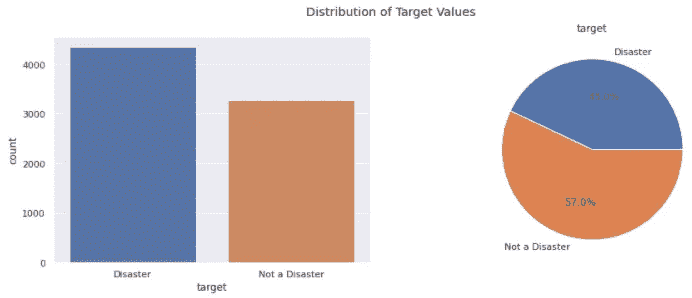
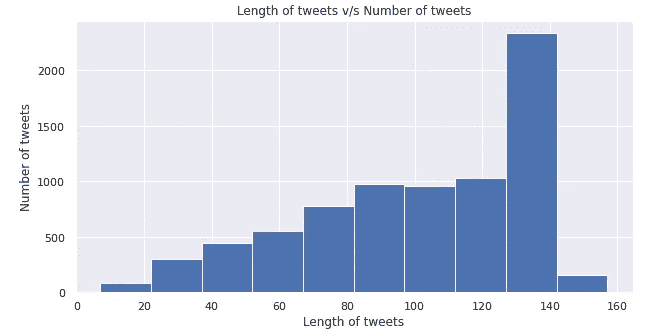
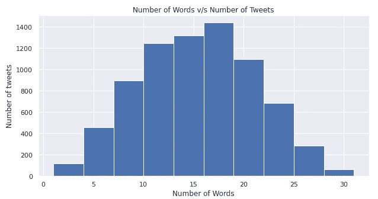
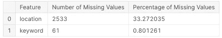
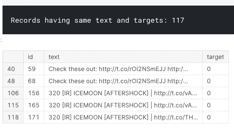
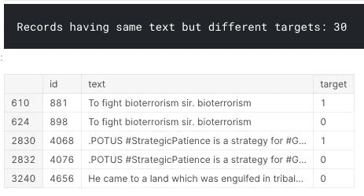
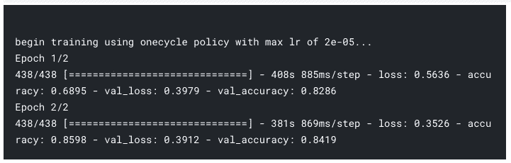
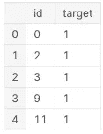
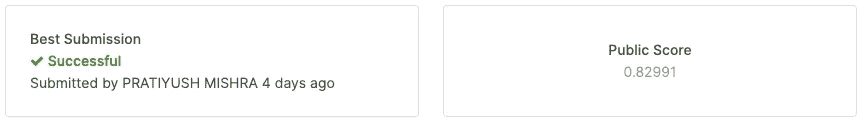

# 使用 Bert 进行推文分析

> 原文：<https://pub.towardsai.net/tweets-analysis-using-bert-af211bc28f2a?source=collection_archive---------7----------------------->

## [自然语言处理](https://towardsai.net/p/category/nlp)

## Bert 的一个简化实现，使用 ktrain 来预测哪些 Tweets 是关于真实灾难的。


本教程包括一个简化的、干净的 Bert 实现，使用 ktrain 对 tweets 进行分类，这使我在 kaggle 的排行榜上名列前 15%。

# 问题陈述

> 预测哪些推文是关于真实的灾难，哪些不是用 Bert 模型。

# 涉及的步骤

1.  数据可视化
2.  缺失值分析
3.  探索性数据分析(EDA)和异常值检测。
4.  使用 Ktrain 进行文本预处理。
5.  Ktrain 模型和培训
6.  预测和评估

[链接原 kaggle 笔记本](https://www.kaggle.com/pratiyushmishra/nlp-eda-cleaning-lstm-and-simplified-bert/)

# 导入库

我们将使用 numpy 和 pandas 处理我们的数据集，使用 matplotlib 和 seaborn 进行数据可视化，使用 ktrain 实现我们的 bert 模型。

```
import numpy as np
import pandas as pd
import re
from matplotlib import pyplot as plt
import seaborn as sns
import tensorflow as tf
import ktrain *# For Bert Model Implementation.*
from ktrain import text *# Preprocessing text for the Bert Model.*
sns.set()
```

# 加载数据集

这里我们使用了来自[的自然语言处理数据集和灾难微博](https://www.kaggle.com/c/nlp-getting-started/data)

```
train = pd.read_csv('../input/nlp-getting-started/train.csv') *# Training Data*
test = pd.read_csv('../input/nlp-getting-started/test.csv') *# Testing Data*
train_len = len(train) # Size of training data
test_len = len(test) # Size of testing data
print('Training Dataset:',train_len)
print('Testing Dataset:',test_len)
train.head()
```

# 数据可视化

*   **目标值的分配**

```
plt.figure(figsize=(15,5))
plt.subplot(1, 2, 1)
ax = sns.countplot(x='target',data=train,label=['Not a Disaster','Disaster'])
ax.set_xticklabels(['Disaster','Not a Disaster'])
plt.suptitle("Distribution of Target Values")
terms = np.array(['Disaster', 'Not a Disaster'])
weigtage = np.array([len(train[train['target'] == 1]),len(train[train['target'] == 0])])
plt.subplot(1, 2, 2)
plt.pie(weigtage,labels=terms, autopct="**%1.1f%%**")
plt.title('target')
plt.show()
```



*   **推文长度 v/s 推文数量**

```
plt.figure(figsize=(10,5))
word_len = train['text'].map(lambda x: len(x))
plt.hist(word_len)
plt.xlabel('Length of tweets')
plt.ylabel('Number of tweets')
plt.title('Length of tweets v/s Number of tweets')
plt.show()
```



*   **字数 v/s 推文数**

```
plt.figure(figsize=(10,5))
word_len = train['text'].str.split().map(lambda x: len(x))
plt.hist(word_len)
plt.xlabel('Number of Words')
plt.ylabel('Number of tweets')
plt.title('Number of Words v/s Number of Tweets')
plt.show()
```



# 缺失值分析

我们首先会看到所有缺少值的特征。这将包括来自训练和测试数据集的数据。

```
def missing_val_analysis(data):
    missing_values = data.isnull().sum()
    missing_values = missing_values[missing_values > 0].sort_values(ascending = False)
    missing_values_data = pd.DataFrame(missing_values)
    missing_values_data.reset_index(level=0, inplace=True)
    missing_values_data.columns = ['Feature','Number of Missing Values']
    missing_values_data['Percentage of Missing Values'] = (100.0*missing_values_data['Number of Missing Values'])/len(data)
    return missing_values_data
```

我们在上面定义了一个函数，它给出了一个包含缺失值的要素的良好数据框。

```
missing_val_analysis(train) *# Missing value analysis in the training data.*
```



训练数据中缺少值

因为缺少关键字的行数非常少，所以我们只需用一个空字符串填充所有缺少的值，将它添加到文本的末尾并删除该列。至于位置，它不太可能有助于模型的预测，因此我们将完全放弃这个特性。我们也会对测试数据采取同样的行动。

```
# Training Data
train['keyword'].fillna('',inplace=True)
train['text'] = train['text'] + ' ' + train['keyword']
train['text'] = train['text'].apply(lambda x: x.strip())
train.drop(['keyword'],axis=1,inplace=True)
train.drop(['location'],axis=1,inplace=True)## Testing Data
test['keyword'].fillna('',inplace=True)
test['text'] = test['text'] + ' ' + test['keyword']
test['text'] = test['text'].apply(lambda x: x.strip())
test.drop(['keyword'],axis=1,inplace=True)
test.drop(['location'],axis=1,inplace=True)
```

# 探索性数据分析(EDA)和异常值检测。

仔细检查训练数据集后，可以看到多条记录都有相同的推文，其中一些推文的预测相互矛盾。因此，我们将对此进行分析，并删除重复记录和异常值。

```
duplicate_records = train[train.duplicated(['text','target'],keep=False)] *# Duplicate records with same targets.*
print('Records having same text and targets:',len(duplicate_records))
duplicate_records.head()
```



我们会为每条这样的推文保留一份副本，删除重复的。

```
train.drop_duplicates(['text','target'],inplace=True) *# Dropping the duplicate records having same targets.*
```

现在剩下的可能是异常值，也就是具有矛盾预测的相同记录。

```
contradicting_records = train[train.duplicated(['text'],keep=False)] *# Duplicate records with outliers.*
print('Records having same text but different targets:',len(contradicting_records))
contradicting_records.head()
```



**由于记录的数量非常少，因此通过人工检查，创建一个包含所有需要移除的异常值的索引的列表。**

```
records_to_drop = [610,2832,3243,3985,4244,4232,4292,4305,4306,4312,4320,4381,4618,5620,6091,6616] *# Outliers.*

train.drop(records_to_drop,inplace=True) *# Dropping the outliers.*
train = train.reset_index(drop=True) *# Resetting the indexes.*
```

# 使用 Ktrain 进行文本预处理

我们将使用 ktrain 处理推文，将它们转换成可以提供给 bert 模型的形式，但在此之前，我们将删除推文中的 URL 和特殊字符。

```
def remove_url(text):
    return re.sub(r'https?://\S+|www\.\S+','',text)
def remove_char(text):
    return re.sub(r'[^A-Za-z0-9 ]+', '', text)

def remove_preprocess(text):
    return remove_char(remove_url(text))train['text'] = train['text'].apply(lambda x: remove_preprocess(x))
test['text'] = test['text'].apply(lambda x: remove_preprocess(x))
```

现在，我们将训练数据分成训练和验证数据集，并使用 ktrain 对推文进行预处理。

```
train_data = train.head(7000).copy()
val_data = train.tail(525).copy()(X_train, y_train), (X_val, y_val), preproc = text.texts_from_df(train_df=train_data,
text_column = 'text',label_columns = 'target',val_df = val_data,maxlen = 256,preprocess_mode = 'bert')
```

因此，ktrain 对数据进行预处理，并为我们提供训练和验证数据集，这些数据集现在可以输入 bert 模型。

# Ktrain 模型和培训

```
model = text.text_classifier(name = 'bert',
                             train_data = (X_train, y_train),
                             preproc = preproc)learner = ktrain.get_learner(model=model, train_data=(X_train,       y_train), val_data = (X_val, y_val), batch_size = 16)learner.fit_onecycle(lr = 2e-5, epochs = 2)

predictor = ktrain.get_predictor(learner.model, preproc)
```



伯特模型训练

使用 GPU 加速器在 kaggle 中训练模型大约需要 15 分钟。

# 预测和评估

我们现在将根据测试数据集运行我们的模型。该模型可以直接获取原始数据集，并对其进行处理和预测值。

```
result = pd.DataFrame()
result['id'] = test['id']
result['target'] = predictor.predict(test['text'].values)
result['target'] = result['target'].map(lambda x:1 if x=='target' else 0)
result.head()
```



我们模型的预测

因此，我们得到了我们的结果，我们可以提交给 kaggle，看看我们的表现如何。



我在 Kaggle 上的提交

因此，我们得到了 0.82991 的分数，使我在 kaggle 排行榜上名列前 15%。这个分数可以通过实验模型的超参数的不同值来进一步提高。

非常感谢你阅读这篇文章。反馈和掌声是最受欢迎的！！