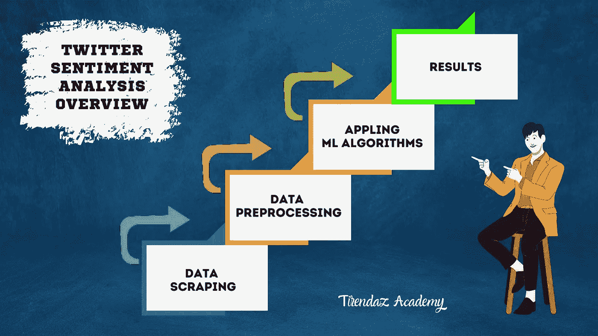
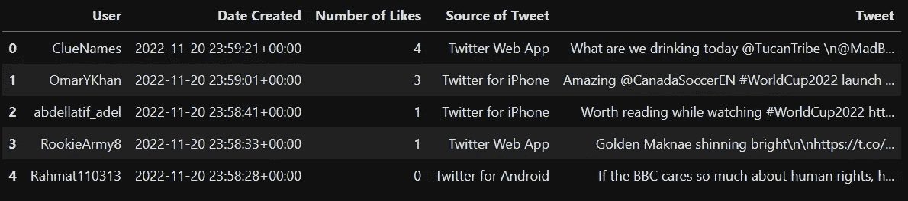
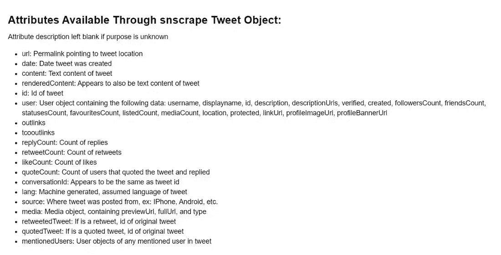
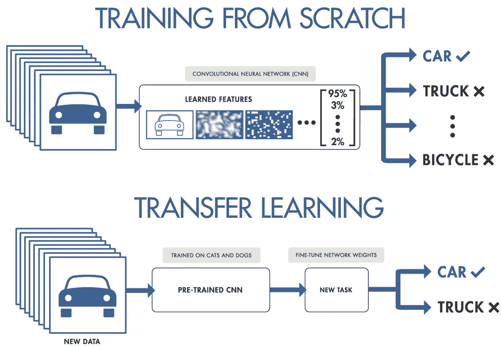
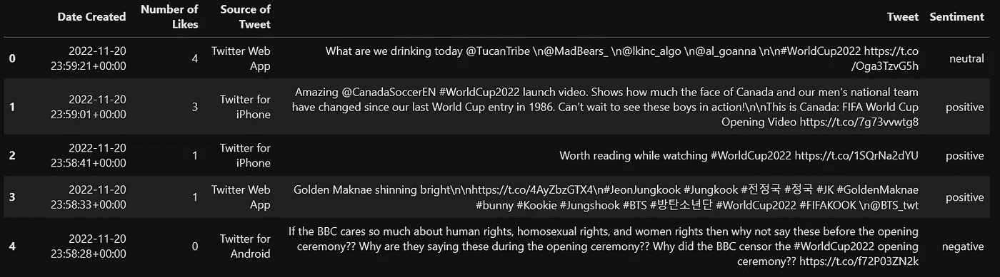
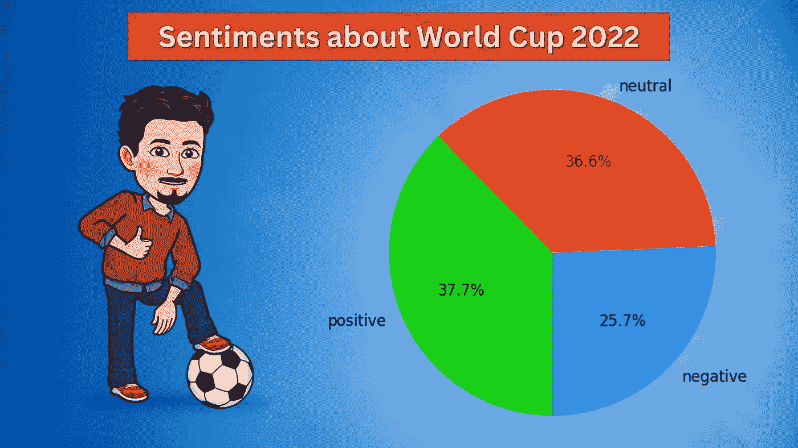
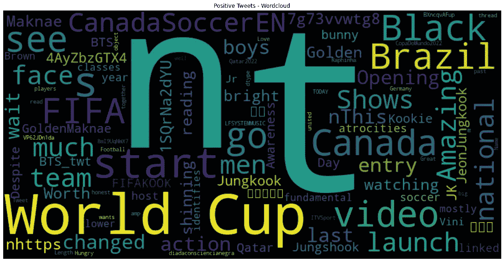
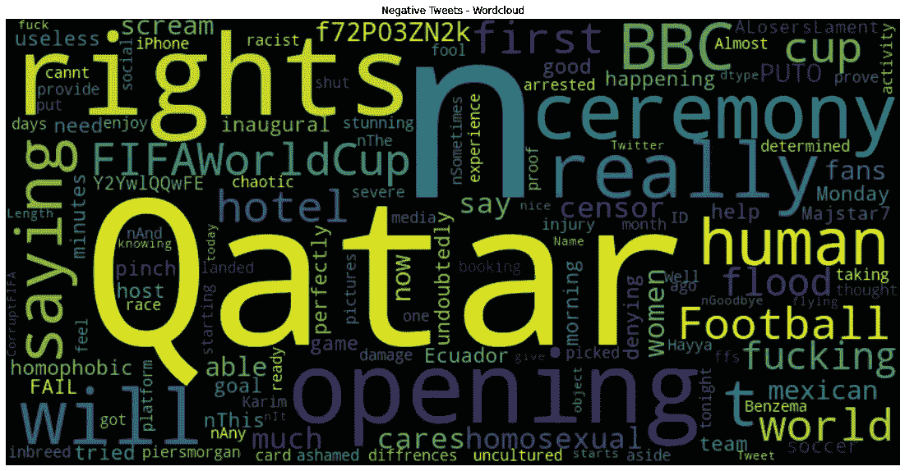

# 推特情绪分析:2022 年世界杯

> 原文：<https://pub.towardsai.net/twitter-sentiment-analysis-fifa-world-cup-2022-bba7e4ffc597?source=collection_archive---------0----------------------->

## 用 Snscrape 和拥抱脸进行情感分析的实用指南


[图片由 Freepik 拍摄](https://www.freepik.com/free-photo/soccer-players-action-professional-stadium_28993834.htm#query=world%20cup&position=41&from_view=search&track=sph)

足球是全世界最受欢迎的运动之一。每四年举办一次的全球性足球赛事国际足联世界杯今年在卡塔尔举行。[在卡塔尔举办世界杯的决定引发了一些争议，包括腐败和侵犯人权的指控。](https://www.reuters.com/lifestyle/sports/world-cup-2022-why-is-qatar-controversial-location-fifa-tournament-2022-11-15/)

那么，足球爱好者对 2022 年国际足联世界杯有什么看法呢？为了找到答案，我将在这篇博文中使用 Twitter 上的#WorldCup2022 标签进行一次 Twitter 情绪分析。以下是我要讲的内容:

*   什么是情感分析？
*   什么是社交媒体抓取？
*   怎么用 Snscrape 刮？
*   如何进行推特情感分析？

让我们开始吧！

# 什么是情感分析？

*情感分析*是一种 NLP，旨在根据数据的情感来标记数据，如正面、负面和中性。这种分析有助于公司了解其客户对其产品或服务的感受，或识别公众对某一特定话题的看法趋势。例如，像奥迪这样的公司可以通过检查下图所示的 Twitter 份额来了解人们是否喜欢其新车的颜色。


[一条关于奥迪的推文](https://twitter.com/garthcupido1/status/1512097091467759630)

# 什么是社交媒体抓取？

随着技术的发展，现在通过社交网站表达各种情绪、感受和想法变得更加容易。*社交媒体抓取*是从社交媒体平台提取数据的过程。使用最多的社交媒体平台之一是 Twitter。[当我们查看统计数据](https://www.demandsage.com/twitter-statistics/)时，截至 2022 年，Twitter 每月约有 4.5 亿活跃用户，每秒发布 6000 条推文。

Twitter 是数据科学家最重要的数据源之一。数据科学家可以用网络抓取工具从 Twitter 中提取数据。有几个库可以做到这一点，比如 Tweepy 和 Snscrape。让我们来看看这些库的优缺点。

## 十二岁

Tweepy 是一个易于使用的 Python 库，允许您访问 Twitter API。你可以把 Twitter API 和这个库连接起来，抓取你想要的推文。然而，这个库有一些缺点。Twitter API 的标准版本只允许你在一个时间线内提取 3200 条推文。你可以从一个用户的账户上收集多少条推文是有限制的。你可以在这里找到更多关于这些限制[的信息。](https://developer.twitter.com/en/docs/twitter-api)

## Snscrape

另一个可以用来从 Twitter 上收集数据的库是 [Snscrape](https://github.com/JustAnotherArchivist/snscrape) 。Snscrape 是一个用于社交网络服务的数据抓取工具，可以帮助你提取用户资料、推文内容、标签或搜索等数据。它也不需要使用 Twitter API。通过 Snscrape，你还可以从脸书、Instagram、Reddit 和 Telegram 等其他服务中抓取数据。

> **免责声明:**本文仅出于教育目的。我们不鼓励任何人抓取网站，尤其是那些可能有条款和条件反对此类行为的网站。



Twitter 情绪分析概述(图片由作者提供)

# 怎么用 Snscrape 刮？

在这一节中，我们将在深入 Twitter 情感分析之前，先看一下 Snscrape 的简要概述，以了解它的结构/理念。首先，我们将使用以下命令安装这个库:

```
!pip install snscrape
```

接下来，让我们从#WorldCup2022 中检索锦标赛第一天发送的 1000 条推文，然后将这些数据转换为 Pandas DataFrame。注意，你可以用 [*这个本子*](https://github.com/TirendazAcademy/NLP-with-Transformers/blob/main/Twitter%20Sentiment%20Analysis%20with%2030k%20Tweets.ipynb) 跟着这个分析。

```
# Importing necessary libraries
import snscrape.modules.twitter as sntwitter
import pandas as pd

# Creating a list to append all tweet attributes(data)
tweets = []

# Creating query
query = '#WorldCup2022 lang:en since:2022-11-20 until:2022-11-21'
q = sntwitter.TwitterSearchScraper(query)

# Using TwitterSearchScraper to scrape data and append tweets to list
for i, tweet in enumerate(q.get_items()):
    if i>1000:
        break
    tweets.append([tweet.user.username, tweet.date, tweet.likeCount, tweet.sourceLabel, tweet.content])

# Converting data to dataframe
tweets_df = pd.DataFrame(tweets, columns=["User", "Date Created", "Number of Likes", "Source of Tweet", "Tweet"])
tweets_df.head()
```



#WorldCup2022 标签中的一些推文

瞧啊。我们使用 Snscrape 只需要几个参数就可以轻松地从 Twitter 上抓取推文。Snscrape tweet 对象有很多参数。您可以在下图中看到这些参数。



[图像来源](https://betterprogramming.pub/how-to-scrape-tweets-with-snscrape-90124ed006af)

是时候进行一次 Twitter 情绪分析了，看看足球爱好者对 2022 年世界杯的看法。

# 带有拥抱脸的 Twitter 情感分析


[图像来源](https://twitter.com/alimo_philip/status/1599141528206655488/photo/1)

到目前为止，我们已经介绍了什么是情感分析和社交媒体抓取，以及如何从 Twitter 收集推文。在本节中，我们将带您了解如何进行 Twitter 情绪分析。在向您展示这个分析之前，让我解释几个您需要知道的 NLP 概念。

## 迁移学习

要进行情感分析，您可以从头开始构建一个模型。在分析大数据时，这种方法需要花费大量的时间和金钱。在处理大数据时，我建议使用迁移学习技术。*迁移学习*是一种机器学习方法，其中在一项任务上训练的模型被重新用于另一项相关任务。



[从零开始培训 vs 迁移学习](https://pin.it/4DkaUbn)

虽然迁移学习已经成为计算机视觉中的标准方法，但这种方法多年来都不适合 NLP，因为它需要大量的标记数据。2017 年以后，随着基于 transformers 的 BERT、GPT3 等模型的发展，迁移学习技术也被用于 NLP。然而，在使用这些模型时出现了一些问题，例如:

*   在对模型架构进行编码时，使用不同的框架，如 PyTorch 或 TensorFlow。
*   从服务器加载预先训练的模型。
*   微调预训练模型。

为了无痛苦地解决这些问题，拥抱脸框架被开发出来。

## 什么是抱脸？

[*抱脸*](https://huggingface.co/) 是一个数据科学平台和大型开源社区，提供帮助用户构建、训练和部署机器学习模型的工具。它为各种变压器型号提供了标准化接口，使它们适应新的使用任务。你也可以使用这个框架与三个主要的深度学习库(PyTorch、TensorFlow 和 JAX)合作。

## 什么是拥抱脸枢纽？

[*抱紧脸中枢*](https://huggingface.co/docs/hub/index) 是一个开源平台，人们可以在这里轻松协作，创建机器学习模型。例如，你可以在这个中心找到超过 762 个公开可用的[情感分析模型](https://huggingface.co/models?pipeline_tag=text-classification&sort=downloads&search=sentiment)。

我们将在此分析中使用的模型是`[cardiffnl/twitter-roberta-base-sentiment-latest](https://huggingface.co/cardiffnlp/twitter-roberta-base-sentiment-latest)`模型，它是基于 roBERTa 的。该模型在 2018 年 1 月至 2021 年 12 月的约 1.24 亿条推文中进行了训练。加载该模型最简单的方法是使用管道。管道自动加载您想要的模型及其预处理类。让我们用管道方法加载我们的模型:

```
# Installing transformers library
# !pip install transformers

from transformers import pipeline
sentiment_analysis = pipeline(model="cardiffnlp/twitter-roberta-base-sentiment-latest")
```

厉害！我们的模型已经可以进行预测了。如果您愿意，也可以使用[不同型号](https://huggingface.co/models?pipeline_tag=text-classification&sort=downloads&search=sentiment)进行此分析。

## 运行 Twitter 情绪分析

让我们把迄今为止我们所谈论的放在一起，进行一次推特情感分析。为此，我们首先在#WorldCup2022 标签中抓取锦标赛第一天的推文，然后用 for 循环查找每条推文中的情绪。

```
 # Creating a list to append all tweet attributes(data)
tweet_sa = []

# Creating query
query = '#WorldCup2022 lang:en since:2022-11-20 until:2022-11-21'
q = sntwitter.TwitterSearchScraper(query)

# Preprocess text (username and link placeholders)
def preprocess(text):
    new_text = []
    for t in text.split(" "):
        t = '@user' if t.startswith('@') and len(t) > 1 else t
        t = 'http' if t.startswith('http') else t
        new_text.append(t)
    return " ".join(new_text)

# Predicting the sentiments of tweets
for i, tweet in enumerate(q.get_items()):
    if i>30000:
        break
    content = tweet.content
    content = preprocess(content)
    sentiment = sentiment_analysis(content)
    tweet_sa.append({"Date Created": tweet.date, "Number of Likes": tweet.likeCount, 
                     "Source of Tweet": tweet.sourceLabel, "Tweet": tweet.content, 'Sentiment': sentiment[0]['label']})
```

我们现在有了推特上的观点。为了了解足球爱好者对 2022 年 FIFA 世界杯的看法，让我们首先将结果转换成一个数据帧，然后看看这个数据帧的前五行。

```
import pandas as pd
pd.set_option('max_colwidth', None)

# Converting data to dataframe
df = pd.DataFrame(tweet_sa)
df.head()
```



如你所见，我们有一个 Twitter 数据集，其中包含一些信息，如日期、喜欢、推文来源、推文和观点。你可以在这里找到这个数据集[。让我们用一个饼图来直观地展示所有这些标签。](https://www.kaggle.com/datasets/tirendazacademy/fifa-world-cup-2022-tweets)

# 数据可视化

在预测了标签之后，查看这些标签的分布是一个好主意。首先，让我们根据情绪栏对数据进行分组，并查看情绪:

```
import matplotlib.pyplot as plt

# Let's count the number of tweets by sentiments
sentiment_counts = df.groupby(['Sentiment']).size()
print(sentiment_counts)
```

```
# Output:
Sentiment
negative    5784
neutral     8251
positive    8489
dtype: int64
```

接下来，我们根据这几组来画一个饼状图。

```
# Drawing a pie plot
fig = plt.figure(figsize=(6,6), dpi=100)
ax = plt.subplot(111)
sentiment_counts.plot.pie(ax=ax, autopct='%1.1f%%', startangle=270, fontsize=12, label="")
```



标签的分布(图片由作者提供)

正如你所看到的，正面和中性推文的百分比彼此接近。负面推文比例最低。事实证明，足球迷对 2022 年国际足联世界杯的看法更加积极。

# 生成单词云

现在，让我们创建一个单词云，并使用 [worldcloud](https://amueller.github.io/word_cloud/index.html) 库来查看每个情绪中有哪些单词脱颖而出。首先，我们来看看正面推文的词云。

```
from wordcloud import WordCloud
from wordcloud import STOPWORDS

# Wordcloud with positive tweets
positive_tweets = df['Tweet'][df["Sentiment"] == 'positive']
stop_words = ["https", "co", "RT", "WorldCup2022"] + list(STOPWORDS)
positive_wordcloud = WordCloud(width=800, height=400, background_color="black", stopwords = stop_words).generate(str(positive_tweets))
plt.figure(figsize=[20,10])
plt.title("Positive Tweets - Wordcloud")
plt.imshow(positive_wordcloud, interpolation="bilinear")
plt.axis("off")
plt.show()
```



与正面推文相关的词

一些与正面推文相关的词包含 FIFA、加拿大、黑人、巴西、start 等。接下来，我们来看看负面推文的词云。

```
# Wordcloud with negative tweets
negative_tweets = df['tweet'][df["sentiment"] == 'negative']
stop_words = ["https", "co", "RT", "WorldCup2022"] + list(STOPWORDS)
negative_wordcloud = WordCloud(width=800, height=400, background_color="black", stopwords = stop_words).generate(str(negative_tweets))
plt.figure(figsize=[20,10])
plt.title("Negative Tweets - Wordcloud")
plt.imshow(negative_wordcloud, interpolation="bilinear")
plt.axis("off")
plt.show()
```



与负面推文相关的词

与负面推文相关的一些词:是权利、卡塔尔、BBC、开场、人类、仪式等。

# 最后的想法

社交媒体是人们自由分享想法的平台。Twitter 是使用最多的社交媒体平台之一。这个平台上的数据对公司来说是金子。公司可以利用这些数据做出更准确的决策。

在这篇博文中，我首先向您展示了如何使用 Snscrape 从 Twitter 中抓取数据。接下来，我解释了如何在拥抱脸中使用预先训练的模型进行情感分析。我们探索了足球迷对 2022 年世界杯的想法。我们建立的模型预测了更多积极的标签。事实证明，足球迷对 2022 年国际足联世界杯的看法更加积极。

就是这样。感谢阅读。我希望你喜欢它。你可以在这里找到我在这个博客上用过的笔记本。别忘了在[YouTube](https://youtube.com/tirendazacademy)|[Twitter](https://twitter.com/TirendazAcademy)|[insta gram](https://www.instagram.com/tirendazacademy)|[抖音](https://www.tiktok.com/@tirendazacademy)上关注我们👍

[](https://heartbeat.comet.ml/7-steps-to-become-a-machine-learning-engineer-698cba0bc43c) [## 成为机器学习工程师的 7 个步骤

### 包含课程和书籍的综合指南

heartbeat.comet.ml](https://heartbeat.comet.ml/7-steps-to-become-a-machine-learning-engineer-698cba0bc43c) [](https://medium.com/geekculture/6-steps-to-become-a-machine-learning-expert-5a1f155f7207) [## 成为机器学习专家的 6 个步骤

### 成为机器学习专家需要知道的一切。

medium.com](https://medium.com/geekculture/6-steps-to-become-a-machine-learning-expert-5a1f155f7207) 

# 资源

*   [使用 Python 开始情感分析](https://huggingface.co/blog/sentiment-analysis-python)
*   [推特情绪分析](https://heartbeat.comet.ml/twitter-sentiment-analysis-part-1-6063442c06f3)
*   [用 Python 进行网页抓取](https://www.freecodecamp.org/news/python-web-scraping-tutorial/)
*   [用变形金刚进行自然语言处理](https://www.amazon.com/Natural-Language-Processing-Transformers-Applications/dp/1098103246)