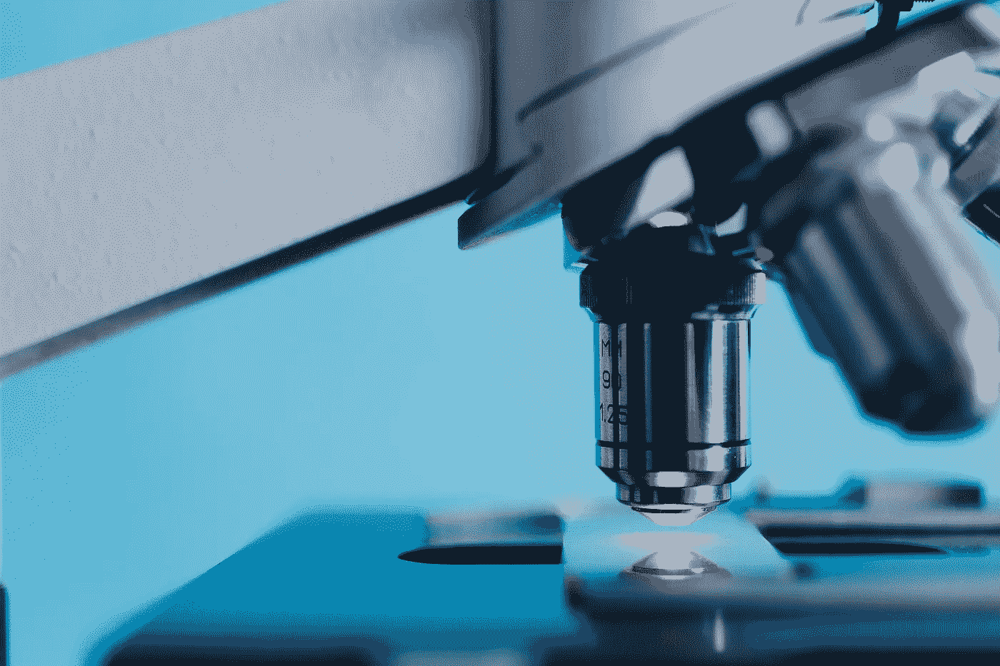
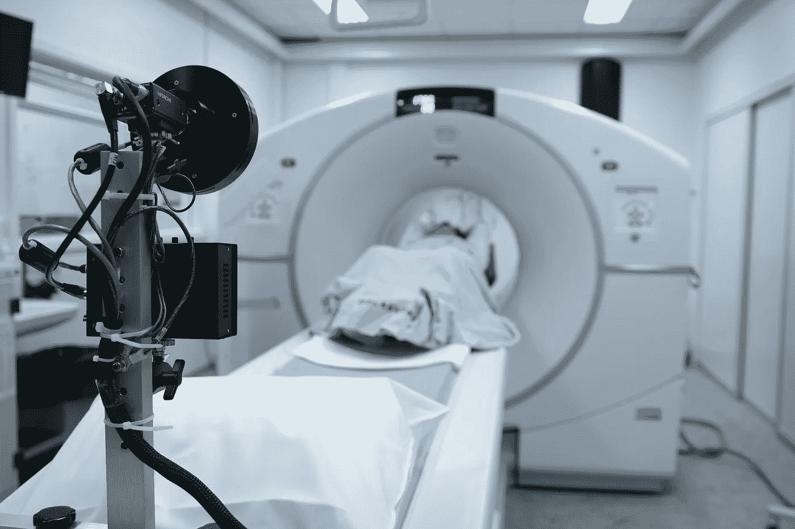
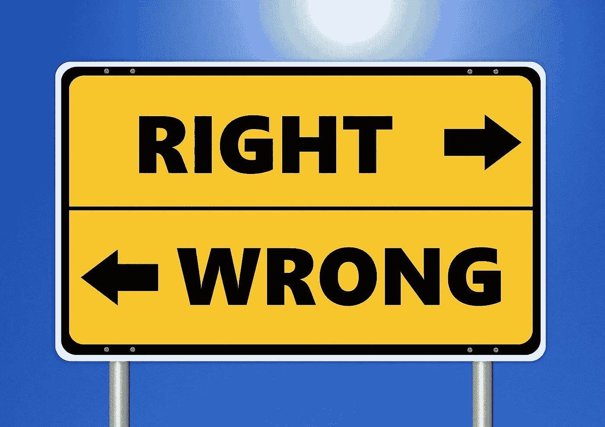

# 在医疗行业应用人工智能的两大障碍

> 原文：<https://pub.towardsai.net/two-major-barriers-to-apply-ai-in-the-medical-industry-6a3243dafa7a?source=collection_archive---------3----------------------->

由 [kkolosov](https://pixabay.com/users/kkolosov-2105326/) 在 [Pixabay](https://pixabay.com/photos/analysis-biochemistry-biologist-2030265/) 上拍摄的照片

## [人工智能](https://towardsai.net/p/category/artificial-intelligence)，[观点](https://towardsai.net/p/category/opinion)

## 新冠肺炎疫情事件后的人工智能思考

在此次新冠肺炎疫情中，IT 行业可能是受影响相对较小的行业之一。我们已经看到了 Zoom.us 和其他 IT 公司的加速发展，它们实际上已经从这场灾难中“受益”了。事实上，除了交流工具，还有一个曾经很热门的领域，但变得更加流行和有争议。那就是人工智能。

由于许多国家已经遭受或正在遭受医疗资源短缺，特别是医疗专业人员，越来越多的人开始关注人工智能。这是因为人工智能的诞生意味着将我们的手从一些手工和重复的工作中解放出来。

# 新冠肺炎期间的人工智能应用

照片由[图片箱](https://pixabay.com/photos/easter-easter-eggs-corona-mask-5001098/)上的[字体](https://pixabay.com/users/nickype-10327513/)拍摄

人工智能在医疗行业最受欢迎的应用之一是读取断层扫描。当病毒在中国武汉爆发时，资源的短缺很快就显露出来。这座拥有 1000 万人口的大城市受灾非常严重。然而，在 3 月份，一家名为易图的人工智能公司发布了一个人工智能智能评估系统，用于自动读取胸部 CT[1]。这有助于以非常高的准确度诊断新冠肺炎，从而减轻了医生的负担。随后，该系统已在许多其他城市使用，截至 3 月底，已累计协助诊断可疑病例 10 万人。

中国不是唯一一个使用人工智能来促进对抗病毒的国家。事实上，几乎全世界都在这样做。例如，微软和拉筹伯大学也进行了合作，并产生了不错的成果[2]。当然，人工智能在计算机断层摄影中的应用在美国更受欢迎。“放射科医生的角色将在五年内过时”，维诺德·科斯拉说。嗯，虽然我不支持那个观点，但是可以看出 AI 在这方面已经足够有竞争力了。

看起来人工智能在医疗行业会越来越受欢迎。疫情也被认为是加速其增长。然而，在本文中，我将介绍应用程序的两个主要障碍。我不会像其他大多数文章一样一直说“存在伦理问题”，我会列出具体原因并详细讨论。

# 为什么我们需要人工智能来辅助放射诊断？

由 [Pixabay](https://pixabay.com/photos/hospital-equipment-medicine-patient-3098683/) 上的 [Bokskapet](https://pixabay.com/users/bokskapet-7322944/) 拍摄的照片

你可能会认为疫情是一种“黑天鹅”，在我们的历史上和未来都不会经常发生。不管这种说法是否正确，除了减轻医疗系统的负担之外，我们肯定有理由在放射诊所中使用人工智能辅助。就是诊断复杂病例的准确率或者 AI 算法其实比医学专业人士更好。有相当多的研究表明，在某些特定领域，人工智能算法的性能可能会超过单个医疗专业人员。

虽然普遍不支持 AI 会取代放射科医生[4]，但我们不得不承认，它可以辅助放射科医生提高工作表现，大幅缩短诊断时间[5]。

除了性能的提高，引入人工智能辅助放射诊所还有其他一些原因。例如，通过减少诊断时间和减轻放射科医生的负担，价格可能会下降，以便一些相关的医疗服务，如乳腺癌筛查，可以很容易地推广到贫困人口。

另一个例子，人工智能还可以帮助确定病人的优先顺序。因此，有望对高危患者进行更紧急的治疗，从而挽救更多的生命。

我们在医疗行业看到了这么多 AI 应用的积极方面，但为什么让它呈指数级增长如此困难？主要障碍如下。

# 障碍 1:黑箱的本质

照片由 [IraEm](https://pixabay.com/users/iraem-147435/) 在 [Pixabay](https://pixabay.com/photos/danbo-nyangbo-figures-doll-1206485/) 上拍摄

黑盒，意思是它能做好，但我们不知道它怎么能做得这么好。因此，它就像一台装在黑盒子里的机器。你放一些材料进去，然后它会输出你想要的东西。所有内部程序对用户都是隐藏的。

并不是所有的机器学习算法都是黑盒，比如决策树算法。然而，不幸的是，最有效的方法不是经典的机器学习，而是深度学习。

深度学习已经表明，它可以在许多人类曾经很有信心的领域超越人类，比如几年前 Alpha Go 已经破解的围棋。

我们的科学已经发展了几百年。因果律一直是基石。这意味着如果我们不能解释它为什么有效，就很难说服人们相信它。

好吧，假设 AI 不是一个黑匣子，它有时可以在某些领域超越专业人士。你想知道什么？是的，我们肯定想把机器学习模型中的“知识”“学”回来给我们。当然，你和我不是唯一有这种想法的人。在从经过训练的人工智能模型中学习方面有很多研究，例如斯坦福大学所做的研究[6]。超过 10 万张胸部 x 光照片被用来训练一个深度学习模型，然后研究人员试图从这个模型中获得一些线索。然而，没有发现任何有用的东西。深度学习模型只能自学，自学。想象一下，如果有人告诉你，你心脏的寿命主要由你的肩胛骨决定，这几乎没有医学文献支持。那么，你信任这个人吗？即使这个人能非常准确地预测大多数人什么时候会心力衰竭？

基本上，通过一个用于诊断目的的黑盒人工智能算法，主要的风险是我们不知道它何时以及如何会犯任何不可发现但严重的错误。

# 障碍 2:责任归属

[图米苏](https://pixabay.com/users/tumisu-148124/)在 [Pixabay](https://pixabay.com/photos/ethics-right-wrong-ethical-moral-2991600/) 上的照片

在现代社会中，医疗行业已经非常成熟，并受到许多发达国家完善的系统法律和政策的管制。然而，人工智能的应用可能会把它搞砸。

当医生因重大疏忽而犯下严重错误时，违反法律规定的责任很可能会减轻受害者的伤害。但如果它是一个只是一段代码的人工智能算法呢？你可能会认为开发该软件的公司应该有责任测试它，确保它不会出现任何荒谬的事件。然而，情况可能并非如此。

不仅人类会生病，人工智能模型也会生病。我们知道，就一致性而言，它不是 100%可靠的。当然，医疗专业人员也不可能 100%可靠，这是可以接受的，但专业人员是一致的。我们可以预期一个新手可能会犯错误，而一个教授会犯更少的错误。随着成长，新手会变得越来越有经验，犯的错误也会越来越少。但人工智能却不是这样，事实上，随着时间的推移，人工智能算法可能会产生更多的错误，这就是所谓的“漂移”。

机器学习模型通过一定数量的标注数据进行训练。在数学上，我们说我们用于训练模型的数据集具有某种**分布**。预计经过训练的机器学习模型只有在它将要预测的新数据具有相同分布的情况下才能很好地工作。具体来说，实践中的以下任何变化都可能导致现有机器学习模型的严重失败。

*   诊所/医院改变了管理体制
*   机器学习模型被不同的医院使用
*   机器学习模型在国家/世界的不同地区使用。
*   该模型所针对的疾病已经发生了变化，例如由变异的病毒引起的疾病。
*   等等。

当这些发生时，我们应该责怪开发这个模型的组织还是医学研究所“误用”了这个模型？很有争议，很难被监管。

 [## 通过我的推荐链接加入 Medium 克里斯托弗·陶

### 作为一个媒体会员，你的会员费的一部分会给你阅读的作家，你可以完全接触到每一个故事…

medium.com](https://medium.com/@qiuyujx/membership) 

**如果你觉得我的文章有帮助，请考虑加入灵媒会员来支持我和成千上万的其他作家！(点击上面的链接)**

# 摘要

照片由 [StockSnap](https://pixabay.com/users/stocksnap-894430/) 在 [Pixabay](https://pixabay.com/photos/doctors-hospital-people-health-2607295/) 上拍摄

在这篇文章中，我分享了我对医疗行业人工智能应用的一些看法。为什么它如此受欢迎却因为社会化的原因而达到瓶颈。

当然，AI 在医疗行业的壁垒，短期内估计无法逾越。不过，作为一个在数据领域工作的人，我还是普遍看好 AI/ML 的。

可以看出，在克服障碍之前，可能会发生一些变化。

1.  人工智能将不能取代医疗专业人员，但是得到人工智能帮助的医疗专业人员可能会取代那些没有得到人工智能帮助的人。
2.  医疗行业的 AI 可能在发展中国家发展更快，因为它可以降低一些医疗服务的成本，提高效率。
3.  人工智能可能会改变病人和专业人员之间的关系。人工智能算法很可能充当“调度”角色，以提高整个医疗系统的效率。

因此，我支持将人工智能应用于医疗行业，以提高整体效率。这可能是一个比试图利用它来“取代”一些角色更好的应用程序，这听起来很有趣，但不是未来几十年的正确目标。

# 参考

[1]易图为新冠肺炎推出人工智能智能胸部 CT 评估系统

 [## 易图为新冠肺炎推出人工智能智能胸部 CT 评估系统

### 2020 年 3 月 31 日-易图开发的新冠肺炎胸部计算机断层扫描(CT)智能评估系统…

www.itnonline.com](https://www.itnonline.com/content/yitu-launches%C2%A0ai-powered-intelligent-evaluation-system-chest-ct-covid-19) 

[2]拉筹伯大学在 3D 中模拟冠状病毒感染的肺部

 [## 拉筹伯大学 3D 模拟冠状病毒感染的肺部-微软澳大利亚新闻中心

### 混合现实耳机 HoloLens 2 支持临床教育突破微软新闻中心拉筹伯大学…

news.microsoft.com](https://news.microsoft.com/en-au/features/la-trobe-university-models-coronavirus-infected-lung-in-3d/) 

[3]这就是为什么一位科技投资者认为一些医生将在五年内被“淘汰”

 [## 这就是为什么一位科技投资者认为一些医生将在五年内被“淘汰”

### 维诺德·科斯拉曾宣称机器将取代 80%的医生，这引起了来自…

www.cnbc.com](https://www.cnbc.com/2017/04/07/vinod-khosla-radiologists-obsolete-five-years.html) 

[4]为什么 AI 不会取代放射科医生

 [## 为什么人工智能不会取代放射科医生

### 2016 年末，神经网络的教父杰弗里·辛顿教授说,“很明显，我们应该停止…

towardsdatascience.com](https://towardsdatascience.com/why-ai-will-not-replace-radiologists-c7736f2c7d80) 

[5]人工智能提高了数字乳腺断层合成的效率和准确性

 [## 人工智能提高数字乳腺断层合成的效率和准确性

### 人工智能(AI)有助于提高用于筛选的先进成像技术的效率和准确性…

www.sciencedaily.com](https://www.sciencedaily.com/releases/2019/07/190731102144.htm) 

[6]医生如何确定自学成才的计算机做出了正确的诊断？

 [## 医生如何确定自学成才的计算机正在做出正确的诊断？

### 一些计算机科学家被能够教会自己如何执行任务的程序迷住了，比如阅读…

www.npr.org](https://www.npr.org/sections/health-shots/2019/04/01/708085617/how-can-doctors-be-sure-a-self-taught-computer-is-making-the-right-diagnosis)