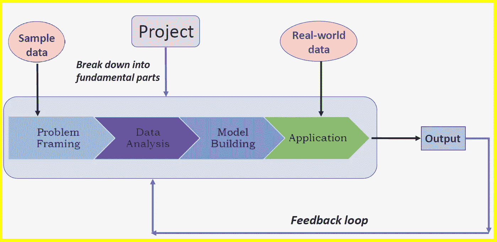

# 埃隆·马斯克的两个生产率秘密对数据科学有帮助

> 原文：<https://pub.towardsai.net/two-productivity-secrets-from-elon-musk-that-can-help-in-data-science-bc743706f017?source=collection_archive---------0----------------------->

## [数据科学](https://towardsai.net/p/category/data-science)

## 第一原则和反馈循环是埃隆·马斯克成功的两个生产力秘诀，也适用于数据科学

**阐述基本原则和反馈回路概念。Benjamin O. Tayo 拍摄的图片**

## 介绍

解决问题的第一原则方法是将问题分解成基本部分，然后从基本部分开始。这种方法早在亚里士多德时代就为物理学家所熟知。第一性原理方法是一种非常有效的解决问题的方法。Elon Musk(特斯拉和 SpaceX 的首席执行官)因应用第一性原理方法解决技术和工程问题而闻名。

*“第一性原理是一种看待世界的物理学方式。你把事情归结为最基本的真理，然后从那里推理。”—埃隆·马斯克*

埃隆·马斯克使用的另一个重要的生产率原理叫做反馈回路。这种方法使用关键的反馈来改进现有的模型或产品。

“我认为有一个反馈环非常重要，在这个反馈环中，你会不断地思考你已经做了什么，以及如何才能做得更好。”——*埃隆·马斯克*

*“批评性的反馈总是非常受欢迎。”—埃隆·马斯克*

在本文中，我们展示了如何使用这两个重要的原则来提高数据科学项目的生产率。

## 1.第一原理方法

在本节中，我们将研究如何将第一原理方法应用于预测分析。使用游轮数据集[**cruise _ ship _ info . CSV**](https://github.com/bot13956/ML_Model_for_Predicting_Ships_Crew_Size)**，**目标是建立一个机器学习模型，根据数据集中提供的几个预测变量来预测游轮的船员人数。使用第一性原理方法，我们可以将问题分解为以下几个基本部分:

**图一**。说明机器学习过程。图像由本杰明·欧·塔约拍摄。

## a.问题框架

***定义你的项目目标。你想知道什么？有数据可以分析吗？***

**目标 *:*** 本项目的目标是建立一个回归模型，使用邮轮数据集[**cruise _ ship _ info . CSV**](https://github.com/bot13956/ML_Model_for_Predicting_Ships_Crew_Size)**为潜在的邮轮买家推荐“船员”规模。**

## b.数据分析

***导入数据集，分析特征以选择与目标变量相关的相关特征。***

*   导入必要的库
*   读取数据集并显示列
*   计算协方差矩阵
*   生成用于显示协方差矩阵的热图
*   使用协方差矩阵图的特征选择
*   定义您的特征矩阵和目标变量

然后，上面获得的特征矩阵和目标变量可以用于模型建立。

## c.模型构建、测试和评估

***挑选与你的数据和想要的结果相匹配的机器学习工具。用可用数据训练模型。***

由于我们的目标是使用回归，我们将实现 3 种不同的回归算法:**线性回归(LR)** 、**近邻回归(KNR)** 和**支持向量回归(SVR)** 。

数据集必须分为训练集、验证集和测试集。超参数调整用于微调模型，以防止过度拟合。执行交叉验证是为了确保模型在验证集上表现良好。在微调模型参数之后，将模型应用于测试数据集。该模型在测试数据集上的性能大约等于该模型用于对未知数据进行预测时的预期性能。

## d.应用

***给你的最终模型打分，生成预测。使您的模型可用于生产。***

在这个阶段，选择最终的机器学习模型并投入生产。当所有组件组装在一起时，代码的最终输出如下图**图 2** 所示。

**图二**。不同回归模型的平均交叉验证显示。Benjamin O. Tayo 的图片

根据**图 2** 的结果，我们观察到线性回归和支持向量回归几乎处于同一水平，并且优于 KNeighbors 回归。所以最终选择的模型可以是线性回归，也可以是支持向量回归。

本教程的数据集和 Jupyter 笔记本可以从这里下载:[**https://github . com/bot 13956/Machine _ Learning _ Process _ Tutorial**](https://github.com/bot13956/Machine_Learning_Process_Tutorial)。

## 2.反馈回路

当一个机器学习模型已经被训练、测试和部署时，故事并没有就此结束。该模型必须在生产环境中进行实时评估，以评估其对未知数据的性能。从实验模型转换到生产线上的实际性能时遇到的任何错误都必须进行分析。然后，这可以用于重新训练和微调原始模型。这一过程被称为反馈回路，在提高模型的质量和预测能力方面起着至关重要的作用(见**图 3** )。

**图三**。示出了反馈回路。Benjamin O. Tayo 的图片

## 摘要

总之，我们已经讨论了解决问题的基本原则和反馈循环方法，以及如何在数据科学中使用这些强大的技术来提高模型的生产率和质量。我们通过案例研究展示了解决问题的基本原则方法，即使用游轮数据集的线性回归模型。第一原则方法，即将数据科学任务分解为更小的任务，并以此为基础进行构建，以及反馈循环，是每个数据科学追求者都应该熟悉的两个重要的生产力秘密。

## 其他数据科学/机器学习资源

[数据科学能力时间表](https://medium.com/towards-artificial-intelligence/timeline-for-data-science-competence-1b724e7977e0)

[数据科学课程](https://medium.com/towards-artificial-intelligence/data-science-curriculum-bf3bb6805576)

[机器学习的基本数学技能](https://medium.com/towards-artificial-intelligence/4-math-skills-for-machine-learning-12bfbc959c92)

[3 个最佳数据科学 MOOC 专业](https://medium.com/towards-artificial-intelligence/3-best-data-science-mooc-specializations-d58da382f628)

[数据科学作品集比简历更有价值](https://towardsdatascience.com/a-data-science-portfolio-is-more-valuable-than-a-resume-2d031d6ce518)