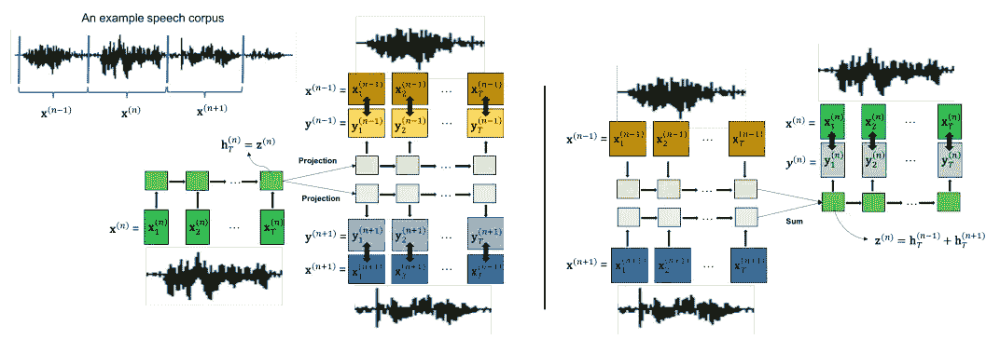
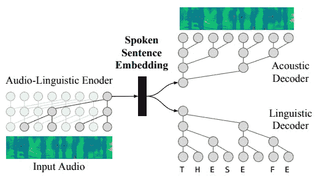
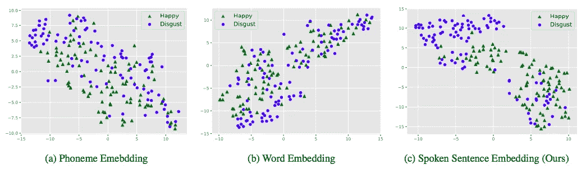

# 学习音频嵌入的两种方法

> 原文：<https://pub.towardsai.net/two-ways-to-learn-audio-embeddings-9dfcaab10ba6?source=collection_archive---------0----------------------->

## 音频特征工程| [走向人工智能](https://towardsai.net)

由[Á·阿尔瓦罗·伯纳尔](https://unsplash.com/@abn?utm_source=medium&utm_medium=referral)在 [Unsplash](https://unsplash.com?utm_source=medium&utm_medium=referral) 上拍摄的照片

[梅尔倒谱系数](https://en.wikipedia.org/wiki/Mel-frequency_cepstrum)(MFCC)[、过零率](https://en.wikipedia.org/wiki/Zero-crossing_rate)是音频的一些经典特征。可以很容易地通过库提取它。然而，它可能无法为当今的深度学习模型提供高质量的信号或输入。

两个研究小组提出了一种不同的方法来学习音频嵌入，但没有利用那些经典的特征。Chung 和 Glass (2018)建议学习基于单词的嵌入，而 Haque 等人(2019)建议学习基于句子的嵌入。

# Speech2Vec

Chung 和 Glass 受到了 word2vec 的启发，提出了一种学习音频嵌入的不同方法。word2vec 利用 skip-gram 或连续词袋(CBOW)来学习单词嵌入。简而言之，单词嵌入是通过邻近单词学习的。如果你不熟悉它，你可以访问[研究论文](https://arxiv.org/pdf/1301.3781.pdf)或[这个故事](https://towardsdatascience.com/3-silver-bullets-of-word-embedding-in-nlp-10fa8f50cc5a)。

Speech2Vec 采用了类似的概念，即通过相邻的声学区域学习声学嵌入。音频片段被按单词分割，并被馈送给模型以学习对应于单词的音频片段的固定嵌入。

## 带 Skip-gram 和 CBOW 的 Speech2Vec

与 word2vec 的 skip-gram 方法相同，目标单词预测目标单词之前和之后预定义范围为 k 的周围单词。Speech2Vec 的连续词袋(CBOW)以不同的方式前进。它不是使用目标词来预测周围的词，而是使用周围的词来预测目标词。

左:Speech2Vec，带跳格。右:与 CBOW 的 Speech2Vec(钟和格拉斯，2018)

# 句子级嵌入

Haque 等人介绍了用于音频输入的句子级嵌入，而字符级、单词级或音素级音频嵌入是经典的嵌入方法。观点是经典的嵌入太短，而句子层次足够长以捕捉更高层次的意思。

学习口语句子嵌入的架构(Haque 等人，2019 年)

作者将学习过程表述为学习口语句子嵌入的多任务学习。任务包括语音识别、情感识别和说话人识别。

各种嵌入的可视化(哈克等人，2019 年)

# 拿走

*   在线预测期间，按单词和句子分割音频可能不会更容易
*   对于 Speech2Vec，由于不同的说话人、通道和背景噪声，同一个词有不同的嵌入。为了便于实验，相同单词的嵌入将被平均以呈现特定的单词。

# 喜欢学习？

我是湾区的数据科学家。专注于数据科学、人工智能，尤其是 NLP 和平台相关领域的最新发展。在 [LinkedIn](https://www.linkedin.com/in/edwardma1026) 或 [Github](https://github.com/makcedward) 上随时联系 [me](https://makcedward.github.io/) 。

# 延伸阅读

*   [如何对音频数据应用无监督学习](https://medium.com/hackernoon/how-can-you-apply-unsupervised-learning-on-audio-data-be95153c5860)
*   [您的助理设备如何基于文本到语音转换技术工作](https://becominghuman.ai/how-does-your-assistant-device-work-based-on-text-to-speech-technology-5f31e56eae7e)

# 参考

*   T.米科洛夫、g .科拉多、k .陈和杰弗里·迪恩。[向量空间中单词表示的有效估计](https://arxiv.org/pdf/1301.3781.pdf)。2013.
*   Y.钟和 j .格拉斯。 [Speech2Vec:从语音中学习单词嵌入的序列到序列框架](https://arxiv.org/pdf/1803.08976.pdf)。2018
*   A.哈克，郭，，李。[口语句子的音频语言嵌入](https://arxiv.org/pdf/1902.07817.pdf)。2019