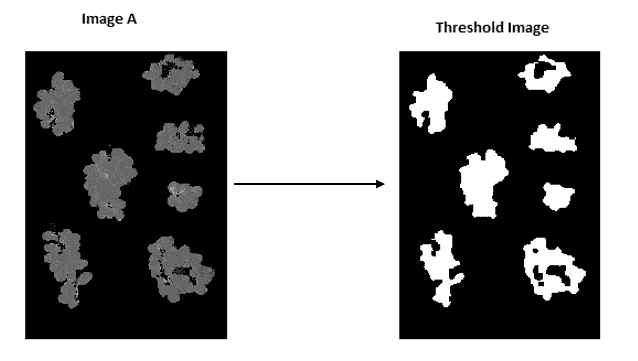
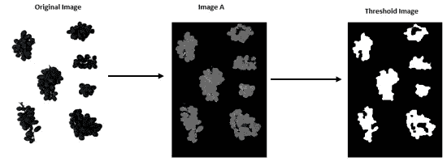
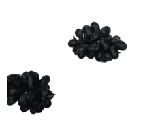
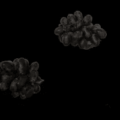
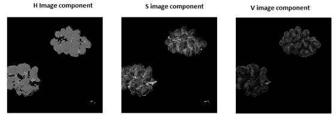
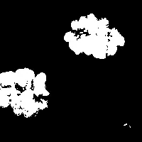
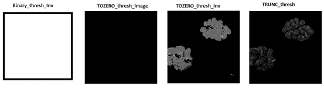

# 用 Python 实现 OpenCV 中二值图像处理阈值的类型

> 原文：<https://pub.towardsai.net/types-of-binary-image-processing-threshold-in-opencv-with-python-2f9b7f8795f9?source=collection_archive---------3----------------------->

## [计算机视觉](https://towardsai.net/p/category/computer-vision)

## 图像分割方法分析



作者的照片

图像的阈值是图像分割过程的重要组成部分。为了对图像应用二值化阈值，我们应该使图像处于二值化阈值正常工作的期望条件下。

这里条件的含义是，当我们做阈值处理时，我们希望图像条件应该在某种强度水平上才能分割。

例如，如果有图像 A，那么这将给出更好的阈值结果。



阈值结果。作者的照片

色彩空间是将彩色图像分解成不同图像成分的过程。图像处理中有许多颜色空间，如 RGB、HSV、CMY 等。我们可以使用颜色空间来分解图像，并找到最适合阈值的图像分量。

图像不同组成部分的类型如下所示:


La*b*和 HSV 颜色空间。作者的照片

从上面的组件中，如果我们选择分割蓝色球，那么我们可以很容易地看到 b*组件向我们展示了一个很好的二进制分割。这样，我们就可以相应地选择什么适合我们的项目。

现在，我们将用 python 来做实际的二进制阈值及其类型。

```
#Import the library and read the image
import cv2#Reading the image with OpenCV
image = cv2.imread('grape.jpg')#To save the image in the folder we use ***imwrite*** method
cv2.imwrite('Original_image.jpg',original_image)
```



原图。作者的照片

OpenCV 读取 BGR 格式的图像，我们需要 RGB 格式的颜色空间。

```
#Converting BGR  to RGB
rgb_image = cv2.cvtColor(original_image, cv2.COLOR_BGR2RGB)

cv2.imwrite('rgb_image.jpg', rgb_image)
```



RGB 图像。作者的照片

现在，我们将使用 HSV 颜色空间并分割成 H、S 和 V 分量图像。

```
#Converting RGB to HSV with cvtColor method in OpenCV
hsv_image = cv2.cvtColor(rgb_image, cv2.COLOR_RGB2HSV)#Splittitng HSV image to H, S and V image components
h, s, v = cv2.split(hsv_image)#saving the image components
cv2.imwrite('H_image.jpg',h)
cv2.imwrite('S_image.jpg',s)
cv2.imwrite('V_image.jpg',v)
```



h、S、V 图像分量。作者的照片

从上面的图像成分中，我们看到“H”图像对于二值化阈值是很好的。我们将在 OpenCV 中使用 OTSU 阈值实现二进制阈值方法。OTSU 阈值将自动选择阈值。

```
#Binary threshold with OTSU
ret,th1=cv2.threshold(h,180,255,cv2.THRESH_BINARY+cv2.THRESH_OTSU)#Savinf the threshold image
cv2.imwrite('Binary_thresh_image.jpg',th1)
```



二值阈值图像。作者的照片

在双峰直方图形状中，OTSU 二值化是获得基于直方图的阈值优化值的非常好的方法。双峰意味着直方图由于图像中的两种光照条件而具有两个峰值。

[](/pre-processing-techniques-in-image-processing-with-python-81e5c8babf09) [## Python 图像处理中的预处理技术

### OpenCV 下的图像处理技术

pub.towardsai.net](/pre-processing-techniques-in-image-processing-with-python-81e5c8babf09) [](/part-ii-pre-processing-techniques-in-image-processing-with-python-17fb628453ff) [## 第二部分 Python 图像处理中的预处理技术

### OpenCV 下的图像处理技术

pub.towardsai.net](/part-ii-pre-processing-techniques-in-image-processing-with-python-17fb628453ff) 

## **阈值方法的类型**

```
ret,th2 = cv2.threshold(h,180,255,cv2.THRESH_BINARY_INV)
ret,th3 = cv2.threshold(h,180,255,cv2.THRESH_TRUNC)
ret,th4 = cv2.threshold(h,180,255,cv2.THRESH_TOZERO)
ret,th5 = cv2.threshold(h,180,255,cv2.THRESH_TOZERO_INV)#Saving the files
cv2.imwrite('Binary_thresh_Inv_image.jpg',th2)
cv2.imwrite('TRUNC_thresh_image.jpg',th3)
cv2.imwrite('TOZERO_thresh_image.jpg',th4)
cv2.imwrite('TOZERO_thresh_Inv_image.jpg',th5)
```



不同的阈值。作者的照片

结论:

在本文中，示例图像是一个葡萄图像，但是您可以选择任何图片并对其进行处理。这些是简单的阈值方法，但也有不同的方法，如自适应阈值等。

我希望你喜欢这篇文章。通过我的 [LinkedIn](https://www.linkedin.com/in/data-scientist-95040a1ab/) 和 [twitter](https://twitter.com/amitprius) 联系我。

# 推荐文章

[1。NLP —零到英雄与 Python](https://medium.com/towards-artificial-intelligence/nlp-zero-to-hero-with-python-2df6fcebff6e?sk=2231d868766e96b13d1e9d7db6064df1)
2。 [Python 数据结构数据类型和对象](https://medium.com/towards-artificial-intelligence/python-data-structures-data-types-and-objects-244d0a86c3cf?sk=42f4b462499f3fc3a160b21e2c94dba6)3 .[Python 中的异常处理概念](/exception-handling-concepts-in-python-4d5116decac3?source=friends_link&sk=a0ed49d9fdeaa67925eac34ecb55ea30)
4。[用 Python 进行主成分分析降维](/principal-component-analysis-in-dimensionality-reduction-with-python-1a613006d531?source=friends_link&sk=3ed0671fdc04ba395dd36478bcea8a55)
5。[用 Python 全面讲解 K-means 聚类](https://medium.com/towards-artificial-intelligence/fully-explained-k-means-clustering-with-python-e7caa573176a?source=friends_link&sk=9c5c613ceb10f2d203712634f3b6fb28)
6。[用 Python](https://medium.com/towards-artificial-intelligence/fully-explained-linear-regression-with-python-fe2b313f32f3?source=friends_link&sk=53c91a2a51347ec2d93f8222c0e06402)
7 全面讲解了线性回归。[用 Python](https://medium.com/towards-artificial-intelligence/fully-explained-logistic-regression-with-python-f4a16413ddcd?source=friends_link&sk=528181f15a44e48ea38fdd9579241a78)
充分解释了 Logistic 回归 8。[用 Python 实现时间序列的基础知识](https://medium.com/towards-artificial-intelligence/basic-of-time-series-with-python-a2f7cb451a76?source=friends_link&sk=09d77be2d6b8779973e41ab54ebcf6c5)
9。[与 Python 的数据角力—第一部分](/data-wrangling-with-python-part-1-969e3cc81d69?source=friends_link&sk=9c3649cf20f31a5c9ead51c50c89ba0b)
10。[机器学习中的混淆矩阵](https://medium.com/analytics-vidhya/confusion-matrix-in-machine-learning-91b6e2b3f9af?source=friends_link&sk=11c6531da0bab7b504d518d02746d4cc)