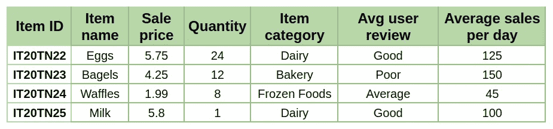

# 解释了机器学习中的数据类型

> 原文：<https://pub.towardsai.net/types-of-data-in-machine-learning-6c1f262a17e7?source=collection_archive---------1----------------------->

## 机器学习

米卡·鲍梅斯特在 [Unsplash](https://unsplash.com?utm_source=medium&utm_medium=referral) 上的照片

机器学习已经在许多领域取得了成功，如推荐引擎、医疗保健、股票预测、供应链管理等。这主要是由于处理器(GPU 和 TPU)的进步以及数据时代的到来。目前，我们能够收集和存储大量数据，复杂的 ML 算法可以使用这些数据来实现最先进的模型。为了理解和应用 ML 算法，理解不同的数据类型是至关重要的，这样我们就可以适当地清理和预处理数据。这将进一步使我们能够选择能够轻松识别底层模式并获得最佳性能的模型。

数据必须转换成数字表示，以便机器能够学习数据中的模式。理解不同的数据类型可以帮助我们识别正确的预处理技术&适当地转换数据。此外，它还将使我们能够执行最佳的可视化，并发现隐藏的知识。

# 结构数据

这种类型的数据通常由数字或单词组成。它们通常存储在关系数据库中，可以很容易地使用 SQL 查询进行搜索。

# 数字/定量数据

顾名思义，这包括可以用数字表示的数据。这种数据的例子是销售价格、度量数量，例如温度、时间、长度、人的身高和体重等等。数值型数据进一步分为两类，即离散型和连续型。

## 分离的

在这一类别中，数据采用离散值或整数，即没有小数点的数字。例如，一个城市的房屋数量，上个月杂货店的消费者数量，您在 Instagram 上的粉丝数量，等等。

## 连续的

在此类别中，数据采用整数值，即带有十进制值的数字。连续数字数据的示例有城市房价、杂货店商品的销售价格、您收到的 Instagram 收入等。

# 分类/定性数据

顾名思义，这包括可以通过文字表示的数据。它通常定义组或类别&因此被称为分类数据。一些例子是超市中所有商品的名称、电影评级(好、一般、差)、个人出生的国家等等。

## 序数

这种类型的数据在类别中具有固有的顺序。例如，如果你把电影分级分为好、一般和差，那么好的等级高于一般，一般又高于差。在将这种类型的数据转换为数字时，需要考虑到这一点，以便模型也可以学习这种排名。类别/组的数量是固定且有限的。例如电影评级、学生成绩、员工表现等等。

## 名义上的

这种类型的数据的类别没有任何特定的顺序或排名。在这类数据中，类别的总数通常也是有限的。例如，个人的出生国、超市中的所有商品、个人的教育程度等等。

## 独一无二的

这种类型的数据对于每个样本都有唯一的值，并且类别的数量通常很大。有时它非常大，以至于不能被称为分类数据，但它仍然由字母和数字组成。例如，商店中所有商品的产品 id、大学中所有人的学号、个人出生地的邮政编码等等。

# 表列数据

这通常是指从多种不同的数据类型中收集数据，如图 1 所示。表格数据由多个要素/列组成，每个要素/列都具有特定的数据类型。

**图 1:** 描绘由不同数据类型的特征组成的样本表格数据的图；**来源:**作者

图 1 显示了具有不同数据类型特性的表格数据示例。它们各自的特性和数据类型如下

*   *数量&平均每天销售额:* **离散数值**
*   *销售价格:* **连续数值**
*   *平均用户评论:* **序数分类**
*   *项目名称&项目类别:* **名义分类**
*   *物品 ID:* **唯一分类**

# 非结构化数据

这种类型的数据通常由其他所有内容组成，包括文本、图像、视频、语音/音频、时间序列等等。它们通常存储在非关系数据库中，不容易搜索。

# 图像

顾名思义，这种类型的数据通常由不同类型的图像文件组成。这种数据类型的一个关键属性是图像中存在空间特征/关系，需要理解这些特征/关系才能从图像中提取有见地的信息。例如，杂货店中所有商品的图像、大学中所有学生的照片等等。

# 录像

这种类型的数据也是不言自明的，因为它由不同格式的视频组成。这种数据类型的一个区别因素是视频中不同帧之间关于位置、物体/人的运动等的关系。以更好地从视频中获取信息。

# 音频/时间序列

这种类型的数据有一系列有序的数据点，每个数据点都有一个时间戳。该数据中最显著的特征是不同数据点之间的关系，例如周期性模式、季节性行为等等。例如，如果您考虑一个城市去年记录的温度，观察随时间的变化，我们可以很容易地确定冬季月份较冷，夏季月份较热。这种类型的洞察力是基本的，但只有当您查看带有时间戳的数据点时才能观察到。图 2 显示了时间序列数据的可视化示例。

图 2:[eth messages](https://unsplash.com/@moneyphotos?utm_source=medium&utm_medium=referral)在 [Unsplash](https://unsplash.com?utm_source=medium&utm_medium=referral) 上拍摄的照片

# 文本

这种类型的数据具有由多个单词组成的文本数据，这些单词作为一个整体有意义。最重要的属性是理解整个上下文和句子中不同单词之间的关系，以及理解每个单词可以有多个含义以及与其他单词的关联。

*文章中的一些内容来自下面参考文献部分引用的其他几篇文章。*

# 参考

[1] R .夏尔马， [4 种类型的数据](https://www.upgrad.com/blog/types-of-data/) (2020)，Upgrad.com

[2] N .保罗，[机器学习中的数据类型](https://pianalytix.com/data-types-in-machine-learning/) (2020)，pianalytix.com

[3] A .张，[机器学习视角下的数据类型与实例](https://towardsdatascience.com/data-types-from-a-machine-learning-perspective-with-examples-111ac679e8bc) (2018)，

[4] A. Goyal，[数据科学统计中数据类型的完整指南](https://www.analyticsvidhya.com/blog/2021/06/complete-guide-to-data-types-in-statistics-for-data-science/) (2021)，analyticsvidhya.com

[5] J. Hale， [7 数据类型:思考机器学习数据类型的更好方式](https://towardsdatascience.com/7-data-types-a-better-way-to-think-about-data-types-for-machine-learning-939fae99a689) (2018)，towardsdatascience.com

通过这个[链接](https://arun-rajendran.medium.com/membership)注册，你可以以每周不到 1 美元的价格获得所有的媒体报道。