# 机器学习中的核类型

> 原文：<https://pub.towardsai.net/types-of-kernels-in-machine-learning-291cf85fcdd0?source=collection_archive---------0----------------------->

## [机器学习](https://towardsai.net/p/category/machine-learning)

## 使用线性函数解决非线性问题

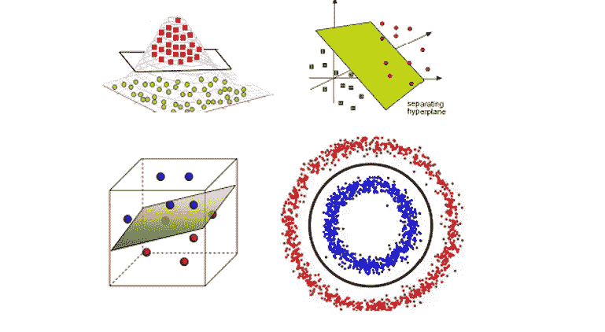

分离类的内核技巧。作者的照片

在本文中，我们将讨论机器学习中使用的核的类型，以使用线性分类器来分离非线性问题数据。原始数据需要额外的关注，以从中获得洞察力和表示，数据中的特征可以是任何模式，我们需要搜索它们之间的关系。

模式分析和关系可以是聚类、相关性、分类、排序等。

**核绝招:**不同核的学习使用一个在高维空间中起作用的核函数，不考虑数据的坐标。因此，这种类型的过程/方法在计算上更便宜且有效。

> ***要覆盖的不同内核:***

```
1\. Linear Kernel
2\. Polynomial Kernel
3\. Sigmoid Kernel
4\. RBF Kernel
5\. Laplacian Kernel
6\. Chi-squared Kernel
```

> ***线性内核***

顾名思义，内核线性地分离数据，因为它是一维内核。每个初学者都从这个简单的内核开始，它是算法中的默认值。

与其他内核相比，线性内核的优点是速度快，因为在线性内核中，我们只需要正则化参数，而在其他内核中，我们需要添加`y`参数来执行网格搜索。

线性核方程如下所示:

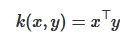

图像来源是 [sklearn](https://scikit-learn.org/stable/modules/metrics.html)

在哪里，

x 和 y =输入列向量

`degree=1`和`coef0=0`如果 coef 为零，则内核是同构的，这意味着它以紧凑的线性表示来映射数据。

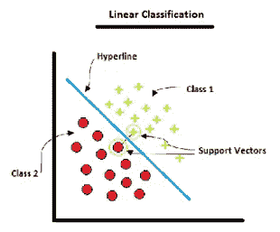

来源:作者的 [SVM 文章](/fully-explained-svm-classification-with-python-eda124997bcd?source=friends_link&sk=da300d557992d67808746ee706269b2f)

[](/fully-explained-svm-classification-with-python-eda124997bcd) [## 用 Python 全面解释了 SVM 分类

### 如何用一个真实的例子解决分类问题。

pub.towardsai.net](/fully-explained-svm-classification-with-python-eda124997bcd) [](/fully-explained-k-nearest-neighbors-with-python-ebbe27f93ba9) [## 用 Python 完整解释 K 近邻

### 数据科学中解决真实案例的机器学习分类算法研究。

pub.towardsai.net](/fully-explained-k-nearest-neighbors-with-python-ebbe27f93ba9) 

> ***多项式内核***

顾名思义，这个内核处理特性的程度/顺序。特征之间的关系不是线性的，而是曲线，因此线性核不适合获得其最大结果，因为残差将更多地位于观察值和预测值之间。

与其他内核相比，该内核的工作功能效率较低。

多项式核的方程如下所示:

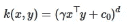

图像来源是 [sklearn](https://scikit-learn.org/stable/modules/metrics.html)

在哪里，

x 和 y =输入列向量，d =核度

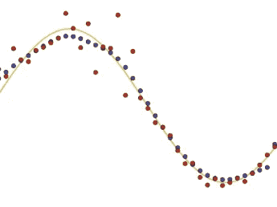

图片[来源](https://www.researchgate.net/figure/Illustration-of-the-benefits-of-more-than-one-kernel-regression-model-The-usual_fig1_221053237)

> **乙状结肠仁 **

这个核主要用于机器学习中的神经网络或感知器。为了对数据中的类进行分类，它作为一个激活函数工作。这个内核中的曲线也被称为从 0 到 1 的累积分布函数。

许多人仍然对 logit 函数感到困惑，logit 函数是 sigmoid 函数的逆函数。

sigmoid 内核的等式如下所示:

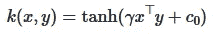

图片来源是 [sklearn](https://scikit-learn.org/stable/modules/metrics.html)

在哪里，

x 和 y =输入列向量，ϒ =斜率，C0 =截距

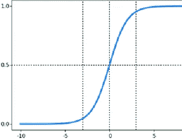

图像[来源](https://www.researchgate.net/figure/Fig-3-Sigmoid-function-graph-CourtseyInternet-sources_fig3_330761350)

> ***RBF 核***

机器学习算法中最常用的内核是在不知道数据类型的情况下对数据进行分类，并尝试平滑地划分类别。RBF 的完整形式是径向基核。

在机器学习内核中引入 RBF 是因为其他内核没有尝试在大量输入特征上很好地扩展。

RBF 核的方程如下所示:

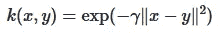

图像来源是 [sklearn](https://scikit-learn.org/stable/modules/metrics.html)

在哪里，

x 和 y =输入列向量，ϒ = ϒ = σ^2，方差核。

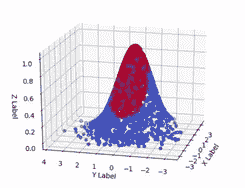

图像[来源](https://www.machinecurve.com/index.php/2020/11/25/using-radial-basis-functions-for-svms-with-python-and-scikit-learn/)

> ***拉普拉斯核***

拉普拉斯核来自 RBF 核家族，可以用于无噪声数据。它受数据变化的影响很小，而且它有一些与指数核相似的特征，我们将在本文后面讨论。

这种核的应用主要是在图像处理中检测被称为高斯滤波器上的拉普拉斯算子(LoG)的物体的边缘。

拉普拉斯核的等式如下所示:

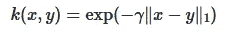

图片来源是 [sklearn](https://scikit-learn.org/stable/modules/metrics.html)

在哪里，

x 和 y =输入列向量，||x-y||1 =曼哈顿距离度量


图像[来源](https://link.springer.com/article/10.1007/s10470-019-01481-3)

> ***卡方核***

这种类型的核在非线性数据中是有用的，它看起来像是对视觉单词数据的直方图进行了处理的交集核。这个内核的速度很慢，有时对稀疏数据不起作用。

该数据应该是非零和正，以使该内核具有良好的结果，并主要用于计算机视觉应用。

卡方核的等式如下所示:

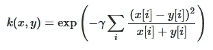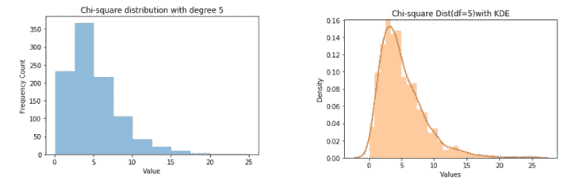

图像[来源](https://fangya18.com/2018/09/17/chi-square-2/)

结论:

这是一种基本类型的内核，主要用于机器学习算法。

我希望你喜欢这篇文章。通过我的 [LinkedIn](https://www.linkedin.com/in/data-scientist-95040a1ab/) 和 [twitter](https://twitter.com/amitprius) 联系我。

# 推荐文章

1.[8 Python 的主动学习见解收集模块](/8-active-learning-insights-of-python-collection-module-6c9e0cc16f6b?source=friends_link&sk=4a5c9f9ad552005636ae720a658281b1)
2。 [NumPy:图像上的线性代数](/numpy-linear-algebra-on-images-ed3180978cdb?source=friends_link&sk=d9afa4a1206971f9b1f64862f6291ac0)3。[Python 中的异常处理概念](/exception-handling-concepts-in-python-4d5116decac3?source=friends_link&sk=a0ed49d9fdeaa67925eac34ecb55ea30)
4。[熊猫:处理分类数据](/pandas-dealing-with-categorical-data-7547305582ff?source=friends_link&sk=11c6809f6623dd4f6dd74d43727297cf)
5。[超参数:机器学习中的 RandomSeachCV 和 GridSearchCV](/hyper-parameters-randomseachcv-and-gridsearchcv-in-machine-learning-b7d091cf56f4?source=friends_link&sk=cab337083fb09601114a6e466ec59689)
6。[用 Python](https://medium.com/towards-artificial-intelligence/fully-explained-linear-regression-with-python-fe2b313f32f3?source=friends_link&sk=53c91a2a51347ec2d93f8222c0e06402)
7 全面讲解了线性回归。[用 Python](https://medium.com/towards-artificial-intelligence/fully-explained-logistic-regression-with-python-f4a16413ddcd?source=friends_link&sk=528181f15a44e48ea38fdd9579241a78)
充分解释了 Logistic 回归 8。[数据分发使用 Numpy 与 Python](/data-distribution-using-numpy-with-python-3b64aae6f9d6?source=friends_link&sk=809e75802cbd25ddceb5f0f6496c9803)
9。[机器学习中的决策树 vs 随机森林](/decision-trees-vs-random-forests-in-machine-learning-be56c093b0f?source=friends_link&sk=91377248a43b62fe7aeb89a69e590860)
10。[用 Python 实现数据预处理的标准化](/standardization-in-data-preprocessing-with-python-96ae89d2f658?source=friends_link&sk=f348435582e8fbb47407e9b359787e41)