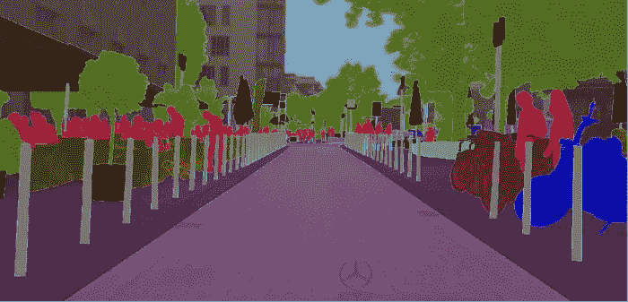
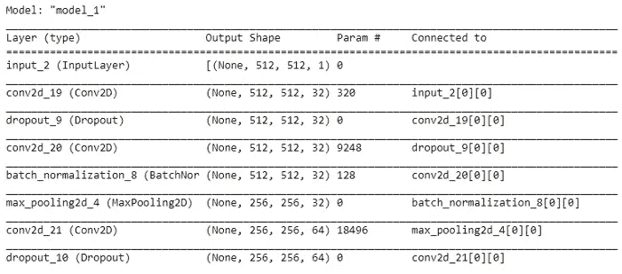
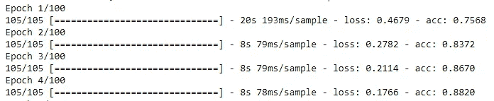

# 基于卷积网络的 U-Net 图像分割

> 原文：<https://pub.towardsai.net/u-net-image-segmentation-with-convolutional-networks-90809950e0d3?source=collection_archive---------0----------------------->

在我们这个时代，图像数据的语义分割经常用于计算机视觉。U-Net 是一个主干网络，包含用于屏蔽对象的卷积神经网络。

🧶 **U-Net** 因其架构类似于图中所示的字母 u 而得名。输入图像在输出端作为分割的输出图获得。

您可以在文章[用 U-Net 进行图像分割](/image-segmentation-with-u-net-da8cc1cbeaeb)中了解 U-Net 网络的基本信息和工作架构。本文描述了用 Python 编程语言逐步编写 U-Net 的代码。

## 步骤 1:获取数据集

在此步骤中，如果您的数据集将从现有代码中提取，您可以按如下方式从文件中加载它。如果数据集位于正在工作的活动文件夹中，则可以通过从文件中加载数据来工作。如果您要像下面的代码行那样工作，数据在加载时需要经过一个准备阶段。

get _ dataset . py

我们导入模块的 Python 文件的代码如下所示。这里的变量 r 向将要下载数据集的地址发出请求。为了从 download_dataset 文件中下载数据，您必须键入要下载的链接，而不是请求的默认域名。

download_dataset.py

整个研究中使用的文库如下所示。应该用**** pip install-r requirements . txt ****命令将库安装在这个环境中。

📣**注意！**
download _ dataset 文件的 Python 代码应位于 Python 文件夹中，以便主动工作。因此，稍后可以从该文件下载数据集。下一步是准备数据。

## **第二步:准备数据**

在这一步中，导入数据集的图像被缩小到 512 x 512。因此，研究中使用的所有数据都采用了统一的数据大小。

🪐As 是已知的，在整个卷积神经网络模型中应用的高度和宽度的尺寸减小，即汇集层，可以与不同的方法结合，如最大值、平均值或中值，并在代码的后半部分实现。得益于这些图层，它旨在提高输出的分辨率。高分辨率特征和采样输出在整个模型中被组合用于定位。然后，顺序卷积层旨在基于此信息创建更精确的输出。

使用 images_prepare.py 文件

你可以在下面这行代码中找到导入的整个***images _ prepare***模块。

images_prepare.py

## 步骤 3:获取蒙版

提取 _masks.py

上面提到的 masks_prepare 文件已经通过以下代码脚本保存。在该步骤中，首先，使用 ***masks_prepare*** 函数将调整后的数据作为参数发送给该函数。

🧮Images 被转换为 1 大小并被分配给 NumPy 数组。图像值到数组的转换对于处理像素值是必不可少的。从图像中提取的遮罩保存在一个文件夹中。简而言之，根据其他算法，U-Net 不使用标签引用，而是使用数学推断的掩码。

## 步骤 4:缩放和转换数据

在这一步中，数据被缩放到 Float32，X 和 Y 值称为图像和遮罩。在这一步中，数组被修改为 NumPy 数组，因为我将在训练和测试集中处理 105。你可以根据自己的数据来改变这一点。您可以用 ***plt.imshow.*** 控制一个随机图像数据

checkanalysisdata.py

## 步骤 5:创建 U-Net 模型

在此步骤中，将使用在文件夹中创建的 UNET 函数。导入模型所需的层 CONV2D、MaxPooling2D、BatchNormalization、Conv2DTranspose、Dropout。

unet_model.py

为从工作文件夹中的 ***model.py*** 文件中拉出的 U-Net 模型创建一个函数会加快工作速度。对于下一个模型，U-Net 模型应该如上图所示。

***model . summary()***用于可视化代码中的图层。汇总各层后，输出如下。没有图片中看到的那么少的图层，我只添加了第一层，这样它们就不会占用空间。

## 步骤 6:编译并拟合 U-Net 模型

在这个阶段使用两个独立的函数。

1.  **model.compile:** 损失函数定义了优化器和指标。你需要一个编译好的模型来训练(因为训练用的是损失函数和优化器)。但是没有必要编译模型来进行预测。
2.  **model.fit:** 为指定数量的时期训练模型。因为 epochs 参数在这里被给定为 100，所以训练将在 100 个步骤中完成。由于这里选择的度量标准是 *[“精确度”]* ，因此在培训过程中将逐步遵循精确度值。

compilefit_model.py

如代码中所述，编译时选择的指标、损失函数和优化器完全可以根据个人情况选择。您可以对此进行更改，并直观地看到精度的变化。结果，当开始模型训练时，观察到如下的周期变化。如果你已经走了这么远，恭喜你！

**观察历元数的结果**

## 步骤 7:模型的预测阶段

一旦训练结束，接下来就是猜测的步骤了。正如这里所看到的，我们作为 x_test 分离的数据被分配给一个具有 predict 函数的变量并被使用。您可以通过将**预测**值打印到屏幕上来查看预测结果。

预测. py

📑*研究中使用的学术文章；*

[U-Net:用于生物医学图像分割的卷积网络](https://arxiv.org/pdf/1505.04597.pdf)

👁‍🗨 *研究中使用的代码的主要来源；*

 [## GitHub-SerdarHelli/使用 U-Net 对全景 X 射线图像中的牙齿进行分割

### 本研究的目的是利用深度学习算法对一张全景 x 射线图像进行自动语义分割。

github.com](https://github.com/SerdarHelli/Segmentation-of-Teeth-in-Panoramic-X-ray-Image-Using-U-Net) 

# 参考

*   “语义分割”，王，机器学习小组，多伦多大学。

 [## Keras 文档:模型训练 API

### 为训练配置模型。示例参数优化器:字符串(优化器的名称)或优化器实例…

keras.io](https://keras.io/api/models/model_training_apis/)  [## model.compile()是否初始化了 Keras (tensorflow backend)中的所有权重和偏差？

### 如果你使用的是 compile，那么肯定是在 load_model()之后。毕竟你需要一个模型来编译。(PS:load _ model……

stackoverflow.com](https://stackoverflow.com/questions/47995324/does-model-compile-initialize-all-the-weights-and-biases-in-keras-tensorflow)