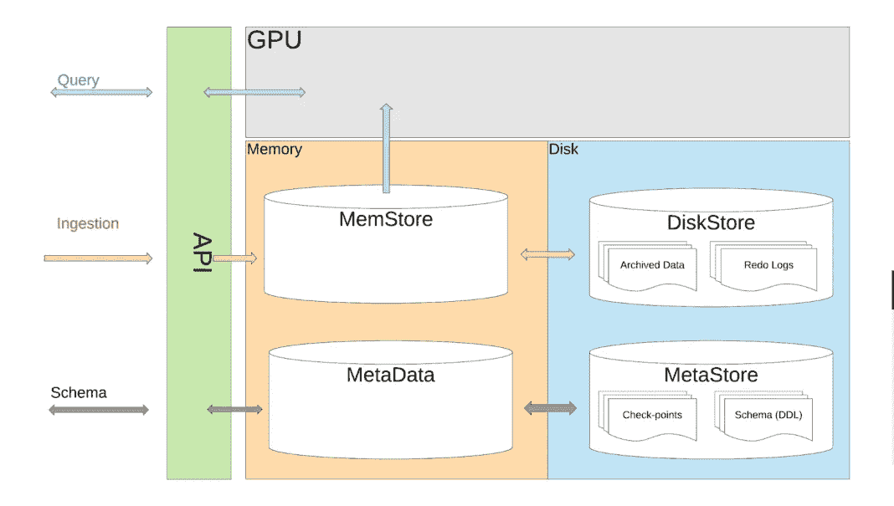
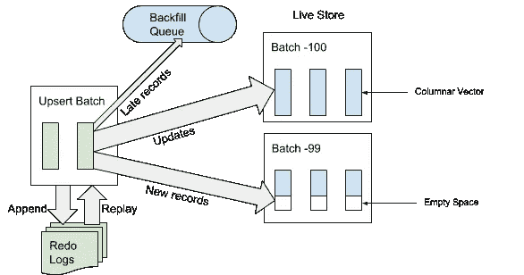
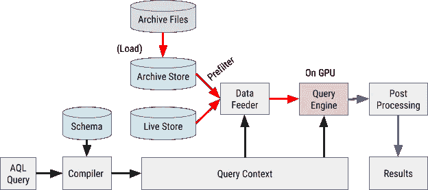

# 优步 AresDB 是一个面向大规模分析工作负载的开源、GPU 驱动的数据库

> 原文：<https://pub.towardsai.net/uber-aresdb-is-an-open-source-gpu-powered-database-for-large-scale-analytics-workloads-ec82c1b2a863?source=collection_archive---------0----------------------->

## [数据分析](https://towardsai.net/p/category/data-analytics)

## 开源堆栈正在为优步的实时分析管道提供动力。


来源:https://eng.uber.com/aresdb/

> 我最近创办了一份专注于人工智能的教育时事通讯，已经有超过 70，000 名订户。《序列》是一份无废话(意思是没有炒作，没有新闻等)的 ML 导向时事通讯，需要 5 分钟阅读。目标是让你与机器学习项目、研究论文和概念保持同步。请通过订阅以下内容来尝试一下:

[](https://thesequence.substack.com/) [## 序列

### 该序列解释了主要的机器学习概念，让你与最相关的项目和最新的…

thesequence.substack.com](https://thesequence.substack.com/) 

优步是开源数据科学基础设施和框架的最大贡献者之一。从像 [Horovod](https://github.com/uber/horovod) 或 [Pyro](http://pyro.ai/) 这样的机器学习框架到像 [M3](https://github.com/m3db) 这样的时间序列基础设施，优步工程团队一直非常积极地开源不同的堆栈，这些堆栈是优步数据科学管道的关键构建模块。本周早些时候，优步推出了另一项超级酷的技术，以实现现代分析解决方案。 [AresDB](https://github.com/uber/aresdb) 是一个用于大规模可扩展实时分析工作负载的数据库和运行时。

市场真的需要另一个实时分析数据库吗？这是我读到 AresDB 的第一反应。实时分析的挑战，特别是对时间序列数据的挑战，是众所周知的，有一些非常先进的堆栈，如 [Apache Pinot](https://github.com/apache/incubator-pinot) 、 [OmniSci](https://www.omnisci.com/) ，甚至在某种程度上， [Elasticsearch](https://www.elastic.co/) 支持许多这些用例。虽然这些解决方案的功能非常强大，但重要的是要认识到，优步的运营规模是市场上大多数软件平台所不知道的。优步的应用程序每秒收集数百万个数据点，需要用于在完全不同的领域做出实时决策，如欺诈检测或小费定价。图形处理单元(GPU)的主流采用开辟了扩展分析工作负载的新领域。然而，你知道有多少实时分析引擎能够有效地利用 GPU。这就是 AresDB 设置要解决的挑战。

# 使用 GPU 扩展

利用 GPU 来扩展实时分析工作负载的想法似乎非常适合优步。ride haling 公司拥有数千个分析流程，可对时间序列数据进行实时计算，这些数据由几天时间内收集的数十亿个数据点组成。与传统 CPU 相比，GPU 为实时分析工作负载提供了非常明显的优势:

*   非常快速地并行处理数据。
*   提供更高的计算吞吐量(GFLOPS/s)，非常适合可以并行化的繁重计算任务(单位数据)。
*   提供更大的计算到存储(ALU 到 GPU 全局内存)数据访问吞吐量(而非延迟)，使其成为处理需要大量数据的 I/O(内存)绑定并行任务的理想选择。

针对基于 GPU 的架构优化的实时分析引擎有机会针对数据集的大型子集扩展任意查询/计算，而无需任何数据优化。

# 输入 AresDB

AresDB 的设计结合了磁盘和内存存储以及 CPU 和 GPU 计算。该堆栈遵循 MemSQL 或 AWS RedShift 等技术中流行的列内数据存储模型。在架构上，AresDB 遵循三个关键原则来实现实时分析计算的巨大性能:

*   **带压缩的基于列的存储:**这种模式用于提高存储效率(以存储数据的字节为单位减少内存使用量)和查询效率(查询期间从 CPU 内存到 GPU 内存的数据传输减少)
*   **采用主键重复数据删除的实时更新:**相关的可在数秒内实现高数据准确性和近乎实时的数据更新。
*   **GPU 驱动的查询处理:**使用进行由 GPU 驱动的高度并行化的数据处理，呈现低查询延迟(亚秒到秒)。

AresDB 的一部分看起来像任何其他实时数据库引擎。AresDB 中的数据存储在磁盘中，但会切换到内存中进行实时计算。数据摄取过程在商用 CPU 中工作，平台维护一个单独的数据库，其中包含核心数据结构的模式和相关元数据。然而，当处理实时查询时，AresDB 将计算从主机内存切换到 GPU 内存，以实现更快的性能。计算引擎上的实时切换是 AresDB 的关键功能之一。在较高层次上，AresDB 的体系结构如下图所示:



来源:[https://eng.uber.com/aresdb/](https://eng.uber.com/aresdb/)

AresDB 中的存储模型基于两组基本的表:

**事实表:** AresDB 的事实表存储实时发生的事件/事实，每个事件都与一个事件时间相关联，事件时间经常查询该表。

**维度表:** AresDB 的维度表存储实体(包括城市、客户和司机)的当前属性。与随时间无限增长的事实表相比，维度表总是受到大小的限制。

在 AresDB 中，数据接收由一个 HTTP API 抽象，该 API 可以接收一批 upsert 记录。收到请求后，AresDB API 将 upsert 批处理写入重做日志以进行恢复。接下来，AresDB 会识别并跳过事实表上的延迟记录，以将其接收到实时存储中。如果记录的事件时间早于存档的截止事件时间，则该记录被认为是“晚”的。对于未被视为“迟交”的记录，AresDB 使用主键索引在 live store 中找到应该应用这些记录的批次。



资料来源:https://eng.uber.com/aresdb/

除了 HTTP API 之外，AresDB 还提供了与多个数据源的集成，如 Apache Spark、Apache Flink 或 Apache Kafka，以扩展大批量插入。AresDB 的可扩展编程模型允许添加新的连接器来集成主流数据和业务线系统。

对于数据查询，AresDB 依赖于 Ares 查询语言(AQL ),它使用类似 JSON 的格式来表示查询命令。AQL 语法包括诸如维度或度量之类的构造，这些构造是列存储模型的本地表示。表示一个查询，例如在 AQL，status = ' completed ' AND request _ at>= 1512000000，SELECT count(*)FROM trips GROUP BY city _ id，如下所示:

```
{
 “table”: “trips”,
 “dimensions”: [
   {“sqlExpression”: “city_id”}
 ],
 “measures”: [
   {“sqlExpression”: “count(*)”}
 ],
;”>  “rowFilters”: [
   “status = ‘completed'”
 ],
 “timeFilter”: {
   “column”: “request_at”,
   “from”: “2 days ago”
 }
}
```

虽然 AQL 是 AresDB 中的主要查询语言，但优步工程团队正在探索也支持 SQL 的计划，以简化平台的采用。像任何其他新的查询语言一样，AQL 需要一个新的执行引擎来解析和执行数据查询。AQL 查询引擎利用 [NVIDIA 的推力框架](https://developer.nvidia.com/thrust)在 GPU 环境中并行执行查询。



来源:https://eng.uber.com/aresdb/

AresDB 是优步不断增长的数据科学和分析堆栈的最新成员。至少在功能上，AresDB 看起来像是对其他优步技术的自然补充，例如 [M3](https://towardsdatascience.com/introducing-m3-8790c503ce24) ，以支持高度可伸缩的时间序列分析。虽然没有多少公司在优步的数据规模上运营，但几乎所有人都会同意，对大型数据集进行实时分析绝非易事。其架构的简单性及其与广泛采用的数据基础架构的集成使 AresDB 能够在许多环境中支持实时分析工作负载。