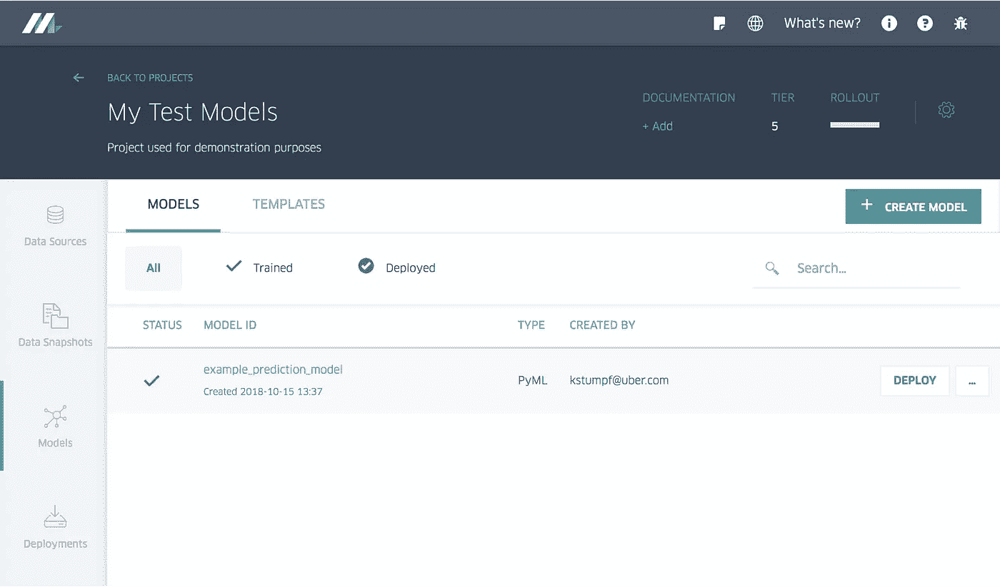
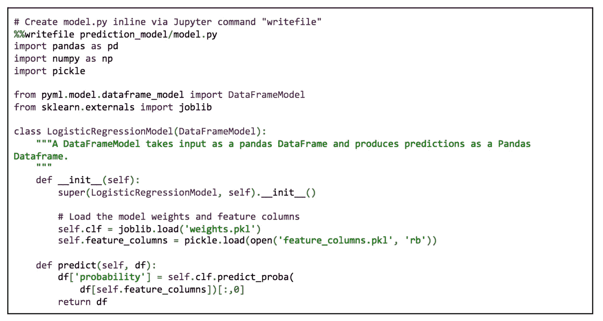
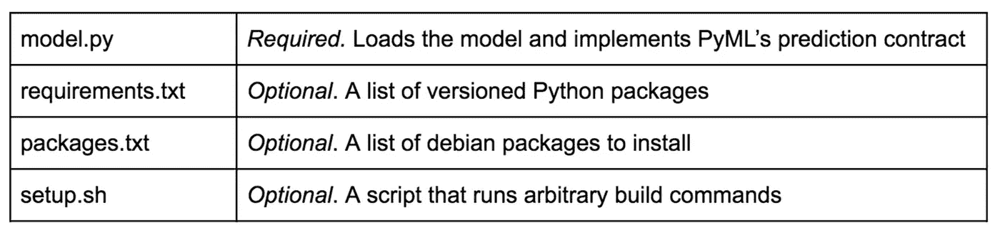
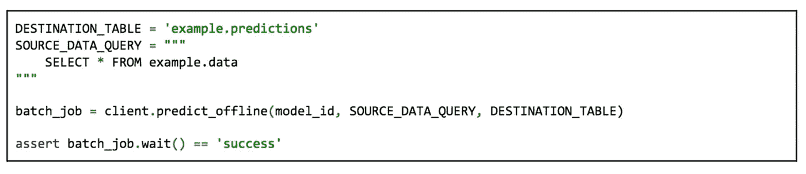
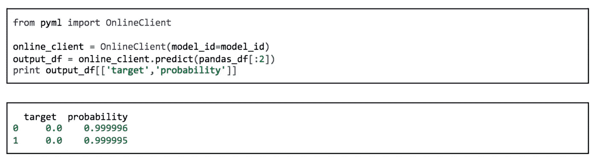

# 优步使用这个框架进行快速 ML 开发

> 原文：<https://pub.towardsai.net/uber-uses-this-framework-for-rapid-ml-development-e4a158b1a73e?source=collection_archive---------1----------------------->

## PyML 是一个允许快速开发与优步基础设施兼容的 ML 模型的框架。

图片来源:优步

> 我最近创办了一份专注于人工智能的教育时事通讯，已经有超过 125，000 名订户。《序列》是一份无废话(意思是没有炒作，没有新闻等)的 ML 导向时事通讯，需要 5 分钟阅读。目标是让你与机器学习项目、研究论文和概念保持同步。请通过订阅以下内容来尝试一下:

 [## 序列

### 与机器学习、人工智能和数据发展保持同步的最佳资源…

thesequence.substack.com](https://thesequence.substack.com/) 

优步一直是试图加速实现现实世界机器学习解决方案的最活跃的公司之一。就在今年，优步推出了像[米开朗基罗](https://eng.uber.com/michelangelo-pyml/)、 [Pyro.ai](http://pyro.ai/) 和 [Horovod](https://eng.uber.com/horovod/) 这样的技术，专注于现实世界中机器学习解决方案的关键组成部分。优步 ML 栈中一个不太为人所知的领域是 PyML，这是一个能够以一种兼容生产运行时的方式快速开发 Python 应用程序的库。

PyML 试图解决的问题是大规模机器学习应用程序中普遍存在的挑战之一。通常，数据科学家用来构建模型原型的工具和框架与相应的生产运行时之间存在明显的不匹配。例如，数据科学家通常使用基于 Python 的框架(如 PyTorch 或 Keras)来生成实验模型，然后需要适应运行时(如 Apache Spark ML Pipelines ),这带来了非常具体的约束。机器学习技术专家将这个问题称为灵活性和资源效率之间的权衡。在优步的案例中，数据科学家正在 Python 机器学习框架中构建模型，需要由米开朗基罗团队进行重构，以符合 Apache Spark 管道的限制。

克服这一限制意味着扩展米开朗基罗的能力，以支持主流机器学习框架中创作的模型，同时保持训练和优化的一致模型。

# 输入 PyML

优步 PyML 的目标是简化机器学习应用程序的开发，并弥合实验和生产运行时之间的差距。为了实现这一点，PyML 关注三个主要方面:

1)为机器学习预测模型提供标准合约。

2)支持使用 Docker 容器打包和部署机器学习模型的一致模型。

3)为在线和离线预测模型启用米开朗基罗集成的运行时。

下图说明了 PyML 的基本架构原则。

图片来源:优步

# 标准的机器学习合同

PyML 模型可以由不同的机器学习框架创作，如 TensorFlow、PyTorch 或 Scikit-Learn。模型可以使用两种主要类型的数据集: *DataFrames* ，它存储表格结构数据，以及 *Tensors* ，它存储命名的多维数组。在创建模型之后，它们被改编成标准的 PyML 契约定义，该定义实质上是分别从 DataFrameModel 或 TensorModel 抽象类继承的类。在这两种情况下，用户只需要实现两种方法:一种是加载模型参数的构造函数，另一种是接受并返回数据帧或张量的 predict()方法。

图片来源:优步

# 打包和部署

创建 PyML 模型后，可以使用一致的结构将它们打包到 Docker 容器中。PyML 引入了基于四个基本构件的标准部署格式:

图片来源:优步

使用该结构，开发人员可以使用下面的代码打包和部署 PyML 模型。PyML Docker 映像将包含模型和所有相应的依赖项。这些模型将立即在米开朗基罗的控制台上运行。

# 离线和在线预测

PyML 支持批处理(离线)和在线预测执行模型。离线预测被建模为 PySpark 上的抽象。在这种情况下，PyML 用户只需提供一个 SQL 查询，其中的列名和类型与他们的模型所期望的输入相匹配，并提供一个存储输出预测的目标配置单元表的名称。在后台，PyML 启动一个容器化的 PySpark 作业，使用与在线服务模型相同的图像和 Python 环境，确保离线和在线预测之间没有差异。执行离线预测相对简单，如以下代码所示:

图片来源:优步

PyML 模型的标准双操作(init，predict)契约简化了在线预测的实现。PyML 通过为 Docker 容器启用轻量级 gRPC 接口来启用在线预测，这些容器由一个常见的在线预测服务使用，如下图所示。根据请求，在线预测服务将通过 Mesos 的 API 启动相应的特定于 PyML 模型的 Docker 映像，作为嵌套的 Docker 容器。当容器启动时，它启动 PyML RPC 服务器，并开始监听来自在线预测服务的 Unix 域套接字上的预测请求。

图片来源:优步

PyML 通过弥合实验和运行时环境之间的差距，解决了大规模机器学习应用程序中最重要的挑战之一。除了其具体的技术贡献，PyML 的架构可以适应不同的技术栈，应该作为组织开始机器学习之旅的重要参考