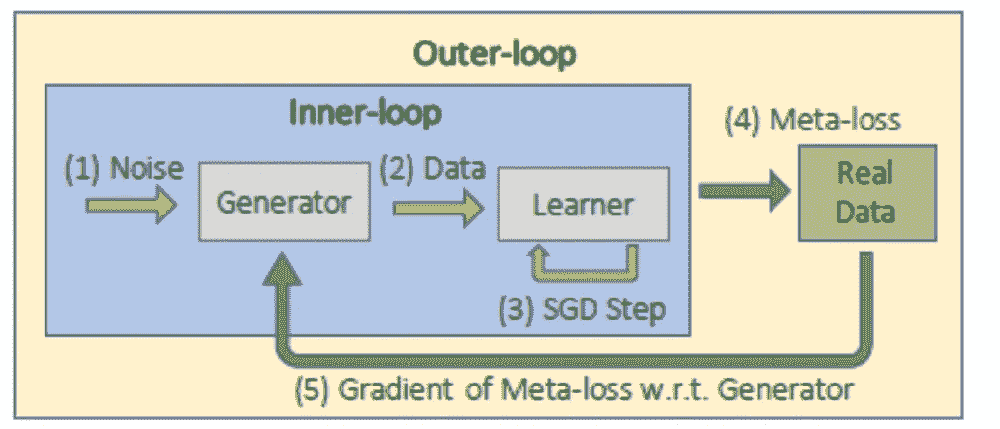
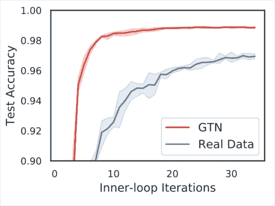
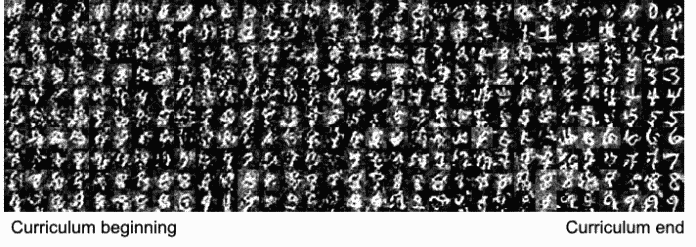

# 优步使用这种技术来改善使用合成数据的机器学习模型的训练

> 原文：<https://pub.towardsai.net/uber-uses-this-technique-to-improve-the-training-of-machine-learning-models-using-synthetic-data-12c5e420b06c?source=collection_archive---------0----------------------->

## [机器学习](https://towardsai.net/p/category/machine-learning)

## 这种被称为生成教学网络的新方法结合了 GANs 和机器教学的思想。

来源:[https://the conversation . com/teaching-machines-to-teaching-self-88374](https://theconversation.com/teaching-machines-to-teach-themselves-88374)

> 我最近创办了一份专注于人工智能的教育时事通讯，已经有超过 10 万名订户。《序列》是一份无废话(意思是没有炒作，没有新闻等)的 ML 导向时事通讯，需要 5 分钟阅读。目标是让你与机器学习项目、研究论文和概念保持同步。请通过订阅以下内容来尝试一下:

 [## 序列

### 订阅人工智能世界中最相关的项目和研究论文。受到 85，000 多人的信任…

thesequence.substack.com](https://thesequence.substack.com/) 

人工智能(AI)界的一个常见类比是，训练数据是机器学习模型的新油。就像珍贵的商品一样，训练数据是稀缺的，很难规模化获取。监督学习模型在今天的机器学习生态系统中占据主导地位。虽然与其他替代方案相比，这些类型模型相对容易创建，但它们对训练数据有很强的依赖性，这导致大多数组织都无法使用这些数据。随着机器学习模型的规模扩大，这个问题变得更加严重。2019 年，[优步工程师发表了一篇论文，提出了一种称为生成教学网络(GTNs)](https://arxiv.org/abs/1912.07768) 的新方法，该方法创建了自动生成训练数据的学习算法。

使用机器学习来生成训练数据的想法并不新奇。诸如半监督和全监督学习之类的技术依赖于该原理来在数据稀缺的环境中操作。然而，机器学习模型中的数据依赖性挑战比潜在的解决方案增长得更快。这些挑战的一部分源于现代机器学习中的一些最大的误解。

# 对训练数据的误解

训练机器学习模型的传统方法告诉我们，应该使用大型数据集来训练模型，并且应该在这个过程中利用整个数据集。虽然这个想法已经很好地建立起来了，但是它似乎是违反直觉的，因为它假设训练数据集中的所有记录都具有相同的权重，这当然是罕见的。诸如课程学习和主动学习之类的新方法集中于基于生成模型的最佳版本的示例从训练数据集中提取分布。这些技术中的一些已经被证明在神经结构搜索(NAS)技术的出现中非常有用。

NAS 正在成为现代机器学习中最流行的趋势之一。从概念上讲，NAS 通过在数千个模型中执行评估，帮助发现针对给定问题的最佳高性能神经网络架构。NAS 方法执行的评估需要训练数据，并且如果它们在每次迭代中使用完整的训练数据集，它们可能导致成本禁止。取而代之的是，NAS 方法在评估候选体系结构方面已经变得非常熟练，它通过从以前训练过的体系结构中进行外推，训练一个预测器来预测一个训练过的学习者的表现如何。

这两个想法:从训练集中选择最好的例子和理解神经网络如何学习，是优步训练机器学习模型的创造性方法的基础。

# 进入生成式教学网络

优步 GTNs 的核心原则基于一个简单而激进的想法:允许机器学习自己创建训练数据。GTINs 利用生成和元学习模型，同时也从[生成对抗神经网络(GANs)](https://en.wikipedia.org/wiki/Generative_adversarial_network) 等技术中获得灵感。

GTNs 的主要思想是训练一个数据生成网络，这样一个经过数据训练的学习者网络可以在目标任务中快速产生高精度。与 GAN 不同，这里两个网络是合作的(而不是竞争的),因为它们的兴趣是一致的，即当根据 GTN 产生的数据进行训练时，让学习者在目标任务中表现良好。通过由内部和外部训练循环组成的嵌套优化，用元学习来训练生成器和学习器网络。在 GTN 模型中，生成器产生全新的人工数据，一个前所未见的学习者神经网络(具有随机采样的架构和权重初始化)对其进行少量学习步骤的训练。在此之后，迄今为止从未见过真实数据的学习者网络在真实数据上被评估，该真实数据提供了被优化的元损失目标。

GTNs 的架构可以用五个简单的步骤来解释:

1)噪声被馈送到用于创建新的合成数据的输入发生器。

2)训练学习者在生成的数据上表现良好。

3)然后根据外环中的真实训练数据来评估已训练的学习者，以计算外环元损失。

4)发电机参数的梯度被计算到元损失以更新发电机。

5)学习课程和体重标准化都显著提高了 GTN 的表现。

图片来源:优步

# gtn 在运行

优步评估了跨不同神经网络架构的 gtn。其中一个场景是使用著名的 MNIST 数据集训练的影像分类模型。经过几次迭代后，使用 GTN 训练的新学习者能够比使用真实数据的相同模型学习得更快。在这些特定的场景中，GTN 训练的模型达到了令人瞩目的 98.9%的准确率，并且仅用了 32 个 SGD 步骤(~0.5 秒)，对课程中的 4096 幅合成图像中的每一幅都看了一次，这不到 MNIST 训练数据集中图像的 10%。

图片来源:优步

使用 GTNs 进行图像分类的一个令人惊讶的发现是，合成数据集对人眼来说似乎不切实际(见下图)。更有趣的是，图像的可识别性在课程接近尾声时有所提高。尽管它看起来很奇怪，但在训练神经网络时，合成数据已被证明是有效的。直觉上，我们会认为，如果神经网络架构在功能上更类似于人脑，那么 GTNs 的合成数据可能更类似于真实数据。然而，另一个(推测性的)假设是，人类大脑也可能通过显示非自然的、不可识别的数据来快速学习任意技能。

图片来源:优步

gtn 是一种使用合成数据改进机器学习模型训练的新方法。理论上，GTNs 可以在诸如 NAS 方法的领域中具有超越传统监督学习的应用。当然，在优步的大规模机器学习基础设施中应用 GTNs 应该会产生惊人的教训，这将有助于改进这项技术。