# 无监督与有监督学习

> 原文：<https://pub.towardsai.net/un-supervised-vs-supervised-learning-c6a83f0b4dfc?source=collection_archive---------3----------------------->

## [机器学习](https://towardsai.net/p/category/machine-learning)

我刚刚开始涉足数据科学和机器学习，开始接触“监督学习”技术，如“分类器”(来自 sklearn kit 的 Decisiontreeclassifer)，以及非监督学习，包括“聚类”。"

在这种情况下，我们使用数据集“[乳腺癌—威斯康辛州](https://www.kaggle.com/uciml/breast-cancer-wisconsin-data/download)”，并设定以下目标:

**a)** 执行聚类(k-means)，使用像剪影评分和 WSS(在平方和内)这样的评估方法找到最优的聚类，

**b)** 执行决策树分类器模型，以及传统的训练与测试样本，并使用 ROC/AUC 评估模型

**c)** 比较聚类模型输出与决策树分类器模型输出的效率

给我带来惊喜的比较结果是，在没有目标/类别变量的情况下，仅使用聚类的准确性，**接近 95 %** 与数据集中的实际类别变量匹配，优于监督学习**(使用 70: 30** ，训练测试拆分，准确性**为 92 % )** 。现在，这是否意味着它将适用于更大的样本，将被验证为更大的数据集？

让我们开始吧— ***数据洞察:***

特征是乳腺肿块细针抽吸(FNA)的数字化图像编辑。它们描述了图像中出现的细胞核的特征。

总共 569 行，32 列(包括分类变量，称为诊断，结果为恶性(M)和良性(B)。

数据处理步骤是:

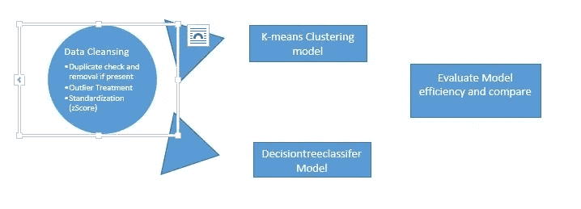

数据集没有任何缺失或重复的值，但在大多数列中有许多异常值，异常值的处理是基于 IQR 的异常值处理，随后是标准化(zScore ),因为不同要素之间的比例和范围不同。

该净化的数据被分成特征和类(目标),然后作为输入提供给 K-Means 聚类和决策树分类器模型。

**K 均值聚类**是一种无监督的 ML 算法，用于识别给定数据集的目标变量的聚类数。让我们忽略原始数据集中的目标变量，只查看特征。让我们假设没有目标变量的潜在聚类的知识。给定这个数据集，看下面的 WSS 图，从 8 分开始，WSS 得分似乎没有显著变化。所以这个图中的聚类数可能是 8。但是考虑到“癌症数据集”的业务场景，拥有 8 个类桶或目标是没有意义的。

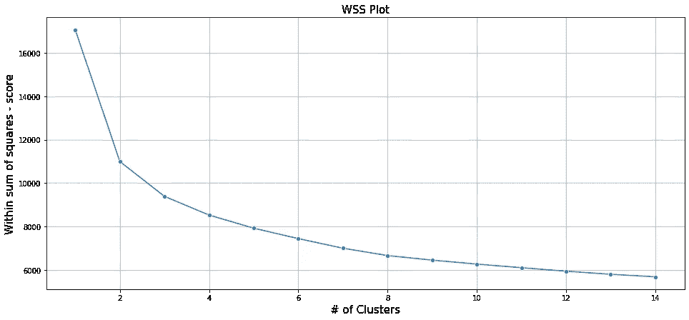

在平方和(WSS)图内

此外，验证这一点，让我们看看剪影分数。

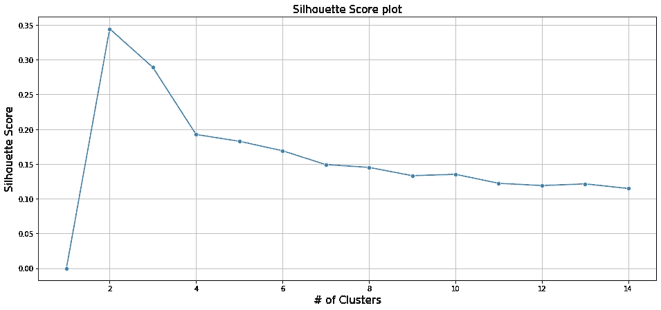

轮廓分数图

轮廓分数是对聚类之间的平均距离以及观察值在聚类中聚集的紧密程度的度量。尽管 WSS 图显示最佳聚类为 8，但轮廓得分更为恰当，因为最佳聚类表示“平均得分”，并且根据上述轮廓得分图，最大平均得分位于 **2 个聚类处。**

**监督学习—决策树分类器**

顾名思义，监督学习模型需要特征和目标变量(类变量)，在这种监督学习方法中，我们将使用决策树根据特征将行分类为二元决策结果 1 或 0。在所考虑的业务场景中，1 表示恶性(M)，0 表示良性(B)。

在这种模型方法中，决策树是在最后构建的，它通常具有根节点、分支/子树(在根节点下)，如下所示，分支数量越多，就意味着模型过度拟合，分支数量越少，就意味着拟合不足。最佳方法或分支数量是需要的，并且这种模型的评估机制是多种多样的，我们将使用混淆矩阵和曲线下面积 AUC 和 ROC(受试者操作特征)来验证模型效率。下面描述了一个决策树，

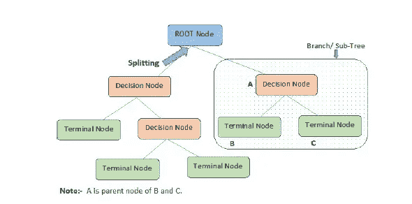

决策图表

**" decision tree classifier "**sk learn . tree 模块下的建模

dt _ model = decision tree classifier(criteria = ' Gini '，random_state=123)

在调用模型和配件之前，我们使用 sklearn 将数据集分成训练和测试样本。模型选择模块和库 train_test_split。我们在训练和测试之间呈现 70:30 的分割。

快速浏览一下参数，我们会使用“基尼”标准，基本上，

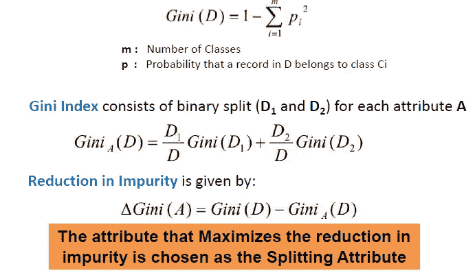

基尼标准

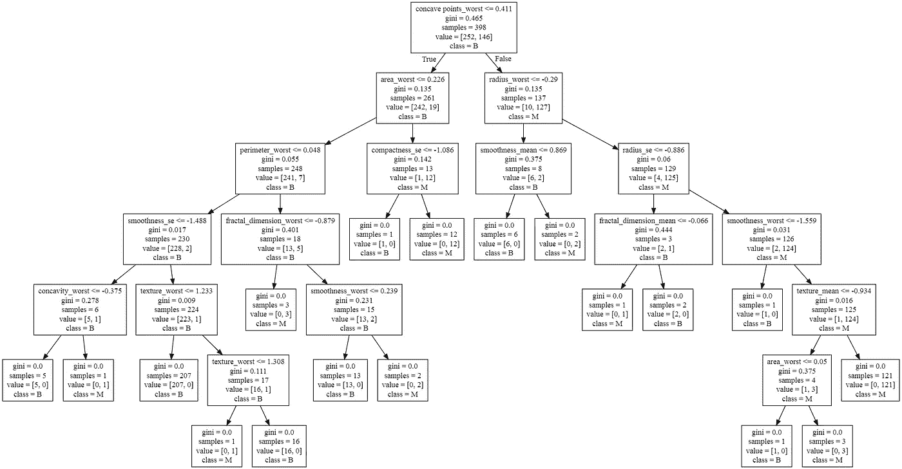

模型定型后的决策树视图。

上面生成的决策树描绘了六个分支，对于训练集，决策树分类器模型为每个特征提供了“特征 _ 重要性”。这对于理解每个特征如何影响最终结果以及每个特征的权重至关重要，下图描述了哪些特征具有更强的影响，

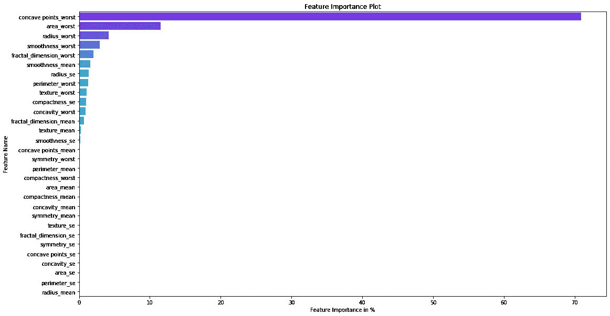

特征重要性

如果注意到特征，“凹点 _ 最差”的影响最大，为 70.9%，根 _ 节点基本上就是利用这个特征来生成到下一个分支的分裂。

让我们来看看训练数据集、测试数据集以及 K 均值与测试和训练数据集的比较的 AUC 图。

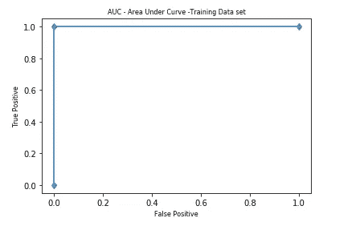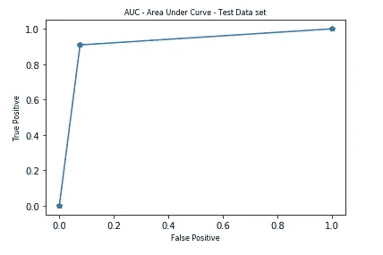

如果您注意到，测试数据集的 AUC 较小， **@ 0.916，**，而训练数据集在 1 时为**，这意味着与实际数据集相比，训练标签、类别变量(诊断)完全匹配。**

当分别比较 kMeans 结果和训练、测试之间的 AUC 时，

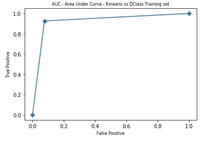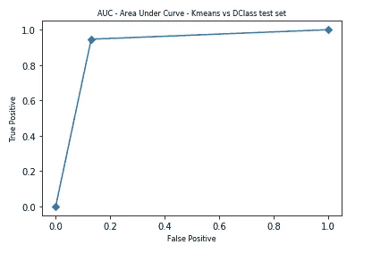

与训练数据集**相比，Kmeans 结果(仅训练样本)的 AUC 分数为 0.925，而对于测试数据集，其为 0.908。**

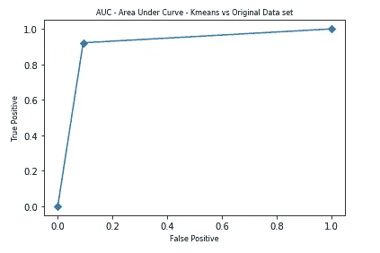

当将 kMeans 分数与原始数据(诊断)类别标签进行比较时，上述 AUC 表明 kMeans 输出和诊断类别(良性-0，恶性-1)之间的高度一致性。AUC 值也很高，为 **0.915。**

以下是混淆矩阵，针对不同的场景，

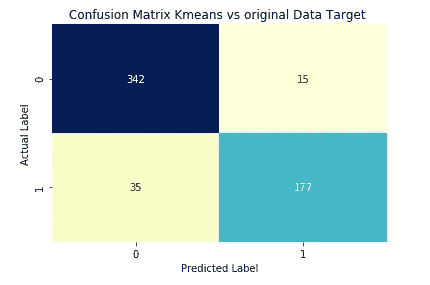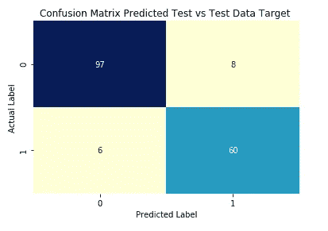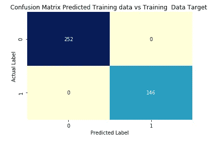

[合并的最终数据](http://www.kaggle.com/dataset/db445d1fbfe498ff91c204aafe9beac8b2afee3eaaf32fbaa2ae0832da791f7b)，带有“诊断”原始目标(类别)变量、k 均值聚类输出、训练预测、测试预测之间的比较，可从以下网址获得

> 总之， **KMeans 聚类提供了相似的准确性和拟合度，即使它是无监督学习，**当与监督学习的决策树分类器相比时。