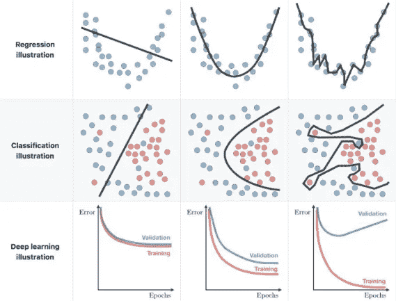
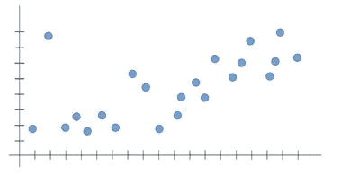
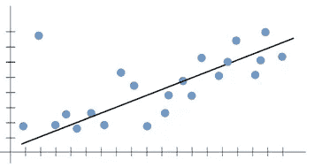
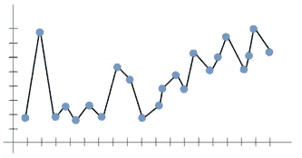
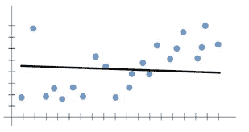
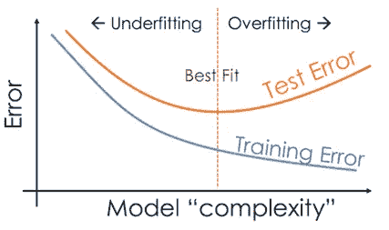
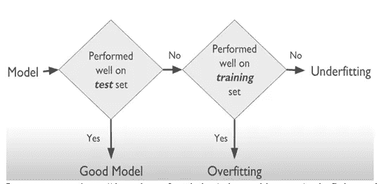
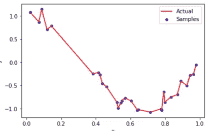
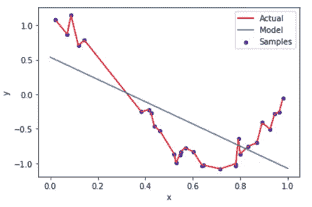

# Python 示例的欠拟合和过拟合

> 原文：<https://pub.towardsai.net/underfitting-and-overfitting-with-python-examples-5a66cb470ebd?source=collection_archive---------0----------------------->

## [机器学习](https://towardsai.net/p/category/machine-learning)

## 提高机器学习算法的性能



图片[来源](https://www.kaggle.com/getting-started/166897)

> ***过拟合和欠拟合介绍***

当你开始学习机器学习的时候，会有很多容易混淆的术语介绍给你。这些术语包括过拟合、欠拟合、偏差-方差权衡等。这些概念通常是机器学习的核心。通过这篇文章，我将试图对这些术语有一个更好的理解。

机器学习模型的唯一目的是很好地概括。泛化是模型从以前从未遇到过的输入中创建合理输出的能力。

一般来说，程序只能对它们熟悉的输入做出“机器人式”的反应，所以它们不能这样做。模型的性能以及整个应用程序在很大程度上取决于模型的泛化。如果这个模型能够很好地推广，它将达到它的目的。

已经引入了几种技术来评估这种性能，从数据本身开始。过拟合和欠拟合等概念指的是可能影响模型性能的缺陷。这意味着了解模型的性能“有多差”是至关重要的。

让我们假设我们想要用如下给出的数据集建立一个机器学习模型:



图片[来源](https://towardsdatascience.com/what-are-overfitting-and-underfitting-in-machine-learning-a96b30864690)

X 轴是输入值，Y 轴是输出值。

在机器学习中，我们知道我们的构建模型可以通过像线性回归一样在数据点之间拟合一条线来将输入值映射到输出值。这条拟合线负责欠拟合和过拟合。

在机器学习的训练阶段，假设在线性回归中，我们希望我们的模型遵循下图中给出的一条线，这是两个术语(欠拟合和过拟合)出现的地方。



图像[来源](https://towardsdatascience.com/what-are-overfitting-and-underfitting-in-machine-learning-a96b30864690)

在我们继续深入之前，让我们澄清两个重要的术语:
偏差和方差。假设使函数更容易学习的机器学习模型被称为偏差和方差，当您根据训练数据训练您的模型并获得非常低的误差时，但当您更改数据并训练相同的先前模型时，您会获得非常高的误差。

> ***过拟合***

过度拟合是指我们的模型训练从训练数据集中进行了太多，因此总成本将非常小，因此模型的泛化是不可靠的。



图像[来源](https://towardsdatascience.com/what-are-overfitting-and-underfitting-in-machine-learning-a96b30864690)

我们做的模型训练越多，过度拟合的可能性就越大。我们总是希望我们的模型能够找到趋势，而不是所有数据点的拟合线。

如果处理不当，过度拟合也可能被称为高方差导致弊大于利。当我们进行训练时，模型学习是好的，并且适合它，但是当新的测试数据来预测时，准确性变得更低，这导致过度拟合。

> **下装*下装***

*当我们的机器学习模型没有从训练数据中学习到足够的知识，因此做出不可靠的预测时，就会出现欠拟合。*

*我们还期望我们的模型从输入数据点学习太多(即太多的模式)，这可以通过更早地停止训练来完成，并且还可以应用任何其他模型。这些结果将导致模型不能从训练数据中学习足够的模式，并且主导趋势也不能被捕获。这就是欠拟合的情况。*

**

*图像[来源](https://towardsdatascience.com/what-are-overfitting-and-underfitting-in-machine-learning-a96b30864690)*

*欠拟合也被称为高偏差，这不利于模型泛化为过拟合。*

*[](/introduction-to-mlops-for-data-science-e2ca5a759f68) [## 面向数据科学的 MLOps 简介

### 持续集成、持续开发和持续测试的一部分

pub.towardsai.net](/introduction-to-mlops-for-data-science-e2ca5a759f68) [](/feature-selection-and-removing-in-machine-learning-dd3726f5865c) [## 机器学习中的特征选择和去除

### 高维数据模型及其精度的改进

pub.towardsai.net](/feature-selection-and-removing-in-machine-learning-dd3726f5865c) 

> ***下图总结了*** 的区别



图像[来源](https://www.analyticsvidhya.com/blog/2020/02/underfitting-overfitting-best-fitting-machine-learning/)

借助于实例，我们得出结论，欠拟合模型在训练集或测试集中的表现都不好。



图像[来源](https://datascience.foundation/sciencewhitepaper/underfitting-and-overfitting-in-machine-learning)

我们演示了如何使用具有多项式特征的线性回归来逼近非线性函数，以及如何避免欠拟合和过拟合。

我们要构造两个变量，比如 X 和 Y，X 是一个随机数或样本，而 Y 是余弦函数。该图将类似于下面简单绘制的 X 和 y。

使用线性回归训练我们的模型，预测并可视化结果。

```
plt.plot(x,y, color = 'red', label="Actual)
plt.scatter(x, y, edgecolor='b', s=20, label ="Samples")
plt.xlabel("x")
plt.ylabel("y")
plt.legend(loc = "best")
plt.show()
```



图像[来源](https://datascience.foundation/sciencewhitepaper/underfitting-and-overfitting-in-machine-learning.)

让我们使用线性回归来训练、预测和可视化我们的模型。

```
model = LinearRegression()
model.fit(x[:, np.newaxis], y)y_pred = model.predict(x1)
```

现在，让我们想象一下我们预测的模型。

```
plt.plot(x,y, color = 'red', label="Actual)
plt.scatter(x, y, edgecolor='b', s=20, label ="Samples")
plt.plot(x1, y_pred, label="Model") plt.xlabel("x")
plt.ylabel("y")
plt.legend(loc = "best")
plt.show()
```



图片[来源](https://datascience.foundation/sciencewhitepaper/underfitting-and-overfitting-in-machine-learning)

直线不能捕捉数据中的模式。这是一个拟合不足的例子。这个模型的误差会很大。

> ***结论***

那么什么才是正确的衡量标准呢？根据我们拥有的模型，我们的模型的性能介于过拟合和欠拟合之间，但是只有当这些模型很好地概括时，该模型才能实现其目的。概括通过限制两种不期望的结果高偏差和高方差来发挥作用。

我希望你喜欢这篇文章。通过我的 [LinkedIn](https://www.linkedin.com/in/data-scientist-95040a1ab/) 和 [twitter](https://twitter.com/amitprius) 联系我。

# 推荐文章

1.[8 Python 的主动学习见解收集模块](/8-active-learning-insights-of-python-collection-module-6c9e0cc16f6b?source=friends_link&sk=4a5c9f9ad552005636ae720a658281b1)
2。 [NumPy:图像上的线性代数](/numpy-linear-algebra-on-images-ed3180978cdb?source=friends_link&sk=d9afa4a1206971f9b1f64862f6291ac0)3。[Python 中的异常处理概念](/exception-handling-concepts-in-python-4d5116decac3?source=friends_link&sk=a0ed49d9fdeaa67925eac34ecb55ea30)
4。[熊猫:处理分类数据](/pandas-dealing-with-categorical-data-7547305582ff?source=friends_link&sk=11c6809f6623dd4f6dd74d43727297cf)
5。[超参数:机器学习中的 RandomSeachCV 和 GridSearchCV](/hyper-parameters-randomseachcv-and-gridsearchcv-in-machine-learning-b7d091cf56f4?source=friends_link&sk=cab337083fb09601114a6e466ec59689)
6。[用 Python](https://medium.com/towards-artificial-intelligence/fully-explained-linear-regression-with-python-fe2b313f32f3?source=friends_link&sk=53c91a2a51347ec2d93f8222c0e06402)
7 全面讲解了线性回归。[用 Python](https://medium.com/towards-artificial-intelligence/fully-explained-logistic-regression-with-python-f4a16413ddcd?source=friends_link&sk=528181f15a44e48ea38fdd9579241a78)
充分解释了 Logistic 回归 8。[数据分发使用 Numpy 与 Python](/data-distribution-using-numpy-with-python-3b64aae6f9d6?source=friends_link&sk=809e75802cbd25ddceb5f0f6496c9803)
9。[机器学习中的决策树 vs 随机森林](/decision-trees-vs-random-forests-in-machine-learning-be56c093b0f?source=friends_link&sk=91377248a43b62fe7aeb89a69e590860)
10。[用 Python 实现数据预处理的标准化](/standardization-in-data-preprocessing-with-python-96ae89d2f658?source=friends_link&sk=f348435582e8fbb47407e9b359787e41)*