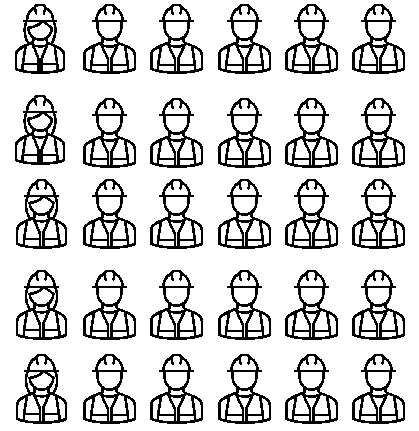
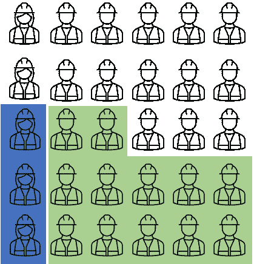
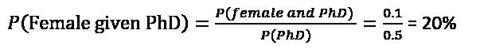
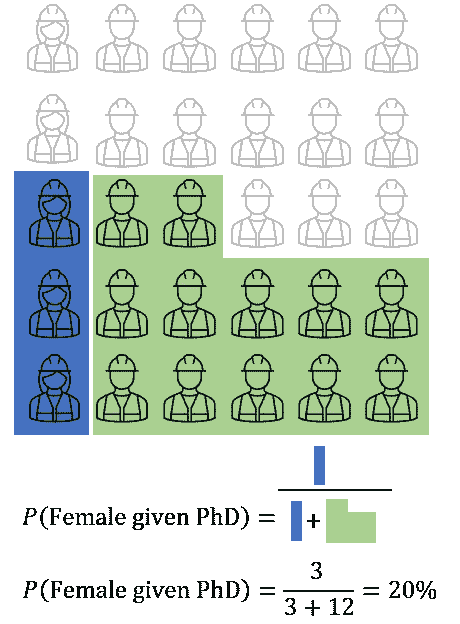
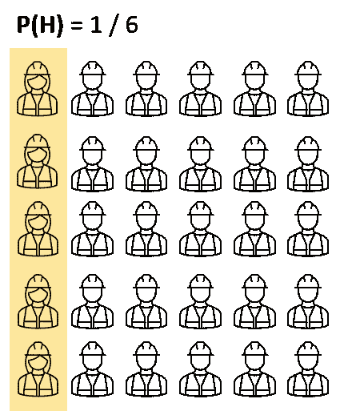
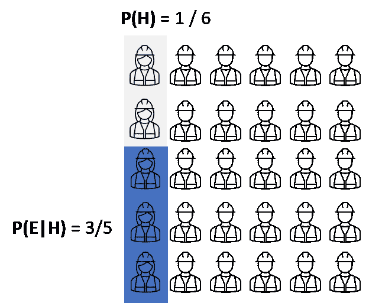
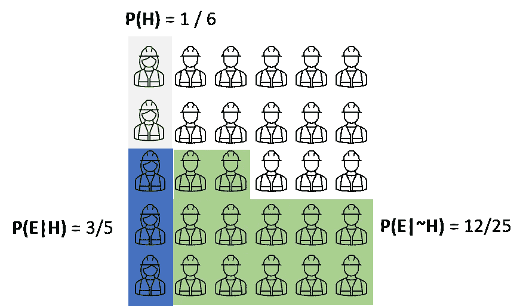
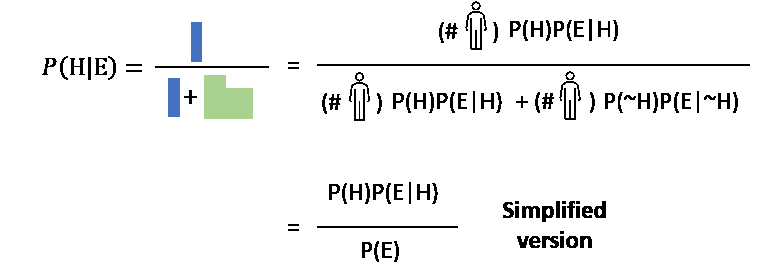

# 通过可视化理解贝叶斯定理

> 原文：<https://pub.towardsai.net/understand-bayes-theorem-through-visualization-8ec99a0577e4?source=collection_archive---------0----------------------->

## [数据科学](https://towardsai.net/p/category/data-science)

## 对贝叶斯定理及其重要性的温和介绍

来自 [Pexels](https://www.pexels.com/photo/five-dice-on-sand-998679/?utm_content=attributionCopyText&utm_medium=referral&utm_source=pexels) 的 [Balázs Utasi](https://www.pexels.com/@balazs-utasi-268058?utm_content=attributionCopyText&utm_medium=referral&utm_source=pexels) 摄影

当我们开始我们的机器学习之旅时，我们经常问自己是否应该学习统计和概率，尤其是概率。答案取决于你在哪里，以及你想让自己理解它有多深。但是，请记住以下几点:

*   许多算法是使用来自概率的概念和技术设计的，即朴素贝叶斯和概率图形模型；
*   许多模型使用在概率框架下设计的迭代算法来训练，即最大似然估计(使用 frequentist)和最大后验估计(使用 Bayesian)；
*   此外，模型的参数调整与概率框架-贝叶斯优化。

在本文中，我将使用可视化来解释贝叶斯定理概念，以及为什么它并不像有些人认为的那样困难。

# 作为可视化的贝叶斯定理…

让我们以一家公司为例，该公司有 30 名工程师，其中 25 名是男性，如下图所示。

陈述的可视化

我们可以计算出 *P(母)= 5/30 = 1/6* 。考虑下一个陈述，这些工程师中有 50%是博士，可以写出 P(PhD) = 0.5，其中 3 名女性获得了博士学位。

博士工程师

现在，我们可能想要回答的问题是“正如我们所知，从该公司随机选择的个人中，有 50%的工程师拥有博士学位，这个人是女性的概率是多少？”。这个问题可以写成 P(女给了博士)或者 P(女|博士)。基于视觉化，那翻译成“给定博士作为一个新的宇宙，女性的概率是多少。我们可以使用下面的公式进行计算:

实际上用上图，我们可以简单的把博士看成一个新宇宙来计算(忽略那些非博士)然后 P(女|博士)= #女/博士工程师数量(见下图)。

这其实就是 ***贝叶斯定理*** 。

## 贝叶斯定理的基础

在进行任何定义之前，通常在我们有一个**假设**并且我们已经观察到一些**证据**并且我们想知道假设成立的**概率为 T5【假定所述证据为真** 】时使用贝叶斯定理。现在听起来可能有点混乱，让我们使用上面的可视化来获得更好的解释。

在示例中，我们想知道选择已完成博士教育的女工程师的概率。

我们首先需要的是在不考虑任何证据的情况下，从人群中选择女工程师的概率。术语 P(H)在之前称为**。**

假设的概率在不考虑任何证据的情况下成立

下一个相关数字是女工程师符合描述(完成博士)时的比例，是 P(E|H)。在贝叶斯定理中，我们称这一项为“**可能性**”。

拥有博士学位的女工程师比例

同样，当假设不成立时，我们需要知道其他方面。

男性工程师获得博士学位的比例

有了这个概念，我们就可以计算出一个女工程师拥有博士学位的概率，P(女|博士)。分母可以写成 P(E)。

贝叶斯定理公式

补充最后一个概念，P(H|E)在贝叶斯定理中被称为“**后验**”，这意味着他们在看到证据后相信假设。通常，当我们分析新数据的范围来验证和无效模型时，我们会使用这个公式。**贝叶斯定理帮助我们量化和系统化改变信念的想法**。这样，我们可以在机器上实现贝叶斯定理来验证信念。

## 定义…

***贝叶斯定理(或贝叶斯定律、贝叶斯法则、贝叶斯价格定理)描述了基于可能与事件*** 相关的证据或条件的先验知识的事件概率。例如，我们可以使用贝叶斯定理来评估已知年龄个体的新冠肺炎风险，这比简单地假设该个体是总体人口的典型更准确(通过以个体年龄为条件)。

# 还有什么？

正如我们所知，贝叶斯定理是贝叶斯统计的分支，它依赖于主观概率，并使用贝叶斯定理根据数据更新关于感兴趣的事件和数量的知识和信念。因此，基于一些知识，我们可以在系统上得出一些初始推论(Bayes 中的“先验”)，然后基于数据和新数据“更新”这些推论，以获得“后验”。

此外，还有一些术语，如贝叶斯推断和频率统计推断，这些术语不在本文讨论范围内。然而，这篇文章应该让你对贝叶斯推断有所了解，你应该能够自己研究频率主义者的统计推断。

# 结论

在本文中，我用可视化的方式解释了贝叶斯定理，希望您已经理解了；

*   贝叶斯定理是什么，它在说什么？
*   什么时候有用？

如果你对这个话题有任何意见或问题，请随时通过 LinkedIn 账户联系我。

 [## Satsawat Natakarnkitkul -细分市场主管- True Digital Group | LinkedIn

### 我是一名数据爱好者，利用技术和业务知识来推动和传递对…

www.linkedin.com](https://www.linkedin.com/in/satsawat/)