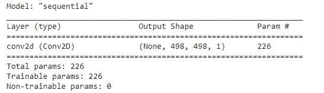
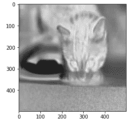
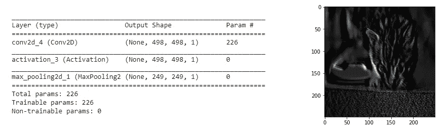

# 通过 Python 中的 Keras 示例了解 CNN 基础知识

> 原文：<https://pub.towardsai.net/understand-cnn-basics-with-a-keras-example-in-python-c1fd6c449935?source=collection_archive---------1----------------------->

## [深度学习](https://towardsai.net/p/category/machine-learning/deep-learning)

## 用于图像过程分析的深度神经网络算法


图片[来源](https://indoml.com/2018/03/07/student-notes-convolutional-neural-networks-cnn-introduction/)

在本文中，我们将尝试用 Keras 框架实现基本的 CNN 模型。卷积神经网络的好处在于，它通过保留最大限度的信息来减少或最小化图像的维度和参数，从而训练过程变得快速并消耗较少的计算能力。

我们将尝试一步一步地在 google colab 中实现代码。

**我们为什么要用 CNN？**

使用卷积神经网络的主要考虑是对于图像，以前的算法不太适合大量的图像数据集和保留图像信息。

## 我们将讨论代码旁边的基本术语，所以让我们开始练习。

我们必须导入某些与 Keras 相关联的库来实现 CNN 模型。

```
**#basic libraries**
import matplotlib.pyplot as plt
from numpy import asarray
import numpy as np
import pandas as pd
import cv2 as cv**#importing Keras libraries**
import keras
from keras.models import Sequential
from keras.layers import Dense, Conv2D , MaxPool2D , Activation**#colab don't support cv2.imshow method, so importing cv2_imshow**
from google.colab.patches import cv2_imshow **#for image pre-processing**
from skimage import io
```

如果有些人有 keras 库，那么在 TensorFlow 之后安装它，因为 keras 是在 TensorFlow 之上工作的。

我们在卷积神经网络模型中看到卷积层，有时人们会问你在一个模型中使用了多少层。现在，我们将看到用于制作 CNN 模型的一层的组件。

**步骤 1:** 从数据集中获取输入图像。这取决于图像是 RGB 格式还是灰度格式。对于 RGB 格式，尺寸为(n x n x 3)，灰度尺寸为(n x n)。

**第二步:**在第一步之后，下一步使用可以在(m×m)维中的过滤器或内核。我们可以使用滤波器的数量来确定来自输入图像的不同信息。

**步骤 3:** 该步骤是通过对输入图像使用滤波器来获得维度(a×a)的 2D 图像。如果我们使用“Y”数量的滤波器，那么我们的输出具有“Y”数量的 2D 图像，即(a x a x Y)。

在制作一层 CNN 模型中使用的基本术语是滤波器、步长、填充和图像的通道数。

*   **滤波器:**用于与图像相乘，得到 2D 图像。
*   **步幅:**是一个依赖于一个像素一个像素的滤镜或内核的运动。
*   **填充:**这是输入图像周围“零”值像素的额外尺寸，以保留最大信息。
*   **通道:**它是三通道或单通道图像，即如果输入图像是 RGB，则它是“3”通道图像，如果输入图像是灰度，则它是“1”通道图像。

[](/step-by-step-basic-understanding-of-neural-networks-with-keras-in-python-94f4afd026e5) [## 使用 Python 中的 Keras 逐步基本了解神经网络

### 具有定义的神经网络的学习

pub.towardsai.net](/step-by-step-basic-understanding-of-neural-networks-with-keras-in-python-94f4afd026e5) [](/bitcoin-price-prediction-with-rnn-and-lstm-in-python-f912d57c483e) [## 用 Python 实现 RNN 和 LSTM 的比特币价格预测

### 使用深度学习预测比特币价格

pub.towardsai.net](/bitcoin-price-prediction-with-rnn-and-lstm-in-python-f912d57c483e) 

```
#Getting an input from the website with mentioned URL below
urls = ["https://placekitten.com/800/571"]#reading the image
image = io.imread(url)#converting image from BGR to RGB
image_2 = cv.cvtColor(image, cv.COLOR_BGR2RGB)#converting RGB to grayscale image
gray_image = cv.cvtColor(image_2, cv.COLOR_RGB2GRAY)#display the image
cv2_imshow(gray_image)
```


输入图像。作者的照片

要检查输入图像的形状

```
gray_image.shape**#output:** (571, 800)
```

正如我们所知，模型的输入图像是方形的，以使过滤器正常工作。因此，我们需要调整输入图像的大小。

```
width = 512
height = 512
dim = (width, height)# resize image
img = cv2.resize(gray_image, dim, interpolation = cv2.INTER_AREA)img.shape**#output:** (512, 512)
```

当我们向 keras 提供图像时，它需要处于完美的维度，这样 keras 中的过程才能完美地工作。

```
img_batch = img.reshape(1, img.shape[0], img.shape[1], 1)
img_batch.shape#output: (1, 512, 512, 1)
```

第一个参数是批量图像的数量，最后一个参数是“1”，这意味着它是一个灰度图像。

现在，我们将在没有激活和最大池的情况下制作我们的卷积神经网络模型。权重将由模型本身随机选择。

```
model1 = Sequential()model1.add(Conv2D(1, (15,15), padding= 'valid', input_shape =
img_batch.shape[1:]))model1.summary()
```



模型 1 的总结。作者的照片

这里，我们使用 stride 的默认值“1 ”,填充为“有效”,这意味着我们不提供任何填充。第一个 Conv2D 层的第一个参数是“1”，这是我们使用的滤镜数量，第二个参数是滤镜的大小，这里滤镜的尺寸是(15 x 15)。

CNN 模型第一层的总结如上图。使用滤波器后的输出形状是(498×498×1 ),可训练参数是 226。

使用或不使用过滤器、填充和步幅后，获得输出形状的公式如下所示:

```
output shape= (input shape+2* padding — filter size)/stride + 1
output shape = (512 + 2*0 - 15)/1 +1 = 498#the params we get 
params = number of filters*(filter size) + number of filters*1
params = 1*(15*15) +1*1 = 226
```

因此，这 226 个参数将在反向传播过程中被训练。现在，我们将对我们的模型使用预测方法。

```
conv_img = model1.predict(img_batch)
```

我们将看到使用模型 1 后的输出图像。

```
conv_img_show = conv_img.reshape(conv_img.shape[1],
                                 conv_img.shape[2])plt.imshow(conv_img_show, cmap = 'gray')
plt.show()
```



模型 1 后的输出图像。作者的照片

正如我们在上面的输出图像中看到的，尺寸是(498 x 498)。

现在，我们将看到使用激活函数(即 relu 和 max-pooling)后的输出图像。

```
model2 = Sequential()model2.add(Conv2D(1, (15,15), padding= 'valid', input_shape = img_batch.shape[1:]))model2.add(Activation('relu'))
model2.add(MaxPool2D(pool_size=(2,2)))model2.summary()conv_img = model2.predict(img_batch)
conv_img_show = conv_img.reshape(conv_img.shape[1], conv_img.shape[2])plt.imshow(conv_img_show, cmap = 'gray')
plt.show()
```



模型 2 的摘要和输出图像。作者的照片

正如我们在上面的总结中看到的，激活和最大池层是在总结中添加的。这是一个单层卷积神经网络模型。

由于最大池操作，输出图像尺寸变小。当内核放置在输入图像上时，最大池内核取图像部分的最大数量。

## 结论

这篇文章是关于 CNN 模型的最基本的观察。要阅读本文，需要先了解与 CNN 模型实现相关的术语。

我希望你喜欢这篇文章。通过我的 [LinkedIn](https://www.linkedin.com/in/data-scientist-95040a1ab/) 和 [twitter](https://twitter.com/amitprius) 联系我。

# 推荐文章

[1。NLP —零到英雄与 Python](https://medium.com/towards-artificial-intelligence/nlp-zero-to-hero-with-python-2df6fcebff6e?sk=2231d868766e96b13d1e9d7db6064df1)
2。 [Python 数据结构数据类型和对象](https://medium.com/towards-artificial-intelligence/python-data-structures-data-types-and-objects-244d0a86c3cf?sk=42f4b462499f3fc3a160b21e2c94dba6)3 .[Python 中的异常处理概念](/exception-handling-concepts-in-python-4d5116decac3?source=friends_link&sk=a0ed49d9fdeaa67925eac34ecb55ea30)
4。[为什么 LSTM 在深度学习方面比 RNN 更有用？](/deep-learning-88e218b74a14?source=friends_link&sk=540bf9088d31859d50dbddab7524ba35)
5。[神经网络:递归神经网络的兴起](/neural-networks-the-rise-of-recurrent-neural-networks-df740252da88?source=friends_link&sk=6844935e3de14e478ce00f0b22e419eb)
6。[用 Python](https://medium.com/towards-artificial-intelligence/fully-explained-linear-regression-with-python-fe2b313f32f3?source=friends_link&sk=53c91a2a51347ec2d93f8222c0e06402)
7 全面讲解了线性回归。[用 Python](https://medium.com/towards-artificial-intelligence/fully-explained-logistic-regression-with-python-f4a16413ddcd?source=friends_link&sk=528181f15a44e48ea38fdd9579241a78)
充分解释了 Logistic 回归 8。[concat()、merge()和 join()与 Python](/differences-between-concat-merge-and-join-with-python-1a6541abc08d?source=friends_link&sk=3b37b694fb90db16275059ea752fc16a)
的区别 9。[与 Python 的数据角力—第一部分](/data-wrangling-with-python-part-1-969e3cc81d69?source=friends_link&sk=9c3649cf20f31a5c9ead51c50c89ba0b)
10。[机器学习中的混淆矩阵](https://medium.com/analytics-vidhya/confusion-matrix-in-machine-learning-91b6e2b3f9af?source=friends_link&sk=11c6531da0bab7b504d518d02746d4cc)