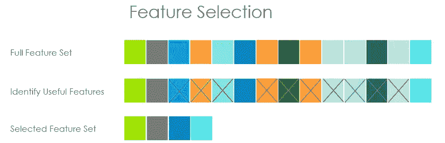
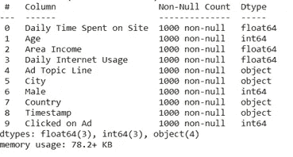
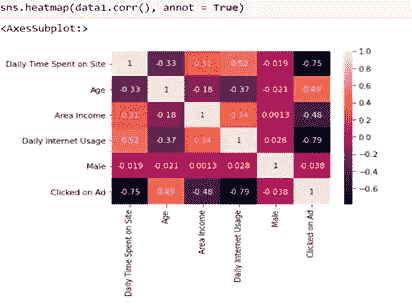

# 理解 Python 机器学习中的特征选择

> 原文：<https://pub.towardsai.net/understand-feature-selection-in-machine-learning-with-python-a0e99dbb7426?source=collection_archive---------0----------------------->

## [机器学习](https://towardsai.net/p/category/machine-learning)

## **从数据中选择最佳特征集的技术**


照片由[乔恩·泰森](https://unsplash.com/@jontyson?utm_source=medium&utm_medium=referral)在 [Unsplash](https://unsplash.com?utm_source=medium&utm_medium=referral) 拍摄

> ***特征选择及其类型***

我们都处理大量的数据，并不是每一列对我们的模型都很重要。

例如，考虑一个包含姓名、年龄、性别、学习时间和学校名称等特征的学生数据集。如果你必须建立一个模型来预测学生的分数，很明显，这个特性的学习时间比其他特性更有帮助。

当你在一个大的数据集上工作时，知道一个特性的重要性并不像我上面说的那么容易。因此，我们需要一种自动为我们工作的技术。特征选择就是这样一种方法。

顾名思义，特征选择是一种从数据集中选择最佳特征集来建立良好预测模型的技术。这个过程也可以称为变量选择或属性选择。



图像[来源](https://thecleverprogrammer.com/2020/10/18/feature-selection-in-machine-learning/)

**特征选择的重要性和优势。**

我们都知道为了得到一个准确的模型，数据清洗是多么重要。特征选择的意义也是如此。过多和多余的功能会导致许多问题，例如:

*   不必要的信息分配。
*   需要更多的时间来训练算法。
*   当包含不必要的数据时，它也可能有噪声，导致模型过拟合。

因此，当在用数据训练模型之前使用特征选择时，模型将是**准确的，较少的训练时间减少了过度拟合。**

[](/latest-programming-languages-for-ai-5252d39e1c51) [## 最新的人工智能编程语言

### 人工智能未来娱乐它的语言

pub.towardsai.net](/latest-programming-languages-for-ai-5252d39e1c51) 

有许多类型的特征选择方法，例如:

*   过滤方法。
*   包装方法。
*   嵌入式方法。

> ***过滤方法***

这是一种作为预处理步骤完成的特征选择。这将根据每个变量的重要性对其进行排序。这也称为单变量方法，因为它一次只作用于一个特征。这种方法是所有其他方法中最简单和容易的。

这种方法可以使用许多技术来实现，如 ***卡方检验、信息增益、费希尔评分和相关系数。***

**使用 python 的例子:**

这里有一段代码解释了使用热图的相关系数。

在这里，我使用广告数据集来创建一个模型，该模型将根据给定的数据预测用户是否会点击广告。它包含以下几列。



作者的照片

现在，我将使用 seaborn 库中的热点图来可视化数据集中最相关的要素。

```
sns.heatmap(data1.corr(), annot = True)
```



作者的照片

相关性范围从-1 到 1。值为 1 的要素具有最大的相关性。在这里,“每天花在网站上的时间”是最相关的特性。我们可以去掉与目标变量相关系数较低的特征。如果一个以上的变量之间存在相关性，则称为多重共线性。

[](/useful-tips-of-if-else-control-statement-using-python-a9d652a74e4) [## 使用 Python 的 If-Else 控制语句的实用技巧

### 通过示例对控制回路有基本的了解

pub.towardsai.net](/useful-tips-of-if-else-control-statement-using-python-a9d652a74e4) [](/numpy-linear-algebra-on-images-ed3180978cdb) [## NumPy:图像上的线性代数

### SVD 来生成图像的压缩近似

pub.towardsai.net](/numpy-linear-algebra-on-images-ed3180978cdb) 

> ***包装方法***

包装方法也称为贪婪方法，因为它搜索和评估所有可能的特征组合以满足评估标准。

该方法采用了前向特征选择、后向特征消除、穷举特征选择、递归特征消除等技术。

**使用 python 的例子:**

这里有一小段代码解释了糖尿病数据集的递归特征消除。这提供了使用 scikit 的最重要的特性。scikit 库中的特征选择方法。

```
from sklearn.linear_model import LogisticRegression
dataframe = pd.read_csv("diabetes.csv")
array =dataframe.valuesx = array[:, 0:8]
y = array[:,8]#gives top 5 features
rfe = RFE(model, 5)
fit = rfe.fit(x,y)print("Num Features: %s" %(fit.n_features_))#this shows TRUE fpr features that are important and other features #as FALSE
print("Selected Features: %s" %(fit.support_))#This is the ranking of the feature in order
print("Feature Ranking: %s" %(fit.ranking_))**#output:**
Num Features: 5
Selected Features: [True True False True True False False True]
Feature Ranking: [1 1 2 3 4 1 1 1]
```

> ***嵌入方法***

将特征选择作为其模型的一部分(内置)的机器学习模型被称为嵌入式或内在方法。内置的特征选择意味着模型包括有助于最大限度提高准确性的预测因子。

使用嵌入式方法的模型有 ***套索回归、岭回归、决策树、随机森林算法*** *。*

**使用 python 的例子:**

这里有一段代码解释了套索回归，也称为 L1 正则化。

```
from sklearn.linear_model import LogisticRegression
from sklearn.feature_selection import SelectFromModel#set the regularization parameter C=1
logistic = LogisticRegression(C=1, penalty ="l1", solver="liblinear'
                          , random_state = 7).fit(x,y)model = SelectFromModel(logistic, prefit = True)x_new = model.transform(x)#dropped columns have value of all zeros, keep other columns
selected_columns = selected_features.columns[selected_features.var()        
                                                 != 0]selected_columns**#output:**
Index([0, 1, 2, 3, 4, 5, 6, 7], dtype = 'int64')
```

还有一种叫做混合方法的方法，它是过滤器和包装器方法的组合。与其他方法相比，这些模型提供了更好的准确性。

> ***结论***

在本文中，我们主要讨论了特征选择、它的重要性和类型。希望你对这个话题有所了解。

我希望你喜欢这篇文章。通过我的 [LinkedIn](https://www.linkedin.com/in/data-scientist-95040a1ab/) 和 [twitter](https://twitter.com/amitprius) 联系我。

# 推荐文章

[1。NLP —零到英雄与 Python](https://medium.com/towards-artificial-intelligence/nlp-zero-to-hero-with-python-2df6fcebff6e?sk=2231d868766e96b13d1e9d7db6064df1)
2。 [Python 数据结构数据类型和对象](https://medium.com/towards-artificial-intelligence/python-data-structures-data-types-and-objects-244d0a86c3cf?sk=42f4b462499f3fc3a160b21e2c94dba6)3 .[Python 中的异常处理概念](/exception-handling-concepts-in-python-4d5116decac3?source=friends_link&sk=a0ed49d9fdeaa67925eac34ecb55ea30)
4。[为什么 LSTM 在深度学习方面比 RNN 更有用？](/deep-learning-88e218b74a14?source=friends_link&sk=540bf9088d31859d50dbddab7524ba35)
5。[神经网络:递归神经网络的兴起](/neural-networks-the-rise-of-recurrent-neural-networks-df740252da88?source=friends_link&sk=6844935e3de14e478ce00f0b22e419eb)
6。[用 Python](https://medium.com/towards-artificial-intelligence/fully-explained-linear-regression-with-python-fe2b313f32f3?source=friends_link&sk=53c91a2a51347ec2d93f8222c0e06402)
7 全面讲解了线性回归。[用 Python](https://medium.com/towards-artificial-intelligence/fully-explained-logistic-regression-with-python-f4a16413ddcd?source=friends_link&sk=528181f15a44e48ea38fdd9579241a78)
充分解释了 Logistic 回归 8。[concat()、merge()和 join()与 Python](/differences-between-concat-merge-and-join-with-python-1a6541abc08d?source=friends_link&sk=3b37b694fb90db16275059ea752fc16a)
的区别 9。[与 Python 的数据角力—第一部分](/data-wrangling-with-python-part-1-969e3cc81d69?source=friends_link&sk=9c3649cf20f31a5c9ead51c50c89ba0b)
10。[机器学习中的混淆矩阵](https://medium.com/analytics-vidhya/confusion-matrix-in-machine-learning-91b6e2b3f9af?source=friends_link&sk=11c6531da0bab7b504d518d02746d4cc)