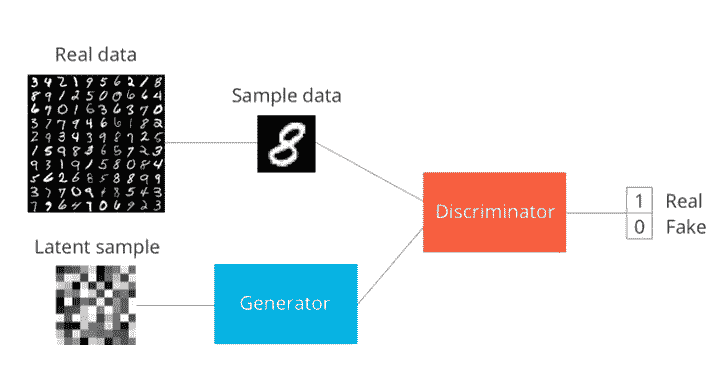
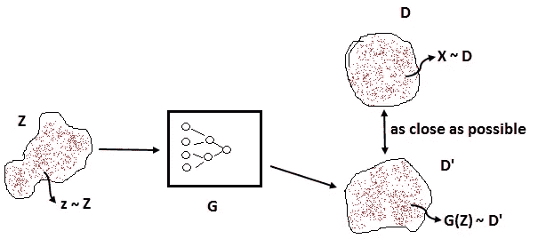
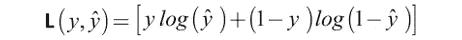
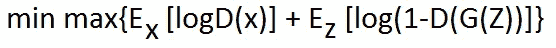

# 理解深度学习中的生成对抗网络

> 原文：<https://pub.towardsai.net/understand-generative-adversarial-network-gan-in-deep-learning-d3afd5941a02?source=collection_archive---------1----------------------->

## [深度学习](https://towardsai.net/p/category/machine-learning/deep-learning)

## 在深度卷积神经网络模型中生成人工图像

图片[来源](https://towardsdatascience.com/gan-introduction-and-implementation-part1-implement-a-simple-gan-in-tf-for-mnist-handwritten-de00a759ae5c)

在本文中，我们将讨论生成对手网络(GAN ),它是由两个神经网络组成的深度神经网络架构，两个神经网络相互竞争。这里的“干”由两个词组成，其含义如下所示:

***生成式*** 是指生成接近我们想要近似的原始数据的概率分布。

***Adversarial*** 的意思是一般情况下是对立的，因为有两个模型即鉴别器和生成器，它们试图互相对立来学习概率分布函数。GAN 是以对抗方式训练的神经网络，用于生成模拟我们想要近似的某种分布的数据。

机器学习中模型的分类。

1.  **判别模型:**判别两类不同数据的模型。
2.  **生成模型:**该模型用于从随机分布的数据中生成图像，使分布 D’接近真实图像分布 D

数学上，

**z~Z 映射到样本 G(Z)~ D’**

作者的照片

在上图中，原始分布是一个圆 D，数据点表示为 X，其分布为 D。生成器的工作是使随机分布 Z 到 D '，并根据类似 l1 或 l2 范数的度量使其尽可能接近 D。生成器 G 可以是神经网络或深度神经网络或卷积神经网络。

现在，在从生成模型中获得假样本后，鉴别器将区分假样本，即 G(Z)和真样本，如果样本来自 D，它将给出值“0 ”,如果来自 D，它将给出值“1”。如果鉴别器给出值“0.5 ”,那么它将无法区分真样本和假样本。

 [## 通过 Python 中的 Keras 示例了解 CNN 基础知识

### 用于图像过程分析的深度神经网络算法

pub.towardsai.net](/understand-cnn-basics-with-a-keras-example-in-python-c1fd6c449935)  [## 用 Python 实现 RNN 和 LSTM 的比特币价格预测

### 使用深度学习预测比特币价格

pub.towardsai.net](/bitcoin-price-prediction-with-rnn-and-lstm-in-python-f912d57c483e) 

**生成敌对网络(GAN)中的损失函数是什么？**

需要注意的重要部分是，生成器用于生成一个图像来欺骗鉴别器。鉴别器不能区分假图像和真实图像的时间，即发生器产生的假图像如此真实以至于不能鉴别。如果鉴别器知道从生成器生成的图像是假的，则它显示错误，并试图更新生成器和鉴别器中模型的权重和偏差。

损失函数的公式是二元交叉熵，如下所示:

其中 ***y-hat*** 为重建图像， ***y*** 为原始图像。

以 GAN 表示的实际损耗函数如下所示:

> ***算法如何在生成性对抗网络中工作***

我们在制作 GAN 算法时可以做的基本步骤如下所示:

步骤 1:导入所有库

步骤 2:加载数据集

步骤 3:现在我们可以给出训练和网络参数

步骤 4:我们可以设置权重和偏差变量

第五步:现在，让生成器和鉴别器运行。

步骤 6:定义损失和优化

*   鉴别器损失:用于量化区分真假图像。
*   发生器损耗:用于欺骗鉴别器，使其误以为假图像是真图像。

第七步:训练发生器和鉴别器，保存发生器的图像以匹配真实图像。

 [## 神经网络:递归神经网络的兴起

### 深度学习中的渐进一代

pub.towardsai.net](/neural-networks-the-rise-of-recurrent-neural-networks-df740252da88) 

> ***生成性对抗网络的局限性***

*   **什么是 GAN 中的模式崩塌？**

在训练期间，发生器可能会崩溃到始终产生相同输出的设置。这被称为模式崩溃。

*   **消失渐变**

权重和偏差的导数变得接近于零。

*   **难以达成纳什均衡**

鉴别器和生成器的成本更新之间没有关系，因为生成器更新的成本与其他模型无关。因此，两种模型的梯度都不能保证收敛。

*   **计数问题**

在很多情况下，我们会看到模糊的图像，图像中的对象看起来更多，因为图像中的突然性会产生更多的预测。

*   **透视问题**

有时生成性对抗网络不能够理解图像的前后视图。

> ***结论***

本文给出了生成性对抗网络的直觉。

我希望你喜欢这篇文章。通过我的 [LinkedIn](https://www.linkedin.com/in/data-scientist-95040a1ab/) 和 [twitter](https://twitter.com/amitprius) 联系我。

# 推荐文章

[1。NLP —零到英雄用 Python](https://medium.com/towards-artificial-intelligence/nlp-zero-to-hero-with-python-2df6fcebff6e?sk=2231d868766e96b13d1e9d7db6064df1)
2。 [Python 数据结构数据类型和对象](https://medium.com/towards-artificial-intelligence/python-data-structures-data-types-and-objects-244d0a86c3cf?sk=42f4b462499f3fc3a160b21e2c94dba6)
3。[Python 中的异常处理概念](/exception-handling-concepts-in-python-4d5116decac3?source=friends_link&sk=a0ed49d9fdeaa67925eac34ecb55ea30)
4。[为什么 LSTM 在深度学习方面比 RNN 更有用？](/deep-learning-88e218b74a14?source=friends_link&sk=540bf9088d31859d50dbddab7524ba35)
5。[神经网络:递归神经网络的兴起](/neural-networks-the-rise-of-recurrent-neural-networks-df740252da88?source=friends_link&sk=6844935e3de14e478ce00f0b22e419eb)
6。[用 Python 充分解释了线性回归](https://medium.com/towards-artificial-intelligence/fully-explained-linear-regression-with-python-fe2b313f32f3?source=friends_link&sk=53c91a2a51347ec2d93f8222c0e06402)
7。[用 Python](https://medium.com/towards-artificial-intelligence/fully-explained-logistic-regression-with-python-f4a16413ddcd?source=friends_link&sk=528181f15a44e48ea38fdd9579241a78)
充分解释了 Logistic 回归 8。[concat()、merge()和 join()与 Python](/differences-between-concat-merge-and-join-with-python-1a6541abc08d?source=friends_link&sk=3b37b694fb90db16275059ea752fc16a)
9 的区别。[与 Python 的数据角力—第一部分](/data-wrangling-with-python-part-1-969e3cc81d69?source=friends_link&sk=9c3649cf20f31a5c9ead51c50c89ba0b)10。[机器学习中的混淆矩阵](https://medium.com/analytics-vidhya/confusion-matrix-in-machine-learning-91b6e2b3f9af?source=friends_link&sk=11c6531da0bab7b504d518d02746d4cc)