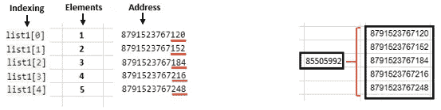

# 将 List 理解为 Big O 并理解 Python 示例

> 原文：<https://pub.towardsai.net/understand-list-as-big-o-and-comprehension-with-python-examples-cbea610c9e43?source=collection_archive---------1----------------------->

## [编程](https://towardsai.net/p/category/programming)

## 列表是 python 数据结构的一部分


照片由[埃米尔·佩龙](https://unsplash.com/@emilep?utm_source=medium&utm_medium=referral)在 [Unsplash](https://unsplash.com?utm_source=medium&utm_medium=referral) 上拍摄

本文将提供 list 的所有深度 ***概念作为数据结构的一部分。概念将从基础到高级，以了解列表的内部。***

## 介绍

我们想到的第一个问题是 ***什么是列表？***

以下几点会让你理解如下所示的列表:

*   该列表可能是也可能不是异构数据类型的集合。
*   这对小序列很有用。
*   python 中的列表是不可变的，这意味着我们可以对列表中的条目进行修改。项目是列表中的元素。
*   列表不能做直接算术，它需要更多的内存来进行运算。

## 列表中的 Python 示例:

使用方括号[]在 python 中创建列表。

```
#Empty list
list1 = []#filling the list with only integer elements
list1 = [1,2,3,4,5]#filling list with only string elements
list1 = ['Amit', 'Akaash', 'John', 'Smith']#filling list with only float elements
list1 = [1.4, 4.2, 9.7, 5.5]#filling list with mix elements
list1 = [1, 'Amit', 4.2, 'Smith']
```

让我们看看列表的地址和列表中的元素。

```
#Address of the list
print(id(list1))#Output:
85505992#Addresses of the elements in the list
print(id(list1[0]))
print(id(list1[1]))
print(id(list1[2]))
print(id(list1[3]))
print(id(list1[4]))#Output:
8791523767120
8791523767152
8791523767184
8791523767216
8791523767248
```



每个元素的不同地址。作者的照片

上面的例子表明，完整列表的地址和每个元素的地址是不同的。

[](/understand-time-series-components-with-python-4bc3e2ba1189) [## 用 Python 理解时间序列组件

### 机器学习中预测模型的基本概念及实例

pub.towardsai.net](/understand-time-series-components-with-python-4bc3e2ba1189) [](/data-preprocessing-concepts-with-python-b93c63f14bb6) [## Python 中的数据预处理概念

### 一种为机器学习估值器准备数据的稳健方法

pub.towardsai.net](/data-preprocessing-concepts-with-python-b93c63f14bb6) 

## 大 O 基础

借助如下所示的***【LIST】***例子，有助于认识数据结构中的大 O:

大 O 项用于数据结构中，了解算法中的时间和空间约束。

```
#Square of numbers with one for loop
def squared(nums):
    sq_list = []
    for n in nums:
        sq_list.append(n*n)
    return sq_listnums = [1,2,3,4,5]
output = squared(nums)
print(output)#output:
[1, 4, 9, 16, 25]
```

正如我们看到的，列表中有 5 个元素，for 循环将迭代 5 次，但如果列表有 100K 个元素，那么 for 循环将迭代 100K 次，时间消耗将更多。所以，这个程序的时间复杂度是 O(n)的量级。

另一方面，当我们将一个列表传递给一个函数来获取一个值时

```
def sum_value(nums, nums1, value):
    price = nums[index]/nums1[index]
    return price
```

这里，时间复杂度是 O(1)的量级，因为计算与列表无关。

如果我们使用两个 for 循环来比较程序中的数字。

```
for n in range(len(nums)):           --------> n
    for k in range(len(nums1)):      --------> n
        if nums[n] == nums1[k]:
```

这里时间为(time = a*n + b)，时间复杂度为 O(n)阶。我们总是选择增长最快的时间，如下例所示:

```
a*n^2 + b*n + c              -------> n^2
a*n^3 + b*n^2 + c*n + d      -------> n^3
```

## 列表中使用的方法

列表是可变的，我们可以根据需要进行修改。因此，python 给出了一些修改方法来对列表进行修改，如下所示:

例如:

1.  **追加方法:**在列表的最后添加值

```
nums = [12,24,46,85,23,89]
nums.append(15)
print(nums)#output:
[12, 24, 46, 85, 23, 89, 15]
```

2.**插入方法:**在方法中指定的特定索引处添加元素。

```
nums = [12,24,46,85,23,89]
nums.insert(2,15)
print(nums)#output:
[12, 24, 15, 46, 85, 23, 89]
```

3.**删除方法:**如果我们知道元素在列表中，就删除它。

```
nums = [12,24,46,85,23,89]
nums.remove(46)
print(nums)#output:
[12, 24, 85, 23, 89]#if the element is not in the list we get an error
#output:
**ValueError**: list.remove(x): x not in list
```

4. **Pop 方法:**删除带索引的数字，删除最后一个元素，不给出索引。

```
nums = [12,24,46,85,23,89]
nums.pop()
print(nums)#output: last element 89 is removed
[12, 24, 46, 85, 23]#with index specify
nums = [12,24,46,85,23,89]
nums.pop(2)
print(nums)#output:  46 is removed
[12, 24, 85, 23, 89]
```

5.**扩展方法:**用另一个列表扩展这个列表。

```
nums = [12,24,46,85,23,89]
nums.extend([34,77])
print(nums)#output:
[12, 24, 46, 85, 23, 89, 34, 77]
```

还有很多其他的方法，你可以去搜索和学习。

## 列表中使用的内置函数

还有一些内置函数可以轻松进行计算。

例如:

```
#creating list
nums = [12,24,46,85,23,89]#finding minimum value
print(min(nums))#output:
12
----------------------------------------------------#finding maximum value
print(max(nums))#output:
89
----------------------------------------------------#finding sum of all values
print(sum(nums))#output:
279
----------------------------------------------------#sorting values to ascending order
nums.sort()
print(nums)#output:
[12, 23, 24, 46, 85, 89]
```

[](/z-statistics-t-statistics-p-statistics-are-still-confusing-you-87557047e20a) [## Z-统计量，T-统计量，P-统计量还在迷惑你？

### 机器学习统计学中的定义和概念

pub.towardsai.net](/z-statistics-t-statistics-p-statistics-are-still-confusing-you-87557047e20a) 

## 列表理解

列表理解用于使过程更加简洁和快速。

例如:

```
#creating list of sum of elements
sum = []
for x in range(5):
    sum.append(x+2)
print(sum)#output:
[2, 3, 4, 5, 6]
```

为了简洁起见，我们可以用*函数配合 ***映射*** 方法*

```
*sum = list(map(lambda x: x+2, range(5)))
print(sum)#output:
[2, 3, 4, 5, 6]*
```

*我们也可以在没有 lambda 函数和 map 方法的情况下实现相同的输出。*

```
*sum = [x+2 for x in range(5)]
print(sum)#output:
[2, 3, 4, 5, 6]*
```

*哦！列表理解的魔力是如此有趣的学习。*

*使用两个 for 循环的另一个例子*

```
*#Getting pairs of elements from two list
pairs = []
for x in [4,7,2]:
    for y in [7,3,8]:
        if x != y:
            pairs.append((x, y))

print(pairs)#output:
[(4, 7), (4, 3), (4, 8), (7, 3), (7, 8), (2, 7), (2, 3), (2, 8)]*
```

*等效的简明易读的理解如下所示:*

```
*pairs = [(x, y) for x in [4,7,2] for y in [7,3,8] if x != y]
print(pairs)#output:
[(4, 7), (4, 3), (4, 8), (7, 3), (7, 8), (2, 7), (2, 3), (2, 8)]*
```

*列表理解的更多例子*

```
*#1
nums = [7,3,8,1,2]
[x*2 for x in nums]#output:
[14, 6, 16, 2, 4]
-------------------------------------------------
#2
nums = [7,3,8,1,2]
[x for x in nums if x >= 5]#output:
[7, 8]
-------------------------------------------------
#To flatten the list from lists
lists = [[1,2,3], [4,7,2], [7,3,8]]
[num for elem in lists for num in elem]#output:
[1, 2, 3, 4, 7, 2, 7, 3, 8]*
```

*我们可以用理解矩阵来转置矩阵*

```
*import numpy as npinput_1 = np.array([[11, 12, 13, 14], 
                    [21, 22, 23, 24], 
                    [31, 32, 33, 34]])[[row[i] for row in input_1] for i in range(4)]#output:
[[11, 21, 31], [12, 22, 32], [13, 23, 33], [14, 24, 34]]*
```

*我们还可以使用内置的 ZIP 函数来进行矩阵的转置。*

```
*import numpy as npinput_1 = np.array([[11, 12, 13, 14], 
                    [21, 22, 23, 24], 
                    [31, 32, 33, 34]])
list(zip(*input_1))#output:
[(11, 21, 31), (12, 22, 32), (13, 23, 33), (14, 24, 34)]*
```

## *结论:*

*列表理解是一种处理列表和其他序列操作以节省时间和空间计算的聪明方法。*

*我希望你喜欢这篇文章。通过我的 [LinkedIn](https://www.linkedin.com/in/data-scientist-95040a1ab/) 和 [twitter](https://twitter.com/amitprius) 联系我。*

# *推荐文章*

*[1。NLP —零到英雄与 Python](https://medium.com/towards-artificial-intelligence/nlp-zero-to-hero-with-python-2df6fcebff6e?sk=2231d868766e96b13d1e9d7db6064df1)
2。 [Python 数据结构数据类型和对象](https://medium.com/towards-artificial-intelligence/python-data-structures-data-types-and-objects-244d0a86c3cf?sk=42f4b462499f3fc3a160b21e2c94dba6)3 .[Python 中的异常处理概念](/exception-handling-concepts-in-python-4d5116decac3?source=friends_link&sk=a0ed49d9fdeaa67925eac34ecb55ea30)
4。[用 Python 进行主成分分析降维](/principal-component-analysis-in-dimensionality-reduction-with-python-1a613006d531?source=friends_link&sk=3ed0671fdc04ba395dd36478bcea8a55)
5。[用 Python 全面讲解 K-means 聚类](https://medium.com/towards-artificial-intelligence/fully-explained-k-means-clustering-with-python-e7caa573176a?source=friends_link&sk=9c5c613ceb10f2d203712634f3b6fb28)
6。[用 Python](https://medium.com/towards-artificial-intelligence/fully-explained-linear-regression-with-python-fe2b313f32f3?source=friends_link&sk=53c91a2a51347ec2d93f8222c0e06402)
7 全面讲解了线性回归。[用 Python](https://medium.com/towards-artificial-intelligence/fully-explained-logistic-regression-with-python-f4a16413ddcd?source=friends_link&sk=528181f15a44e48ea38fdd9579241a78)
充分解释了 Logistic 回归 8。[用 Python 实现时间序列的基础知识](https://medium.com/towards-artificial-intelligence/basic-of-time-series-with-python-a2f7cb451a76?source=friends_link&sk=09d77be2d6b8779973e41ab54ebcf6c5)
9。[与 Python 的数据角力—第一部分](/data-wrangling-with-python-part-1-969e3cc81d69?source=friends_link&sk=9c3649cf20f31a5c9ead51c50c89ba0b)
10。[机器学习中的混淆矩阵](https://medium.com/analytics-vidhya/confusion-matrix-in-machine-learning-91b6e2b3f9af?source=friends_link&sk=11c6531da0bab7b504d518d02746d4cc)*