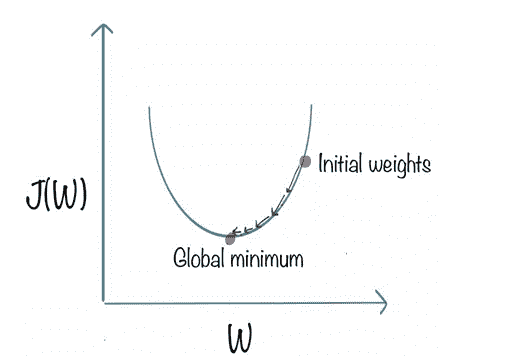
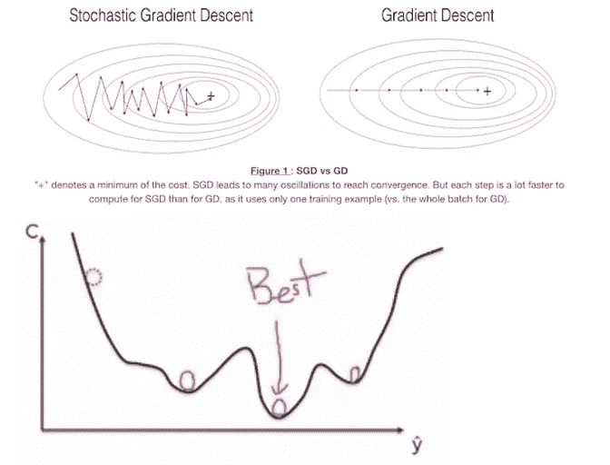

# 理解深度学习中的优化器

> 原文：<https://pub.towardsai.net/understand-optimizers-in-deep-learning-694f4f0eb048?source=collection_archive---------1----------------------->

## [深度学习](https://towardsai.net/p/category/machine-learning/deep-learning)

## 优化器是机器学习的典范

由[布雷特·乔丹](https://unsplash.com/@brett_jordan?utm_source=medium&utm_medium=referral)在 [Unsplash](https://unsplash.com?utm_source=medium&utm_medium=referral) 上拍摄的照片

> ***优化器***

优化器是机器学习的范例，特别是在深度学习中，通过减少或最小化我们模型中的损失，使月亮的工作变得美丽。优化器是用来改变我们的神经网络的属性的方法或算法，例如权重和学习率，以减少我们网络中的损失。

优化算法或策略负责减少损失函数，并通过更新权重来提供最准确的结果。

**深度学习/神经网络中的反向传播**

图像[来源](https://www.superdatascience.com/blogs/the-ultimate-guide-to-artificial-neural-networks-ann)

反向传播由优化器函数完成，这是神经网络训练的本质。在这种情况下，基于在前一时期(即迭代)中获得的误差率来微调神经网络的权重。这种权重的减少使我们能够降低错误率，并通过提高其泛化能力来使模型可靠。这是训练人工神经网络的标准方法，有助于计算与网络中所有权重相关的损失函数的梯度。

> ***渐变下降***

在理解梯度下降之前，我们必须知道它为什么会出现以及它的重要性。所以我建议你先看看**强力算法**，它指的是一种不包含任何提高性能的捷径的编程风格。

**比如说**，就像我们在旅行商问题(TSP)中做的那样。使用它来解决具有大数据集的深度学习/ANN 任务可能需要一周、一个月或一年，因此针对这种维数灾难， ***梯度下降*** 应运而生。

因此，**梯度下降**是一种优化技术，用于通过最小化成本函数来改进深度学习和基于神经网络的模型。

借助于这个例子，可以很容易地理解梯度下降的工作原理。假设我们有一个大数据集，其中有数百万条记录，然后梯度下降法获取完整的数据集，对于一个时期(一轮迭代)，它进行前向和后向传播，然后为每个时期更新权重。所以用这种方法最终损失函数减少了。

更准确地说，梯度下降是一种算法，用于以最佳方式迭代不同的权重组合，以找到具有最小误差的最佳权重组合。

图像[来源](https://medium.com/@rndayala/gradient-descent-algorithm-2553ccc79750)

梯度下降的最终目标是找到如图所示的全局最小值。

**优势:**

*   易于理解和实现。
*   计算也很容易。

**缺点:**

*   计算成本高，因为需要更多资源和高 RAM。
*   它非常慢，因为对于大数据集来说，它要进行传播和权重更新，且转换也进行得很慢。
*   它需要大量的内存来计算整个梯度

> ***渐变下降的类型:***

*   批量梯度下降或普通梯度下降 2
*   随机梯度下降
*   小批量梯度下降

## **随机梯度下降**

让我们举个例子来理解一下。随机梯度下降每次迭代选择一些随机样本，而不是整个数据集。

因此，研究人员和科学家开始为每个前向和后向传播逐个选择样本记录，并为每个记录更新记录。

对于每个时期，将有一个迭代次数的介绍。假设对于一个时期，我们为传播进行 10k 次迭代，因此对于两个时期，对于前向和反向传播迭代次数将是 2*10 k，以此类推，并为每个记录更新记录。

**优势:**

*   与梯度下降相比，它需要更少的 RAM 和更少的其他计算资源来到达特定点。

**缺点:**

*   转换很慢，因为每个时期都要进行多次迭代。

图像[来源](https://towardsdatascience.com/the-fascinating-no-gradient-approach-to-neural-net-optimization-abb287f88c97)

在上图中，我们知道**全局** **最小值**的值大于 1，那么我们必须为全局最小值选择最合适的值。这项工作由 **SGD** 完成。

## **小批量梯度随机完成**

小批量梯度下降是梯度下降算法的一种变体，研究人员或科学家过去常常在每个时期将训练数据集分成小批量。对于每个时期，需要一些批量大小。

**例如，**让我们有 10K 的数据集，批量=1000 条记录，那么，通过将数据集除以批量，可以计算出 1 个历元的迭代次数。在这种情况下，1 个时期的迭代次数=10K/1000，即 10。

以这种方式，根据迭代次数，发生正向和反向传播，并且针对每个时期更新权重。

它是深度学习领域中梯度下降最常见的实现。

**优势:**

*   计算成本低于 SGD。
*   需要更少的资源。

**劣势:**

*   我们的转换会有噪声，因为我们只知道批次，而不是全部数据。
*   比 SGD 需要更多时间。

 [## 使用 Python 中的 Keras 逐步基本了解神经网络

### 具有定义的神经网络的学习

pub.towardsai.net](/step-by-step-basic-understanding-of-neural-networks-with-keras-in-python-94f4afd026e5) 

> ***梯度下降带动量***

具有动量的梯度下降保持查看过去的梯度以平滑更新。它**计算梯度**的指数加权平均值，然后使用该梯度更新您的权重，比标准梯度下降算法执行得更快。

在反向传播期间，我们使用权重(dW)的导数和偏差(db)对学习速率(lr)的导数来更新我们的参数 W 和 b，如下所示:

— — — **W = W — lr* dW**

————**b = b—lr * db**

**在动量**中，我们取 dW 和 db 的**指数**加权平均值，而不是对每个历元独立使用权重(dW)的导数和偏差(db)的导数。

———**VdW =βx VdW+(1—β)x dW**———

———**Vdb =βx VD b+(1—β)x db**———

其中 VdW 和 Vdb 是速度。

其中，β是另一个超参数，也称为动量，范围从 0 到 1。(β)设置以前值的平均值和当前值之间的权重值，以计算新的加权平均值。

我们将在指数计算加权平均值后更新我们的参数。

— — — **W = W — lr *VdW**

— — — **b = b — lr * Vdb** — — — —

**优点**:

*   具有 GD 和 SGD 的所有特征。

**缺点**:

*   每次更新都要多计算一个变量。

> ***Ada-grad:*** *自适应梯度优化器*

**Ada-grad** 是一个**优化器**，具有特定于参数的学习率，该学习率根据参数在训练过程中反复更新的次数进行调整。更新的参数越多，学习率越小。

**Ada-grad** 允许学习率根据参数进行调整。它也非常适合稀疏数据，如自然语言处理问题和图像相关的操作。

**神经网络学习阶段的两个特征**

*   稠密矩阵矩阵中的大部分值不为零。
*   稀疏矩阵矩阵中的大部分值为零。

**优势**:

*   没有必要一次又一次地更新学习率，因为它随着迭代自适应地变化。

**缺点**:

*   随着迭代次数变得非常大，学习率降低到非常小的数值。

 [## 神经网络:递归神经网络的兴起

### 深度学习中的渐进一代

pub.towardsai.net](/neural-networks-the-rise-of-recurrent-neural-networks-df740252da88) 

> ***Ada-delta & RMS Prop 优化器***

均方根 prop 是另一种自适应学习速率，是对 **AdaGrad** 的改进。不像 AdaGrad 那样对平方梯度进行渐进求和，而是取这些梯度的指数移动平均值。

与 RMSprop 一样，Adadelta (2012)也是 AdaGrad 的另一个改进，专注于学习率组件。Adadelta 是 adaptive delta 的简称，这里的 *delta* 是指当前权重和新更新的权重之差。

Adadelta 与 RMSprop 的不同之处在于，Adadelta 完全取消了学习率参数的使用，代之以 D，即平方 delta 的指数移动平均值。

**自适应矩估计(Adam)优化器**

*   它也被称为 optimi **z** er 之王。

————**亚当=动量+均方根** — — — —

其中动量负责执行平滑，RMS 负责学习速率。

更准确地说

*   使用 V 的梯度分量，V 是动量中梯度的指数移动平均值。
*   学习率部分，通过将学习率α除以 S 的平方根，即 RMS prop 中的平方梯度的指数移动平均值。

— — — **W = W — lr* dW** — — — — —

———**VdW =βx VdW+(1—β)x dW**———

———**Vdb =βx VD b+(1—β)x db**———

> ***结论***

本文吸引人的中心是深度学习优化器，根据它们的用法以及一个优化器的限制如何被下一个克服。“Adam”优化器是处理最复杂和庞大数据集的每个人的最爱，因为它结合了高效处理任何类型输入的动力。

我希望你喜欢这篇文章。通过我的 [LinkedIn](https://www.linkedin.com/in/data-scientist-95040a1ab/) 和 [twitter](https://twitter.com/amitprius) 联系我。

# 推荐文章

[1。NLP —零到英雄与 Python](https://medium.com/towards-artificial-intelligence/nlp-zero-to-hero-with-python-2df6fcebff6e?sk=2231d868766e96b13d1e9d7db6064df1)
2。 [Python 数据结构数据类型和对象](https://medium.com/towards-artificial-intelligence/python-data-structures-data-types-and-objects-244d0a86c3cf?sk=42f4b462499f3fc3a160b21e2c94dba6)3 .[Python 中的异常处理概念](/exception-handling-concepts-in-python-4d5116decac3?source=friends_link&sk=a0ed49d9fdeaa67925eac34ecb55ea30)
4。[为什么 LSTM 在深度学习方面比 RNN 更有用？](/deep-learning-88e218b74a14?source=friends_link&sk=540bf9088d31859d50dbddab7524ba35)
5。[神经网络:递归神经网络的兴起](/neural-networks-the-rise-of-recurrent-neural-networks-df740252da88?source=friends_link&sk=6844935e3de14e478ce00f0b22e419eb)
6。[用 Python](https://medium.com/towards-artificial-intelligence/fully-explained-linear-regression-with-python-fe2b313f32f3?source=friends_link&sk=53c91a2a51347ec2d93f8222c0e06402)
7 全面讲解了线性回归。[用 Python](https://medium.com/towards-artificial-intelligence/fully-explained-logistic-regression-with-python-f4a16413ddcd?source=friends_link&sk=528181f15a44e48ea38fdd9579241a78)
充分解释了 Logistic 回归 8。[concat()、merge()和 join()与 Python](/differences-between-concat-merge-and-join-with-python-1a6541abc08d?source=friends_link&sk=3b37b694fb90db16275059ea752fc16a)
的区别 9。[与 Python 的数据角力—第一部分](/data-wrangling-with-python-part-1-969e3cc81d69?source=friends_link&sk=9c3649cf20f31a5c9ead51c50c89ba0b)
10。[机器学习中的混淆矩阵](https://medium.com/analytics-vidhya/confusion-matrix-in-machine-learning-91b6e2b3f9af?source=friends_link&sk=11c6531da0bab7b504d518d02746d4cc)