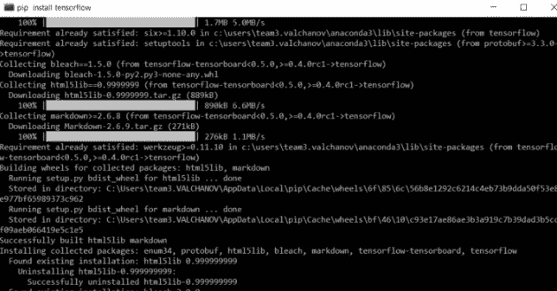
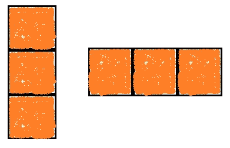
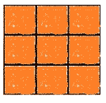
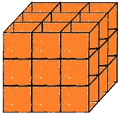

# 使用 Python 了解 TensorFlow Basic

> 原文：<https://pub.towardsai.net/understand-tensorflow-basic-with-python-87281e737db9?source=collection_archive---------4----------------------->

## [深度学习](https://towardsai.net/p/category/machine-learning/deep-learning)，[编程](https://towardsai.net/p/category/programming)

## 张量流中使用的基本术语


照片由[马库斯·斯皮斯克](https://unsplash.com/@markusspiske?utm_source=medium&utm_medium=referral)在 [Unsplash](https://unsplash.com?utm_source=medium&utm_medium=referral) 拍摄

为什么大家都想学习深度学习中的 TensorFlow，当我们深入到机器学习项目中时，我们使用“sklearn”库，当我们谈到深度神经网络时，TensorFlow 就进入了画面。Anaconda 发行版对于预装库包的数据科学和机器学习来说是完美的，但是我们必须显式地安装 TensorFlow，因为它没有包含在 anaconda 发行版中。要下载 TensorFlow，请在 anaconda 提示符下编写以下命令，然后按 enter 键。

```
#command to install TensorFlow
pip install tensorflow 
```


蟒蛇提示视图。作者的照片



TensorFlow 正在工作环境中安装软件包。照片作者

TensorFlow 是许多应用程序中深度计算过程的库，广泛用于深度神经网络。在知道张量是什么之前，先了解一些定义。


攀登者

*   Scaler:它是一个单一的值，用它我们可以在张量秩为零的情况下完成许多计算任务。



矢量

*   向量:这些是张量秩为 1 的行或列中包含的值。



[数]矩阵

*   矩阵:它是张量秩为 2 的行列格式的向量的构成。



*   张量:它是矩阵或向量的组合。

sklearn 和 TensorFlow 都用于机器学习。我们知道谷歌有很好的算法和软件包用于机器，因为他们的大脑团队。他们正在进行机器学习项目，需要开发更快更好的编程方法，因此他们开发了 TensorFlow 供内部使用。2015 年，谷歌将 TensorFlow 作为开源软件发布。现在这个包用于神经网络，卷积神经网络等。TensorFlow 不仅使用 CPU 进行计算，还使用 GPU 和 TPU 来获得更快的速度和可靠性。Sklearn 库也可以做所有的机器学习算法，但是有一些限制。

TensorFlow 用于带有数据流图的计算过程。张量的工作流程如下所示，是我在实践中了解到的。

> ***导入库***

```
import tensorflow as tf
import numpy as np
```

> ***生成数据***

通常我们处理 CSV、excel 和其他文件。但是 TensorFlow 在 tensors 中使用文件格式。为此，我们将数据保存在(。npz)文件格式。可能是 NumPy 文件类型。在这个过程中，我们以张量格式保存输入和目标值。

```
np.savez('file_name, arrays)
```

这里数组是输入和输出值。File_name 是我们以张量文件格式保存的文件的名称。执行代码后，文件保存在。“npz”文件格式。

> ***张量流对象***

我们需要在变量中指定输入和目标的大小。输入和输出是我们在数据生成中使用的列数。

TensorFlow 在我们用来保存值的对象上工作。

1.  ***占位符:*** 它用来插入输入的尺寸和目标。

```
input = tf.placeholder(tf.float32,[none, input_size])
target = tf.placeholder(tf.float32,[none, output_size])
```

这些输入和目标是我们保存为'的值。“npz”文件格式。Float32 用于传输 32 位数据。

**2。** ***变量:*** 用于插入权重和偏差值。变量能够保存值，而迭代和占位符则不能。现在，我们必须用权重乘法来求解图层的方程

y = wx + b

```
y1 = tf.matmul(input, weight) + bais
```

matmul 用于将括号中的两个值相乘，作为张量中的点积。

> ***目标函数***

它被用作损失函数，我们必须用它来优化我们的算法。例如，回归的损失函数是 L-2 范数损失。本库的 L-2 范数损失为均方损失。

```
loss = tf.losses.mean_squared_error(labels, predictions)
```

> ***优化***

优化是用来得到最小值，这样误差会更小。我们在这个过程中设置学习率值，一般大多数时候是梯度下降优化器。

```
optimization = tf.train.GradientDescentOptimizer(learning rate).loss
```

> ***会话***

在 TensorFlow 中，执行发生在这些会话中。

```
sessions = tf.InteractiveSession()
```

> ***初始化***

它用于初始化会话。变量已在会话运行方法中初始化。

```
intializer  = ()
sess.run(initializer)
```

> ***训练数据加载***

用于训练的数据来自保存的文件，我们将其保存为。npz '文件格式为张量。

```
np.load(file)
```

> ***纪元***

这是一个从数据训练到执行的完整循环。我们将使用这个术语，而不是迭代。为此，我们可以使用 For 循环从优化和损失中获得损失函数值。优化不会带来任何价值，但损失会带来。

> ***结论***

TensorFlow 是一个非常好的处理深度神经网络的软件包。使用 TensorFlow 使代码长度最小化。

我希望你喜欢这篇文章。通过我的 [LinkedIn](https://www.linkedin.com/in/data-scientist-95040a1ab/) 和 [twitter](https://twitter.com/amitprius) 联系我。

# 推荐文章

1.  [NLP——用 Python 零到英雄](https://medium.com/towards-artificial-intelligence/nlp-zero-to-hero-with-python-2df6fcebff6e?sk=2231d868766e96b13d1e9d7db6064df1)

2. [Python 数据结构数据类型和对象](https://medium.com/towards-artificial-intelligence/python-data-structures-data-types-and-objects-244d0a86c3cf?sk=42f4b462499f3fc3a160b21e2c94dba6)

3. [MySQL:零到英雄](https://medium.com/towards-artificial-intelligence/mysql-zero-to-hero-with-syntax-of-all-topics-92e700762c7b?source=friends_link&sk=35a3f8dc1cf1ebd1c4d5008a5d12d6a3)