# 用 Python 理解时间序列组件

> 原文：<https://pub.towardsai.net/understand-time-series-components-with-python-4bc3e2ba1189?source=collection_archive---------0----------------------->

## [数据可视化](https://towardsai.net/p/category/data-visualization)

## 机器学习中预测模型的基本概念及实例


一堆时间序列术语。作者的照片

在本文中，我们将通过处理数据中时间成分的机器学习示例来讨论时间序列概念。

预测在银行业、天气、人口预测以及许多直接处理现实生活问题的领域都非常重要。

时间序列模型是基于时间的函数。测量以规则的时间间隔进行，其中时间是建模的独立变量。

**Z = f(t)**

**Z** 是 Z1，Z2……Zn 的值，“ **t** 是 T1，T2……的时间。Tn 个区间。

## 涵盖的主题:

1.  **时间序列的组成部分**
2.  **白噪声**
3.  **静止和非静止**
4.  **滚动统计和 Dickey-Fuller 检验**
5.  **差分和分解**
6.  **AR、MA、ARMA、ARIMA 模型**
7.  **ACF 和 PACF**

时间序列分析的应用例如:每日汽油价格、公司利润、季度房屋销售。

时间序列分析的能力

*   这是预测决策的有效方法。
*   它们被用来预测不确定的未来以帮助组织。
*   当与数据挖掘技术结合使用时，它用于分析数据的行为。

> ***时间序列的组成***

在我们开始对时间序列数据建模之前，有一些基本的定义和概念。主要地，在时间序列中主要有四种类型的成分，如下所述:

*   **趋势:**

它是随着时间减少或增加的数据值的移动。任何数据序列都可能有上升趋势和下降趋势。

上升趋势是那些随着时间而增加的趋势。下降趋势是那些随着时间而减少的趋势。

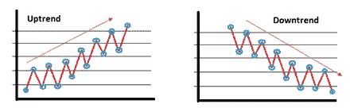

趋势的运动。作者的照片

Python 的例子:

```
#to make a month column with added day
data['Month'] = data['Month'].apply(lambda x: dt(int(x[:4]),
                                                   int(x[5:]), 15))data = data.set_index('Month')
data.head()
```

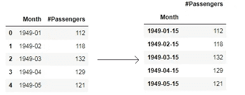

作为索引的月份。作者的照片

现在，绘制折线图来看趋势。

```
ts = data['#Passengers']
plt.plot(ts)
```

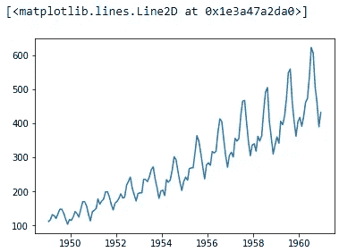

数据的趋势。作者的照片

有时，当索引不是日期-时间数据类型时，有必要将日期-时间作为索引列，以便所有特征都成为时间的函数。

例如:

```
df.month = pd.to_datetime(df.month)
df.set_index('month', inplace=True)
```

*   **季节性和周期:**

季节性是数据在固定时间间隔内的重复行为。这意味着，在一段时间间隔之后，有一些模式会重复出现，我们称之为季节性。

例如，在上面的图中，下行峰值和上行峰值以规则的时间间隔出现。

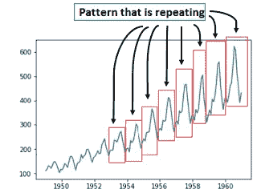

数据的季节性。作者的照片

季节性和周期性的区别在于，季节性总是有一个固定的和已知的频率。周期也有上升和下降高峰，但没有固定的频率或至少两年的持续时间。

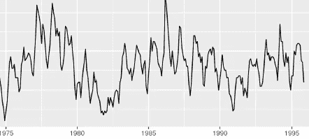

数据中的循环模式。作者的照片

*   **变化和不规则:**

变化和不规则模式不是固定的频率模式，而是持续时间短且不重复的模式。

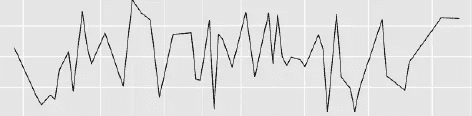

随机变化和不规则。作者的照片

> ***白噪音***

白噪声是一个属于时间序列中模式部分的术语，其中我们不能进行预测/预报，因为下一个值与前一个值没有相关性，该模式部分具有零均值和恒定方差。

这里要注意的要点是，白噪声具有零均值和恒定方差，因此，这意味着数据点将是具有标准正态分布的高斯白噪声。但是当我研究各种链接时，我注意到白噪声可以是均匀分布而不是正态分布。

例如:

```
import numpy
import matplotlib.pyplot as pltmean_value = 0
std_dev = 1 
no_of_samples = 500
time_data = numpy.random.normal(mean_value, std_dev, size=no_of_samples)plt.plot(time_data)
plt.show()
```

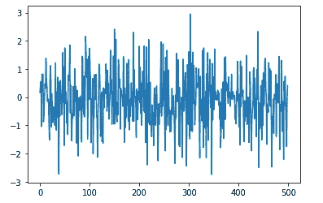

时间序列中的白噪声。作者的照片

同样正确的是，白噪声是具有不同频率的随机数据，因此它可以是任何分布。另一方面，正态分布在离散过程中受到连续白噪声的影响。

例如:

```
import numpy as np
import seaborn as sns#mean value and standard deviation value
mean, std = 0, 1#Normal distribution with 5000 samples
samples = np.random.normal(mean, std, size=5000)#plotting normal distribution with seaborn library
sns.distplot(samples, bins=20, hist_kws={'edgecolor':'red'})
```

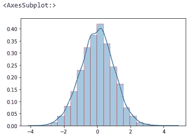

白噪声的正态分布。作者的照片

[](/diabetes-classification-model-with-svm-and-knn-models-3e8570747ef5) [## 糖尿病分类模型有 SVM 模型和 KNN 模型

### 预测糖尿病的二元分类

pub.towardsai.net](/diabetes-classification-model-with-svm-and-knn-models-3e8570747ef5) [](/z-statistics-t-statistics-p-statistics-are-still-confusing-you-87557047e20a) [## Z-统计量，T-统计量，P-统计量还在迷惑你？

### 机器学习统计学中的定义和概念

pub.towardsai.net](/z-statistics-t-statistics-p-statistics-are-still-confusing-you-87557047e20a) 

> ***静止与非静止***

平稳时间序列是一个时间周期，其平均值不变，方差不变，自相关性也不随时间变化。这些是制作模型必须满足的标准。

非平稳时间序列是均值、方差和自相关随时间变化的一段时间。

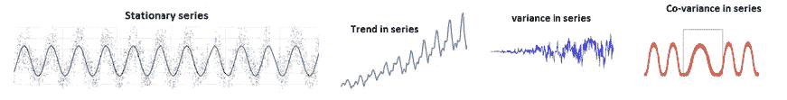

作者的照片

如果序列不是平稳的，那么我们用某种方法或测试使数据是平稳的。

**变换后达到平稳的点如下图:**

*   如果数据不是稳定的，那么我们可以在新的序列中减去一个点。
*   如果数据显示一个趋势，那么我们可以用另一条曲线与数据进行卷积，并取出残差。
*   如果方差是时变的，那么我们可以用平方根或对数来稳定方差。

> ***滚动统计和 Dickey-Fuller 检验***

执行这两个测试是为了检查时间序列的平稳性。

滚动统计就是检验序列的移动均值和移动方差是否随时间变化。这是一种视觉类型测试结果。

Dickey-Fuller 检验是一种假设检验，其中检验统计值小于 p 值，那么我们将拒绝零假设。这个时间序列的零假设是非平稳的。

```
def test_stationarity(timeseries):

    #Determing rolling statistics
    rolmean = timeseries.rolling(window=52,center=False).mean() 
    rolstd = timeseries.rolling(window=52,center=False).std() #Plot rolling statistics:
    orig = plt.plot(timeseries, color='blue',label='Original')
    mean = plt.plot(rolmean, color='red', label='Rolling Mean')
    std = plt.plot(rolstd, color='black', label = 'Rolling Std')
    plt.legend(loc='best')
    plt.title('Rolling Mean & Standard Deviation')
    plt.show(block=False)

    #Perform Dickey-Fuller test:
    print ('Results of Dickey-Fuller Test:')
    dftest = adfuller(timeseries, autolag='AIC')
    dfoutput = pd.Series(dftest[0:4], index=['Test Statistic','
            p-value','#Lags Used','Number of Observations Used'])
    for key,value in dftest[4].items():
        dfoutput['Critical Value (%s)'%key] = value
    print (dfoutput)test_stationarity(data['#Passengers']
```

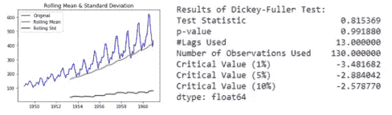

两个检验来检查平稳性。作者的照片

[](/hypothesis-testing-in-statistics-with-examples-844d698d99d5) [## 统计学中的假设检验及实例

### 数据驱动决策的统计学概念

pub.towardsai.net](/hypothesis-testing-in-statistics-with-examples-844d698d99d5) 

> ***求差分解***

假设我们发现我们的时间序列是非平稳的，那么有两种技术可以使我们的数据成为大量平稳的时间序列。

*   **差分:**用于将趋势、非平稳序列转化为平稳序列，并控制自相关性。它用于计算过去值与当前值之间的差值。

差异过大的序列会产生不准确的估计。所以，这并不代表所有的情况。

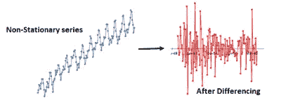

作者的照片

*   **分解:**通过回归序列并从回归中提取残差，对序列执行分解。

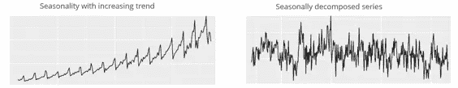

作者的照片

> ***AR，MA，ARMA，***

在建模中有不同的模型来拟合时间序列数据。

*   **AR 模型:**基于过去值的加权和预测未来值的自回归模型。

当时间序列中的值与前一个和后一个值之间存在相关性时，它用于预测。

*   **MA 模型:**是一种移动平均模型，用于预测一个仅依赖于随机误差项的时间序列的未来值。

例如:

```
#transformation
ts_log = np.log(ts)plt.plot(ts_log)#calculating moving average 
MA = ts_log.rolling(window=12).mean()
movingSTD = ts_log.rolling(window=12).std()
plt.plot(ts_log)
plt.plot(MA, color='red')
```

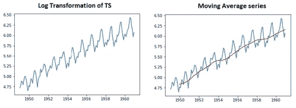

作者的照片

*   **ARMA 模型:**它是一种自回归和移动平均模型，用于使用过去的数据和误差项来预测未来的值。自回归模型告诉我们交易市场的均值和动量。MA 部分记录了在白噪声条件下观察到的冲击效应。
*   ARIMA 模型:它是一种自回归综合移动平均模型，是一类用于预测和分析时间序列数据的统计模型。它有助于做出巧妙的时间序列预测。它是简单 ARMA 模型的推广，增加了积分的概念。

在 ARIMA 模型之前，我们可以用移动平均线来区分。如果没有差异(d=0)，那么该模型通常被称为 ARMA 模型。

```
ts_log_mv_diff = ts_log - MA
```

> ***ACF 和 PACF***

*   **ACF:** 它是时间序列的自相关函数，用于识别 MA 过程的阶数。它是当前时间点的值和滞后 p 点的值之间的相关系数。
*   **PACF:** 它是一个偏相关函数，用来识别 AR 过程的阶数。

例如对于 ACF:

```
plt.plot(np.arange(0,11), acf(ts_log_mv_diff, nlags = 10))
plt.axhline(y=0,linestyle='--',color='gray')
plt.axhline(y=-7.96/np.sqrt(len(ts_log_mv_diff)),linestyle='--
            ',color='gray')plt.axhline(y=7.96/np.sqrt(len(ts_log_mv_diff)),linestyle='--
            ',color='gray')plt.title('Autocorrelation Function')
plt.show()
```

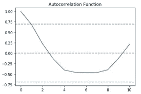

作者的照片

当滞后值在 0 和 1 之间时，ACF 曲线穿过置信上限。因此，" 0 "或" 1 "是 ARIMA 模型的一个最佳值。

以 PACF 为例:

```
plt.plot(np.arange(0,11), pacf(ts_log_mv_diff, nlags = 10))
plt.axhline(y=0,linestyle='--',color='gray')
plt.axhline(y=-7.96/np.sqrt(len(ts_log_mv_diff)),linestyle='--
            ',color='gray')plt.axhline(y=7.96/np.sqrt(len(ts_log_mv_diff)),linestyle='--
            ',color='gray')plt.title('Partial Autocorrelation Function')
plt.show()
```

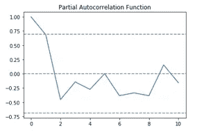

作者的照片

在滞后值 1 和 2 之间，PACF 曲线下降到 0。因此，" 0 "或" 1 "是 ARIMA 模型的一个最佳值。

要符合 ARIMA 模型，如下例所示:

```
model = ARIMA(ts_log, order=(1, 1, 0))  
results_ARIMA = model.fit(disp=-1)  
plt.plot(ts_log_mv_diff)
plt.plot(results_ARIMA.fittedvalues, color='red')
plt.title('RSS: %.4f'% sum((results_ARIMA.fittedvalues[1:] - ts_log_mv_diff)**2))
```

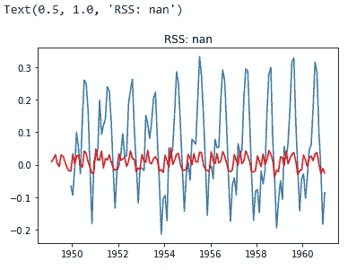

作者的照片

要查找 ARIMA 时间序列中的预测，示例如下所示:

```
predictions_ARIMA_diff = pd.Series(results_ARIMA.fittedvalues, copy=True)predictions_ARIMA_diff_cumsum = predictions_ARIMA_diff.cumsum()predictions_ARIMA_log = pd.Series(ts_log.ix[0], index=ts_log.index)predictions_ARIMA_log = predictions_ARIMA_log.add(predictions_ARIMA_diff_cumsum,fill_value=0)predictions_ARIMA = np.exp(predictions_ARIMA_log)
plt.plot(ts)
plt.plot(predictions_ARIMA)
plt.title('RMSE: %.4f'% np.sqrt(sum((predictions_ARIMA-ts)**2)/len(ts)))
```

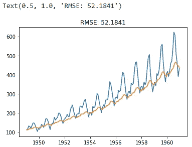

ARIMA 模型预测实例

橙色曲线是我们的预测。

> ***结论:***

当我们做时间序列建模时，有时模型在预测趋势方面很好，但在季节性方面却失败了。本文是为初学者编写的，目的是学习时间序列的基本概念，没有合适的建模，但有一个 python 示例。

[](/functions-and-its-concepts-in-python-df08138fbca2) [## Python 中的函数及其概念

### 函数中参数的组成和类型

pub.towardsai.net](/functions-and-its-concepts-in-python-df08138fbca2) 

我希望你喜欢这篇文章。通过我的 [LinkedIn](https://www.linkedin.com/in/data-scientist-95040a1ab/) 和 [twitter](https://twitter.com/amitprius) 联系我。

# 推荐文章

[1。NLP —零到英雄与 Python](https://medium.com/towards-artificial-intelligence/nlp-zero-to-hero-with-python-2df6fcebff6e?sk=2231d868766e96b13d1e9d7db6064df1)
2。 [Python 数据结构数据类型和对象](https://medium.com/towards-artificial-intelligence/python-data-structures-data-types-and-objects-244d0a86c3cf?sk=42f4b462499f3fc3a160b21e2c94dba6)3 .[Python 中的异常处理概念](/exception-handling-concepts-in-python-4d5116decac3?source=friends_link&sk=a0ed49d9fdeaa67925eac34ecb55ea30)
4。[用 Python 进行主成分分析降维](/principal-component-analysis-in-dimensionality-reduction-with-python-1a613006d531?source=friends_link&sk=3ed0671fdc04ba395dd36478bcea8a55)
5。[用 Python 全面讲解 K-means 聚类](https://medium.com/towards-artificial-intelligence/fully-explained-k-means-clustering-with-python-e7caa573176a?source=friends_link&sk=9c5c613ceb10f2d203712634f3b6fb28)
6。[用 Python](https://medium.com/towards-artificial-intelligence/fully-explained-linear-regression-with-python-fe2b313f32f3?source=friends_link&sk=53c91a2a51347ec2d93f8222c0e06402)
7 全面讲解了线性回归。[用 Python](https://medium.com/towards-artificial-intelligence/fully-explained-logistic-regression-with-python-f4a16413ddcd?source=friends_link&sk=528181f15a44e48ea38fdd9579241a78)
充分解释了 Logistic 回归 8。[用 Python 实现时间序列的基础知识](https://medium.com/towards-artificial-intelligence/basic-of-time-series-with-python-a2f7cb451a76?source=friends_link&sk=09d77be2d6b8779973e41ab54ebcf6c5)
9。[与 Python 的数据角力—第一部分](/data-wrangling-with-python-part-1-969e3cc81d69?source=friends_link&sk=9c3649cf20f31a5c9ead51c50c89ba0b)
10。[机器学习中的混淆矩阵](https://medium.com/analytics-vidhya/confusion-matrix-in-machine-learning-91b6e2b3f9af?source=friends_link&sk=11c6531da0bab7b504d518d02746d4cc)