# 通过情感分析更好地了解您的客户

> 原文：<https://pub.towardsai.net/understand-your-customer-better-with-sentiment-analysis-9a7de3f106ea?source=collection_archive---------0----------------------->

作者图片

***“你最不满意的顾客是你最大的学习来源。”—比尔·盖茨*T3**

在这个竞争激烈的商业世界中，公司寻找策略来满足他们的客户群，并可能通过推出优惠或新产品来吸引新客户。跟踪客户是喜欢还是不喜欢某个产品，以及他们对某个产品的反应，以改进服务，从而领先于竞争对手，这已成为不可避免的事情。在这篇博客中，重点将放在 NLP 用例**“情感分析”**上，它根据客户对产品的情感对客户评论进行分类，通过跟踪客户对产品的评论来使企业受益。

我们将一步一步地对数据集进行情感分析，该数据集包含对智能手机的评论，数据标签为这些评论的“正面”和“负面”情感。你可以从 Kaggle 下载[数据并跟随。我们将介绍 Word2Vec 算法及其架构的一些基本和初级概念，以便更好地理解 NLP 在处理文本数据时的工作方式。](https://www.kaggle.com/datasets/PromptCloudHQ/amazon-reviews-unlocked-mobile-phones)

**使用的数据集**

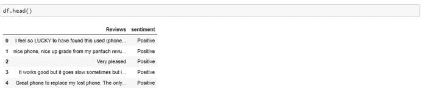

要执行情感分析，遵循的流程是:

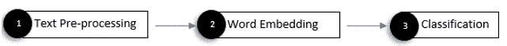

作者图片

**1。文本预处理**

需要数据预处理来从文本中移除不必要的信息，这些信息可能导致模型不太准确。文本预处理的步骤如下:

**小写** —这是最常见的文本预处理步骤之一，基于问题陈述使用。如果你正在处理用来识别人们情绪的文本，那么这一步可以跳过，因为这样做会导致信息的丢失，比如用大写字母表示愤怒或兴奋。

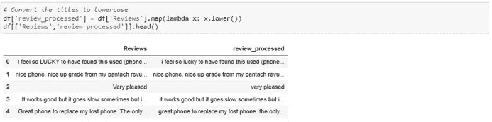

将单词转换成小写

**标记化—** 标记化是将文本分解成更小的块(句子或单词)，称为标记。这个过程是必需的，因为令牌根据单词序列解释句子的上下文，这对于 word2vec 模型来说是至关重要的。

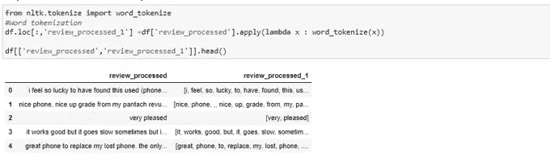

单词标记化

**特殊字符删除—** 括号、逗号等特殊字符。，不要给文本添加任何值，可以使用 Python 的字符串库删除它们，该字符串库包含一个预定义的标点符号列表，可用于删除标点符号。

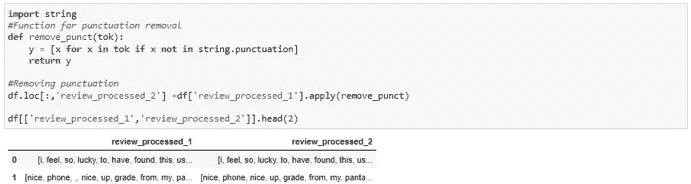

已删除“.”从句子中

**词汇化—** 词汇化移除前缀和后缀，并将单词转换为其基本形式，例如—“变化”和“改变”将转换为“变化”。

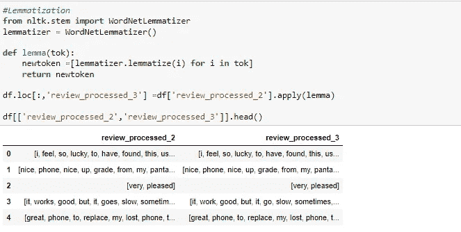

**停用词移除** —停用词是文本数据中最常用的词，并且不携带关于文本中焦点主题的任何有价值的信息。像 my，my，we，our 这样的词是停用词，NLTK 库包含一个预定义的停用词列表，您可以使用它，也可以根据项目需求创建一个用户定义的停用词列表。例如，在我们的数据集中,“What”可能是一个停用词，但如果我们正在处理一个客户查询数据集，那么“What”将是一个重要的词。

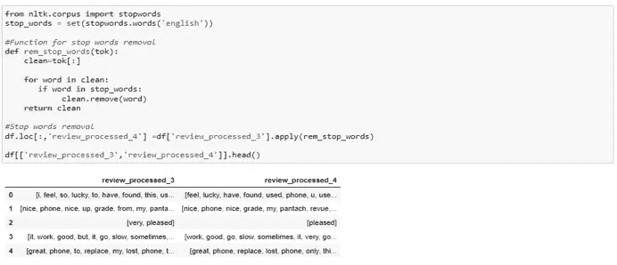

停止单词删除

**2。单词嵌入**

ML 模型不直接理解原始文本。因此，需要将文本数据转换为向量，这些向量对单词的上下文含义进行编码，并使相似的单词在维度空间中彼此更接近。例如，像电话、移动电话和手机这样的词在维度空间中会显得彼此更近，而远离像“好”、“好”等这样的不相关的词。将文本转换成向量的过程称为单词嵌入，Word2Vec 算法用于产生这些嵌入。

**工作于 Word2Vec**

> **Word2Vec 利用具有单个隐藏层的神经网络来预测文本语料库中每个单词在维度空间中更接近输入单词的概率**。现在，这里的直觉是，相似的单词在相似的上下文中使用，并且它们在维度空间中彼此更接近，因此相似单词的概率应该更大，但是在 Word2Vec 算法中训练神经网络的目标不是使用产生的神经网络本身，而是学习隐藏层的权重。这些权重是我们的单词向量，它给出了单词在多维空间中的地址。

下面是 skip-gram 神经网络的视觉图和架构，它将一个单词作为输入，并尝试预测上下文单词。

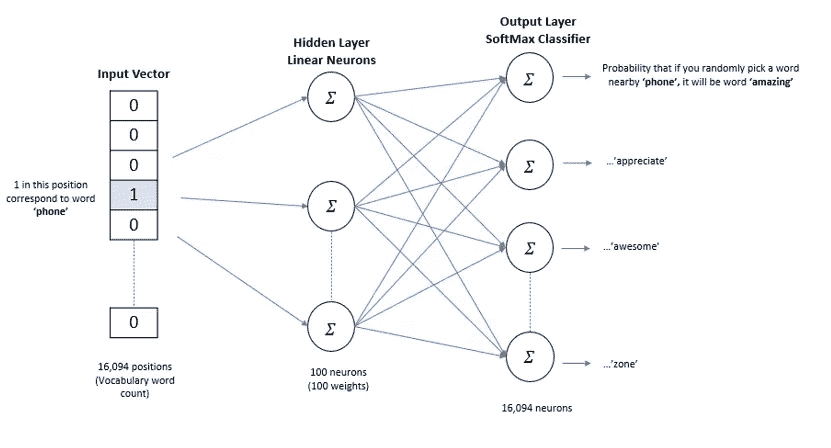

Genism 是用于 NLP 的开源 python 库，它提供了 Word2Vec 模型算法，用于从大型文本语料库中学习单词关联。下面是在文本数据上训练 word2vec 模型的代码。

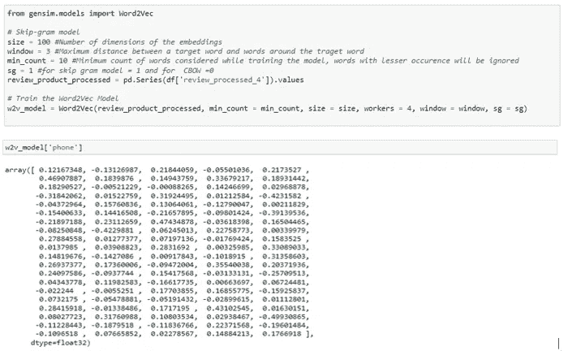

“电话”这个词有 100 个向量

现在，我们有了语料库中每个单词的向量，我们将取一个句子中所有单词向量的平均值，这将得到该评论语句的 100 维平均数组。

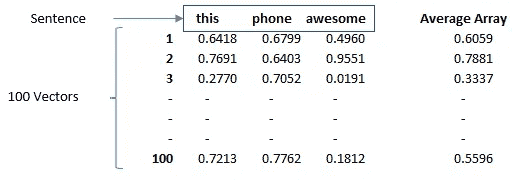

这个 100 维的平均数组将代表我们的语句的特征，用于分类模型来预测情感。它存储在‘word 2 vec _ df’中，分类模型利用该‘word 2 vec _ df’来对情感进行分类。

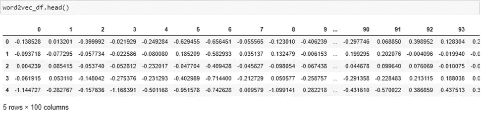

**3。分类**

一旦我们有了评论的特征，我们就可以在数据上训练一个分类模型来预测情感。采用随机搜索变异系数进行超参数优化，提高了模型的精度。

测试集上训练模型的评估

生成分类报告和混淆矩阵以查看模型的性能。Gensim word2vec 嵌入方法和随机森林分类模型能够对 2 类文本分类问题产生较高的准确率。在这个问题陈述中选择随机森林的原因是，当我们比较所有评估指标(如精度、召回率和 F1)时，它比其他分类算法(支持向量机、逻辑回归)表现得更好。

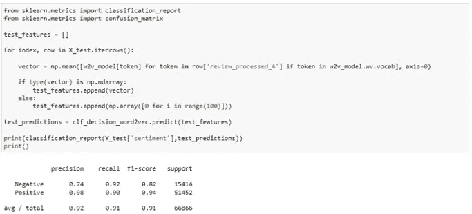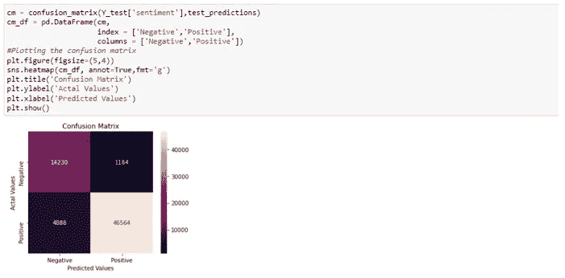

**业务用途**

假设您的公司最近推出了一种产品，他们想了解产品在市场上的接受情况。该模型将通过利用产品评论并查看有多少人给出了积极的评论以及有多少人不喜欢该产品来帮助您预测情绪。

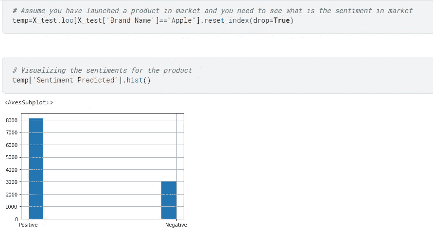

3000 条评论是负面的，你可能想要检查顾客不喜欢该产品的确切原因。你可以通过制造负面评论的文字云来做到这一点

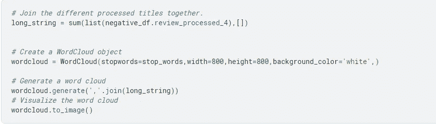

正如你所看到的，人们对产品的电池、屏幕和卖家都不满意。这些信息有助于改善产品和整体客户体验。

**结论**

本博客主要关注面向初学者的 NLP 情感分析用例，一旦您理解了 word2vec 算法，最好转向更高级的文本分类技术，如构建神经网络，因为上述方法的缺点是它可能无法很好地执行多类文本分类，因此，可以探索深度学习神经网络来解决这类问题。

**代码链接**

代码可以从[这里引用](https://www.kaggle.com/code/simonityagi/a-guide-to-sentiment-analysis-using-word2vec)

**参考文献**

1.  [https://ka vita-ganesan . com/comparison-between-cbow-skip gram-subword/# . yyqt 32 bbziu](https://kavita-ganesan.com/comparison-between-cbow-skipgram-subword/#.YYqT32BBzIU)

[https://machine learning mastery . com/develop-word-embeddings-python-gensim/](https://machinelearningmastery.com/develop-word-embeddings-python-gensim/)

2.skip-gram 工作参考—[https://towards data science . com/word 2 vec-skip-gram-model-part-1-intuition-78614 E4 d6e 0 b](https://towardsdatascience.com/word2vec-skip-gram-model-part-1-intuition-78614e4d6e0b%20%0d3)