# 从头开始理解抽象文本摘要

> 原文：<https://pub.towardsai.net/understanding-abstractive-text-summarization-from-scratch-baaf83d446b3?source=collection_archive---------0----------------------->

## [深度学习](https://towardsai.net/p/category/machine-learning/deep-learning)

## CNN 新闻摘要案例研究

Linkedin [简介](http://linkedin.com/in/gundluru-chandrasekhar-499129196) & Github [简介](https://github.com/Chandugundluru?tab=repositories)代码实现。


照片由[海登·沃克](https://unsplash.com/@haydenwalker?utm_source=unsplash&utm_medium=referral&utm_content=creditCopyText)在 [Unsplash](https://unsplash.com/s/photos/newspaper?utm_source=unsplash&utm_medium=referral&utm_content=creditCopyText) 上拍摄

# 目录:

1.  文本摘要介绍
2.  了解 CNN 数据集
3.  数据清理
4.  文本数据分析
5.  评估指标
6.  数据预处理
7.  基线模型
8.  注意力层
9.  覆盖机制
10.  预训练伯特
11.  微调 T5
12.  模型分析
13.  结论
14.  参考

## **1。文本摘要介绍。**

> *自动摘要定义:自动摘要是通过计算缩短一组数据的过程，以创建代表原始内容中最重要或最相关信息的子集。*

文本摘要分为两种类型——**抽取式**和**抽象式摘要**。

1.  **提取摘要:**提取文本摘要过程提取文本的要点，而不对这些要点进行任何修改，并重新排列这些要点的顺序和语法，以从摘要中获取精华。
2.  抽象概括:抽象方法使用先进的技术得到一个全新的概括。该摘要的某些部分甚至可能不会出现在原文中。

## **2。了解 CNN 数据集**

[(来源:https://cs.nyu.edu/~kcho/DMQA/)](https://cs.nyu.edu/~kcho/DMQA/)

该数据集包含来自 CNN 新闻文章的文档。大约有 9 万份文件。每篇文章都包含一个故事及其亮点。

```
file = open('Data/cnn/stories' + '/' + '000c835555db62e319854d9f8912061cdca1893e.story', encoding=utf-8)text = file.read() 
file.close() 
text
```

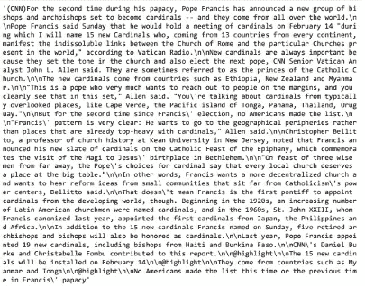

原始文章

## 3.**数据清理**

我们得到的故事是完全混乱和不干净的文本，有许多不想要的字符和符号。所以我们必须清理数据，并从故事文章中提取摘要

***a)从文章中提取摘要:***

```
def loading_articles(file_name): 
    file = open(file_name, encoding='utf-8')  
    text = file.read()  
    file.close()  
    return textdef split_story(doc):  
    index = doc.find('@highlight')
    story, highlights = doc[:index],
    doc[index:].split('@highlight') 
    highlights = [h.strip() for h in highlights if len(h) > 0]         
    return story, highlights
```

总结在文章中标注在“@highlight”之后。上述功能将从文章中提取一个摘要，还将故事文章和摘要分开

***b)扩展收缩词:***

缩略词是由两个词缩短或组合而成的词。像不可以(可以+不可以)、不要(做+不可以)、我已经(我+有)这些词都是缩写。作为清理步骤，我们用下面的函数扩展所有这些收缩。

```
def decontracted(phrase): 
    phrase = re.sub(r"won't", "will not", phrase) 
    phrase = re.sub(r"can\'t", "can not", phrase)  
    phrase = re.sub(r"n\'t", " not", phrase)  
    phrase = re.sub(r"\'re", " are", phrase)  
    phrase = re.sub(r"\'s", " is", phrase)  
    phrase = re.sub(r"\'d", " would", phrase)  
    phrase = re.sub(r"\'ll", " will", phrase)  
    phrase = re.sub(r"\'t", " not", phrase)  
    phrase = re.sub(r"\'ve", " have", phrase)  
    phrase = re.sub(r"\'m", " am", phrase)  
    return phrase
```

***c)去除不想要的符号:***

Token '(CNN)'出现在每篇毫无意义的文章开头。以便从文档中移除标记以及'$%^&*#'符号。

```
article_text=[]for i in CNN.article.values:tt=re.sub(r'\n',' ', i)
    tt=re.sub(r"([?!¿])", r" \1 ", tt)
    tt=decontracted(tt)
    tt = re.sub('[^A-Za-z0-9.,]+', ' ', tt)
    tt = tt.lower()
article_text.append(tt)
```

在清除所有的文本后，它被转换成小写。

## **4。文本数据分析**

***a)文章长度:***

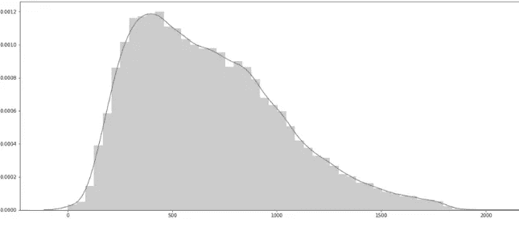

文章长度分布

大多数文章的长度为 800，分布看起来是右偏的，让我们检查 90–99 之间的长度百分位值

```
import numpy as np 
b = [i for i in range(90,100)] 
for i in b:  
    print(i,'th percentile is ', np.percentile(art_len, i))
```

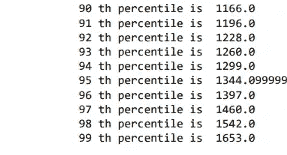

## 第 95 百分位文章长度置信区间

```
percentiles_95=[]
for i in range(0,200):
    samples=sample(summ_len,500)
    k=np.percentile(samples, 95)
    percentiles_95.append(k)
    mean = np.round(mean(percentiles_95),3)
    std = np.round(stdev(percentiles_95),3)
    left_limit = np.round(mean - 2*(std/np.sqrt(sample_size)), 3)     
    right_limit = np.round(mean + 2*(std/np.sqrt(sample_size)), 3)   print("95% of CI for MSE=",[left_limit,right_limit])
```


***b)汇总长度:***

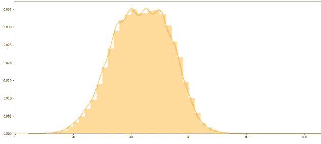

概要长度分布

看起来大部分摘要都有 35-55 个单词。看起来很有趣..让我们探索百分位值。

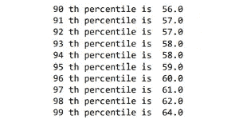

## 第 95 百分位汇总长度置信区间

```
percentiles_95=[]
for i in range(0,200):
    samples=sample(summ_len,500)
    k=np.percentile(samples, 95)
    percentiles_95.append(k)
    mean = np.round(mean(percentiles_95),3)
    std = np.round(stdev(percentiles_95),3)
    left_limit = np.round(mean - 2*(std/np.sqrt(sample_size)), 3)     
    right_limit = np.round(mean + 2*(std/np.sqrt(sample_size)), 3)   print("95% of CI for MSE=",[left_limit,right_limit])
```

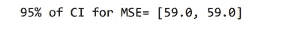

我们再深入挖掘一下，找出哪些词在总结中出现的频率更高。

***c)词云为总结词:***


这里每个单词的大小表明了它的频率或重要性。重要的文本数据点可以使用单词云突出显示。

我们在这里可以观察到一个有趣的现象，就是像‘say’，‘said’，‘will’，‘may’这样的动词在总结中出现的频率更高。

由于 CNN 的文章是以美国新闻为基础的，像“美国”、“纽约”、“美国”这样的词在云中有着重要的意义。

***d)词性标注到摘要和文章:***

```
import spacy
sum_pos=[]
nlp = spacy.load("en_core_web_lg")
for i in tqdm(data_cleaned.Summary.values):
    pos_tag=[]
    doc = nlp(i)
    for token in doc:
        pos_tag.append(token.pos_)
    sum_pos.append(pos_tag)
```

*名词百分比分布*

```
noun_percent=[]
for i in sum_pos:
    lent = i.count('NOUN')
    lentl = i.count('PROPN')
    noun=((lent+lentl)/len(i))*100
    noun_percent.append(noun)plt.figure(figsize=(20,8))sns.distplot(noun_percent,color='red');
```

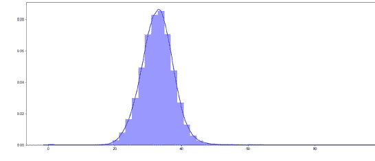

名词百分比分布汇总和文章

*动词百分比分布*

```
verb_percent=[]for i in sum_pos:
    lent = i.count('VERB')
    verb=(lent/len(i))*100
    verb_percent.append(verb)
plt.figure(figsize=(20,8))
sns.distplot(verb_percent,color='red');
```

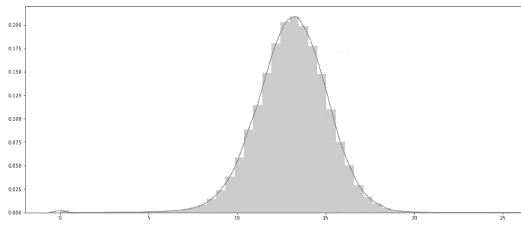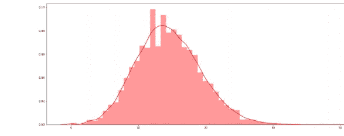

动词在摘要和文章中的百分比分布

***e)命名 _ 实体标注:***

命名实体是真实世界的对象，例如人、地点、组织、产品等。，可以用一个合适的名字来表示。它可以是抽象的，也可以是有形的存在。

```
import spacy
from spacy import displacy
from IPython.core.display import display, HTML
nlp = spacy.load("en_core_web_lg")
doc2 = nlp(data_cleaned.Article.values[2])
displacy.render(doc2, style="ent", jupyter=True)
```

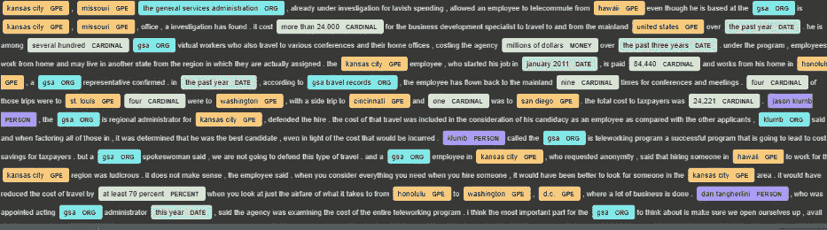

带有命名实体的文章

***f)从分析中观察:***

1)每个摘要平均有 30%的名词和 15%的动词。

2)从命名实体的可视化来看，我们可以说有很大概率会把一个包含 ORG 实体的句子当作摘要。由于文章只有两个“组织”实体，因此在摘要中选择了“GSA”组织实体。

## **5。评估指标**

摘要是一个棘手的问题，因为系统必须理解文本的要点。这需要使用单词知识对内容进行语义分析和分组。

用于总结结果的两个通用评估指标是 **BLEU** 和 **ROGUE**

**a) BLEU Score** 是用来发现从一种语言预测到另一种语言的文本质量。

> BLEU 代表双语评估替角

BLEU 分数范围从 0 到 1。如果预测和原始文本是一个相似的分数接近 1，反之亦然。

**胭脂是什么？**

为了评估生成的摘要的好坏，文本摘要空间中的常用度量被称为 Rouge score。

> ROUGE 代表面向回忆的替角，用于 Gisting 评估。

它通过将自动生成的摘要或翻译与一组参考摘要(通常是人工生成的)进行比较来工作。它通过匹配生成的和参考摘要的 n 元语法的重叠来工作。

**ROUGE-1** 指系统和参考摘要之间的单字(每个单词)重叠。

**ROUGE-2** 指系统和参考汇总之间二元模型的重叠。

**ROUGE-L** :基于最长公共子序列(LCS)的统计。最长公共子序列问题自然地考虑了句子级结构的相似性，并自动识别序列 n 元文法中最长的共现。

*   ROUGE-n recall=40%意味着*引用*摘要中 40%的 n 元文法也存在于*生成的*摘要中。

对于这个模型，我使用 rogue 分数作为评估指标

## 6。数据预处理

***a)替换文本中的实体:***

命名实体是真实世界的对象，例如人、地点、组织、产品等。，可以用一个合适的名字来表示。它可以是抽象的，也可以是有形的存在。如果我们认为他们是词汇感知的，他们中的大多数被归类为生僻字。

```
for i in range(len(cleaned_text)):
    doc1 = nlp(cleaned_text[i])
    c=(" ".join([t.text if not t.ent_type_ else t.ent_type_ for t in    doc1]))
    c=c.lower()
    short_text.append(c)doc2 = nlp(cleaned_summary[i])
    k=(" ".join([t.text if not t.ent_type_ else t.ent_type_ for t in    doc2]))
    k=k.lower()
    short_summary.append(k)
```

假设有一篇关于人名“张克帆·诺兰”的文章，如果我们在其他文章中没有再看到这个名字，那么文章模型可以假设这些名字是罕见的单词。但是这个词概括起来很重要。所以我们正在替换文本中的实体。

> 例如:“张克帆·诺兰在网飞执导的网络系列”转换为“gpe 中由个人执导的网络系列”

***b)处理 OOV 的话:***

出现在训练数据中而在测试数据中缺失的单词被认为是词汇表之外的单词。

> Keras Tokenizer(oov_token='ukn ')怎么了？

如果我们在 tokenizer 中使用 oov_token='ukn ',它将替换训练 vocab 中缺少的所有测试令牌。测试时，我们给未训练的模型嵌入，因为“unk”没有被训练。这将显著影响模型性能。

因此，我们必须在训练中包含“ukn”标记，因为我正在考虑将训练词汇中的生僻字作为“ukn”。

```
thresh=2
rare_word=[]for key,value in y_tokenizer.word_counts.items():
    if(value<thresh):
    rare_word.append(key)
```

这里我认为我的阈值是 2。这表明如果语料库中的词频小于 2，则将这些词作为稀有词追加。

```
tokenrare=[]
for i in range(len(rare_word)):
    tokenrare.append('ukn')
dictionary_1 = dict(zip(rare_word,tokenrare))
y_trunk=[]
for i in y_train:
    for word in i.split():
        if word.lower() in dictionary_1:
            i = i.replace(word, dictionary_1[word.lower()])
     y_trunk.append(i)
```

通过使用这个代码片段，我用“unk”替换了 train 文档中的生僻字。这个过程有助于更好地嵌入训练数据中的生僻字以及测试数据中的“未知”字符。

***c)分词和填充:***

我们使用 Keras 分词器来分词。创建标记器后，我们将它用于训练数据，然后我们将使用它来拟合测试数据。

然后，我们需要做填充，因为文本中的每个句子都没有相同的字数，我们也可以定义每个句子的最大字数，如果一个句子较长，那么我们可以删除一些单词。下面是填充线，如下图所示:

```
y_tokenizer = Tokenizer(oov_token='ukn')
y_tokenizer.fit_on_texts(list(y_trunk)) 
y_tr_seq = y_tokenizer.texts_to_sequences(y_trunk)y_val_seq = y_tokenizer.texts_to_sequences(y_validatioin)zero upto maximum lengthy_tr = pad_sequences(y_tr_seq,maxlen=max_summary_len, padding='post')y_val = pad_sequences(y_val_seq, maxlen=max_summary_len, padding='post')y_voc = len(y_tokenizer.word_index) +1
```

***d)字嵌入:***

单词嵌入是将单个单词解释为预定义向量空间中的实值向量的技术。每个单词被映射到一个向量，向量值以类似于神经网络的方式被学习。

这些单词嵌入是对文本的学习表示，其中具有相同含义的单词具有相似的表示。正是这种表示单词和文档的方法可以被认为是深度学习在挑战自然语言处理问题上的关键突破之一。

这种方法的关键是对每个单词使用密集分布的表示法。

这里我使用预先训练的 100 个手套向量。

```
embeddings_dictionary = dict()glove_file = open("/content/gdrive/My Drive/glove.6B.100d.txt", encoding="utf8")for line in glove_file:  
    records = line.split()  
    word = records[0]  
    vector_dimensions = np.asarray(records[1:], dtype='float32')               
    embeddings_dictionary [word] = vector_dimensions   glove_file.close()
```

## **7。基准模型**

我使用了一个简单的**编码器-解码器**模型作为基线模型，这是我使用的架构。

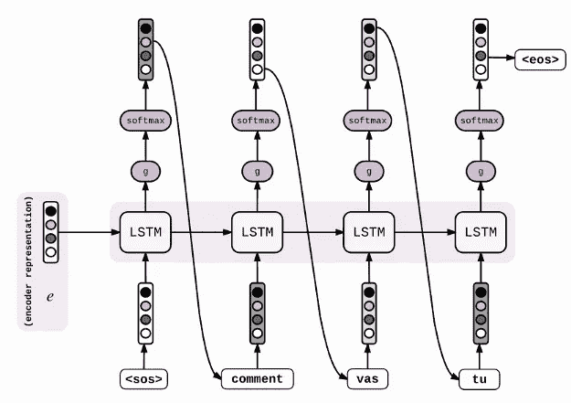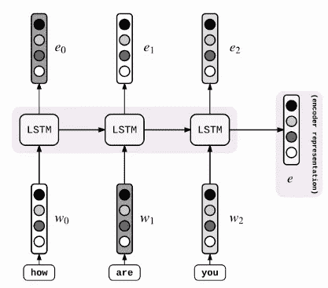

来自[应用人工智能课程](http://www.appliedaicourse.com/)

***编码器***

```
encoder_inputs = Input(shape=(max_text_len,))enc_emb = Embedding(x_voc+1, 50,mask_zero=True, weights=[embedding_matrix_x] ,trainable=True)encoder = Bidirectional(LSTM(64, return_state=True))encoder_outputs, forward_h, forward_c, backward_h,  backward_c=encoder(enc_emb)state_h = Concatenate()([forward_h, backward_h])state_c = Concatenate()([forward_c, backward_c])
```

*   对于编码器，我们可以使用 LSTM/GRU 细胞在这里我使用双向 LSTM 作为编码器。它返回编码器输出、前向 h、前向 c、后向 h、后向 c。
*   然后连接前向和后向状态以及将作为初始状态提供给解码器单元输出。
*   编码器接收输入序列，并将信息封装为内部状态向量。

***解码器***

```
decoder_inputs = Input(shape=(max_sum_len,)) #embedding layerdec_emb_layer = Embedding(y_voc+1, 50,mask_zero=True, weights=[embedding_matrix_y])dec_emb = dec_emb_layer(decoder_inputs)decoder_lstm = LSTM(128, return_sequences=True, return_state=True)decoder_output,decoder_state_h, decoder_state_c = decoder_lstm(dec_emb,initial_state=[state_h,state_c])dense layer decoder_dense = TimeDistributed(Dense(y_voc+1, activation='softmax'))decoder_outputs = decoder_dense(decoder_output)model1 = Model([encoder_inputs, decoder_inputs], decoder_outputs)
```

对于解码器，我们给出摘要作为输入，并使用教师强制技术来训练模型。

如解码器结构所示，我们的第一个时间戳输入是解码器 LSTM 单元的“开始”(y1)输出，给定大小摘要 vocab 的密集层。

然后将 softmax 应用于其结果以给出 vocab 的概率分布。我们可以挑选概率最高的词作为摘要中的下一个词(比如 y2)。这个 y2 是 LSTM 的下一个时间戳的输入。

***预测汇总:***

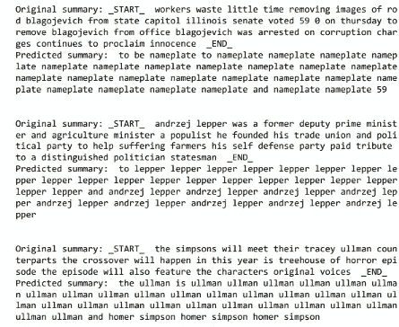

很明显，该模型不能清楚地预测摘要和重复相同的单词。现在让我们通过添加注意力层来检查这个模型。

## **8。关注层**

> ***为什么关注？***

标准的 seq2seq 模型通常不能准确地处理长输入序列，因为只有编码器 RNN 的最后隐藏状态被用作解码器的上下文向量。另一方面，注意力机制直接解决了这个问题，因为它在解码过程中保留并利用了输入序列的所有隐藏状态。这是通过在解码器输出的每个时间步长与所有编码器隐藏状态之间创建唯一映射来实现的。这意味着，对于解码器产生的每个输出，它可以访问整个输入序列，并可以有选择地从该序列中挑选出特定的元素来产生输出。

因此，该机制允许模型根据需要将更多的“注意力”集中在输入序列的相关部分上。

***理解注意机制***

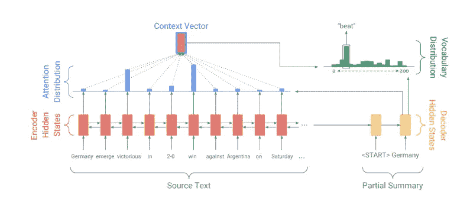

当我们想到英文单词“Attention”时，我们知道它的意思是将你的注意力集中在某件事情上，并给予更多的注意。深度学习中的注意机制是基于这种引导你的焦点的概念，它在处理数据时更加关注某些因素。

我们将使用基线模型中相同的编码器来为每个传入的输入产生隐藏状态/输出。我们将把编码器产生的所有隐藏状态带到下一步，而不是在最后一个时间步只使用隐藏状态。

```
class additiveAttention(tf.keras.layers.AdditiveAttention): 
    def __init__(self,units):  
    super(additiveAttention,self).__init__()  
    self.units = units   
    self.W1 = Dense(units)  
    self.W2 = Dense(units)  
    self.V = Dense(1)  
    @tf.function  

    def call(self, keys):   
        query=keys[0]  
        values=keys[1]  
        ht_with_time_axis = tf.expand_dims(values, axis=1)score = self.V(tf.nn.tanh(self.W1(ht_with_time_axis) +      self.W2(query)))  
        attention_weights = tf.nn.softmax(score, axis=1)    
        context_vector = attention_weights * query  
        context_vector = tf.reduce_sum(context_vector, axis=1)return context_vector, attention_weights
```

# 计算校准分数:

为了计算解码器时间步长 t 处的对齐分数，我们将考虑(t-1)的解码器隐藏状态和编码器隐藏状态。

从上面的代码

查询形状(编码器输出)==(批量大小，最大长度，隐藏大小)值形状(解码器隐藏在(t-1)) ==(批量大小，隐藏大小)

> scorealignment=wcombined⋅tanh(wdecoder⋅hdecoder+wencoder⋅hencoder)

# 上下文向量:

> Attention_weights=softmax(得分对齐)
> 
> context _ vector = Attention _ weights * query

我们产生的上下文向量然后将与先前的解码器输出连接。然后，它被送入解码器 RNN 单元，以产生一个新的隐藏状态，并重复这一过程。时间步长的最终输出是通过将新的隐藏状态传递到密集层来获得的，密集层充当分类器来给出下一个预测单词的概率分数。


我们的注意力模型试图预测单词，但整体预测的摘要没有任何意义，许多单词都在重复。为了避免单词重复，我在我的模型中添加了覆盖机制。让我们来看看它是如何工作的。

## **9。覆盖机制**

重复是序列到序列模型的常见问题，在生成多句子文本时尤其明显。

在这种覆盖机制中，我们使用覆盖向量 ct，它是所有先前解码器时间步长上的注意力分布的总和。


直观上，ct 是源文档单词上的分布，它表示这些单词迄今为止从注意机制接收到的覆盖程度。注意，c0 是一个零向量，因为在第一个时间步长上，没有覆盖任何源文档

我们将这个覆盖向量添加到注意力机制中，同时找到对齐分数，正如我们在上一节中所看到的。

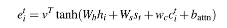

```
class additiveAttention(tf.keras.layers.AdditiveAttention):  
    def __init__(self, hidden_units,is_coverage=False):   
        super().__init__()   
        self.Wh = tf.keras.layers.Dense(hidden_units) 
        self.Ws = tf.keras.layers.Dense(hidden_units)
        self.wc = tf.keras.layers.Dense(1)
        self.V = tf.keras.layers.Dense(1)  
        self.coverage = is_coverage  

        if self.coverage is False:  
             self.wc.trainable = Falsedef call(self,keys):    
        value=keys[0]  
        query=keys[1]  
        ct=keys[2]    
        value = tf.expand_dims(value, 1)
        ct = tf.expand_dims(ct, 1)score = self.V(tf.nn.tanh(  self.Wh(query) +  self.Ws(value) +  self.wc(ct)  ))attention_weights = tf.nn.softmax(score, axis=1)ct = tf.squeeze(ct,1) 
        if self.coverage is True:  
            ct+=tf.squeeze(attention_weights)context_vector = attention_weights * query
        context_vector = tf.reduce_sum(context_vector, axis=1)

        return context_vector, attention_weights, ct
```

其中，wc 是一个长度与 v 相同的可学习参数向量。这确保了注意力机制的当前决策(选择接下来在哪里出席)被其先前决策的提醒所通知(在 c . t 中总结)。这将使注意力机制更容易避免重复注意相同的位置，从而避免产生重复的文本。

重复去同一个地方也有保险损失。

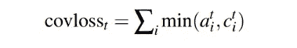

```
def coverage_loss(attention_weights,coverage_vector,target): 
    mask = tf.math.logical_not(tf.math.equal(target, 0))  
    coverage_vector = tf.expand_dims(coverage_vector,axis=2)ct_min=tf.reduce_min(tf.concat
    ([attention_weights,coverage_vector],axis=2),axis=2)cov_loss = tf.reduce_sum(ct_min,axis=1)  
    mask = tf.cast(mask, dtype=cov_loss.dtype)  
    cov_loss *= mask     

    return cov_loss
```

让我们检查一下我们的摘要是如何生成的

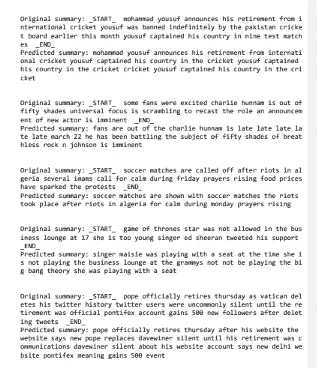

来自覆盖模型的摘要

这些结果比由序列到序列和注意机制生成的摘要更有意义。

**流氓评分与序列序列+关注+覆盖机制**

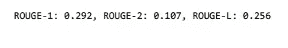

## **10。预训练的 BERT**

来自变压器的双向编码器表示(BERT)推进了广泛的自然语言处理任务。在描述该模型的论文发布后不久，该团队还开源了该模型的代码，并提供了已经在大规模数据集上进行了预训练的模型下载版本。这是一个重大的发展，因为它使任何人都能够建立一个涉及语言处理的机器学习模型，以此作为一个随时可用的组件，节省了从头训练语言处理模型所需的时间、精力、知识和资源，现在它可以有效地应用于提取和抽象模型的文本摘要。

关于伯特的更多细节，请查看这篇写得很漂亮的博客。这里我假设你熟悉伯特。

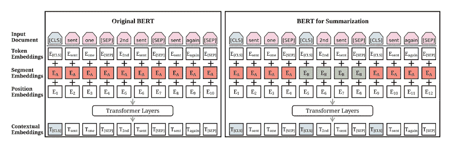

https://arxiv.org/pdf/1908.08345.pdf

**伯特是如何接受总结训练的**

> ***伯特森:***

我们知道摘要是从文档中选择重要的句子。考虑在包含句子[sent1，sent2，...，sentm]的文档 1 上实现摘要的任务。

现在，我们可以假设抽取摘要是二元分类的任务，给每个句子分配一个标签，不管该句子是否应该包括在摘要中。假设摘要句子代表了文档中最重要的内容。

来自顶层的[CLS]符号的向量可以用作句子的表示。

```
yˆi = σ(W h + bo)
```

其中‘h’是来自变换器顶层的句子的[CLS]向量。实验中发现 L = 1，2，3 的变压器，发现 L = 2 的变压器表现最好。模型的损失是预测 yˇI 对真实标签 yi 的二元分类熵。这款车型被命名为 **BERTSUM。**

*BERTSUMABS 被训练使用标准的编码器-解码器框架进行抽象概括。这里，编码器是预先训练的 BERTSUM，解码器是从头开始训练的 6 层变换器。*

*可以相信，编码器和解码器之间存在不匹配，因为 BERTSUM 是预先训练的，而解码器必须从头开始训练。这会使微调变得不确定。编码器可能会过拟合数据，而解码器则欠拟合，反之亦然。*

*为了避免这种情况，BERTSUMABS 为编码器和解码器使用了两个独立的优化器。*

*除了这两种策略之外，还有一种两阶段微调方法，其中 **BERTSUMEXTABS** 首先在提取摘要任务上微调编码器，然后在抽象摘要任务上微调它。因为使用提取意图可以提高抽象概括的性能。*

***下载 CNN 每日邮报数据上的预训练模型***

```
*! gdown [https://drive.google.com/uc?id=1-IKVCtc4Q-BdZpjXc4s70_fRsWnjtYLr&export=download](https://drive.google.com/uc?id=1-IKVCtc4Q-BdZpjXc4s70_fRsWnjtYLr&export=download) #CNN/DM Abstractive model_step_148000.pt*
```

***克隆 git 回购***

```
*!git clone [https://github.com/mingchen62/PreSumm.git](https://github.com/mingchen62/PreSumm.git)*
```

***生成汇总***

```
*!python summarizer.py -task abs -mode test  -test_from models/CNN_DailyMail_Abstractive/model_step_148000.pt \  -batch_size 6 -test_batch_size 6 -bert_data_path bert_data/cnndm \  -log_file $log_file -report_rouge False \  -sep_optim true -use_interval true \  -visible_gpus -1 -max_pos 512 \  -max_src_nsents 100 -max_length 200 \  -alpha 0.95 -min_length 50 \  -result_path $result_path \*
```

*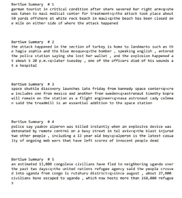*

*伯特的总结*

## *11。微调 T5*

***T5:文本到文本转换转换器***

*从拥抱脸下载 T5-小变压器用于条件生成*

```
*tokenizer = T5Tokenizer.from_pretrained('t5-small') model = TFT5ForConditionalGeneration.from_pretrained('t5-small') task_specific_params = model.config.task_specific_params if task_specific_params is not None:     
    model.config.update(task_specific_params.get("summarization", {}))  

pad_token_id = tokenizer.pad_token_id*
```

***为模型准备数据***

```
*def normalize_text(text):   
    text = tf.strings.lower(text)  
    text = tf.strings.regex_replace(text,"'(.*)'", r"\1")  
    return text.numpy().decode('UTF-8') def tokenize_articles(text):  
    text = normalize_text(text)  

    ids = tokenizer.encode_plus((model.config.prefix + text),      
    return_tensors="tf", max_length=350)

    return tf.squeeze(ids['input_ids']),    tf.squeeze(ids['attention_mask']) def tokenize_highlights(text):  
    text = normalize_text(text)  
    ids = tokenizer.encode(text, return_tensors="tf", max_length=50)         return tf.squeeze(ids) def map_func(x, y):      article_ids, attention_mask = tf.py_function(tokenize_articles, inp=[x], Tout=(tf.int32, tf.int32))  
    highlights_ids = tf.py_function(tokenize_highlights, inp=[y], Tout=tf.int32)      return article_ids, attention_mask, highlights_ids*
```

*检查此 [GitHub](https://github.com/Chandugundluru/Understanding-Abstractive-Summarization-from-scratch) repo 用于模型训练*

***模型预测:***

```
*from tqdm import tqdm 
predictions = [] 
reference=[] 
for i, (input_ids, input_mask, y) in (enumerate(test_ds)):      summaries = model.generate(input_ids=input_ids,max_length=45  ,attention_mask=input_mask)      pred = [tokenizer.decode(g, skip_special_tokens=True,   clean_up_tokenization_spaces=False) for g in summaries]      real = [tokenizer.decode(g, skip_special_tokens=True,  clean_up_tokenization_spaces=False) for g in y]       predictions.append(pred)      reference.append(real)*
```

***生成汇总***

*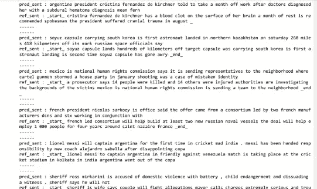*

*微调 T5 模型的总结*

***Rogue_score***

*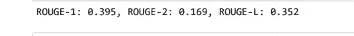*

## ***12。模型分析***

***带有纪元的覆盖模型分析:***

*让我们检查一下覆盖向量及其损失是如何阻止预测中单词的重复的。在这里，我打印 3、5、10、25 个时期后的摘要输出*

```
*print('length_of_article : ',len(x_train[12].split( ))) 
print('\n') print('orginal_summary : ',orgsummepoch3[12]) 
print('\n') 
print('predictes summary after 3rd epoch:',predsummepoch3[12]) print('\n') 
print('predictes summary after 5th epoch:',predsummepoch5[12]) print('\n') 
print('predictes summary after 10th epoch:',predsummepoch10[12]) print('\n') 
print('predictes summary after 25th epoch:',predsummepoch25[12])*
```

*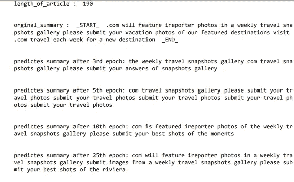**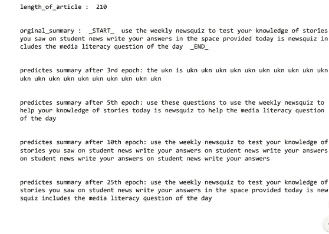*

*在**历元-3** 之后生成的摘要类似于我们通过关注机制得到的输出，但是在**历元-10** 之后，事情发生了变化，我们的覆盖机制启动，并且在**25 历元**之后，我们得到了精确的摘要*

***让我们分析一下我们的模型失败在哪里***

*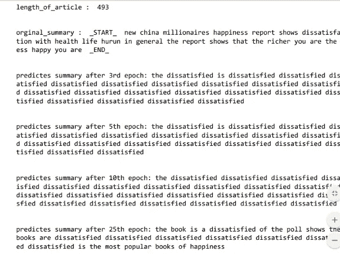**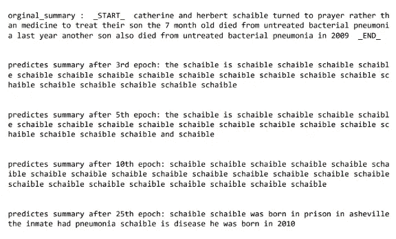*

*在分析模型时发现的一个普遍现象是输入文章的长度很长，一些摘要是没有意义的。看了图片的第二个总结，觉得很可笑…..作为一个预测总结，他出生于 2010 年，但在 org summary 中说他在 2009 年死于未经治疗的细菌性肺炎，这没有任何意义*

***微调后的 T5 车型有多好？***

*为了检查这一点，我根据文章长度将我的数据分为 3 组*

1.  *长度小于 200 的文章*
2.  *文章长度在 200-500 之间*
3.  *文章长度超过 700*

```
*max_art_len=500 
min_art_len=200 cleaned_text = np.array(data_cleaned['text']) 
cleaned_summary = np.array(data_cleaned['summary'])
short_text = [] 
short_summary = [] 
for i in range(len(cleaned_text)):          if(len(cleaned_text[i].split())>=min_art_len and
        len(cleaned_text[i].split())<=max_art_len)        short_text.append(cleaned_text[i])        

        short_summary.append(cleaned_summary[i]) data1=pd.DataFrame({'text':short_text,'summary':short_summary})*
```

***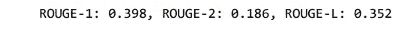**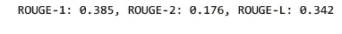*

*以上分别是上述文章和模型的不良分数，即使输入文本很长，它们也做得很好*

## *13。结论*

*所有这些都是从简单的 seq-seq 模型开始，以最先进的技术 T5 结束。我希望你们能从这个博客中找到一些有用的信息。*

*查看 Linkedin [简介](http://linkedin.com/in/gundluru-chandrasekhar-499129196) & Github [简介](https://github.com/Chandugundluru?tab=repositories)查看完整代码实现。*

## *14。参考文献*

*[www.appliedaicourse.com](http://www.appliedaicourse.com/)*

*[nlpyang/proposum](https://github.com/nlpyang/PreSumm)*

*[带预训练编码器的文本摘要](https://arxiv.org/abs/1908.08345)*

*[https://arxiv.org/abs/1908.08345](https://arxiv.org/abs/1908.08345)*

*[https://hugging face . co/transformers/model _ doc/t5 . html # tft 5 for conditional generation](https://huggingface.co/transformers/model_doc/t5.html#tft5forconditionalgeneration)*

*[http://www . abigailsee . com/2017/04/16/taming-rnns-for-better-summarying . html](http://www.abigailsee.com/2017/04/16/taming-rnns-for-better-summarization.html)*