# 理解人工智能

> 原文：<https://pub.towardsai.net/understanding-artificial-intelligence-8a040b911b12?source=collection_archive---------2----------------------->

## [人工智能](https://towardsai.net/p/category/artificial-intelligence)，[观点](https://towardsai.net/p/category/opinion)

## 几分钟探索人工智能…

**人工智能** **(AI)** 如今是这样一个时髦词，关于时髦词的一件事是…’*它们经常在翻译中迷失*。

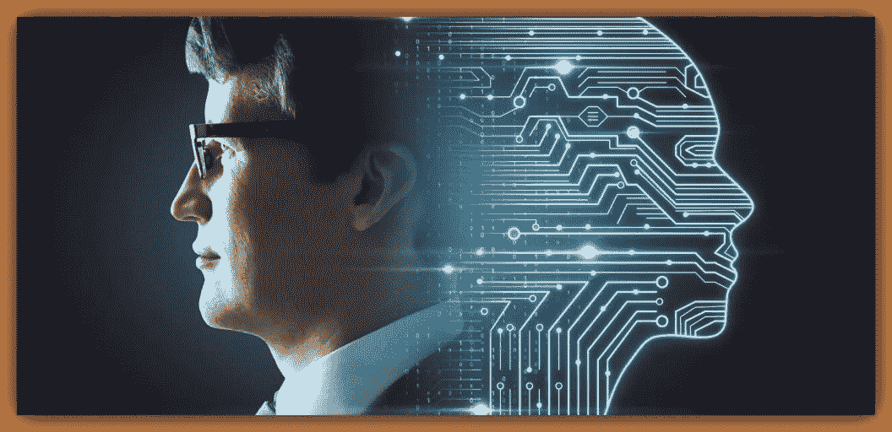

[img_credit](https://www.commercialintegrator.com/wp-content/uploads/2019/09/Artificial-intelligence-1400x650.jpeg)

向任何一位数据科学家(*包括你真正的*)询问 **AI** ，你很可能会听到*机器学习(ML)* 算法或者*深度学习(DL)* 及其奇妙的应用，比如在 [*AlphaGo*](https://deepmind.com/research/case-studies/alphago-the-story-so-far) …在那里，神经网络通过[强化学习](https://deepmind.com/blog/article/alphago-zero-starting-scratch)进行学习，击败了围棋世界冠军，使 *AlphaGo* 成为可以说是最强的围棋选手

但我认为是时候我们都深呼吸，呼气，暂停…并意识到人工智能本身就是一门有充分依据的学科。

> 机器学习和深度学习并没有定义人工智能。不要犯错。人工智能是一个比 ML 更广泛的领域，ML 是人工智能和 DL 的统计子集，DL 是 ML 的专门子集，涉及神经网络计算…

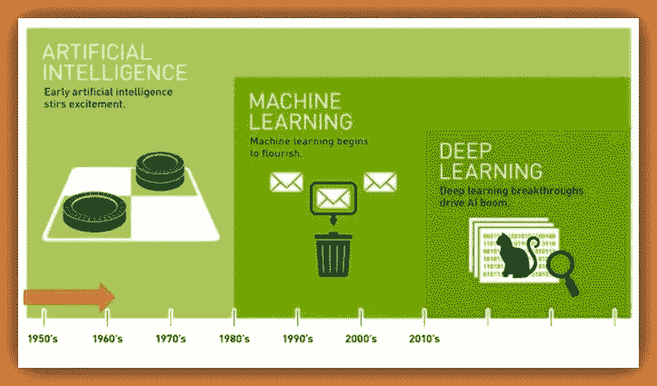

ML 和 DL 是一个更广泛的领域的子集，称为人工智能…

# 那么到底什么是人工智能呢？

要回答这个问题，我们必须考虑四种历史方法。

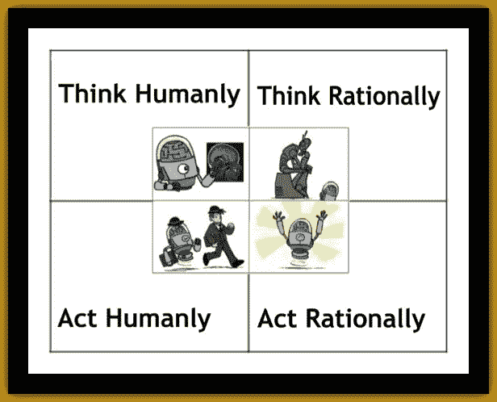

人工智能的四种历史进路

最上面的两组分别负责*思维过程*和*推理*。而下面的那些处理*行为*。

让我们仔细看看这些…

# 1.人性化思考:

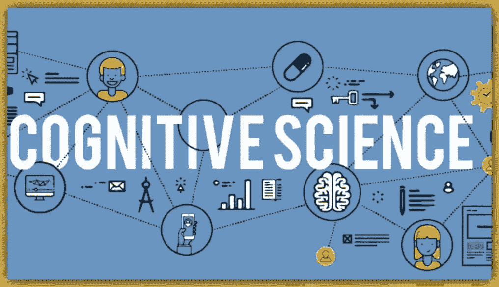

[img_credit](https://i.ytimg.com/vi/XVP9sMyxprQ/maxresdefault.jpg)

**定义一:**

> 人工智能是令人兴奋的新成果，它让计算机思考……从字面意义上来说，是有思想的机器

**Def 二:**

> 人工智能是我们与人类思维相关的活动的自动化，如决策、解决问题、学习……(**Bellman，1978** )

**思考-为人**就是 ***认知-造型-方法*** 。它基本上说，如果我们要设计一个像人类一样思考的算法，那么我们必须有一些方法来确定人类是如何思考的。

有三种方法可以做到这一点

```
**1\. Through Introspection:** *Trying to catch our own thoughts as they go by.***2\. Through Psychological Experiments:** *Observing a person in action.***3\. Through Brain Imaging:** *Observing the brain in action... (EEG built by Hans Berger)*
```

认知科学的跨学科领域将人工智能的计算机模型和心理学的实验技术结合在一起，构建精确且可测试的心理理论。

认知建模方法的使用已经有了显著的进步，我想到的一个是[控制实验室](https://www.youtube.com/watch?v=D8pB8sNBGlE&feature=emb_logo)。这些家伙已经与脸书合作，正在开发一种叫做意图捕捉的非侵入性神经接口技术，它可以帮助你只用大脑信号来控制物体。

# 2.理性思考:

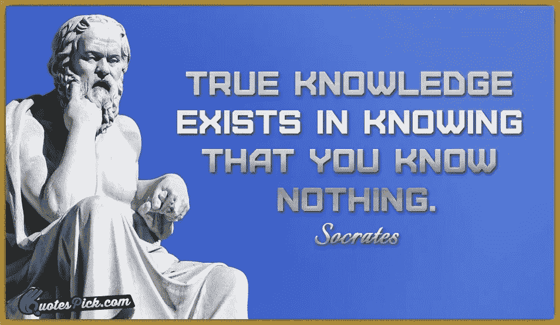

苏格拉底的形象| [img_credit](https://www.quotespick.com/images/quotes/english/socrates/true_knowledge_exists_in_knowing-2039-13246.jpg)

**Def 三:**

> 人工智能是通过使用计算模型来研究智力… ( **Charniak 和 McDermott，1985** )

**Def 四:**

> 人工智能是对计算的研究，它使感知、推理和行动成为可能

**是人工智能的**。希腊哲学家亚里士多德是第一个试图编纂“正确思维”的人。他使用 [*三段论*](https://en.wikipedia.org/wiki/Syllogism) 为论证结构提供模式。例如:-****

******苏格拉底是一个人；凡人皆有一死= >因此，苏格拉底是凡人。******

****这些思想法则被认为是控制大脑运作的，他们的研究开创了被称为逻辑的领域。人工智能中所谓的*逻辑学家传统*试图构建能够解决任何用逻辑符号描述的可解决问题的计算机程序。这种方法在 60 年代末和 70 年代很流行。****

# ****3.为人处事:****

****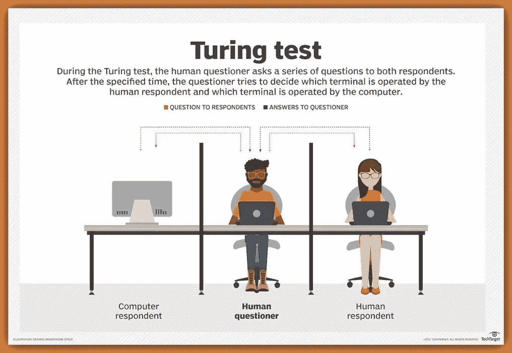****

****图灵测试… | [img_credit](https://www.google.com/url?sa=i&url=https%3A%2F%2Fsearchenterpriseai.techtarget.com%2Fdefinition%2FTuring-test&psig=AOvVaw2gHQq_A4rFN4evbsoTLSiF&ust=1595117113991000&source=images&cd=vfe&ved=0CAIQjRxqFwoTCMDDsuPA1eoCFQAAAAAdAAAAABAD)****

******Def 五:******

> ****人工智能是创造机器的艺术，这些机器在由人执行时执行需要智能的功能……(**库兹韦尔，1990** )****

******Def 六:******

> ****人工智能是研究如何让计算机在某个时刻做一些比人类更好的事情… ( **Rich and Knight，1991** )****

******为人处事**就是 [***图灵测试方法***](https://en.wikipedia.org/wiki/Turing_test) 。由 [*艾伦·图灵(1950)*](https://en.wikipedia.org/wiki/Alan_Turing) 提出的**图灵测试**，旨在为人工智能提供一个令人满意的操作定义。如果人类询问者在提出一些书面问题后，不能分辨出这些书面回答是来自人还是来自计算机，那么计算机就通过了图灵测试。要通过该测试，计算机至少需要具备以下能力:****

******A .自然语言处理:***使其能够成功交流*****

******B .知识表示:** *储存它所知道或听到的*****

******C .自动推理 *:*** *利用存储的数据回答问题，得出新的结论。*****

*******D .机器学习:*** *适应新的环境，检测并推断模式。*****

****我将从[Lex Fridman](https://medium.com/u/119b8eb57f8e?source=post_page-----8a040b911b12--------------------------------)[***这里***](https://youtu.be/MGW_Qcqr9eQ) ***留给你更多关于**图灵测试**的见解。*******

# ****4.理性行事:****

****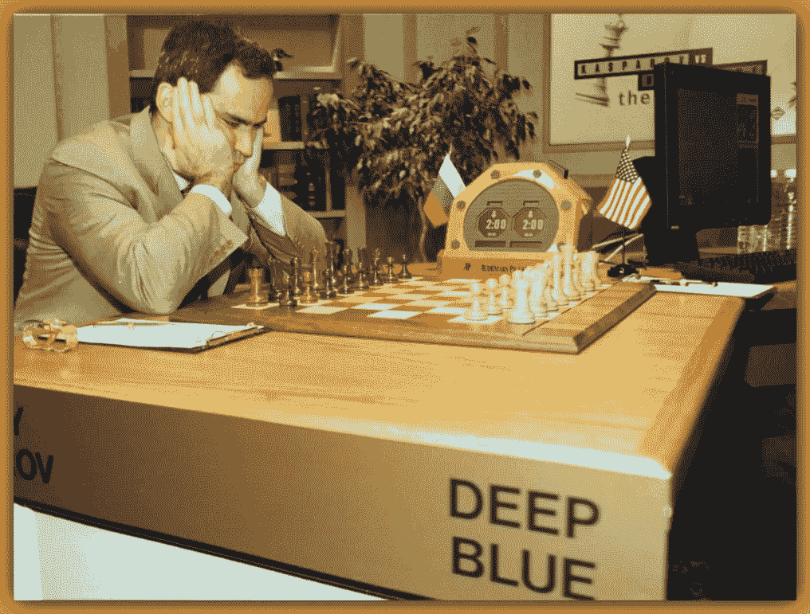****

****加里·卡斯帕罗夫 VS IBM 深蓝| [img_credit](https://i.insider.com/5e53dff1fee23d6ae640ce1a?width=1136&format=jpeg)****

> ****1997 年加里·卡斯帕罗夫和 IBM 深蓝之间的国际象棋比赛是计算机在锦标赛条件下第一次击败国际象棋世界冠军。****

******Def 七:******

> ****计算智能是对智能代理设计的研究……(**普尔等人，1998** )****

******Def 八:******

> ****人工智能与人工制品的智能行为有关… ( **尼尔森，1998** )****

******理性行事**就是 ***理性行事*** 。一个理性的代理人是为了达到最好的结果而行动，或者当有不确定性时，达到最好的预期结果。与其他方法相比，Rational-Agent 方法有两个优点****

****首先，*理性代理*比其他代理更通用。以*思维法则*方法为例，它强调做出正确的推论。嗯，做出正确的推论通常是理性代理人的一部分。除此之外，还有其他没有推理的理性行为方式，例如，从热火炉前退缩是一种没有推理的理性反射行为。****

****第二，理性主体方法比基于人类行为或人类思想的方法更能顺应科学的发展。****

********

> ****智力是相对的…一个智能体的领域影响我们如何判断它的智力水平…****

****以 Siri 为例，她可以向我们推荐我们向她询问的漂亮、安全的地方，甚至可以用人类的声音将这些答案传达给我们，但无论我们如何努力，Siri 都无法带着我们的车轮带我们去那家高级餐厅。****

> ****她只在交谈方面聪明……****

# ****定义智能:****

****我们把人工系统和生物系统的某些特性归于智能的概念。****

> ****为了让人工智能具有生产力，我们对智能的概念不应该取决于我们如何感知事物，而是应该在任务的背景下定义智能。****

****事实证明，人类在做几件不同的事情时是聪明的。****

********

****[img_credit](https://281d98e0ab5512278894-874808387edf2e59e092850289738f00.ssl.cf2.rackcdn.com/uploaded/a/0e7824265_1536969882_attention.jpg)****

****我们已经看到了人工智能的八种不同的定义。重要的是要注意到， **AI** 的所有四种方法都是围绕着“ ***人类意识形态*** ”展开的。****

****人性地思考…****

******理性思考……******

******为人处事……******

******理智行事……******

****副词**‘Humanly**’到底是什么意思？…****

## ****我们来看看牛津的定义:****

****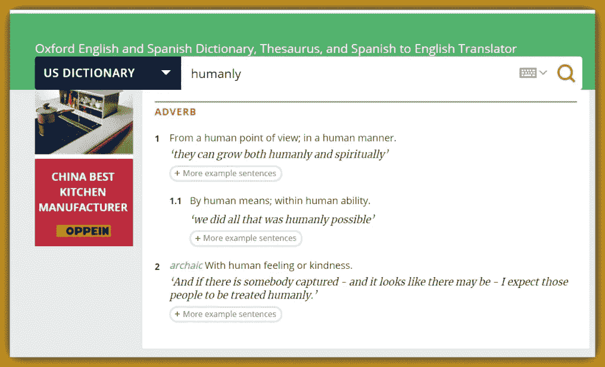****

****人道地:-与人类的感觉，或善良…****

## ****让我们看看韦氏词典的定义:****

****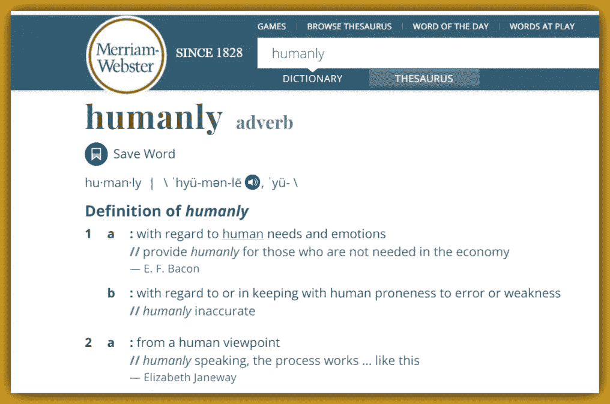****

****人性方面:-关于人类的需求和情感…****

****我们都需要放下架子，坐下来认清关于**艾**的**真相**…****

> ****人工智能是一门久经考验的真正的科学，旨在通过创造理性和智能的机器来促进人类进步，这些机器倾向于人类的需求和情感，迎合人类的感情和善良……机器为所有人的利益服务，没有偏见。****

## ******这是我自己对人工智能的定义！******

# ****人工智能的基础和范围****

## ****基础:****

****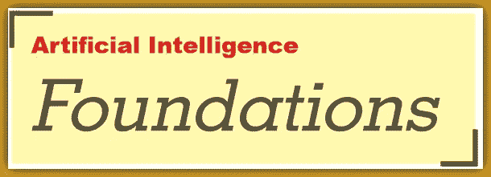****

****不同的人带着不同的目标接近人工智能。在构建人工智能应用程序时要问的两个重要问题是****

1.  ****你关心的是思想还是行为？****
2.  ****你想模拟人类还是从一个理想的标准开始工作？****

****让我们来看看作为一门交叉学科的人工智能的组成部分...****

*   ****哲学:追溯到公元前 400 年，哲学家们认为大脑在某些方面像一台机器，从而让人工智能成为可能。这些知识被编码在某种内部语言中。****
*   ******数学:** *数学家提供了操纵逻辑确定性陈述和不确定性概率陈述的工具。*****
*   ******经济学:** *经济学家将使决策者预期结果最大化的决策问题形式化。*****
*   ******神经科学:** *神经科学家发现了一些关于大脑如何工作的事实，以及大脑与计算机相似和不同的方式。*****
*   ******心理学:** *心理学家采纳了人类和动物可以被认为是信息处理机器的观点。*****
*   ******语言学:** *语言学家表明，语言的使用，符合这种计算模式。*****
*   ****计算机工程:计算机工程师提供越来越强大的机器，使人工智能应用成为可能。比如 GCP 最新的基于 NVIDIA A100 GPU 的 A2 虚拟机。****
*   ******控制理论:** *控制理论家致力于设计根据环境反馈做出最佳行为的机器*****

****其他包括 ***统计学家*** 和 ***医师*** 和**学科**为支持 **AI** 的计算过程或理论提供领域知识。****

## ****范围:****

****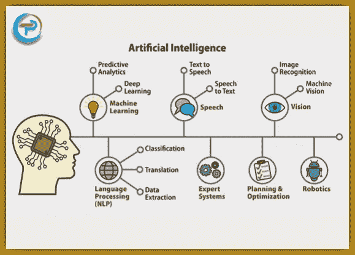****

****上图突出了一些 **AI** 的核心单元，注意这个列表绝不是决定性的:-****

1.  ******机器学习******
2.  ******深度学习******
3.  ******语音** : *文字转语音和语音转文字*****
4.  ******视觉** : *图像识别*和*机器视觉*****
5.  ******语言处理** : *翻译、分类、提取*****
6.  ******机器人技术******
7.  ******搜** : *A-star，DFS，BFS，UCS* ，e.t.c…****
8.  ******规划和优化******
9.  ******决策智能******
10.  ******统计学习******

****最后两个是相当有趣和相对较新的学科。****

******统计学习(SL)** :是机器学习进步的结果。SL 是统计学的一个子集，侧重于非监督和监督建模和预测。SL 比 ML 更深入，它的目标是探索算法实现背后的参数和配置。****

******决策智能**:是一门工程学科，用来自[社会科学](https://en.wikipedia.org/wiki/Social_science)、[决策理论](https://en.wikipedia.org/wiki/Decision_theory)和[管理科学](https://en.wikipedia.org/wiki/Outline_of_business_management)的理论来扩充[数据科学](https://en.wikipedia.org/wiki/Data_science)。我们可以在 [*维基百科*](https://en.wikipedia.org/wiki/Decision_intelligence) *上看到更多这方面的内容。*****

****或者，让 [Cassie Kozyrkov](https://medium.com/u/2fccb851bb5e?source=post_page-----8a040b911b12--------------------------------) ，谷歌决策智能的负责人告诉我们[什么是决策智能](https://towardsdatascience.com/introduction-to-decision-intelligence-5d147ddab767)。****

********

# ******概要:******

****人工智能创始人的梦想是创造能够不带偏见地模拟人类思维过程和行为的机器。****

****人类生来都是纯洁的……天真而真实。我们让社会影响、环境、种族和文化因素消极地影响我们向善的意志。这可能是今天 **AI** 实现中出现一些偏差的原因。****

****AI 从未打算制造分裂和仇恨。人们让他们的负面情绪感染了科技。作为一个民族，如果我们想要一个为了人类的整体利益实现人工智能承诺的未来…****

****然后，我们必须**支持 AI** 中的包容性，我们应该利用**公平性**库，如[**aif360**](https://aif360.mybluemix.net/) ，我们应该使我们的数据探索具有模型性和可预测性**可解释性**。我们应该使用像 [**aix360**](https://aix360.mybluemix.net/resources#overview) **，** [**石灰**](https://lime-ml.readthedocs.io/en/latest/lime.html) 这样的可解释库以及像[**LALE**](https://github.com/IBM/lale)**这样的库来促进自动化，减少人为错误。******

> ******但最重要的是，我们必须人性化地思考，理性地思考，人性化地行动，并在任何时候都理性地行动。******

# ******最后，******

> ******本文引用了艾的探索从[**《AIMA》第 3 版第 1 章**](http://aima.cs.berkeley.edu/) 。《AIMA》是有史以来关于人工智能最有影响力的文章。由 [**彼得·诺维格**](https://en.wikipedia.org/wiki/Peter_Norvig) 和 [**斯图亚特·罗素**](https://people.eecs.berkeley.edu/~russell/) 撰写，有少数人投稿，包括 [**巴斯蒂安·特龙**](https://en.wikipedia.org/wiki/Sebastian_Thrun) 。******

******这里有一个词——对人工智能中的一些老兵和英雄喊出来******

******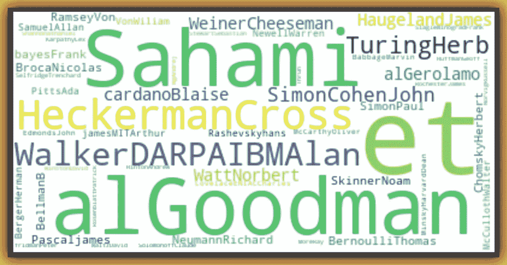******

> ******感谢你阅读这篇文章…当你下一次听到人工智能这个词时，请超越浮华和魅力，超越人工智能的惊人应用…把你的目光投向人性…让公平和可解释性来指导你的项目。******

# ******干杯！******

# ******关于我:******

******劳伦斯是技术层的数据专家，对公平和可解释的人工智能和数据科学充满热情。我持有 IBM 的 ***数据科学专业*** *和* ***高级数据科学专业*** *证书。在获得 IBM 数据科学可解释徽章***后，我的任务是促进人工智能的公平性和可解释性……我喜欢尽可能从头开始编写函数。我喜欢学习和实验…我有一堆数据和人工智能认证，我写了几篇强烈推荐的文章。********

******请随时与我联系:-******

******[**Github**](https://github.com/Lawrence-Krukrubo)******

******[**领英**](https://www.linkedin.com/in/lawrencekrukrubo/)******

******[**推特**](https://twitter.com/LKrukrubo)******